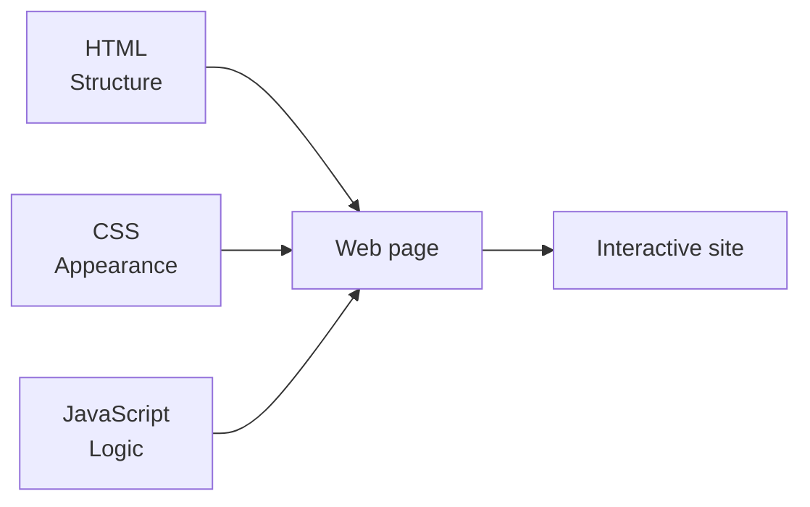
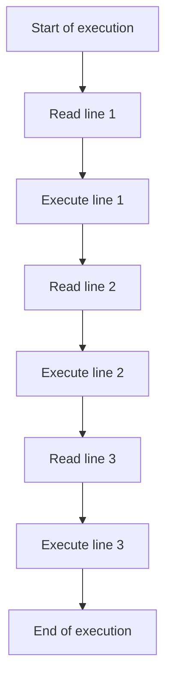
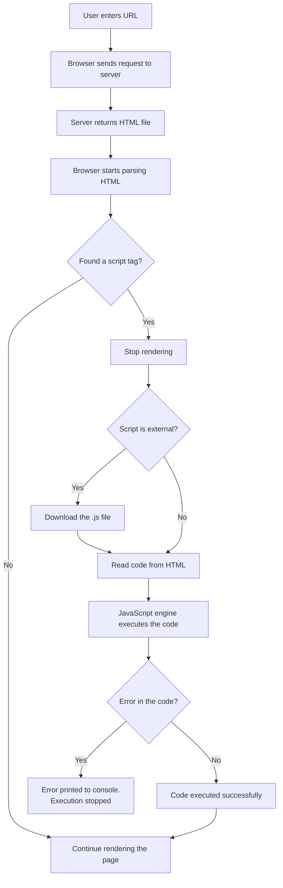

## Introduction to JavaScript

> **Connection with previous courses:** in the "HTML: From A to Z" and "CSS: in 10 lessons" courses, we built and styled the page. Today we start bringing it to life with JavaScript.

---

## Lesson Goal

Understand what JavaScript is, how it relates to HTML and CSS, master the three ways of connecting scripts, and write the first program - so that by the end of the lesson, you can independently add executable code to any page and observe its result in the browser console.

## What You Will Learn by the End of the Lesson

- Explain what JavaScript is and how it interacts with HTML (structure) and CSS (appearance).
- Connect scripts in three ways (internal, external, browser console) - and understand why an external file is preferred.
- Write the first program using `console.log()` and see its output in the browser console.
- Understand that JavaScript executes sequentially, line by line, from top to bottom.
- Use comments `//` and `/* */` to explain code.
- Describe how the browser parses HTML, finds `<script>` tags, and executes code using an engine like V8 or SpiderMonkey.

---

## Lesson Timeline

| Block | Content |
| -------------------------------------------- | ---------------------------------------------- |
| 1. What JavaScript is                      | Analogy with house automation, HTML/CSS/JS roles |
| 2. Three ways to connect scripts           | Internal, external, console - pros and cons |
| 3. First program: `console.log()`          | Syntax, arguments, where the result appears |
| 4. Execution order                        | Synchronous, line-by-line execution, errors |
| 5. Comments                               | `//` and `/* */`, their purpose          |
| 6. How code runs in the browser            | Parsing, script engine, V8/SpiderMonkey |
| 7. Practice: first program                | Connecting scripts and observing the result |
| 8. Summary and homework                    | Reinforcement                               |

---

## Block 1. What JavaScript Is and Why It's Needed

**In simple terms:** in the previous courses we built a house and dressed it. HTML builds the framework, CSS paints the walls and arranges furniture. **JavaScript (JS)** is the electrical wiring and automation: it makes the lights turn on when you clap, the doors open by themselves, and the page respond to clicks.

JavaScript is a **programming language** originally created to make web pages interactive. Unlike HTML (a markup language) and CSS (a styling language), JavaScript is a full-fledged programming language: it has variables, conditions, loops, functions, and can perform calculations.

**Key principle to always remember:** the three technologies solve **different tasks**, and it's important not to mix them:

- **HTML** answers the question "what is this?" - heading, paragraph, list, button.
- **CSS** answers the question "what does it look like?" - color, size, position.
- **JavaScript** answers the question "what happens when?" - the page responds to clicks, calculates data, changes content dynamically.



### What JavaScript Can Do

- Respond to user actions (clicks, key presses, form input).
- Change the content and structure of the page on the fly (DOM - lesson 9).
- Perform calculations and process data.
- Run on the server (Node.js) and in mobile apps (React Native).

All of this will be covered in order throughout the course.

---

## Block 2. Three Ways to Connect JavaScript

There are three working ways to add JavaScript to an HTML page. Let's examine all three - but it's important to understand right away that they are **not equal** in quality.

### Method 1. Internal Script (the `<script>` tag)

The code is written directly inside a `<script>` tag in the HTML document, usually at the end of the `<body>`.

```html
<!DOCTYPE html>
<html>
<head>
    <title>Example</title>
</head>
<body>
    <h1>Heading</h1>

    <script>
        console.log('Code inside HTML');
    </script>
</body>
</html>
```

**Pros:** fast, no extra files - convenient for quick experiments.

**Cons:**

- The code is tied to one specific HTML page - if several pages need the same logic, you'll have to duplicate it everywhere.
- Mixes structure (HTML) and logic (JavaScript) in one file, which makes the code harder to read and maintain.

**Conclusion:** used for small test examples or page-specific logic.

### Method 2. External File (the `src` attribute)

The code is placed in a separate `.js` file, which is connected to HTML via the `src` attribute of the `<script>` tag.

**File `script.js`:**

```javascript
console.log('Code from an external file');
```

**File `index.html`:**

```html
<body>
    <h1>Heading</h1>
    <script src="script.js"></script>
</body>
```

**Pros:**

- **One file - many pages.** Connect the same `script.js` to several HTML files, and the logic will work everywhere identically. Changed the file once - all pages updated at once.
- **Separation of concerns.** HTML files contain only the structure, JavaScript files contain only the logic. Each file is easier to read and maintain.
- **Browser caching.** The browser loads an external script once and remembers it - when navigating between pages, re-downloading is not required, which speeds up the site.

**Conclusion:** this is **the correct, professional method**, which we will use as the main one in this course.

### Method 3. The Browser Console

Code can be entered directly into the browser's developer console, without creating any files.

```javascript
console.log('Test in the console');
```

**Pros:** instant - you can check any fragment of code right here, without saving anything.

**Cons:** the code is not saved anywhere and disappears when the page is refreshed - it's only for experiments.

**Conclusion:** an indispensable tool for testing and debugging, but not a way to deliver code to users.

### Comparison Table

|Method|Where it's written|Scope|Recommendation|
|---|---|---|---|
|Internal (`<script>`)|Inside the HTML file|Only this one page|Quick experiments only|
|External (`src`)|Separate `.js` file|Any number of pages|**Main method in this course**|
|Console|Browser DevTools|Current session|Testing and debugging|

---

### Common Beginner Mistakes

|Mistake|How to Fix|
|---|---|
|Putting the `<script>` tag in the `<head>`|The script executes when encountered - if elements don't exist yet, errors occur. Place scripts at the end of `<body>` (until lesson 9)|
|Forgetting the `src` attribute and writing `console.log` inside `<script src="script.js">`|The `src` attribute means "load code from a file" - you cannot put code inside a tag with `src`|
|Writing `console.log` directly in the HTML text without a `<script>` tag|The browser treats it as text. Wrap code in `<script>...</script>` or put it in a `.js` file|
|Specifying the wrong path to the `.js` file|Check the path relative to the HTML file's location (as in the HTML course, lesson 3)|

---

## Block 3. First Program: `console.log()`

The traditional first program in any language prints the message "Hello, World!" - JavaScript does this with the `console.log()` method.

```javascript
console.log('Hello, World!');
```

### Syntax Breakdown

|Element|Description|
|---|---|
|`console`|An object that provides access to the browser's developer console|
|`.log()`|A method that outputs the passed value to the console|
|`'Hello, World!'`|The method's argument - the string to output|

### Where the Result Appears

The result is printed in the browser console:

1. Open the page with the code in a browser.
2. Press **F12** (or right-click → "Inspect").
3. Go to the **Console** tab.
4. You will see the message `Hello, World!` there.

**Why start with the console?** In future lessons, `console.log()` will be our main debugging tool - a way to "look inside" the code and understand what values variables hold and whether the logic is working.

---

## Block 4. Code Execution Order

JavaScript is a **synchronous** and **interpreted** language. This means that code is executed line by line, from top to bottom - each next line runs only after the previous one finishes.

```javascript
console.log('Step 1: Start');
console.log('Step 2: Continue');
console.log('Step 3: End');
```

**Result in the console:**

```
Step 1: Start
Step 2: Continue
Step 3: End
```



**Important to understand:** if an error occurs on any line, execution **stops** - the remaining lines below it are not executed. Knowing this helps you read error messages: the error always points to the first problematic line.

---

## Block 5. Comments

**A comment** is text in the source code that the interpreter completely ignores. It is meant for people - to explain or document the code.

### Single-Line Comments: `//`

Everything after `//` to the end of the line is a comment.

```javascript
// Declaring a variable with the user's name
let userName = 'Alex';

let age = 25; // user's age
```

### Multi-Line Comments: `/* ... */`

Everything between `/*` and `*/` is a comment and can span as many lines as needed.

```javascript
/*
  Function calculateSum
  Takes two numbers and returns their sum
*/
function calculateSum(a, b) {
    return a + b;
}
```

### Why Comments Are Useful

1. **Documenting logic** - explain what a piece of code does and why.
2. **Temporarily disabling code** - comment out a line during debugging to "turn it off" without deleting it.
3. **Improving readability** for other developers (and your future self) who read the code.

---

### Common Beginner Mistakes

|Mistake|How to Fix|
|---|---|
|Using HTML comments `<!-- -->` inside a JavaScript file|In JavaScript, comments are written as `//` or `/* */`|
|Forgetting to close `/*`|An unclosed multi-line comment will "swallow" the code after it - everything becomes one huge comment|
|Commenting too much, describing every line|Comment the "why" and complex logic, not the obvious - too many comments hurt readability just like too few|

---

## Block 6. How Code Runs in the Browser

### The Complete Load and Execution Cycle

1. The browser parses the HTML file from top to bottom.
2. When it finds a `<script>` tag, it stops rendering the page.
3. The JavaScript engine executes the code (downloading the external `.js` file first, if needed).
4. Execution continues; on the first error it stops and prints the error to the console.



### What a JavaScript Engine Is

The engine is the part of the browser that understands and runs JavaScript. Different browsers have their own engines:

- **Chrome / Edge** use **V8**.
- **Firefox** uses **SpiderMonkey**.
- **Safari** uses **JavaScriptCore**.

The engine doesn't execute code line by line in its original form: it converts the source into an internal representation and then into machine code the processor understands - on the fly, right during execution.

### Key Facts to Remember

- JavaScript is an **interpreted** language - it converts to machine code during execution, not beforehand.
- The JavaScript engine is **built into the browser**.
- When a `<script>` tag is found, the browser **blocks page rendering** until the script finishes running - one reason why large scripts are placed at the end of `<body>`.

---

## Block 7. Practice: First Program

Let's apply everything in practice - write the first program and connect it in both ways.

**Step 1.** Create a project folder, for example `MyFirstJS`.

**Step 2.** Inside it, create the file `index.html` and write the basic structure:

```html
<!DOCTYPE html>
<html lang="en">
<head>
    <meta charset="UTF-8">
    <title>My First JS</title>
</head>
<body>
    <h1>Hello, World!</h1>
</body>
</html>
```

**Step 3.** Before the closing `</body>` tag, add a `<script>` tag with the first command:

```html
<body>
    <h1>Hello, World!</h1>

    <script>
        console.log('Hello, World!');
    </script>
</body>
```

**Step 4.** Open the page in the browser (via Live Server or by double-clicking the file).

**Step 5.** Press **F12**, go to the **Console** tab, and make sure the message `Hello, World!` appears.

**Step 6.** Now move the code to an external file. Create `main.js` next to `index.html`:

```javascript
console.log('Hello, World!');
```

**Step 7.** In `index.html`, replace the code inside `<script>` with a link to the file:

```html
<script src="main.js"></script>
```

**Step 8.** Refresh the page and make sure the result is identical - the message appears in the console again.

---

## Lesson Summary

Today you learned:

- **JavaScript** is a programming language responsible for **logic and interactivity**; HTML is the structure, CSS is the appearance.
- There are three ways to connect JavaScript: internal (`<script>`), external (`src` attribute), and the browser console - in this course the main method is **external file**.
- The first program is `console.log('Hello, World!');` - the result appears in the browser console (F12 → Console).
- JavaScript executes **sequentially**, line by line from top to bottom; an error on any line stops subsequent execution.
- Comments are written as `//` (single line) and `/* */` (multi-line).
- The browser parses HTML, finds `<script>` tags, and executes the code with an engine (V8 in Chrome, SpiderMonkey in Firefox), blocking page rendering meanwhile.

---

## Practice

Create and connect your first program:

1. Create the `MyFirstJS` folder and the `index.html` file inside it with a basic HTML structure.
2. Add a `<script>` tag inside `<body>` and write `console.log('Hello, World!');`.
3. Open the page in the browser, press F12, and find the message in the Console tab.
4. Create a `main.js` file, move the command there, and in HTML leave only `<script src="main.js"></script>`.
5. Refresh the page and verify the result is the same.
6. In the console, directly type `console.log('Test from console');` - this way, without any files, and watch the output.

---

[Next lesson: Variables and Data Types →](../../Lesson-2/en/Variables%20and%20Data%20Types.md)
