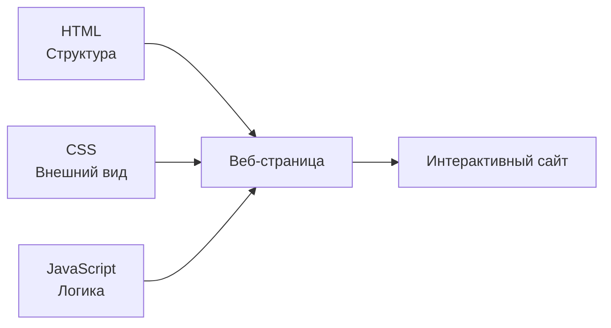
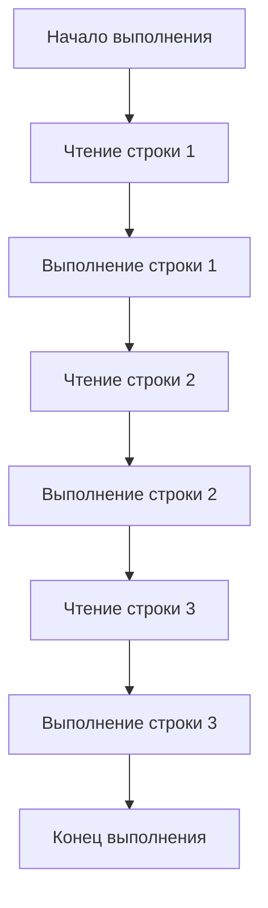
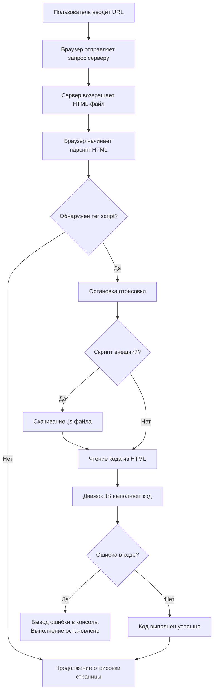

## Введение в JavaScript

> **Связь с предыдущими курсами:** в курсах «HTML: от А до Я» и «CSS: за 10 уроков» мы построили и оформили страницу. Сегодня мы начинаем оживлять её с помощью JavaScript.

---

## Цель урока

Понять, что такое JavaScript, как он соотносится с HTML и CSS, освоить три способа подключения скриптов и написать первую программу — так, чтобы к концу урока вы могли самостоятельно добавить исполняемый код на любую страницу и увидеть его результат в консоли браузера.

## Что вы узнаете к концу урока

- Объясните, что такое JavaScript и как он взаимодействует с HTML (структура) и CSS (внешний вид).
- Подключите скрипты тремя способами (внутренний, внешний, консоль браузера) — и поймёте, почему внешний файл предпочтительнее.
- Напишете первую программу с помощью `console.log()` и увидите её вывод в консоли браузера.
- Поймёте, что JavaScript выполняется последовательно, строка за строкой, сверху вниз.
- Используете комментарии `//` и `/* */` для пояснения кода.
- Опишете, как браузер разбирает HTML, находит теги `<script>` и выполняет код с помощью движка V8 или SpiderMonkey.

---

## План урока

| Блок | Содержание |
| -------------------------------------------- | ---------------------------------------------- |
| 1. Что такое JavaScript                      | Аналогия с автоматикой дома, роли HTML/CSS/JS |
| 2. Три способа подключения скриптов          | Внутренний, внешний, консоль — плюсы и минусы |
| 3. Первая программа: `console.log()`          | Синтаксис, аргументы, где появляется результат |
| 4. Порядок выполнения кода                   | Синхронно, построчно, ошибки                |
| 5. Комментарии                              | `//` и `/* */`, их назначение            |
| 6. Как выполняется код в браузере           | Парсинг, движок, V8/SpiderMonkey     |
| 7. Практика: первая программа               | Подключение скриптов и наблюдение результата |
| 8. Итоги и домашнее задание                 | Закрепление                               |

---

## Блок 1. Что такое JavaScript и зачем он нужен

**Простыми словами:** в предыдущих курсах мы построили дом и нарядили его. HTML возводит каркас, CSS красит стены и расставляет мебель. **JavaScript (JS)** — это электрика и автоматика: он заставляет свет загораться от хлопка, двери открываться сами, а страницу — реагировать на клики.

JavaScript — это **язык программирования**, изначально созданный для того, чтобы делать веб-страницы интерактивными. В отличие от HTML (языка разметки) и CSS (языка стилей), JavaScript — полноценный язык программирования: в нём есть переменные, условия, циклы, функции, он умеет выполнять вычисления.

**Ключевой принцип, который нужно всегда помнить:** три технологии решают **разные задачи**, и важно их не смешивать:

- **HTML** отвечает на вопрос «что это?» — заголовок, абзац, список, кнопка.
- **CSS** отвечает на вопрос «как это выглядит?» — цвет, размер, расположение.
- **JavaScript** отвечает на вопрос «что происходит, когда?» — страница реагирует на клики, вычисляет данные, динамически меняет содержимое.



### Что умеет JavaScript

- Реагировать на действия пользователя (клики, нажатия клавиш, ввод в формы).
- Менять содержимое и структуру страницы на лету (DOM — урок 9).
- Выполнять вычисления и обрабатывать данные.
- Работать на сервере (Node.js) и в мобильных приложениях (React Native).

Всё это мы будем проходить по порядку.

---

## Блок 2. Три способа подключения JavaScript

Существует три рабочих способа добавить JavaScript на HTML-страницу. Разберём все три — но важно сразу понять, что они **не равноценны** по качеству.

### Способ 1. Внутренний — тег `<script>`

Код пишется прямо внутри тега `<script>` в HTML-документе, обычно в конце `<body>`.

```html
<!DOCTYPE html>
<html>
<head>
    <title>Пример</title>
</head>
<body>
    <h1>Заголовок</h1>

    <script>
        console.log('Код внутри HTML');
    </script>
</body>
</html>
```

**Плюсы:** быстро, не нужны дополнительные файлы — удобно для быстрых экспериментов.

**Минусы:**

- Код привязан к одной конкретной HTML-странице — если нескольким страницам нужна одинаковая логика, придётся дублировать её везде.
- Смешивает структуру (HTML) и логику (JavaScript) в одном файле, что усложняет чтение и поддержку кода.

**Вывод:** используется для небольших тестовых примеров или логики, уникальной для страницы.

### Способ 2. Внешний — атрибут `src`

Код выносится в отдельный файл `.js`, который подключается к HTML через атрибут `src` тега `<script>`.

**Файл `script.js`:**

```javascript
console.log('Код из внешнего файла');
```

**Файл `index.html`:**

```html
<body>
    <h1>Заголовок</h1>
    <script src="script.js"></script>
</body>
```

**Плюсы:**

- **Один файл — много страниц.** Подключите один и тот же `script.js` к нескольким HTML-файлам — логика заработает везде одинаково. Изменили файл один раз — обновились все страницы.
- **Разделение ответственности.** В HTML-файлах только структура, в JS-файлах только логика. Каждый файл проще читать и поддерживать.
- **Кеширование браузером.** Браузер один раз загружает внешний скрипт и запоминает его — при переходе между страницами повторная загрузка не требуется, что ускоряет сайт.

**Вывод:** это **правильный, профессиональный способ**, который мы будем использовать как основной в этом курсе.

### Способ 3. Консоль браузера

Код можно вводить прямо в консоль разработчика браузера, не создавая никаких файлов.

```javascript
console.log('Тест в консоли');
```

**Плюсы:** мгновенно — можно проверить любой фрагмент кода прямо здесь, ничего не сохраняя.

**Минусы:** код нигде не сохраняется и исчезает при обновлении страницы — это только для экспериментов.

**Вывод:** незаменимый инструмент для тестирования и отладки, но не способ доставки кода пользователям.

### Таблица сравнения

|Способ|Где пишется|Область действия|Рекомендация|
|---|---|---|---|
|Внутренний (`<script>`)|Внутри HTML-файла|Только эта одна страница|Только быстрые эксперименты|
|Внешний (`src`)|Отдельный файл `.js`|Любое количество страниц|**Основной способ в этом курсе**|
|Консоль|DevTools браузера|Текущая сессия|Тестирование и отладка|

---

### Частые ошибки новичков

|Ошибка|Как исправить|
|---|---|
|Размещение тега `<script>` в `<head>`|Скрипт выполняется при встрече — если элементов ещё нет, возникают ошибки. Ставьте скрипт в конец `<body>` (до урока 9)|
|Забыт атрибут `src` и `console.log` написан внутри `<script src="script.js">`|Атрибут `src` означает «загрузить код из файла» — нельзя писать код внутри тега с `src`|
|`console.log` написан прямо в тексте HTML без тега `<script>`|Браузер воспримет это как текст. Оберните код в `<script>...</script>` или поместите в файл `.js`|
|Указан неверный путь к файлу `.js`|Проверьте путь относительно расположения HTML-файла (как в курсе HTML, урок 3)|

---

## Блок 3. Первая программа: `console.log()`

Традиционная первая программа в любом языке выводит сообщение «Hello, World!» — в JavaScript это делается методом `console.log()`.

```javascript
console.log('Привет, мир!');
```

### Разбор синтаксиса

|Элемент|Описание|
|---|---|
|`console`|Объект, предоставляющий доступ к консоли браузера|
|`.log()`|Метод, выводящий переданное значение в консоль|
|`'Привет, мир!'`|Аргумент метода — строка для вывода|

### Где появляется результат

Результат выводится в консоли браузера:

1. Откройте страницу с кодом в браузере.
2. Нажмите **F12** (или правой кнопкой мыши → «Исследовать элемент»).
3. Перейдите на вкладку **Console**.
4. Там вы увидите сообщение `Привет, мир!`.

**Зачем начинать с консоли?** В следующих уроках `console.log()` станет нашим главным инструментом отладки — способом «заглянуть внутрь» кода и понять, какие значения хранят переменные и работает ли логика.

---

## Блок 4. Порядок выполнения кода

JavaScript — **синхронный** и **интерпретируемый** язык. Это значит, что код выполняется построчно, сверху вниз — каждая следующая строка запускается только после завершения предыдущей.

```javascript
console.log('Шаг 1: Начало');
console.log('Шаг 2: Продолжение');
console.log('Шаг 3: Конец');
```

**Результат в консоли:**

```
Шаг 1: Начало
Шаг 2: Продолжение
Шаг 3: Конец
```



**Важно понимать:** если на любой строке возникает ошибка, выполнение **прерывается** — оставшиеся строки ниже не обрабатываются. Это помогает читать сообщения об ошибках: ошибка всегда указывает на первую проблемную строку.

---

## Блок 5. Комментарии

**Комментарий** — текст в исходном коде, который интерпретатор полностью игнорирует. Он предназначен для людей — чтобы пояснить или задокументировать код.

### Однострочный комментарий: `//`

Всё, что следует после `//` до конца строки, — комментарий.

```javascript
// Объявление переменной с именем пользователя
let userName = 'Alex';

let age = 25; // возраст пользователя
```

### Многострочный комментарий: `/* ... */`

Всё между `/*` и `*/` — комментарий, он может занимать сколько угодно строк.

```javascript
/*
  Функция calculateSum
  Принимает два числа и возвращает их сумму
*/
function calculateSum(a, b) {
    return a + b;
}
```

### Зачем нужны комментарии

1. **Документирование логики** — объяснить, что делает фрагмент кода и почему.
2. **Временное отключение кода** — закомментировать строку при отладке, чтобы «выключить» её, не удаляя.
3. **Улучшение читаемости** для других разработчиков (и для вас в будущем).

---

### Частые ошибки новичков

|Ошибка|Как исправить|
|---|---|
|Использование HTML-комментариев `<!-- -->` внутри JS-файла|В JavaScript комментарии пишутся как `//` или `/* */`|
|Незакрытый `/*`|Незакрытый многострочный комментарий «проглотит» код после себя — всё превратится в один огромный комментарий|
|Комментирование каждой строки|Комментируйте «почему» и сложную логику, а не очевидное — избыток комментариев вредит читаемости так же, как их нехватка|

---

## Блок 6. Как выполняется код в браузере

### Полный цикл загрузки и выполнения

1. Браузер разбирает HTML-файл сверху вниз.
2. При встрече тега `<script>` он останавливает отрисовку страницы.
3. Движок JavaScript выполняет код (при необходимости сначала скачивает внешний файл `.js`).
4. Выполнение продолжается; при первой ошибке оно останавливается, и ошибка выводится в консоль.



### Что такое движок JavaScript

Движок — это часть браузера, которая понимает и исполняет JavaScript. У разных браузеров свои движки:

- **Chrome / Edge** используют **V8**.
- **Firefox** использует **SpiderMonkey**.
- **Safari** использует **JavaScriptCore**.

Движок выполняет код не построчно в исходном виде: он преобразует исходный код во внутреннее представление, а затем в машинный код, понятный процессору, — и делает это «на лету», прямо во время выполнения.

### Ключевые факты для запоминания

- JavaScript — **интерпретируемый** язык: он преобразуется в машинный код во время выполнения, а не заранее.
- Движок JavaScript **встроен в браузер**.
- При встрече тега `<script>` браузер **блокирует отрисовку страницы**, пока скрипт не завершится, — поэтому большие скрипты размещают в конце `<body>`.

---

## Блок 7. Практика: первая программа

Применим всё на практике — напишем первую программу и подключим её двумя способами.

**Шаг 1.** Создайте папку проекта, например `MyFirstJS`.

**Шаг 2.** Внутри создайте файл `index.html` и напишите базовую структуру:

```html
<!DOCTYPE html>
<html lang="ru">
<head>
    <meta charset="UTF-8">
    <title>Мой первый JS</title>
</head>
<body>
    <h1>Привет, мир!</h1>
</body>
</html>
```

**Шаг 3.** Перед закрывающим тегом `</body>` добавьте тег `<script>` с первой командой:

```html
<body>
    <h1>Привет, мир!</h1>

    <script>
        console.log('Привет, мир!');
    </script>
</body>
```

**Шаг 4.** Откройте страницу в браузере (через Live Server или двойным кликом по файлу).

**Шаг 5.** Нажмите **F12**, перейдите на вкладку **Console** и убедитесь, что появилось сообщение `Привет, мир!`.

**Шаг 6.** Теперь вынесем код во внешний файл. Создайте `main.js` рядом с `index.html`:

```javascript
console.log('Привет, мир!');
```

**Шаг 7.** В `index.html` замените код внутри `<script>` на ссылку на файл:

```html
<script src="main.js"></script>
```

**Шаг 8.** Обновите страницу и убедитесь, что результат тот же — сообщение снова появилось в консоли.

---

## Итоги урока

Сегодня вы узнали:

- **JavaScript** — это язык программирования, отвечающий за **логику и интерактивность**; HTML — структура, CSS — внешний вид.
- Есть три способа подключения JavaScript: внутренний (`<script>`), внешний (атрибут `src`) и консоль браузера — в этом курсе основной способ — **внешний файл**.
- Первая программа — `console.log('Привет, мир!');`, результат появляется в консоли браузера (F12 → Console).
- JavaScript выполняется **последовательно**, строка за строкой сверху вниз; ошибка на любой строке останавливает дальнейшее выполнение.
- Комментарии пишутся как `//` (однострочные) и `/* */` (многострочные).
- Браузер разбирает HTML, находит теги `<script>` и выполняет код с помощью движка (V8 в Chrome, SpiderMonkey в Firefox), блокируя на это время отрисовку страницы.

---

## Практическое задание

Создайте и подключите свою первую программу:

1. Создайте папку `MyFirstJS` и файл `index.html` внутри с базовой структурой HTML.
2. Добавьте тег `<script>` внутри `<body>` и напишите `console.log('Привет, мир!');`.
3. Откройте страницу в браузере, нажмите F12 и найдите сообщение на вкладке Console.
4. Создайте файл `main.js`, перенесите команду туда, а в HTML оставьте только `<script src="main.js"></script>`.
5. Обновите страницу и убедитесь, что результат тот же.
6. Прямо в консоли наберите `console.log('Тест из консоли');` — так, без файлов, — и посмотрите вывод.

---

[Следующий урок: Переменные и типы данных →](../../Lesson-2/ru/Переменные%20и%20типы%20данных.md)
