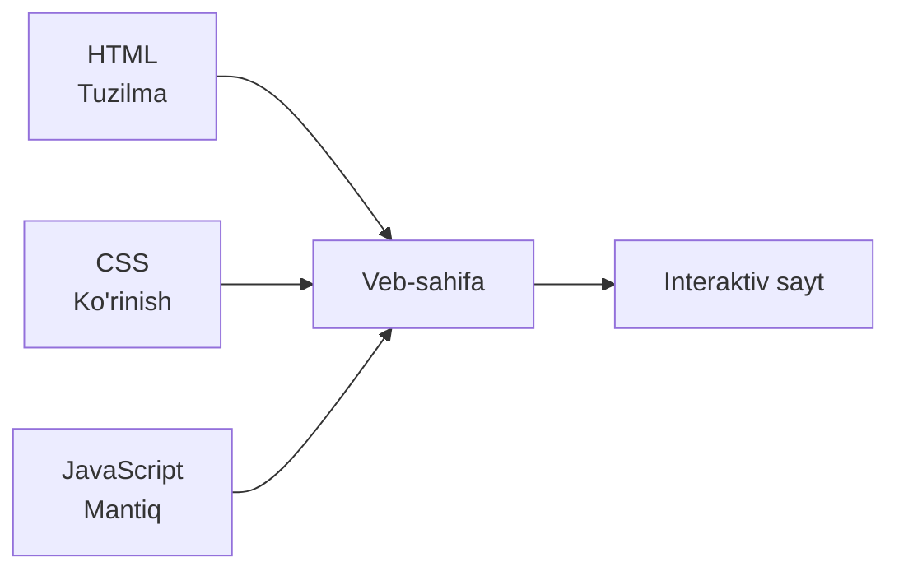
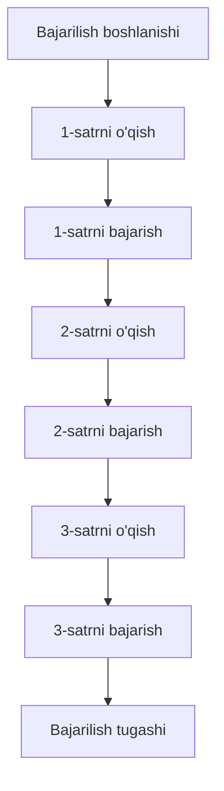
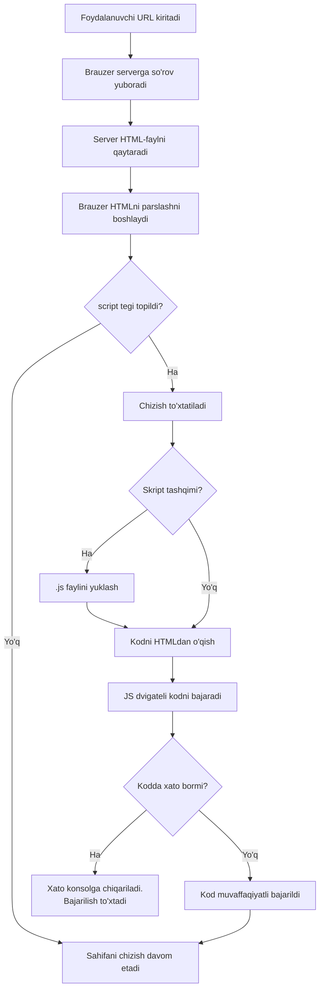

## JavaScript ga kirish

> **Oldingi kurslar bilan bog'liqlik:** «HTML: A dan Z gacha» va «CSS: 10 darsda» kurslarida sahifani yaratdik va bezatdik. Bugun uni JavaScript yordamida jonlantirishni boshlaymiz.

---

## Darsning maqsadi

JavaScript nima ekanini, uning HTML va CSS bilan aloqasini tushunish, skriptlarni ulashning uchta usulini o'zlashtirish va birinchi dasturni yozish — dars oxiriga kelib istalgan sahifaga mustaqil ravishda bajariladigan kod qo'shish va uning natijasini brauzer konsolida ko'rish.

## Dars oxiriga kelib nimani o'rganasiz

- JavaScript nima ekanini va uning HTML (tuzilma) hamda CSS (ko'rinish) bilan qanday aloqa qilishini tushuntirasiz.
- Skriptlarni uchta usulda ulaysiz (ichki, tashqi, brauzer konsoli) — va tashqi fayl nega afzalroq ekanini tushunasiz.
- `console.log()` yordamida birinchi dasturni yozasiz va uning natijasini brauzer konsolida ko'rasiz.
- JavaScript ketma-ket, satrma-satr, yuqoridan pastga bajarilishini tushunasiz.
- Kodni izohlash uchun `//` va `/* */` izohlaridan foydalanasiz.
- Brauzer HTMLni qanday parslashini, `<script>` teglarini topib, kodni V8 yoki SpiderMonkey kabi dvigatelda qanday bajarishini tasvirlaysiz.

---

## Darsning rejasi

| Blok | Mazmuni |
| -------------------------------------------- | ---------------------------------------------- |
| 1. JavaScript nima va u nega kerak            | Uy avtomatikasi bilan o'xshashlik, HTML/CSS/JS rollari |
| 2. Skriptlarni ulashning uchta usuli          | Ichki, tashqi, konsol — afzallik va kamchiliklar |
| 3. Birinchi dastur: `console.log()`           | Sintaksis, argumentlar, natija qayerda ko'rinadi |
| 4. Kodning bajarilish tartibi                 | Sinxron, satrma-satr bajarilish, xatolar       |
| 5. Izohlar                                   | `//` va `/* */`, ularning vazifasi             |
| 6. Kod brauzerda qanday bajariladi            | Parsing, dvigatel, V8/SpiderMonkey             |
| 7. Amaliyot: birinchi dastur                 | Skriptlarni ulash va natijani kuzatish          |
| 8. Yakun va uy vazifasi                     | Mustahkamlash                                  |

---

## Blok 1. JavaScript nima va u nega kerak

**Oddiy so'zlar bilan:** oldingi kurslarda uy qurdik va uni bezatdik. HTML karkasni quradi, CSS devorlarni bo'yaydi va mebelni joylashtiradi. **JavaScript (JS)** — bu elektr simlari va avtomatika: u qarsak chalganingizda chiroq yonishi, eshiklar o'z-o'zidan ochilishi va sahifaning bosishlarga reaksiya berishiga sabab bo'ladi.

JavaScript — bu veb-sahifalarni interaktiv qilish uchun yaratilgan **dasturlash tili**. HTML (belgilash tili) va CSS (bezatish tili)dan farqli o'laroq, JavaScript to'liq huquqli dasturlash tilidir: unda o'zgaruvchilar, shartlar, sikllar, funksiyalar bor va u hisob-kitoblarni bajara oladi.

**Yodda tutish kerak bo'lgan asosiy tamoyil:** uch texnologiya **turli vazifalarni** hal qiladi va ularni aralashtirmaslik muhim:

- **HTML** «bu nima?» degan savolga javob beradi — sarlavha, paragraf, ro'yxat, tugma.
- **CSS** «bu qanday ko'rinadi?» degan savolga javob beradi — rang, o'lcham, joylashuv.
- **JavaScript** «qanday voqea, qachon?» degan savolga javob beradi — sahifa bosishlarga reaksiya beradi, ma'lumotlarni hisoblaydi, mazmunni dinamik o'zgartiradi.



### JavaScript nimani bajara oladi

- Foydalanuvchi amallariga reaksiya berish (bosishlar, tugmalar, formaga kiritish).
- Sahifaning mazmuni va tuzilmasini tezda o'zgartirish (DOM — 9-dars).
- Hisob-kitoblarni bajarish va ma'lumotlarni qayta ishlash.
- Serverda (Node.js) va mobil ilovalarda (React Native) ishlash.

Bularning barchasini kurs davomida tartib bilan o'rganamiz.

---

## Blok 2. JavaScriptni ulashning uchta usuli

JavaScriptni HTML-sahifaga qo'shishning uchta usuli bor. Uchchalasini ko'rib chiqamiz — lekin darhol tushunish muhim: ular sifat jihatidan **teng emas**.

### 1-usul. Ichki — `<script>` tegi

Kod to'g'ridan-to'g'ri HTML-hujjat ichidagi `<script>` tegi ichida, odatda `<body>` oxirida yoziladi.

```html
<!DOCTYPE html>
<html>
<head>
    <title>Misol</title>
</head>
<body>
    <h1>Sarlavha</h1>

    <script>
        console.log('HTML ichidagi kod');
    </script>
</body>
</html>
```

**Afzalliklari:** tez, qo'shimcha fayllar kerak emas — tezkor tajribalar uchun qulay.

**Kamchiliklari:**

- Kod bitta HTML-sahifaga bog'liq — bir nechta sahifaga bir xil mantiq kerak bo'lsa, uni hamma joyda takrorlashga to'g'ri keladi.
- Tuzilma (HTML) va mantiq (JavaScript) bitta faylda aralashib ketadi, bu kodni o'qish va qo'llab-quvvatlashni qiyinlashtiradi.

**Xulosa:** kichik test misollari yoki faqat shu sahifaga xos mantiq uchun ishlatiladi.

### 2-usul. Tashqi — `src` atributi

Kod alohida `.js` faylga chiqariladi va `<script>` tegining `src` atributi orqali HTMLga ulanadi.

**`script.js` fayli:**

```javascript
console.log('Tashqi fayldagi kod');
```

**`index.html` fayli:**

```html
<body>
    <h1>Sarlavha</h1>
    <script src="script.js"></script>
</body>
```

**Afzalliklari:**

- **Bitta fayl — ko'p sahifalar.** Xuddi shu `script.js`ni bir nechta HTML-faylga ulang — mantiq hamma joyda bir xil ishlaydi. Faylni bir marta o'zgartirdingiz — barcha sahifalar yangilandi.
- **Mas'uliyatni bo'lish.** HTML-fayllarda faqat tuzilma, JS-fayllarda faqat mantiq bo'ladi. Har bir faylni o'qish va qo'llab-quvvatlash osonroq.
- **Brauzer keshi.** Brauzer tashqi skriptni bir marta yuklab oladi va eslab qoladi — sahifalar orasida o'tganda qayta yuklanmaydi, bu saytni tezlashtiradi.

**Xulosa:** bu **to'g'ri, professional usul** — biz uni ushbu kursda asosiy usul sifatida ishlatamiz.

### 3-usul. Brauzer konsoli

Kodni hech qanday fayl yaratmasdan, to'g'ridan-to'g'ri brauzerning dasturchi konsoliga yozish mumkin.

```javascript
console.log('Konsoldagi test');
```

**Afzalliklari:** bir zumda — istalgan kod parchasini shu yerda, hech narsa saqlamasdan tekshirish mumkin.

**Kamchiliklari:** kod hech qayerda saqlanmaydi va sahifa yangilanganda yo'qoladi — bu faqat tajribalar uchun.

**Xulosa:** test va tuzatish uchun ajralmas vosita, lekin kodni foydalanuvchilarga yetkazish usuli emas.

### Taqqoslash jadvali

|Usul|Qayerda yoziladi|Qanday hududda ishlaydi|Tavsiya|
|---|---|---|---|
|Ichki (`<script>`)|HTML-fayl ichida|Faqat shu bitta sahifa|Faqat tezkor tajribalar|
|Tashqi (`src`)|Alohida `.js` fayl|Istalgan miqdordagi sahifalar|**Ushbu kursda asosiy usul**|
|Konsol|Brauzer DevTools|Joriy sessiya|Test va tuzatish|

---

### Boshlovchilarning keng tarqalgan xatolari

|Xato|Qanday tuzatish kerak|
|---|---|
|`<script>` tegini `<head>`ga qo'yish|Skript uchrashganda bajariladi — elementlar hali mavjud bo'lmasa, xatolar yuzaga keladi. Skriptni `<body>` oxiriga qo'ying (9-darsgacha)|
|`src` atributi unutilib, `console.log` to'g'ridan-to'g'ri `<script src="script.js">` ichiga yoziladi|`src` atributi «kodni fayldan yuklab ol» degani — `src` bo'lgan tegga kod yozib bo'lmaydi|
|`<script>` tegisiz `console.log` to'g'ridan-to'g'ri HTML matniga yoziladi|Brauzer buni matn deb tushunadi. Kodni `<script>...</script>` ichiga o'rab qo'ying yoki `.js` faylga joylashtiring|
|`.js` faylga noto'g'ri yo'l ko'rsatilgan|Yo'lni HTML-fayl joylashgan joyga nisbatan tekshiring (HTML kursidagi 3-darsdagi kabi)|

---

## Blok 3. Birinchi dastur: `console.log()`

Istalgan tilda an'anaviy birinchi dastur «Hello, World!» xabarini chiqaradi — JavaScriptda bu `console.log()` metodi orqali bajariladi.

```javascript
console.log('Salom, dunyo!');
```

### Sintaksisni tahlil qilish

|Element|Tavsif|
|---|---|
|`console`|Brauzer konsoliga kirishni ta'minlaydigan obyekt|
|`.log()`|Berilgan qiymatni konsolga chiqaradigan metod|
|`'Salom, dunyo!'`|Metodning argumenti — chiqariladigan satr|

### Natija qayerda ko'rinadi

Natija brauzer konsolida chiqariladi:

1. Kodli sahifani brauzerda oching.
2. **F12** tugmasini bosing (yoki sichqonchaning o'ng tugmasi → «Tekshirish»).
3. **Console** bo'limiga o'ting.
4. U yerda `Salom, dunyo!` xabarini ko'rasiz.

**Nega konsoldan boshlaymiz?** Keyingi darslarda `console.log()` bizning asosiy tuzatish vositamizga aylanadi — kodning «ichiga qarash», o'zgaruvchilarda qanday qiymatlar borligini va mantiq ishlayaptimi yoki yo'qligini tushunish usuli.

---

## Blok 4. Kodning bajarilish tartibi

JavaScript — **sinxron** va **interpretatsiya qilinadigan** til. Bu degani, kod satrma-satr, yuqoridan pastga bajariladi — har bir keyingi satr oldingisi tugagandan keyingina ishga tushadi.

```javascript
console.log('1-qadam: Boshlandi');
console.log('2-qadam: Davom etmoqda');
console.log('3-qadam: Tugadi');
```

**Konsoldagi natija:**

```
1-qadam: Boshlandi
2-qadam: Davom etmoqda
3-qadam: Tugadi
```



**Tushunish muhim:** istalgan satrda xato yuzaga kelsa, bajarilish **to'xtaydi** — undan pastdagi qolgan satrlar ishlanmaydi. Bu xato xabarlarini o'qishga yordam beradi: xato har doim birinchi muammoli satrni ko'rsatadi.

---

## Blok 5. Izohlar

**Izoh** — bu interpretator butunlay e'tiborsiz qoldiradigan manba kodi matni. U odamlar uchun mo'ljallangan — kodni tushuntirish yoki hujjatlashtirish uchun.

### Bir qatorli izoh: `//`

`//` dan keyin satr oxirigacha bo'lgan hammasi izoh hisoblanadi.

```javascript
// Foydalanuvchi ismiga ega o'zgaruvchining e'lon qilinishi
let userName = 'Ali';

let age = 25; // foydalanuvchining yoshi
```

### Ko'p qatorli izoh: `/* ... */`

`/*` va `*/` orasidagi hammasi izoh bo'lib, u xohlagancha qatorni egallashi mumkin.

```javascript
/*
  calculateSum funksiyasi
  Ikkita sonni qabul qiladi va ularning yig'indisini qaytaradi
*/
function calculateSum(a, b) {
    return a + b;
}
```

### Izohlar nima uchun kerak

1. **Mantiqni hujjatlashtirish** — kodning nimani va nima uchun bajarishini tushuntirish.
2. **Kodni vaqtincha o'chirish** — tuzatish paytida satrni o'chirmasdan «o'chirish» uchun izohga aylantirish.
3. **O'qilishini yaxshilash** boshqa dasturchilar uchun (va kelajakda o'zingiz uchun).

---

### Boshlovchilarning keng tarqalgan xatolari

|Xato|Qanday tuzatish kerak|
|---|---|
|JS-fayl ichida HTML izohlaridan `<!-- -->` foydalanish|JavaScriptda izohlar `//` yoki `/* */` ko'rinishida yoziladi|
|Yopilmagan `/*`|Yopilmagan ko'p qatorli izoh o'zidan keyingi kodni «yutib yuboradi» — hammasi bitta ulkan izohga aylanadi|
|Har bir satrni izohlash|«Nima uchun»ni va murakkab mantiqni izohlang, o'z-o'zidan tushunarli joyni emas — izohlarning ko'pligi ham ularning kamligi kabi o'qilishga zarar keltiradi|

---

## Blok 6. Kod brauzerda qanday bajariladi

### To'liq yuklash va bajarish tsikli

1. Brauzer HTML-faylni yuqoridan pastga parslashadi.
2. `<script>` tegi uchraganda, brauzer sahifani chizishni to'xtatadi.
3. JavaScript dvigateli kodni bajaradi (kerak bo'lsa avval tashqi `.js` faylini yuklab oladi).
4. Bajarilish davom etadi; birinchi xatoda u to'xtaydi va xato konsolga chiqariladi.



### JavaScript dvigateli nima

Dvigatel — brauzerning JavaScriptni tushunadigan va bajaradigan qismi. Turli brauzerlarda o'z dvigatellari bor:

- **Chrome / Edge** **V8**dan foydalanadi.
- **Firefox** **SpiderMonkey**dan foydalanadi.
- **Safari** **JavaScriptCore**dan foydalanadi.

Dvigatel kodni asl ko'rinishida satrma-satr bajarmaydi: u manba kodni ichki ko'rinishga, so'ngra protsessor tushunadigan mashina kodiga aylantiradi — buni «uchib ketayotganda», aynan bajarish vaqtida qiladi.

### Yodda saqlash uchun asosiy faktlar

- JavaScript — **interpretatsiya qilinadigan** til: u bajarish vaqtida mashina kodiga aylanadi, oldindan emas.
- JavaScript dvigateli **brauzerga o'rnatilgan**.
- `<script>` tegi uchraganda, brauzer skript tugaguncha **sahifani chizishni bloklaydi** — shuning uchun katta skriptlar `<body>` oxiriga qo'yiladi.

---

## Blok 7. Amaliyot: birinchi dastur

Hammaning bilimini amalda qo'llaymiz — birinchi dasturni yozamiz va uni ikkala usulda ulaymiz.

**1-qadam.** Loyiha papkasini yarating, masalan `MyFirstJS`.

**2-qadam.** Ichida `index.html` faylini yarating va asosiy tuzilmani yozing:

```html
<!DOCTYPE html>
<html lang="uz">
<head>
    <meta charset="UTF-8">
    <title>Mening birinchi JS</title>
</head>
<body>
    <h1>Salom, dunyo!</h1>
</body>
</html>
```

**3-qadam.** Yopiluvchi `</body>` tegi oldidan birinchi buyruq bilan `<script>` tegini qo'shing:

```html
<body>
    <h1>Salom, dunyo!</h1>

    <script>
        console.log('Salom, dunyo!');
    </script>
</body>
```

**4-qadam.** Sahifani brauzerda oching (Live Server orqali yoki faylga ikki marta bosish).

**5-qadam.** **F12** tugmasini bosing, **Console** bo'limiga o'ting va `Salom, dunyo!` xabari chiqqaniga ishonch hosil qiling.

**6-qadam.** Endi kodni tashqi faylga chiqaramiz. `index.html` yonida `main.js` faylini yarating:

```javascript
console.log('Salom, dunyo!');
```

**7-qadam.** `index.html`da `<script>` ichidagi kodni faylga havolaga almashtiring:

```html
<script src="main.js"></script>
```

**8-qadam.** Sahifani yangilang va natija bir xilligiga ishonch hosil qiling — xabar konsolda yana paydo bo'ldi.

---

## Darsning yakuni

Bugun siz quyidagilarni o'rgandingiz:

- **JavaScript** — bu **mantiq va interaktivlik** uchun mas'ul bo'lgan dasturlash tili; HTML — tuzilma, CSS — ko'rinish.
- JavaScriptni ulashning uchta usuli bor: ichki (`<script>`), tashqi (`src` atributi) va brauzer konsoli — ushbu kursda asosiy usul — **tashqi fayl**.
- Birinchi dastur — `console.log('Salom, dunyo!');`, natija brauzer konsolida ko'rinadi (F12 → Console).
- JavaScript **ketma-ket**, satrma-satr, yuqoridan pastga bajariladi; istalgan satrdagi xato keyingi bajarilishni to'xtatadi.
- Izohlar `//` (bir qatorli) va `/* */` (ko'p qatorli) ko'rinishida yoziladi.
- Brauzer HTMLni parslashadi, `<script>` teglarini topadi va kodni dvigatel yordamida bajaradi (Chrome'da V8, Firefox'da SpiderMonkey), shu vaqtda sahifa chizilishini bloklab turadi.

---

## Amaliy vazifa

Birinchi dasturingizni yarating va ulang:

1. `MyFirstJS` papkasini va ichida asosiy HTML tuzilmali `index.html` faylini yarating.
2. `<body>` ichida `<script>` tegini qo'shing va `console.log('Salom, dunyo!');` deb yozing.
3. Sahifani brauzerda oching, F12 ni bosing va Console bo'limida xabarni toping.
4. `main.js` faylini yarating, buyruqni o'sha yerga o'tkazing va HTMLda faqat `<script src="main.js"></script>` ni qoldiring.
5. Sahifani yangilang va natija bir xilligini tekshiring.
6. To'g'ridan-to'g'ri konsolda `console.log('Konsoldan test');` deb yozing — hech qanday faylsiz — va natijani ko'ring.

---

[Keyingi dars: O'zgaruvchilar va ma'lumot turlari →](../../Lesson-2/uz/O'zgaruvchilar%20va%20ma'lumot%20turlari.md)