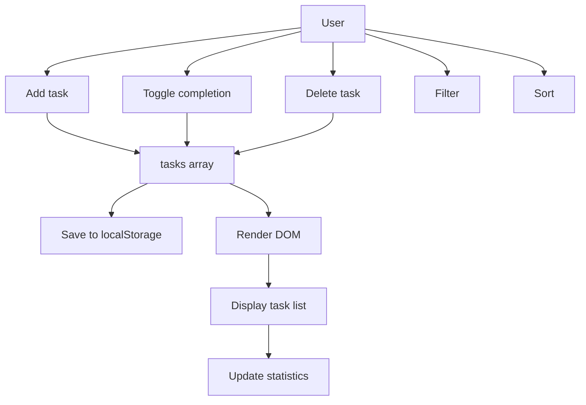
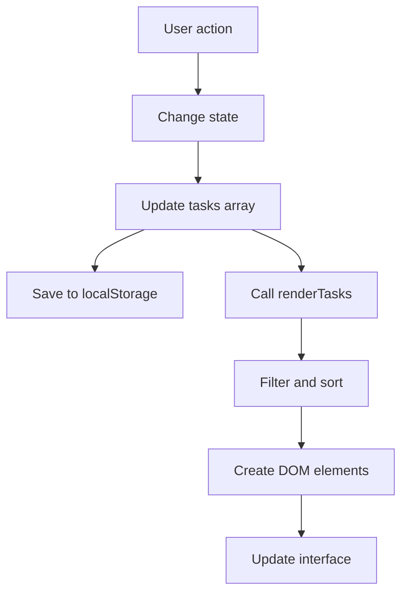

## Final Project — To-Do List Manager

> **Connection with the previous lesson:** over the past nine lessons we studied variables, arrays, objects, conditions, loops, functions, Date, the DOM, events, and localStorage. Now it is time to bring every one of those topics together into a single, real application.

---

## Project Goal

Build a fully functional **To-Do List Manager** that covers every major concept from the JavaScript course: data storage, CRUD operations, filtering, sorting, deadline formatting, inline editing, and persistent state via localStorage.

## What You Will Build

- Add a new task with a text description and an optional deadline.
- Mark a task as completed (toggle).
- Delete a task with a confirmation prompt.
- Edit a task text inline (double-click to edit, Enter to save, Escape to cancel).
- Filter tasks by status: All / Active / Completed.
- Sort tasks by creation date.
- Persist all data in localStorage so tasks survive a page reload.
- Display live statistics (total tasks, completed tasks).
- Format deadlines with human-readable labels (overdue, today, tomorrow, in N days).

---

## Project Timeline

| Block | Content |
| --- | --- |
| 1. Project description and features | What we are building and why |
| 2. File structure | index.html, css/style.css, js/app.js |
| 3. Data structure | Shape of a task object |
| 4. HTML markup | Semantic structure of the page |
| 5. CSS styling | Polished, responsive interface |
| 6. JavaScript — application logic | State, DOM cache, localStorage, CRUD, filtering, sorting, rendering, inline editing, statistics, init |
| 7. Testing | Manual verification checklist |
| 8. Bonus assignments | Priorities, subtasks, export/import, reminders, grouping by day |
| 9. How it connects everything | Mapping course topics to project usage |

---

## Block 1. Project Description

Throughout the course we practiced each JavaScript concept in isolation — a variable here, a loop there, a small function. A real application, however, requires all of those pieces to work together. The To-Do List Manager is the classic "glue" project: simple enough to build in one sitting, yet complex enough to touch every topic we covered.

**Why a To-Do List?**

- The domain is familiar to everyone — no learning curve for the problem space.
- The core operations (create, read, update, delete) map directly to array methods and DOM manipulation.
- Adding deadlines introduces the Date object in a practical way.
- Filtering and sorting require conditions and comparison logic.
- localStorage ties everything together with persistent state.

**Features at a glance:**

| Feature | Course topic used |
| --- | --- |
| Add a task | Functions, DOM events |
| Toggle completion | Conditionals, array find |
| Delete a task | Array filter |
| Edit inline | DOM manipulation, keyboard events |
| Filter by status | Array filter, data attributes |
| Sort by date | Date comparison, array sort |
| Persist data | localStorage, JSON |
| Deadline labels | Date arithmetic |
| Live statistics | DOM update, array reduce |

---

## Block 2. File Structure

```
todo-app/
  index.html
  css/
    style.css
  js/
    app.js
```

Three files, clean separation: structure in HTML, presentation in CSS, behavior in JavaScript.

---

## Block 3. Data Structure

Every task is a plain JavaScript object:

```javascript
{
    id: 1719000000000,
    text: "Buy groceries",
    completed: false,
    createdAt: "2026-06-18T13:45:00.000Z",
    deadline: "2026-06-20"
}
```

| Property | Type | Purpose |
| --- | --- | --- |
| `id` | number | Unique identifier (timestamp + random) |
| `text` | string | Task description |
| `completed` | boolean | Done or not |
| `createdAt` | string (ISO) | When the task was created |
| `deadline` | string | Optional due date (YYYY-MM-DD) |

The entire application state lives in one object:

```javascript
const state = {
    tasks: [],          // array of task objects
    filter: 'all',      // 'all' | 'active' | 'completed'
    sortByDate: false   // toggle for date sorting
};
```

---

## Block 4. HTML Markup

Create `index.html`:

```html
<!DOCTYPE html>
<html lang="en">
<head>
    <meta charset="UTF-8">
    <meta name="viewport" content="width=device-width, initial-scale=1.0">
    <title>To-Do List Manager</title>
    <link rel="stylesheet" href="css/style.css">
</head>
<body>
    <div class="container">
        <header>
            <h1>My Tasks</h1>
            <p class="stats">
                Total: <span id="totalTasks">0</span> |
                Completed: <span id="completedTasks">0</span>
            </p>
        </header>

        <section class="add-task">
            <input type="text" id="taskInput" placeholder="Enter a new task...">
            <input type="date" id="deadlineInput">
            <button id="addBtn">Add Task</button>
        </section>

        <section class="filters">
            <button class="filter-btn active" data-filter="all">All</button>
            <button class="filter-btn" data-filter="active">Active</button>
            <button class="filter-btn" data-filter="completed">Completed</button>
            <button class="sort-btn" id="sortBtn">Sort by Date</button>
        </section>

        <section class="task-list">
            <ul id="taskList"></ul>
        </section>

        <section class="empty-state">
            <p>No tasks yet. Add your first one!</p>
        </section>
    </div>

    <script src="js/app.js"></script>
</body>
</html>
```

Key points:

- The `<ul>` with id `taskList` is the container where JavaScript will inject task items.
- Filter buttons carry `data-filter` attributes so JS can read the target filter without extra variables.
- The empty-state section is hidden by default and shown only when there are no tasks.

---

## Block 5. CSS Styling

Create `css/style.css`:

```css
/* style.css */
* {
    margin: 0;
    padding: 0;
    box-sizing: border-box;
}

body {
    font-family: 'Segoe UI', Tahoma, Geneva, Verdana, sans-serif;
    background: #f0f2f5;
    color: #333;
    min-height: 100vh;
    display: flex;
    justify-content: center;
    padding: 20px;
}

.container {
    background: #fff;
    border-radius: 12px;
    box-shadow: 0 2px 10px rgba(0, 0, 0, 0.1);
    padding: 30px;
    max-width: 700px;
    width: 100%;
    height: fit-content;
}

header {
    margin-bottom: 25px;
    border-bottom: 2px solid #f0f2f5;
    padding-bottom: 15px;
}

header h1 {
    font-size: 28px;
    color: #1a73e8;
}

.stats {
    margin-top: 8px;
    color: #666;
    font-size: 14px;
}

.stats span {
    font-weight: bold;
    color: #1a73e8;
}

.add-task {
    display: flex;
    gap: 10px;
    margin-bottom: 20px;
    flex-wrap: wrap;
}

.add-task input[type="text"] {
    flex: 1;
    padding: 12px 16px;
    border: 2px solid #e0e0e0;
    border-radius: 8px;
    font-size: 16px;
    min-width: 150px;
    outline: none;
    transition: border-color 0.2s;
}

.add-task input[type="text"]:focus {
    border-color: #1a73e8;
}

.add-task input[type="date"] {
    padding: 12px 16px;
    border: 2px solid #e0e0e0;
    border-radius: 8px;
    font-size: 16px;
    min-width: 150px;
    outline: none;
    transition: border-color 0.2s;
}

.add-task input[type="date"]:focus {
    border-color: #1a73e8;
}

.add-task button {
    padding: 12px 24px;
    background: #1a73e8;
    color: #fff;
    border: none;
    border-radius: 8px;
    font-size: 16px;
    cursor: pointer;
    transition: background 0.2s;
}

.add-task button:hover {
    background: #1557b0;
}

.filters {
    display: flex;
    gap: 10px;
    margin-bottom: 20px;
    flex-wrap: wrap;
}

.filters button {
    padding: 8px 16px;
    border: 2px solid #e0e0e0;
    border-radius: 20px;
    background: transparent;
    cursor: pointer;
    font-size: 14px;
    transition: all 0.2s;
}

.filters button:hover {
    background: #f0f2f5;
}

.filters button.active {
    background: #1a73e8;
    color: #fff;
    border-color: #1a73e8;
}

.task-list {
    margin-bottom: 20px;
}

#taskList {
    list-style: none;
}

.task-item {
    display: flex;
    align-items: center;
    gap: 12px;
    padding: 12px 16px;
    background: #f8f9fa;
    border-radius: 8px;
    margin-bottom: 8px;
    transition: all 0.2s;
    border-left: 4px solid #1a73e8;
}

.task-item:hover {
    background: #f0f2f5;
    transform: translateX(4px);
}

.task-item.completed {
    border-left-color: #34a853;
    opacity: 0.7;
}

.task-item.completed .task-text {
    text-decoration: line-through;
    color: #888;
}

.task-item .task-checkbox {
    width: 20px;
    height: 20px;
    cursor: pointer;
    accent-color: #1a73e8;
}

.task-item .task-text {
    flex: 1;
    font-size: 16px;
    cursor: default;
}

.task-item .task-deadline {
    font-size: 12px;
    color: #666;
    padding: 2px 8px;
    background: #e8eaed;
    border-radius: 12px;
    white-space: nowrap;
}

.task-item .task-actions {
    display: flex;
    gap: 8px;
}

.task-item .task-actions button {
    padding: 4px 8px;
    border: none;
    border-radius: 4px;
    cursor: pointer;
    font-size: 14px;
    background: transparent;
    transition: all 0.2s;
}

.task-item .task-actions .edit-btn {
    color: #1a73e8;
}

.task-item .task-actions .edit-btn:hover {
    background: #e8f0fe;
}

.task-item .task-actions .delete-btn {
    color: #d93025;
}

.task-item .task-actions .delete-btn:hover {
    background: #fce8e6;
}

.empty-state {
    text-align: center;
    padding: 40px 0;
    color: #888;
    display: none;
}

.empty-state.visible {
    display: block;
}

.edit-input {
    width: 70%;
    padding: 4px 8px;
    border: 2px solid #1a73e8;
    border-radius: 4px;
    font-size: 16px;
    outline: none;
}

@media (max-width: 600px) {
    .container {
        padding: 15px;
    }

    .add-task {
        flex-direction: column;
    }

    .add-task input[type="text"],
    .add-task input[type="date"] {
        width: 100%;
    }

    .filters {
        flex-direction: column;
    }

    .filters button {
        width: 100%;
    }

    .task-item {
        flex-wrap: wrap;
    }
}
```

---

## Block 6. JavaScript — Application Logic

Create `js/app.js`. This is the heart of the project. We will walk through each section.

### 6.1. Application State

```javascript
// js/app.js

// ============================================
// 1. APPLICATION STATE
// ============================================

const state = {
    tasks: [],
    filter: 'all',
    sortByDate: false
};
```

`state` is a single object that holds everything the application needs to know. Having one source of truth makes it easy to reason about what is happening at any moment.

### 6.2. DOM Element Cache

```javascript
// ============================================
// 2. DOM ELEMENTS
// ============================================

const DOM = {
    taskInput: document.getElementById('taskInput'),
    deadlineInput: document.getElementById('deadlineInput'),
    addBtn: document.getElementById('addBtn'),
    taskList: document.getElementById('taskList'),
    totalTasks: document.getElementById('totalTasks'),
    completedTasks: document.getElementById('completedTasks'),
    emptyState: document.querySelector('.empty-state'),
    filterBtns: document.querySelectorAll('.filter-btn'),
    sortBtn: document.getElementById('sortBtn')
};
```

We look up every element once and store references. Repeated `getElementById` calls inside tight loops would be wasteful; this approach is both faster and clearer.

### 6.3. localStorage Operations

```javascript
// ============================================
// 3. STORAGE (localStorage)
// ============================================

function saveToStorage() {
    try {
        localStorage.setItem('tasks', JSON.stringify(state.tasks));
    } catch (error) {
        console.error('Save error:', error);
    }
}

function loadFromStorage() {
    try {
        const data = localStorage.getItem('tasks');
        if (data) {
            state.tasks = JSON.parse(data);
        }
    } catch (error) {
        console.error('Load error:', error);
        state.tasks = [];
    }
}
```

localStorage stores only strings. We use `JSON.stringify` to serialize the array and `JSON.parse` to restore it. The `try/catch` blocks guard against corrupted data or storage quota errors.

### 6.4. ID Generation

```javascript
// ============================================
// 4. ID GENERATION
// ============================================

function generateId() {
    return Date.now() + Math.floor(Math.random() * 1000);
}
```

`Date.now()` gives a millisecond timestamp. Adding a random component reduces the chance of collision if two tasks are created in the same millisecond.

### 6.5. Task Creation

```javascript
// ============================================
// 5. CREATE TASK
// ============================================

function createTask(text, deadline) {
    return {
        id: generateId(),
        text: text.trim(),
        completed: false,
        createdAt: new Date().toISOString(),
        deadline: deadline || ''
    };
}
```

This pure function returns a new task object without side effects. It is called by `addTask`, which is the function that actually mutates state.

### 6.6. CRUD Operations

```javascript
// ============================================
// 6. CRUD OPERATIONS
// ============================================

function addTask(text, deadline) {
    if (!text || !text.trim()) {
        alert('Please enter a task description.');
        return false;
    }

    const task = createTask(text, deadline);
    state.tasks.unshift(task);
    saveToStorage();
    renderTasks();
    updateStats();
    return true;
}

function deleteTask(id) {
    if (!confirm('Delete this task?')) return;

    state.tasks = state.tasks.filter(task => task.id !== id);
    saveToStorage();
    renderTasks();
    updateStats();
}

function toggleTask(id) {
    const task = state.tasks.find(t => t.id === id);
    if (task) {
        task.completed = !task.completed;
        saveToStorage();
        renderTasks();
        updateStats();
    }
}

function editTask(id, newText) {
    const task = state.tasks.find(t => t.id === id);
    if (task) {
        task.text = newText.trim();
        saveToStorage();
        renderTasks();
    }
}
```

Each function follows the same pattern: mutate `state.tasks`, save, re-render, update statistics. This consistency keeps the data flow predictable.

### 6.7. Filtering and Sorting

```javascript
// ============================================
// 7. FILTERING & SORTING
// ============================================

function getFilteredTasks() {
    let filtered = state.tasks;

    if (state.filter === 'active') {
        filtered = filtered.filter(task => !task.completed);
    } else if (state.filter === 'completed') {
        filtered = filtered.filter(task => task.completed);
    }

    if (state.sortByDate) {
        filtered = [...filtered].sort((a, b) => {
            return new Date(b.createdAt) - new Date(a.createdAt);
        });
    }

    return filtered;
}

function setFilter(filter) {
    state.filter = filter;

    DOM.filterBtns.forEach(btn => {
        btn.classList.toggle('active', btn.dataset.filter === filter);
    });

    renderTasks();
}

function toggleSort() {
    state.sortByDate = !state.sortByDate;
    DOM.sortBtn.textContent = state.sortByDate
        ? 'Sort by Date \u25B2'
        : 'Sort by Date';
    renderTasks();
}
```

`getFilteredTasks` is a pure function: given the current state, it returns a new array without modifying `state.tasks`. The spread operator `[...filtered]` before `.sort()` ensures we do not mutate the original array.

### 6.8. Rendering Pipeline

```javascript
// ============================================
// 8. RENDERING
// ============================================

function renderTasks() {
    const filtered = getFilteredTasks();
    const list = DOM.taskList;

    list.innerHTML = '';

    if (filtered.length === 0) {
        DOM.emptyState.classList.add('visible');
        return;
    }

    DOM.emptyState.classList.remove('visible');

    filtered.forEach(task => {
        const li = createTaskElement(task);
        list.appendChild(li);
    });
}

function createTaskElement(task) {
    const li = document.createElement('li');
    li.className = 'task-item' + (task.completed ? ' completed' : '');
    li.dataset.id = task.id;

    // Checkbox
    const checkbox = document.createElement('input');
    checkbox.type = 'checkbox';
    checkbox.className = 'task-checkbox';
    checkbox.checked = task.completed;
    checkbox.addEventListener('change', () => toggleTask(task.id));

    // Task text
    const textSpan = document.createElement('span');
    textSpan.className = 'task-text';
    textSpan.textContent = task.text;
    textSpan.addEventListener('dblclick', () => startEditing(task.id, textSpan));

    // Deadline label
    const deadlineSpan = document.createElement('span');
    deadlineSpan.className = 'task-deadline';
    deadlineSpan.textContent = formatDeadline(task.deadline);

    // Actions container
    const actions = document.createElement('div');
    actions.className = 'task-actions';

    // Delete button
    const deleteBtn = document.createElement('button');
    deleteBtn.className = 'delete-btn';
    deleteBtn.textContent = '\u2715';
    deleteBtn.title = 'Delete task';
    deleteBtn.addEventListener('click', () => deleteTask(task.id));

    actions.appendChild(deleteBtn);

    // Assemble
    li.appendChild(checkbox);
    li.appendChild(textSpan);
    li.appendChild(deadlineSpan);
    li.appendChild(actions);

    return li;
}
```

The rendering pipeline is: `renderTasks` calls `getFilteredTasks`, clears the list, then loops through the result calling `createTaskElement` for each task. This two-function split keeps the loop clean and makes `createTaskElement` independently testable.

### 6.9. Deadline Formatting

```javascript
// ============================================
// 9. DEADLINE FORMATTING
// ============================================

function formatDeadline(dateStr) {
    if (!dateStr) return 'No deadline';

    const deadline = new Date(dateStr);
    const today = new Date();
    today.setHours(0, 0, 0, 0);

    const diffDays = Math.ceil((deadline - today) / (1000 * 60 * 60 * 24));

    if (diffDays < 0) {
        return 'Overdue by ' + Math.abs(diffDays) + ' day(s)';
    } else if (diffDays === 0) {
        return 'Today';
    } else if (diffDays === 1) {
        return 'Tomorrow';
    } else {
        return 'In ' + diffDays + ' day(s)';
    }
}
```

This function demonstrates practical Date arithmetic. Subtracting two Date objects gives milliseconds; dividing by the number of milliseconds in a day converts to days.

### 6.10. Inline Editing

```javascript
// ============================================
// 10. INLINE EDITING
// ============================================

function startEditing(id, textSpan) {
    const currentText = textSpan.textContent;

    const input = document.createElement('input');
    input.type = 'text';
    input.className = 'edit-input';
    input.value = currentText;

    textSpan.textContent = '';
    textSpan.appendChild(input);
    input.focus();
    input.select();

    const finishEditing = () => {
        const newText = input.value.trim();
        if (newText && newText !== currentText) {
            editTask(id, newText);
        } else {
            textSpan.textContent = currentText;
        }
    };

    input.addEventListener('blur', finishEditing);
    input.addEventListener('keydown', (e) => {
        if (e.key === 'Enter') {
            input.blur();
        } else if (e.key === 'Escape') {
            textSpan.textContent = currentText;
        }
    });
}
```

The editing flow: double-click triggers `startEditing`, which replaces the text with an input field. Pressing Enter triggers blur, which calls `finishEditing`. Pressing Escape restores the original text without saving.

### 6.11. Statistics

```javascript
// ============================================
// 11. STATISTICS
// ============================================

function updateStats() {
    const total = state.tasks.length;
    const completed = state.tasks.filter(t => t.completed).length;

    DOM.totalTasks.textContent = total;
    DOM.completedTasks.textContent = completed;
}
```

### 6.12. Application Initialization

```javascript
// ============================================
// 12. INITIALIZATION
// ============================================

function init() {
    loadFromStorage();
    renderTasks();
    updateStats();

    // Add task on button click
    DOM.addBtn.addEventListener('click', () => {
        const text = DOM.taskInput.value;
        const deadline = DOM.deadlineInput.value;
        const success = addTask(text, deadline);
        if (success) {
            DOM.taskInput.value = '';
            DOM.deadlineInput.value = '';
            DOM.taskInput.focus();
        }
    });

    // Add task on Enter key
    DOM.taskInput.addEventListener('keydown', (e) => {
        if (e.key === 'Enter') {
            DOM.addBtn.click();
        }
    });

    // Filter buttons
    DOM.filterBtns.forEach(btn => {
        btn.addEventListener('click', () => {
            setFilter(btn.dataset.filter);
        });
    });

    // Sort toggle
    DOM.sortBtn.addEventListener('click', toggleSort);

    // Save before page unload
    window.addEventListener('beforeunload', saveToStorage);
}

document.addEventListener('DOMContentLoaded', init);
```

`DOMContentLoaded` ensures the script runs only after the HTML is fully parsed. Inside `init` we load saved tasks, render them, and wire up all event listeners.

### 6.13. Additional Utility Functions

```javascript
// ============================================
// 13. ADDITIONAL UTILITIES
// ============================================

function clearAllTasks() {
    if (!confirm('Delete all tasks?')) return;
    state.tasks = [];
    saveToStorage();
    renderTasks();
    updateStats();
}

function searchTasks(query) {
    if (!query) return getFilteredTasks();

    const searchQuery = query.toLowerCase().trim();
    const filtered = getFilteredTasks();

    return filtered.filter(task =>
        task.text.toLowerCase().includes(searchQuery)
    );
}
```

These utility functions are not wired into the UI by default but are available for future expansion or as part of the bonus assignments.

---

## Block 7. Application Data Flow





---

## Block 8. Testing

Open the application in a browser (use Live Server or open `index.html` directly) and verify:

| Step | Action | Expected result |
| --- | --- | --- |
| 1 | Type "Buy milk" and click Add | Task appears in the list; input clears |
| 2 | Click the checkbox | Task gets a strikethrough and turns green |
| 3 | Refresh the page | The toggled task is still marked completed |
| 4 | Click "Active" filter | Only non-completed tasks are shown |
| 5 | Click "Completed" filter | Only completed tasks are shown |
| 6 | Click "All" filter | All tasks are shown |
| 7 | Click "Sort by Date" | Tasks reorder by creation date (newest first) |
| 8 | Double-click a task text | An input field appears with the current text |
| 9 | Type a new text and press Enter | Task text updates |
| 10 | Double-click, then press Escape | Editing cancels, original text remains |
| 11 | Add a task with a deadline of tomorrow | Deadline label says "Tomorrow" |
| 12 | Add a task with a deadline in the past | Deadline label says "Overdue by N day(s)" |
| 13 | Click the delete button | Confirmation dialog appears; on confirm, task is removed |
| 14 | Statistics line shows correct totals | Total and completed counts match |

---

## Block 9. Bonus Assignments

### Bonus 1. Task Priorities

Add a priority select element to the add-task section and visually differentiate tasks:

```javascript
function createTask(text, deadline, priority) {
    return {
        id: generateId(),
        text: text.trim(),
        completed: false,
        createdAt: new Date().toISOString(),
        deadline: deadline || '',
        priority: priority || 'medium'
    };
}
```

```css
.task-item.priority-high { border-left-color: #d93025; }
.task-item.priority-medium { border-left-color: #fbbc04; }
.task-item.priority-low { border-left-color: #34a853; }
```

### Bonus 2. Subtasks

Allow each task to contain nested subtasks:

```javascript
{
    id: 123,
    text: "Buy groceries",
    subtasks: [
        { id: 1, text: "Bread", completed: false },
        { id: 2, text: "Milk", completed: true }
    ]
}
```

### Bonus 3. Export / Import JSON

Add buttons to export tasks to a `.json` file and import from one:

```javascript
function exportTasks() {
    const data = JSON.stringify(state.tasks, null, 2);
    const blob = new Blob([data], { type: 'application/json' });
    const url = URL.createObjectURL(blob);
    const a = document.createElement('a');
    a.href = url;
    a.download = 'tasks_' + new Date().toISOString().slice(0, 10) + '.json';
    a.click();
    URL.revokeObjectURL(url);
}

function importTasks(file) {
    const reader = new FileReader();
    reader.onload = (e) => {
        try {
            const tasks = JSON.parse(e.target.result);
            if (Array.isArray(tasks)) {
                state.tasks = tasks;
                saveToStorage();
                renderTasks();
                updateStats();
                alert('Tasks imported successfully!');
            }
        } catch (error) {
            alert('Import failed.');
        }
    };
    reader.readAsText(file);
}
```

### Bonus 4. Reminders

Set a reminder time for a task and display a browser notification when the time arrives:

```javascript
function setReminder(taskId, reminderDate) {
    const task = state.tasks.find(t => t.id === taskId);
    if (task) {
        task.reminder = reminderDate;
        saveToStorage();
        checkReminders();
    }
}

function checkReminders() {
    const now = new Date().getTime();
    state.tasks.forEach(task => {
        if (task.reminder && new Date(task.reminder).getTime() <= now) {
            if (!task.reminderShown) {
                showNotification('Reminder: ' + task.text);
                task.reminderShown = true;
                saveToStorage();
            }
        }
    });
}

setInterval(checkReminders, 30000);
```

### Bonus 5. Grouping by Day

Group tasks by their deadline or creation date:

```javascript
function groupTasksByDate(tasks) {
    const groups = {};

    tasks.forEach(task => {
        const date = task.deadline || task.createdAt.slice(0, 10);
        if (!groups[date]) {
            groups[date] = [];
        }
        groups[date].push(task);
    });

    return groups;
}
```

---

## Block 10. How It Connects Everything

| Course topic | Where it appears in the project |
| --- | --- |
| **Variables and types** | `state`, `DOM`, local variables in every function |
| **Arrays** | `state.tasks`, methods `filter`, `forEach`, `unshift` |
| **Objects** | Each task is an object; `state` is an object |
| **Conditionals** | Filter logic, deadline comparison, input validation |
| **Loops** | `forEach` in `renderTasks`, `getFilteredTasks`, `updateStats` |
| **Functions** | Every operation is its own function: `addTask`, `deleteTask`, `toggleTask`, `editTask`, `renderTasks`, `createTaskElement`, `formatDeadline`, `init` |
| **Date** | `Date.now()`, `new Date().toISOString()`, deadline arithmetic in `formatDeadline` |
| **DOM** | `createElement`, `appendChild`, `classList`, `textContent`, `innerHTML`, `dataset` |
| **Events** | `click`, `change`, `dblclick`, `keydown`, `blur`, `beforeunload`, `DOMContentLoaded` |
| **localStorage** | `saveToStorage` and `loadFromStorage` with `JSON.stringify` / `JSON.parse` |

---

## Practice / Final Assignment

Follow these steps to build the project from scratch:

1. Create a folder `todo-app` with subfolders `css/` and `js/`.
2. Create `index.html` with the full markup shown in Block 4.
3. Create `css/style.css` with the complete styles shown in Block 5.
4. Create `js/app.js` and add the code section by section:
   - State object.
   - DOM element cache.
   - localStorage functions.
   - ID generation.
   - `createTask`.
   - CRUD functions: `addTask`, `deleteTask`, `toggleTask`, `editTask`.
   - Filtering and sorting: `getFilteredTasks`, `setFilter`, `toggleSort`.
   - Rendering: `renderTasks`, `createTaskElement`.
   - `formatDeadline`.
   - `startEditing`.
   - `updateStats`.
   - `init` and `DOMContentLoaded` listener.
5. Open the page in a browser and test every feature from the checklist in Block 8.
6. Commit the project to your repository.
7. Pick at least two bonus assignments and implement them.

---

## Lesson Summary

In this final project you:

- Structured a multi-file application with clear separation of concerns.
- Managed application state with a single `state` object.
- Performed full CRUD operations on an array of objects.
- Filtered and sorted data using array methods.
- Formatted dates with practical Date arithmetic.
- Built inline editing with keyboard event handling.
- Persisted data across page reloads with localStorage.
- Rendered a dynamic DOM list from data, not hardcoded HTML.

Every major topic from the JavaScript course was applied in a single, cohesive project.

---

[Back to course start](../README.md)

Congratulations on completing the JavaScript course. You now have the foundation to build interactive web applications from scratch.