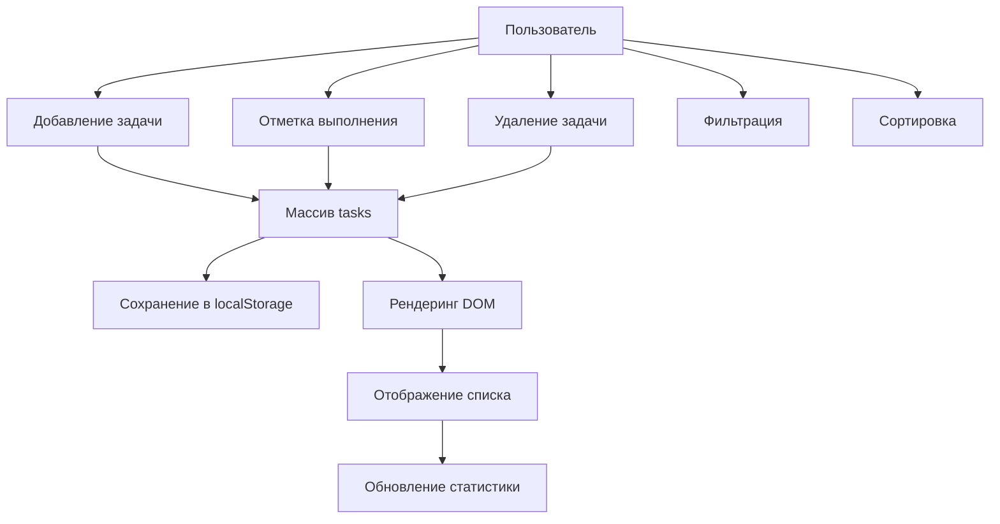
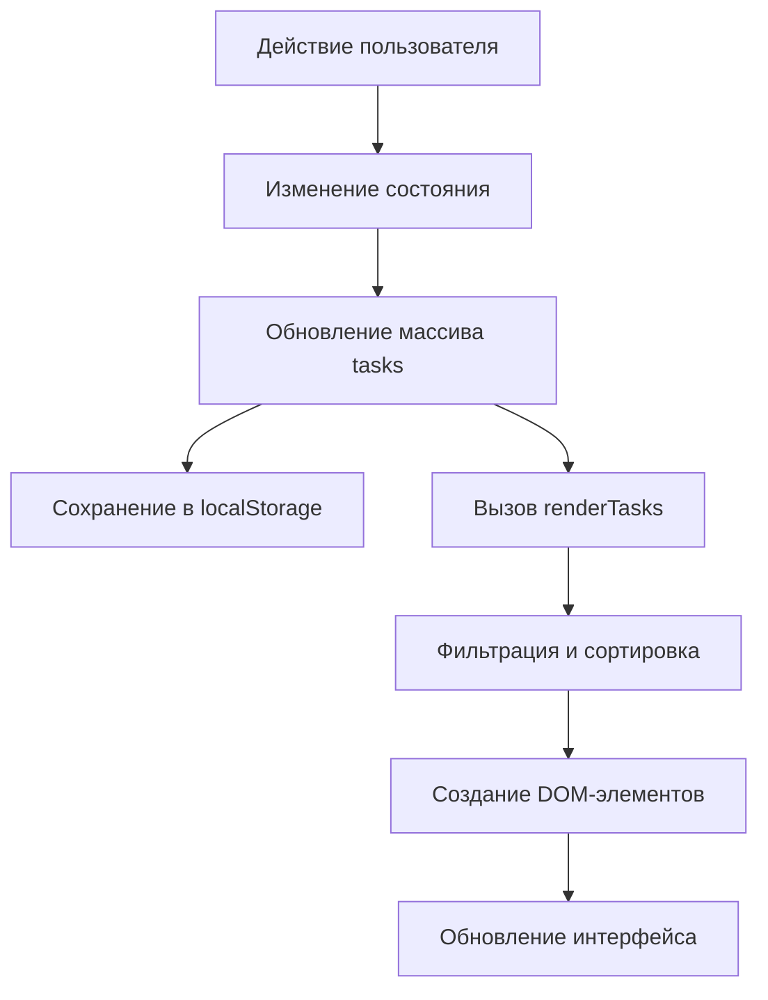

## Итоговый проект — менеджер задач

> **Связь с предыдущим уроком:** за девять уроков мы изучили переменные, массивы, объекты, условия, циклы, функции, объект Date, DOM, события и localStorage. Пришло время собрать все эти темы в одно полноценное приложение.

---

## Цель проекта

Создать полностью рабочий **менеджер задач (To-Do List)**, который охватывает каждую ключевую тему курса JavaScript: хранение данных, CRUD-операции, фильтрацию, сортировку, форматирование дедлайнов, редактирование текста на месте и сохранение состояния через localStorage.

## Что вы создадите

- Добавление новой задачи с текстом и необязательным дедлайном.
- Отметка задачи как выполненной (переключение).
- Удаление задачи с подтверждением.
- Редактирование текста задачи на месте (двойной клик для редактирования, Enter для сохранения, Escape для отмены).
- Фильтрация задач по статусу: Все / Активные / Выполненные.
- Сортировка задач по дате создания.
- Сохранение всех данных в localStorage — задачи сохраняются при обновлении страницы.
- Отображение статистики в реальном времени (всего задач, выполнено).
- Форматирование дедлайнов с читабельными метками (просрочено, сегодня, завтра, через N дней).

---

## Хронология проекта

| Блок | Содержание |
| --- | --- |
| 1. Описание проекта и функционал | Что мы создаём и зачем |
| 2. Файловая структура | index.html, css/style.css, js/app.js |
| 3. Структура данных | Формат объекта задачи |
| 4. HTML-разметка | Семантическая структура страницы |
| 5. CSS-стили | Полированный, адаптивный интерфейс |
| 6. JavaScript — логика приложения | Состояние, кэш DOM, localStorage, CRUD, фильтрация, сортировка, рендеринг, редактирование на месте, статистика, инициализация |
| 7. Тестирование | Чек-лист ручной проверки |
| 8. Дополнительные задания | Приоритеты, подзадачи, экспорт/импорт, напоминания, группировка по дням |
| 9. Как всё соединяется | Соответствие тем курса и их применения в проекте |

---

## Блок 1. Описание проекта

На протяжении курса мы практиковали каждую концепцию JavaScript по отдельности — переменная здесь, цикл там, небольшая функция где-то ещё. Однако полноценное приложение требует, чтобы все эти части работали вместе. Менеджер задач — это классический «связующий» проект: достаточно простой, чтобы собрать его за один сеанс, но достаточно сложный, чтобы задеть каждую тему курса.

**Почему список задач?**

- Домен знаком каждому — не нужно разбираться в предметной области.
- Основные операции (создание, чтение, обновление, удаление) напрямую соответствуют методам массивов и манипуляциям с DOM.
- Дедлайны вводят объект Date в практичном контексте.
- Фильтрация и сортировка требуют условий и логики сравнения.
- localStorage связывает всё вместе с постоянным хранением.

**Функционал:**

| Функция | Тема курса |
| --- | --- |
| Добавление задачи | Функции, события DOM |
| Переключение статуса | Условия, поиск в массиве |
| Удаление задачи | Фильтрация массива |
| Редактирование на месте | Манипуляции с DOM, события клавиатуры |
| Фильтрация по статусу | Фильтрация массива, data-атрибуты |
| Сортировка по дате | Сравнение дат, сортировка массива |
| Сохранение данных | localStorage, JSON |
| Метки дедлайнов | Арифметика дат |
| Статистика | Обновление DOM, подсчёт в массиве |

---

## Блок 2. Файловая структура

```
todo-app/
  index.html
  css/
    style.css
  js/
    app.js
```

Три файла, чёткое разделение: структура в HTML, представление в CSS, поведение в JavaScript.

---

## Блок 3. Структура данных

Каждая задача — это обычный JavaScript-объект:

```javascript
{
    id: 1719000000000,
    text: "Купить продукты",
    completed: false,
    createdAt: "2026-06-18T13:45:00.000Z",
    deadline: "2026-06-20"
}
```

| Свойство | Тип | Назначение |
| --- | --- | --- |
| `id` | number | Уникальный идентификатор (метка времени + случайное число) |
| `text` | string | Описание задачи |
| `completed` | boolean | Выполнена или нет |
| `createdAt` | string (ISO) | Дата создания |
| `deadline` | string | Необязательный дедлайн (YYYY-MM-DD) |

Всё состояние приложения хранится в одном объекте:

```javascript
const state = {
    tasks: [],          // массив объектов задач
    filter: 'all',      // 'all' | 'active' | 'completed'
    sortByDate: false   // переключатель сортировки по дате
};
```

---

## Блок 4. HTML-разметка

Создайте `index.html`:

```html
<!DOCTYPE html>
<html lang="ru">
<head>
    <meta charset="UTF-8">
    <meta name="viewport" content="width=device-width, initial-scale=1.0">
    <title>Менеджер задач</title>
    <link rel="stylesheet" href="css/style.css">
</head>
<body>
    <div class="container">
        <header>
            <h1>Мои задачи</h1>
            <p class="stats">
                Всего: <span id="totalTasks">0</span> |
                Выполнено: <span id="completedTasks">0</span>
            </p>
        </header>

        <section class="add-task">
            <input type="text" id="taskInput" placeholder="Введите новую задачу...">
            <input type="date" id="deadlineInput">
            <button id="addBtn">Добавить</button>
        </section>

        <section class="filters">
            <button class="filter-btn active" data-filter="all">Все</button>
            <button class="filter-btn" data-filter="active">Активные</button>
            <button class="filter-btn" data-filter="completed">Выполненные</button>
            <button class="sort-btn" id="sortBtn">Сортировка по дате</button>
        </section>

        <section class="task-list">
            <ul id="taskList"></ul>
        </section>

        <section class="empty-state">
            <p>Нет задач. Добавьте первую!</p>
        </section>
    </div>

    <script src="js/app.js"></script>
</body>
</html>
```

Ключевые моменты:

- `<ul>` с id `taskList` — контейнер, куда JavaScript будет добавлять элементы задач.
- Кнопки фильтров содержат атрибуты `data-filter`, чтобы JS мог считывать нужный фильтр без дополнительных переменных.
- Секция empty-state скрыта по умолчанию и показывается только при отсутствии задач.

---

## Блок 5. CSS-стили

Создайте `css/style.css`:

```css
/* style.css */
* {
    margin: 0;
    padding: 0;
    box-sizing: border-box;
}

body {
    font-family: 'Segoe UI', Tahoma, Geneva, Verdana, sans-serif;
    background: #f0f2f5;
    color: #333;
    min-height: 100vh;
    display: flex;
    justify-content: center;
    padding: 20px;
}

.container {
    background: #fff;
    border-radius: 12px;
    box-shadow: 0 2px 10px rgba(0, 0, 0, 0.1);
    padding: 30px;
    max-width: 700px;
    width: 100%;
    height: fit-content;
}

header {
    margin-bottom: 25px;
    border-bottom: 2px solid #f0f2f5;
    padding-bottom: 15px;
}

header h1 {
    font-size: 28px;
    color: #1a73e8;
}

.stats {
    margin-top: 8px;
    color: #666;
    font-size: 14px;
}

.stats span {
    font-weight: bold;
    color: #1a73e8;
}

.add-task {
    display: flex;
    gap: 10px;
    margin-bottom: 20px;
    flex-wrap: wrap;
}

.add-task input[type="text"] {
    flex: 1;
    padding: 12px 16px;
    border: 2px solid #e0e0e0;
    border-radius: 8px;
    font-size: 16px;
    min-width: 150px;
    outline: none;
    transition: border-color 0.2s;
}

.add-task input[type="text"]:focus {
    border-color: #1a73e8;
}

.add-task input[type="date"] {
    padding: 12px 16px;
    border: 2px solid #e0e0e0;
    border-radius: 8px;
    font-size: 16px;
    min-width: 150px;
    outline: none;
    transition: border-color 0.2s;
}

.add-task input[type="date"]:focus {
    border-color: #1a73e8;
}

.add-task button {
    padding: 12px 24px;
    background: #1a73e8;
    color: #fff;
    border: none;
    border-radius: 8px;
    font-size: 16px;
    cursor: pointer;
    transition: background 0.2s;
}

.add-task button:hover {
    background: #1557b0;
}

.filters {
    display: flex;
    gap: 10px;
    margin-bottom: 20px;
    flex-wrap: wrap;
}

.filters button {
    padding: 8px 16px;
    border: 2px solid #e0e0e0;
    border-radius: 20px;
    background: transparent;
    cursor: pointer;
    font-size: 14px;
    transition: all 0.2s;
}

.filters button:hover {
    background: #f0f2f5;
}

.filters button.active {
    background: #1a73e8;
    color: #fff;
    border-color: #1a73e8;
}

.task-list {
    margin-bottom: 20px;
}

#taskList {
    list-style: none;
}

.task-item {
    display: flex;
    align-items: center;
    gap: 12px;
    padding: 12px 16px;
    background: #f8f9fa;
    border-radius: 8px;
    margin-bottom: 8px;
    transition: all 0.2s;
    border-left: 4px solid #1a73e8;
}

.task-item:hover {
    background: #f0f2f5;
    transform: translateX(4px);
}

.task-item.completed {
    border-left-color: #34a853;
    opacity: 0.7;
}

.task-item.completed .task-text {
    text-decoration: line-through;
    color: #888;
}

.task-item .task-checkbox {
    width: 20px;
    height: 20px;
    cursor: pointer;
    accent-color: #1a73e8;
}

.task-item .task-text {
    flex: 1;
    font-size: 16px;
    cursor: default;
}

.task-item .task-deadline {
    font-size: 12px;
    color: #666;
    padding: 2px 8px;
    background: #e8eaed;
    border-radius: 12px;
    white-space: nowrap;
}

.task-item .task-actions {
    display: flex;
    gap: 8px;
}

.task-item .task-actions button {
    padding: 4px 8px;
    border: none;
    border-radius: 4px;
    cursor: pointer;
    font-size: 14px;
    background: transparent;
    transition: all 0.2s;
}

.task-item .task-actions .edit-btn {
    color: #1a73e8;
}

.task-item .task-actions .edit-btn:hover {
    background: #e8f0fe;
}

.task-item .task-actions .delete-btn {
    color: #d93025;
}

.task-item .task-actions .delete-btn:hover {
    background: #fce8e6;
}

.empty-state {
    text-align: center;
    padding: 40px 0;
    color: #888;
    display: none;
}

.empty-state.visible {
    display: block;
}

.edit-input {
    width: 70%;
    padding: 4px 8px;
    border: 2px solid #1a73e8;
    border-radius: 4px;
    font-size: 16px;
    outline: none;
}

@media (max-width: 600px) {
    .container {
        padding: 15px;
    }

    .add-task {
        flex-direction: column;
    }

    .add-task input[type="text"],
    .add-task input[type="date"] {
        width: 100%;
    }

    .filters {
        flex-direction: column;
    }

    .filters button {
        width: 100%;
    }

    .task-item {
        flex-wrap: wrap;
    }
}
```

---

## Блок 6. JavaScript — логика приложения

Создайте `js/app.js`. Это сердце проекта. Разберём каждый раздел.

### 6.1. Состояние приложения

```javascript
// js/app.js

// ============================================
// 1. СОСТОЯНИЕ ПРИЛОЖЕНИЯ
// ============================================

const state = {
    tasks: [],
    filter: 'all',
    sortByDate: false
};
```

`state` — один объект, хранящий всё, что приложению нужно знать. Единый источник истины упрощает понимание того, что происходит в любой момент.

### 6.2. Кэш DOM-элементов

```javascript
// ============================================
// 2. DOM-ЭЛЕМЕНТЫ
// ============================================

const DOM = {
    taskInput: document.getElementById('taskInput'),
    deadlineInput: document.getElementById('deadlineInput'),
    addBtn: document.getElementById('addBtn'),
    taskList: document.getElementById('taskList'),
    totalTasks: document.getElementById('totalTasks'),
    completedTasks: document.getElementById('completedTasks'),
    emptyState: document.querySelector('.empty-state'),
    filterBtns: document.querySelectorAll('.filter-btn'),
    sortBtn: document.getElementById('sortBtn')
};
```

Мы находим каждый элемент один раз и сохраняем ссылки. Повторные вызовы `getElementById` внутри циклов были бы расточительными; такой подход быстрее и понятнее.

### 6.3. Операции с localStorage

```javascript
// ============================================
// 3. ХРАНИЛИЩЕ (localStorage)
// ============================================

function saveToStorage() {
    try {
        localStorage.setItem('tasks', JSON.stringify(state.tasks));
    } catch (error) {
        console.error('Ошибка сохранения:', error);
    }
}

function loadFromStorage() {
    try {
        const data = localStorage.getItem('tasks');
        if (data) {
            state.tasks = JSON.parse(data);
        }
    } catch (error) {
        console.error('Ошибка загрузки:', error);
        state.tasks = [];
    }
}
```

localStorage хранит только строки. Мы используем `JSON.stringify` для сериализации массива и `JSON.parse` для восстановления. Блоки `try/catch` защищают от повреждённых данных или ошибок квоты хранилища.

### 6.4. Генерация ID

```javascript
// ============================================
// 4. ГЕНЕРАЦИЯ ID
// ============================================

function generateId() {
    return Date.now() + Math.floor(Math.random() * 1000);
}
```

`Date.now()` возвращает временную метку в миллисекундах. Добавление случайного компонента уменьшает вероятность коллизии, если две задачи создаются в одну миллисекунду.

### 6.5. Создание задачи

```javascript
// ============================================
// 5. СОЗДАНИЕ ЗАДАЧИ
// ============================================

function createTask(text, deadline) {
    return {
        id: generateId(),
        text: text.trim(),
        completed: false,
        createdAt: new Date().toISOString(),
        deadline: deadline || ''
    };
}
```

Эта чистая функция возвращает новый объект задачи без побочных эффектов. Она вызывается функцией `addTask`, которая непосредственно изменяет состояние.

### 6.6. CRUD-операции

```javascript
// ============================================
// 6. CRUD-ОПЕРАЦИИ
// ============================================

function addTask(text, deadline) {
    if (!text || !text.trim()) {
        alert('Введите текст задачи.');
        return false;
    }

    const task = createTask(text, deadline);
    state.tasks.unshift(task);
    saveToStorage();
    renderTasks();
    updateStats();
    return true;
}

function deleteTask(id) {
    if (!confirm('Удалить эту задачу?')) return;

    state.tasks = state.tasks.filter(task => task.id !== id);
    saveToStorage();
    renderTasks();
    updateStats();
}

function toggleTask(id) {
    const task = state.tasks.find(t => t.id === id);
    if (task) {
        task.completed = !task.completed;
        saveToStorage();
        renderTasks();
        updateStats();
    }
}

function editTask(id, newText) {
    const task = state.tasks.find(t => t.id === id);
    if (task) {
        task.text = newText.trim();
        saveToStorage();
        renderTasks();
    }
}
```

Каждая функция следует одному шаблону: изменяет `state.tasks`, сохраняет, перерисовывает, обновляет статистику. Такая последовательность делает поток данных предсказуемым.

### 6.7. Фильтрация и сортировка

```javascript
// ============================================
// 7. ФИЛЬТРАЦИЯ И СОРТИРОВКА
// ============================================

function getFilteredTasks() {
    let filtered = state.tasks;

    if (state.filter === 'active') {
        filtered = filtered.filter(task => !task.completed);
    } else if (state.filter === 'completed') {
        filtered = filtered.filter(task => task.completed);
    }

    if (state.sortByDate) {
        filtered = [...filtered].sort((a, b) => {
            return new Date(b.createdAt) - new Date(a.createdAt);
        });
    }

    return filtered;
}

function setFilter(filter) {
    state.filter = filter;

    DOM.filterBtns.forEach(btn => {
        btn.classList.toggle('active', btn.dataset.filter === filter);
    });

    renderTasks();
}

function toggleSort() {
    state.sortByDate = !state.sortByDate;
    DOM.sortBtn.textContent = state.sortByDate
        ? 'Сортировка по дате \u25B2'
        : 'Сортировка по дате';
    renderTasks();
}
```

`getFilteredTasks` — чистая функция: при заданном состоянии возвращает новый массив, не изменяя `state.tasks`. Оператор spread `[...filtered]` перед `.sort()` гарантирует, что исходный массив не мутируется.

### 6.8. Конвейер рендеринга

```javascript
// ============================================
// 8. ОТОБРАЖЕНИЕ ЗАДАЧ (РЕНДЕРИНГ)
// ============================================

function renderTasks() {
    const filtered = getFilteredTasks();
    const list = DOM.taskList;

    list.innerHTML = '';

    if (filtered.length === 0) {
        DOM.emptyState.classList.add('visible');
        return;
    }

    DOM.emptyState.classList.remove('visible');

    filtered.forEach(task => {
        const li = createTaskElement(task);
        list.appendChild(li);
    });
}

function createTaskElement(task) {
    const li = document.createElement('li');
    li.className = 'task-item' + (task.completed ? ' completed' : '');
    li.dataset.id = task.id;

    // Чекбокс
    const checkbox = document.createElement('input');
    checkbox.type = 'checkbox';
    checkbox.className = 'task-checkbox';
    checkbox.checked = task.completed;
    checkbox.addEventListener('change', () => toggleTask(task.id));

    // Текст задачи
    const textSpan = document.createElement('span');
    textSpan.className = 'task-text';
    textSpan.textContent = task.text;
    textSpan.addEventListener('dblclick', () => startEditing(task.id, textSpan));

    // Метка дедлайна
    const deadlineSpan = document.createElement('span');
    deadlineSpan.className = 'task-deadline';
    deadlineSpan.textContent = formatDeadline(task.deadline);

    // Контейнер действий
    const actions = document.createElement('div');
    actions.className = 'task-actions';

    // Кнопка удаления
    const deleteBtn = document.createElement('button');
    deleteBtn.className = 'delete-btn';
    deleteBtn.textContent = '\u2715';
    deleteBtn.title = 'Удалить задачу';
    deleteBtn.addEventListener('click', () => deleteTask(task.id));

    actions.appendChild(deleteBtn);

    // Сборка
    li.appendChild(checkbox);
    li.appendChild(textSpan);
    li.appendChild(deadlineSpan);
    li.appendChild(actions);

    return li;
}
```

Конвейер рендеринга: `renderTasks` вызывает `getFilteredTasks`, очищает список, затем в цикле вызывает `createTaskElement` для каждой задачи. Такое разделение на две функции упрощает цикл и делает `createTaskElement` независимо тестируемой.

### 6.9. Форматирование дедлайна

```javascript
// ============================================
// 9. ФОРМАТИРОВАНИЕ ДЕДЛАЙНА
// ============================================

function formatDeadline(dateStr) {
    if (!dateStr) return 'Нет дедлайна';

    const deadline = new Date(dateStr);
    const today = new Date();
    today.setHours(0, 0, 0, 0);

    const diffDays = Math.ceil((deadline - today) / (1000 * 60 * 60 * 24));

    if (diffDays < 0) {
        return 'Просрочено на ' + Math.abs(diffDays) + ' дн.';
    } else if (diffDays === 0) {
        return 'Сегодня';
    } else if (diffDays === 1) {
        return 'Завтра';
    } else {
        return 'Через ' + diffDays + ' дн.';
    }
}
```

Эта функция демонстрирует практическую арифметику дат. Вычитание двух объектов Date даёт миллисекунды; деление на количество миллисекунд в дне переводит результат в дни.

### 6.10. Редактирование на месте

```javascript
// ============================================
// 10. РЕДАКТИРОВАНИЕ ЗАДАЧИ
// ============================================

function startEditing(id, textSpan) {
    const currentText = textSpan.textContent;

    const input = document.createElement('input');
    input.type = 'text';
    input.className = 'edit-input';
    input.value = currentText;

    textSpan.textContent = '';
    textSpan.appendChild(input);
    input.focus();
    input.select();

    const finishEditing = () => {
        const newText = input.value.trim();
        if (newText && newText !== currentText) {
            editTask(id, newText);
        } else {
            textSpan.textContent = currentText;
        }
    };

    input.addEventListener('blur', finishEditing);
    input.addEventListener('keydown', (e) => {
        if (e.key === 'Enter') {
            input.blur();
        } else if (e.key === 'Escape') {
            textSpan.textContent = currentText;
        }
    });
}
```

Поток редактирования: двойной клик вызывает `startEditing`, который заменяет текст полем ввода. Нажатие Enter вызывает blur, который запускает `finishEditing`. Нажатие Escape восстанавливает исходный текст без сохранения.

### 6.11. Статистика

```javascript
// ============================================
// 11. ОБНОВЛЕНИЕ СТАТИСТИКИ
// ============================================

function updateStats() {
    const total = state.tasks.length;
    const completed = state.tasks.filter(t => t.completed).length;

    DOM.totalTasks.textContent = total;
    DOM.completedTasks.textContent = completed;
}
```

### 6.12. Инициализация приложения

```javascript
// ============================================
// 12. ИНИЦИАЛИЗАЦИЯ
// ============================================

function init() {
    loadFromStorage();
    renderTasks();
    updateStats();

    // Добавление задачи по клику
    DOM.addBtn.addEventListener('click', () => {
        const text = DOM.taskInput.value;
        const deadline = DOM.deadlineInput.value;
        const success = addTask(text, deadline);
        if (success) {
            DOM.taskInput.value = '';
            DOM.deadlineInput.value = '';
            DOM.taskInput.focus();
        }
    });

    // Добавление по Enter
    DOM.taskInput.addEventListener('keydown', (e) => {
        if (e.key === 'Enter') {
            DOM.addBtn.click();
        }
    });

    // Кнопки фильтров
    DOM.filterBtns.forEach(btn => {
        btn.addEventListener('click', () => {
            setFilter(btn.dataset.filter);
        });
    });

    // Переключение сортировки
    DOM.sortBtn.addEventListener('click', toggleSort);

    // Сохранение перед закрытием
    window.addEventListener('beforeunload', saveToStorage);
}

document.addEventListener('DOMContentLoaded', init);
```

`DOMContentLoaded` гарантирует, что скрипт выполнится только после полной загрузки HTML. Внутри `init` мы загружаем сохранённые задачи, отрисовываем их и подключаем все обработчики событий.

### 6.13. Дополнительные утилиты

```javascript
// ============================================
// 13. ДОПОЛНИТЕЛЬНЫЕ ФУНКЦИИ
// ============================================

function clearAllTasks() {
    if (!confirm('Удалить все задачи?')) return;
    state.tasks = [];
    saveToStorage();
    renderTasks();
    updateStats();
}

function searchTasks(query) {
    if (!query) return getFilteredTasks();

    const searchQuery = query.toLowerCase().trim();
    const filtered = getFilteredTasks();

    return filtered.filter(task =>
        task.text.toLowerCase().includes(searchQuery)
    );
}
```

Эти утилитарные функции по умолчанию не подключены к интерфейсу, но доступны для дальнейшего расширения или использования в дополнительных заданиях.

---

## Блок 7. Поток данных приложения





---

## Блок 8. Тестирование

Откройте приложение в браузере (используйте Live Server или откройте `index.html` напрямую) и проверьте:

| Шаг | Действие | Ожидаемый результат |
| --- | --- | --- |
| 1 | Введите «Купить молоко» и нажмите Добавить | Задача появляется в списке; поле очищается |
| 2 | Нажмите чекбокс | Задача зачёркивается и зеленеет |
| 3 | Обновите страницу | Отмеченная задача остаётся выполненной |
| 4 | Нажмите фильтр «Активные» | Показываются только невыполненные задачи |
| 5 | Нажмите фильтр «Выполненные» | Показываются только выполненные задачи |
| 6 | Нажмите фильтр «Все» | Показываются все задачи |
| 7 | Нажмите «Сортировка по дате» | Задачи перестраиваются по дате создания (новые сверху) |
| 8 | Дважды кликните по тексту задачи | Появляется поле ввода с текущим текстом |
| 9 | Введите новый текст и нажмите Enter | Текст задачи обновляется |
| 10 | Дважды кликните, затем нажмите Escape | Редактирование отменяется, текст остаётся прежним |
| 11 | Добавьте задачу с дедлайном на завтра | Метка дедлайна: «Завтра» |
| 12 | Добавьте задачу с дедлайном в прошлом | Метка дедлайна: «Просрочено на N дн.» |
| 13 | Нажмите кнопку удаления | Появляется диалог подтверждения; задача удаляется |
| 14 | Проверьте строку статистики | Значения «Всего» и «Выполнено» совпадают |

---

## Блок 9. Дополнительные задания

### Задание 1. Приоритеты задач

Добавьте элемент выбора приоритета в секцию добавления задачи и визуально выделяйте задачи с разным приоритетом:

```javascript
function createTask(text, deadline, priority) {
    return {
        id: generateId(),
        text: text.trim(),
        completed: false,
        createdAt: new Date().toISOString(),
        deadline: deadline || '',
        priority: priority || 'medium'
    };
}
```

```css
.task-item.priority-high { border-left-color: #d93025; }
.task-item.priority-medium { border-left-color: #fbbc04; }
.task-item.priority-low { border-left-color: #34a853; }
```

### Задание 2. Подзадачи

Реализуйте возможность создания подзадач для каждой задачи:

```javascript
{
    id: 123,
    text: "Купить продукты",
    subtasks: [
        { id: 1, text: "Хлеб", completed: false },
        { id: 2, text: "Молоко", completed: true }
    ]
}
```

### Задание 3. Экспорт / Импорт данных

Добавьте кнопки для экспорта задач в JSON-файл и импорта из файла:

```javascript
function exportTasks() {
    const data = JSON.stringify(state.tasks, null, 2);
    const blob = new Blob([data], { type: 'application/json' });
    const url = URL.createObjectURL(blob);
    const a = document.createElement('a');
    a.href = url;
    a.download = 'tasks_' + new Date().toISOString().slice(0, 10) + '.json';
    a.click();
    URL.revokeObjectURL(url);
}

function importTasks(file) {
    const reader = new FileReader();
    reader.onload = (e) => {
        try {
            const tasks = JSON.parse(e.target.result);
            if (Array.isArray(tasks)) {
                state.tasks = tasks;
                saveToStorage();
                renderTasks();
                updateStats();
                alert('Задачи импортированы!');
            }
        } catch (error) {
            alert('Ошибка импорта файла.');
        }
    };
    reader.readAsText(file);
}
```

### Задание 4. Напоминания

Добавьте возможность установки напоминания для задачи. При наступлении времени напоминания показывайте уведомление:

```javascript
function setReminder(taskId, reminderDate) {
    const task = state.tasks.find(t => t.id === taskId);
    if (task) {
        task.reminder = reminderDate;
        saveToStorage();
        checkReminders();
    }
}

function checkReminders() {
    const now = new Date().getTime();
    state.tasks.forEach(task => {
        if (task.reminder && new Date(task.reminder).getTime() <= now) {
            if (!task.reminderShown) {
                showNotification('Напоминание: ' + task.text);
                task.reminderShown = true;
                saveToStorage();
            }
        }
    });
}

setInterval(checkReminders, 30000);
```

### Задание 5. Группировка по дням

Сгруппируйте задачи по дате создания или дедлайну:

```javascript
function groupTasksByDate(tasks) {
    const groups = {};

    tasks.forEach(task => {
        const date = task.deadline || task.createdAt.slice(0, 10);
        if (!groups[date]) {
            groups[date] = [];
        }
        groups[date].push(task);
    });

    return groups;
}
```

---

## Блок 10. Как всё соединяется

| Тема курса | Где применяется в проекте |
| --- | --- |
| **Переменные и типы данных** | `state`, `DOM`, локальные переменные в каждой функции |
| **Массивы** | `state.tasks`, методы `filter`, `forEach`, `unshift` |
| **Объекты** | Каждая задача — объект; `state` — объект |
| **Условия** | Логика фильтрации, сравнение дат, валидация ввода |
| **Циклы** | `forEach` в `renderTasks`, `getFilteredTasks`, `updateStats` |
| **Функции** | Каждая операция — отдельная функция: `addTask`, `deleteTask`, `toggleTask`, `editTask`, `renderTasks`, `createTaskElement`, `formatDeadline`, `init` |
| **Дата и время** | `Date.now()`, `new Date().toISOString()`, арифметика дедлайнов в `formatDeadline` |
| **DOM** | `createElement`, `appendChild`, `classList`, `textContent`, `innerHTML`, `dataset` |
| **События** | `click`, `change`, `dblclick`, `keydown`, `blur`, `beforeunload`, `DOMContentLoaded` |
| **Хранилище** | `saveToStorage` и `loadFromStorage` с `JSON.stringify` / `JSON.parse` |

---

## Практика / Итоговое задание

Следуйте этим шагам, чтобы собрать проект с нуля:

1. Создайте папку `todo-app` с подпапками `css/` и `js/`.
2. Создайте `index.html` с полной разметкой из Блока 4.
3. Создайте `css/style.css` с полными стилями из Блока 5.
4. Создайте `js/app.js` и добавляйте код по секциям:
   - Объект состояния.
   - Кэх DOM-элементов.
   - Функции localStorage.
   - Генерация ID.
   - `createTask`.
   - CRUD-функции: `addTask`, `deleteTask`, `toggleTask`, `editTask`.
   - Фильтрация и сортировка: `getFilteredTasks`, `setFilter`, `toggleSort`.
   - Рендеринг: `renderTasks`, `createTaskElement`.
   - `formatDeadline`.
   - `startEditing`.
   - `updateStats`.
   - `init` и слушатель `DOMContentLoaded`.
5. Откройте страницу в браузере и протестируйте каждую функцию по чек-листу из Блока 8.
6. Зафиксируйте проект в репозитории.
7. Выберите не менее двух дополнительных заданий и реализуйте их.

---

## Итоги урока

В этом итоговом проекте вы:

- Организовали многофайловое приложение с чётким разделением ответственности.
- Управляли состоянием приложения с помощью единого объекта `state`.
- Выполняли полные CRUD-операции над массивом объектов.
- Фильтровали и сортировали данные с помощью методов массивов.
- Форматировали даты с помощью практической арифметики Date.
- Создали редактирование на месте с обработкой событий клавиатуры.
- Сохраняли данные между загрузками страницы через localStorage.
- Отрисовывали динамический список DOM из данных, а не из жёстко прописанной разметки.

Каждая основная тема курса JavaScript была применена в едином, цельном проекте.

---

[Назад к началу курса](../README.md)

Поздравляем с завершением курса JavaScript. Теперь у вас есть основа для создания интерактивных веб-приложений с нуля.