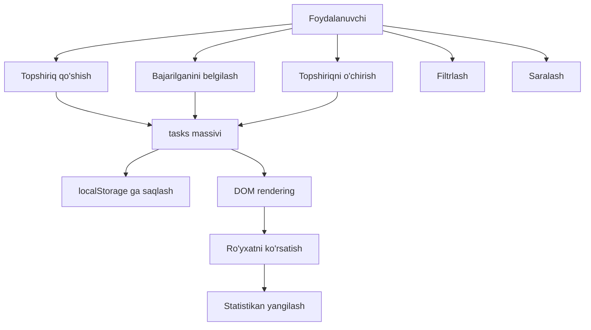
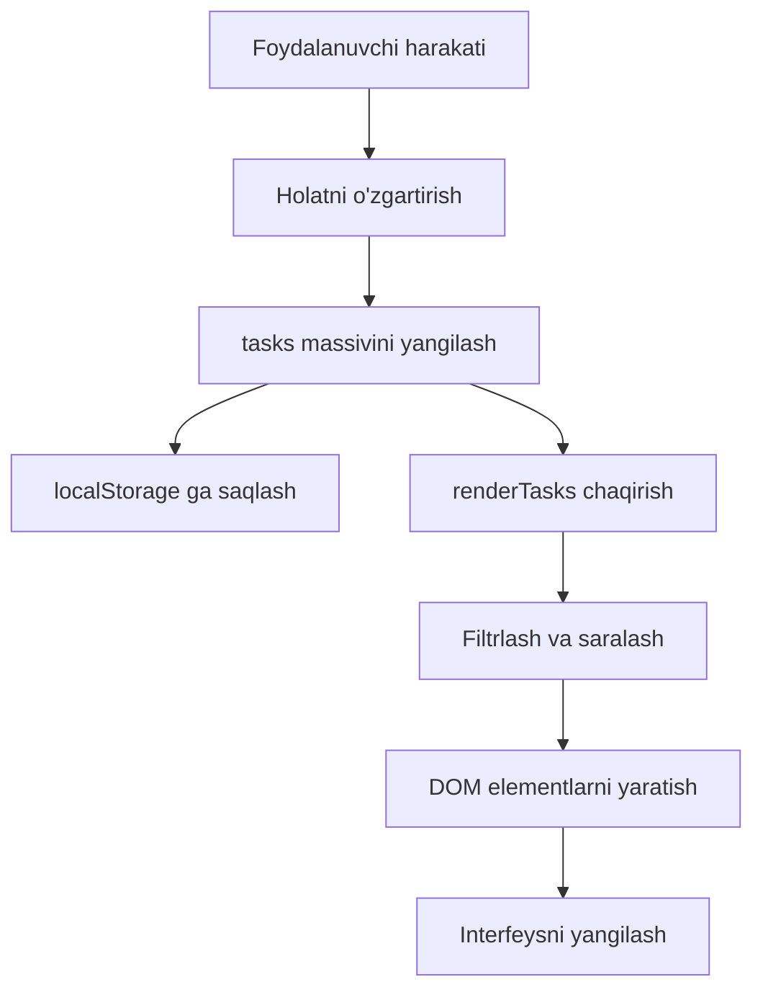

## Yakuniy loyiha — topshiriqlar menejeri

> **Oldingi dars bilan bog'lanish:** o'tgan to'qqiz darsda biz o'zgaruvchilar, massivlar, ob'ektlar, shartlar, tsikllar, funksiyalar, Date ob'ekti, DOM, hodisalar va localStorage ni o'rgandik. Endi barcha ushbu mavzularni birga to'liq ilovaga birlashtirish vaqti keldi.

---

## Loyiha maqsadi

To'liq ishlaydigan **topshiriqlar menejerini (To-Do List)** yaratish — bu JavaScript kursining har bir asosiy mavzusini qamrab oladi: ma'lumotlarni saqlash, CRUD operatsiyalar, filtrlash, saralash, muddatlarni formatlash, matnni tahrirlash va localStorage orqali holatni saqlash.

## Siz nima yasaysiz

- Matn va ixtiyoriy muddat bilan yangi topshiriq qo'shish.
- Topshiriqni bajarilgan deb belgilash (almashtirish).
- Tasdiqlash bilan topshiriqni o'chirish.
- Topshiriq matnini joyida tahrirlash (ikkma marta bosish — tahrirlash, Enter — saqlash, Escape — bekor qilish).
- Holat bo'yicha topshiriqlarni filtrlash: Barchasi / Faol / Bajarilgan.
- Yaratilgan sana bo'yicha topshiriqlarni saralash.
- Barcha ma'lumotlarni localStorage da saqlash — topshiriqlar sahifani yangilashda saqlanib qoladi.
- Real vaqtda statistikani ko'rsatish (jami topshiriqlar, bajarilganlari).
- Muddatlarni tushunarli formatda ko'rsatish (muddati o'tgan, bugun, ertaga, N kundan keyin).

---

## Loyiha jadvali

| Blok | Mazmuni |
| --- | --- |
| 1. Loyiha tavsifi va funksional | Nimani yaratayapmiz va nima uchun |
| 2. Fayl tuzilishi | index.html, css/style.css, js/app.js |
| 3. Ma'lumotlar tuzilishi | Topshiriq ob'ektining shakli |
| 4. HTML tuzilishi | Sahifaning semantik tuzilishi |
| 5. CSS uslublari | Darhol tayyor, moslashuvchan interfeys |
| 6. JavaScript — ilova mantiqiyoti | Holat, DOM kesh, localStorage, CRUD, filtrlash, saralash, rendering, joyida tahrirlash, statistika, ishga tushirish |
| 7. Sinov | Qo'lda tekshirish ro'yxati |
| 8. Qo'shimcha topshiriqlar | ustuvorliklar, ichki topshiriqlar, eksport/import, eslatmalar, kun bo'yicha guruhlash |
| 9. Hammasi qanday bog'lanadi | Kurs mavzulari va loyihadagi ulardan foydalanish |

---

## Blok 1. Loyiha tavsifi

Kurs davomida biz har bir JavaScript tushunchasini alohida holda mashq qildik — bu yerda o'zgaruvchi, u yerda tsikl, boshqa joyda kichik funksiya. Biroq to'liq ilova barcha qismlarning birgalikda ishlashini talab qadi. Topshiriqlar menejeri — bu klassik «bog'lovchi» loyiha: bir o'tirishda yig'ish uchun etarlicha oddiy, lekin kursning har bir mavzusiga tegishli darajada murakkab.

**Nega topshiriqlar ro'yxati?**

- Soha hammaga tushunarli — muhitni o'rganishga hojat yo'q.
- Asosiy operatsiyalar (yaratish, o'qish, yangilash, o'chirish) to'g'ridan-to'g'ri massiv metodlari va DOM bilan ishlashga mos keladi.
- Muddatlar Date ob'ektini amaliy kontekstda kiritadi.
- Filtrlash va saralash shartlar va taqqoslash mantiqini talab qadi.
- localStorage barchasini doimiy saqlash bilan bog'laydi.

**Funksional:**

| Funksiya | Kurs mavzusi |
| --- | --- |
| Topshiriq qo'shish | Funksiyalar, DOM hodisalari |
| Bajarilganini almashtirish | Shartlar, massivda qidirish |
| Topshiriqni o'chirish | Massivni filtrlash |
| Joyida tahrirlash | DOM bilan ishlash, klaviatura hodisalari |
| Holat bo'yicha filtrlash | Massivni filtrlash, data-atributlar |
| Sana bo'yicha saralash | Sanalarni taqqoslash, massivni saralash |
| Ma'lumotlarni saqlash | localStorage, JSON |
| Muddat belgilari | Sana arifmetikasi |
| Statistika | DOM ni yangilash, massivda hisoblash |

---

## Blok 2. Fayl tuzilishi

```
todo-app/
  index.html
  css/
    style.css
  js/
    app.js
```

Uchta fayl, toza ajratish: tuzilma HTML da, ko'rinish CSS da, xulq-atvor JavaScript da.

---

## Blok 3. Ma'lumotlar tuzilishi

Har bir topshiriq oddiy JavaScript ob'ekti:

```javascript
{
    id: 1719000000000,
    text: "Nonushta qilish",
    completed: false,
    createdAt: "2026-06-18T13:45:00.000Z",
    deadline: "2026-06-20"
}
```

| Xususiyat | Tur | Maqsad |
| --- | --- | --- |
| `id` | number | Noyob identifikator (vaqt belgisi + tasodifiy son) |
| `text` | string | Topshiriq tavsifi |
| `completed` | boolean | Bajarilgan yoki yo'q |
| `createdAt` | string (ISO) | Yaratilgan sana |
| `deadline` | string | Ixtiyoriy muddat (YYYY-MM-DD) |

Ilovaning barcha holati bitta ob'ektda saqlanadi:

```javascript
const state = {
    tasks: [],          // topshiriq ob'ektlari massivi
    filter: 'all',      // 'all' | 'active' | 'completed'
    sortByDate: false   // sana bo'yicha saralash almashtirgichi
};
```

---

## Blok 4. HTML tuzilishi

`index.html` faylini yarating:

```html
<!DOCTYPE html>
<html lang="uz">
<head>
    <meta charset="UTF-8">
    <meta name="viewport" content="width=device-width, initial-scale=1.0">
    <title>Topshiriqlar menejeri</title>
    <link rel="stylesheet" href="css/style.css">
</head>
<body>
    <div class="container">
        <header>
            <h1>Mening topshiriqlarim</h1>
            <p class="stats">
                Jami: <span id="totalTasks">0</span> |
                Bajarilgan: <span id="completedTasks">0</span>
            </p>
        </header>

        <section class="add-task">
            <input type="text" id="taskInput" placeholder="Yangi topshiriq kiriting...">
            <input type="date" id="deadlineInput">
            <button id="addBtn">Qo'shish</button>
        </section>

        <section class="filters">
            <button class="filter-btn active" data-filter="all">Barchasi</button>
            <button class="filter-btn" data-filter="active">Faol</button>
            <button class="filter-btn" data-filter="completed">Bajarilgan</button>
            <button class="sort-btn" id="sortBtn">Sana bo'yicha saralash</button>
        </section>

        <section class="task-list">
            <ul id="taskList"></ul>
        </section>

        <section class="empty-state">
            <p>Hali topshiriq yo'q. Birinchisini qo'shing!</p>
        </section>
    </div>

    <script src="js/app.js"></script>
</body>
</html>
```

Asosiy nuqtalar:

- `taskList` id li `<ul>` — JavaScript topshiriq elementlarini qo'shadigan konteyner.
- Filtr tugmalari `data-filter` atributlarini o'z ichiga oladi, shunda JS qo'shimcha o'zgaruvchilarsiz kerakli filtrni o'qiy oladi.
- Bo'sh holat sektsiyasi boshlang'ichda yashirin va faqat topshiriqlar yo'q bo'lganda ko'rsatiladi.

---

## Blok 5. CSS uslublari

`css/style.css` faylini yarating:

```css
/* style.css */
* {
    margin: 0;
    padding: 0;
    box-sizing: border-box;
}

body {
    font-family: 'Segoe UI', Tahoma, Geneva, Verdana, sans-serif;
    background: #f0f2f5;
    color: #333;
    min-height: 100vh;
    display: flex;
    justify-content: center;
    padding: 20px;
}

.container {
    background: #fff;
    border-radius: 12px;
    box-shadow: 0 2px 10px rgba(0, 0, 0, 0.1);
    padding: 30px;
    max-width: 700px;
    width: 100%;
    height: fit-content;
}

header {
    margin-bottom: 25px;
    border-bottom: 2px solid #f0f2f5;
    padding-bottom: 15px;
}

header h1 {
    font-size: 28px;
    color: #1a73e8;
}

.stats {
    margin-top: 8px;
    color: #666;
    font-size: 14px;
}

.stats span {
    font-weight: bold;
    color: #1a73e8;
}

.add-task {
    display: flex;
    gap: 10px;
    margin-bottom: 20px;
    flex-wrap: wrap;
}

.add-task input[type="text"] {
    flex: 1;
    padding: 12px 16px;
    border: 2px solid #e0e0e0;
    border-radius: 8px;
    font-size: 16px;
    min-width: 150px;
    outline: none;
    transition: border-color 0.2s;
}

.add-task input[type="text"]:focus {
    border-color: #1a73e8;
}

.add-task input[type="date"] {
    padding: 12px 16px;
    border: 2px solid #e0e0e0;
    border-radius: 8px;
    font-size: 16px;
    min-width: 150px;
    outline: none;
    transition: border-color 0.2s;
}

.add-task input[type="date"]:focus {
    border-color: #1a73e8;
}

.add-task button {
    padding: 12px 24px;
    background: #1a73e8;
    color: #fff;
    border: none;
    border-radius: 8px;
    font-size: 16px;
    cursor: pointer;
    transition: background 0.2s;
}

.add-task button:hover {
    background: #1557b0;
}

.filters {
    display: flex;
    gap: 10px;
    margin-bottom: 20px;
    flex-wrap: wrap;
}

.filters button {
    padding: 8px 16px;
    border: 2px solid #e0e0e0;
    border-radius: 20px;
    background: transparent;
    cursor: pointer;
    font-size: 14px;
    transition: all 0.2s;
}

.filters button:hover {
    background: #f0f2f5;
}

.filters button.active {
    background: #1a73e8;
    color: #fff;
    border-color: #1a73e8;
}

.task-list {
    margin-bottom: 20px;
}

#taskList {
    list-style: none;
}

.task-item {
    display: flex;
    align-items: center;
    gap: 12px;
    padding: 12px 16px;
    background: #f8f9fa;
    border-radius: 8px;
    margin-bottom: 8px;
    transition: all 0.2s;
    border-left: 4px solid #1a73e8;
}

.task-item:hover {
    background: #f0f2f5;
    transform: translateX(4px);
}

.task-item.completed {
    border-left-color: #34a853;
    opacity: 0.7;
}

.task-item.completed .task-text {
    text-decoration: line-through;
    color: #888;
}

.task-item .task-checkbox {
    width: 20px;
    height: 20px;
    cursor: pointer;
    accent-color: #1a73e8;
}

.task-item .task-text {
    flex: 1;
    font-size: 16px;
    cursor: default;
}

.task-item .task-deadline {
    font-size: 12px;
    color: #666;
    padding: 2px 8px;
    background: #e8eaed;
    border-radius: 12px;
    white-space: nowrap;
}

.task-item .task-actions {
    display: flex;
    gap: 8px;
}

.task-item .task-actions button {
    padding: 4px 8px;
    border: none;
    border-radius: 4px;
    cursor: pointer;
    font-size: 14px;
    background: transparent;
    transition: all 0.2s;
}

.task-item .task-actions .edit-btn {
    color: #1a73e8;
}

.task-item .task-actions .edit-btn:hover {
    background: #e8f0fe;
}

.task-item .task-actions .delete-btn {
    color: #d93025;
}

.task-item .task-actions .delete-btn:hover {
    background: #fce8e6;
}

.empty-state {
    text-align: center;
    padding: 40px 0;
    color: #888;
    display: none;
}

.empty-state.visible {
    display: block;
}

.edit-input {
    width: 70%;
    padding: 4px 8px;
    border: 2px solid #1a73e8;
    border-radius: 4px;
    font-size: 16px;
    outline: none;
}

@media (max-width: 600px) {
    .container {
        padding: 15px;
    }

    .add-task {
        flex-direction: column;
    }

    .add-task input[type="text"],
    .add-task input[type="date"] {
        width: 100%;
    }

    .filters {
        flex-direction: column;
    }

    .filters button {
        width: 100%;
    }

    .task-item {
        flex-wrap: wrap;
    }
}
```

---

## Blok 6. JavaScript — ilova mantiqiyoti

`js/app.js` faylini yarating. Bu loyiha yuragi. Har bir bo'limni ko'rib chiqamiz.

### 6.1. Ilova holati

```javascript
// js/app.js

// ============================================
// 1. ILOVA HOLATI
// ============================================

const state = {
    tasks: [],
    filter: 'all',
    sortByDate: false
};
```

`state` — ilova bilishi kerak bo'lgan harsa-narsani saqlovchi yagona ob'ekt. Haqiqatning yagona manbai istalgan paytda nima bo'layotganini tushunishni osonlashtiradi.

### 6.2. DOM elementlar keshi

```javascript
// ============================================
// 2. DOM ELEMLARI
// ============================================

const DOM = {
    taskInput: document.getElementById('taskInput'),
    deadlineInput: document.getElementById('deadlineInput'),
    addBtn: document.getElementById('addBtn'),
    taskList: document.getElementById('taskList'),
    totalTasks: document.getElementById('totalTasks'),
    completedTasks: document.getElementById('completedTasks'),
    emptyState: document.querySelector('.empty-state'),
    filterBtns: document.querySelectorAll('.filter-btn'),
    sortBtn: document.getElementById('sortBtn')
};
```

Biz har bir elementni bir marta topamiz va referenslarni saqlaymiz. Tsikllar ichida takroriy `getElementIData` chaqiruvlari sarflanib ketardi; bu yondashuv tezroq va tushunarliroq.

### 6.3. localStorage operatsiyalari

```javascript
// ============================================
// 3. SAQLASH (localStorage)
// ============================================

function saveToStorage() {
    try {
        localStorage.setItem('tasks', JSON.stringify(state.tasks));
    } catch (error) {
        console.error('Saqlash xatosi:', error);
    }
}

function loadFromStorage() {
    try {
        const data = localStorage.getItem('tasks');
        if (data) {
            state.tasks = JSON.parse(data);
        }
    } catch (error) {
        console.error('Yuklash xatosi:', error);
        state.tasks = [];
    }
}
```

localStorage faqat satrlarni saqlaydi. Massivni serializatsiya qilish uchun `JSON.stringify`, qayta tiklash uchun `JSON.parse` ishlatamiz. `try/catch` bloklari buzilgan ma'lumotlar yoki saqlash kvotasi xatolaridan himoya qiladi.

### 6.4. ID generatsiyasi

```javascript
// ============================================
// 5. ID GENERATSIYASI
// ============================================

function generateId() {
    return Date.now() + Math.floor(Math.random() * 1000);
}
```

`Date.now()` millisekundlarda vaqt belgisini beradi. Tasodifiy komponentni qo'shish ikki topshiriq bir millisekundda yaratilsa, to'qnashuv ehtimolini kamaytiradi.

### 6.5. Topshiriq yaratish

```javascript
// ============================================
// 5. TOPSHIRIQ YARATISH
// ============================================

function createTask(text, deadline) {
    return {
        id: generateId(),
        text: text.trim(),
        completed: false,
        createdAt: new Date().toISOString(),
        deadline: deadline || ''
    };
}
```

Bu toza funksiya tashqi ta'sirlarsiz yangi topshiriq ob'ektini qaytaradi. U `addTask` tomonidan chaqiriladi — bu funksiya holatni o'zgartiradi.

### 6.6. CRUD operatsiyalari

```javascript
// ============================================
// 6. CRUD OPERATSIYALARI
// ============================================

function addTask(text, deadline) {
    if (!text || !text.trim()) {
        alert('Topshiriq matnini kiriting.');
        return false;
    }

    const task = createTask(text, deadline);
    state.tasks.unshift(task);
    saveToStorage();
    renderTasks();
    updateStats();
    return true;
}

function deleteTask(id) {
    if (!confirm('Bu topshiriqni o\'chirishni xohlaysizmi?')) return;

    state.tasks = state.tasks.filter(task => task.id !== id);
    saveToStorage();
    renderTasks();
    updateStats();
}

function toggleTask(id) {
    const task = state.tasks.find(t => t.id === id);
    if (task) {
        task.completed = !task.completed;
        saveToStorage();
        renderTasks();
        updateStats();
    }
}

function editTask(id, newText) {
    const task = state.tasks.find(t => t.id === id);
    if (task) {
        task.text = newText.trim();
        saveToStorage();
        renderTasks();
    }
}
```

Har bir funksiya bir xil shablonga amal qiladi: `state.tasks` ni o'zgartiradi, saqlaydi, qayta chizadi, statistikani yangilaydi. Bu ketma-ketlik ma'lumotlar oqimini bashorat qilinadigan qiladi.

### 6.7. Filtrlash va saralash

```javascript
// ============================================
// 7. FILTRLASH VA SARALASH
// ============================================

function getFilteredTasks() {
    let filtered = state.tasks;

    if (state.filter === 'active') {
        filtered = filtered.filter(task => !task.completed);
    } else if (state.filter === 'completed') {
        filtered = filtered.filter(task => task.completed);
    }

    if (state.sortByDate) {
        filtered = [...filtered].sort((a, b) => {
            return new Date(b.createdAt) - new Date(a.createdAt);
        });
    }

    return filtered;
}

function setFilter(filter) {
    state.filter = filter;

    DOM.filterBtns.forEach(btn => {
        btn.classList.toggle('active', btn.dataset.filter === filter);
    });

    renderTasks();
}

function toggleSort() {
    state.sortByDate = !state.sortByDate;
    DOM.sortBtn.textContent = state.sortByDate
        ? 'Sana bo\'yicha saralash \u25B2'
        : 'Sana bo\'yicha saralash';
    renderTasks();
}
```

`getFilteredTasks` toza funksiya: berilgan holatda `state.tasks` ni o'zgartirmasdan yangi massiv qaytaradi. `.sort()` dan oldin `[...filtered]` spread operatori asl massiv o'zgarishini kafolatlaydi.

### 6.8. Rendering konveyeri

```javascript
// ============================================
// 8. TOPSHIRIQLARNI KO'RSATISH (RENDERING)
// ============================================

function renderTasks() {
    const filtered = getFilteredTasks();
    const list = DOM.taskList;

    list.innerHTML = '';

    if (filtered.length === 0) {
        DOM.emptyState.classList.add('visible');
        return;
    }

    DOM.emptyState.classList.remove('visible');

    filtered.forEach(task => {
        const li = createTaskElement(task);
        list.appendChild(li);
    });
}

function createTaskElement(task) {
    const li = document.createElement('li');
    li.className = 'task-item' + (task.completed ? ' completed' : '');
    li.dataset.id = task.id;

    // Checkbox
    const checkbox = document.createElement('input');
    checkbox.type = 'checkbox';
    checkbox.className = 'task-checkbox';
    checkbox.checked = task.completed;
    checkbox.addEventListener('change', () => toggleTask(task.id));

    // Topshiriq matni
    const textSpan = document.createElement('span');
    textSpan.className = 'task-text';
    textSpan.textContent = task.text;
    textSpan.addEventListener('dblclick', () => startEditing(task.id, textSpan));

    // Muddat belgisi
    const deadlineSpan = document.createElement('span');
    deadlineSpan.className = 'task-deadline';
    deadlineSpan.textContent = formatDeadline(task.deadline);

    // Amallar konteyneri
    const actions = document.createElement('div');
    actions.className = 'task-actions';

    // O'chirish tugmasi
    const deleteBtn = document.createElement('button');
    deleteBtn.className = 'delete-btn';
    deleteBtn.textContent = '\u2715';
    deleteBtn.title = 'Topshiriqni o\'chirish';
    deleteBtn.addEventListener('click', () => deleteTask(task.id));

    actions.appendChild(deleteBtn);

    // Yig'ish
    li.appendChild(checkbox);
    li.appendChild(textSpan);
    li.appendChild(deadlineSpan);
    li.appendChild(actions);

    return li;
}
```

Rendering konveyeri: `renderTasks` `getFilteredTasks` ni chaqiradi, ro'yxatni tozalaydi, keyin har bir topshiriq uchun siklda `createTaskElement` ni chaqiradi. Ikki funksiyaga bo'lish siklni toza qiladi va `createTaskElement` ni mustaqil sinovga yaroqli qiladi.

### 6.9. Muddatlarni formatlash

```javascript
// ============================================
// 9. MUDDATLARNI FORMATLASH
// ============================================

function formatDeadline(dateStr) {
    if (!dateStr) return 'Muddat yo\'q';

    const deadline = new Date(dateStr);
    const today = new Date();
    today.setHours(0, 0, 0, 0);

    const diffDays = Math.ceil((deadline - today) / (1000 * 60 * 60 * 24));

    if (diffDays < 0) {
        return Math.abs(diffDays) + ' kun muddati o\'tgan';
    } else if (diffDays === 0) {
        return 'Bugun';
    } else if (diffDays === 1) {
        return 'Ertaga';
    } else {
        return diffDays + ' kundan keyin';
    }
}
```

Bu funksiya amaliy sana arifmetikasini namoyish etadi. Ikki Date ob'ektini ayirish millisekundlarni beradi; bir kundagi millisekundlar soniga bo'lish natijani kunlarga o'tkazadi.

### 6.10. Joyida tahrirlash

```javascript
// ============================================
// 10. TOPSHIRIQNI TAHRIRLASH
// ============================================

function startEditing(id, textSpan) {
    const currentText = textSpan.textContent;

    const input = document.createElement('input');
    input.type = 'text';
    input.className = 'edit-input';
    input.value = currentText;

    textSpan.textContent = '';
    textSpan.appendChild(input);
    input.focus();
    input.select();

    const finishEditing = () => {
        const newText = input.value.trim();
        if (newText && newText !== currentText) {
            editTask(id, newText);
        } else {
            textSpan.textContent = currentText;
        }
    };

    input.addEventListener('blur', finishEditing);
    input.addEventListener('keydown', (e) => {
        if (e.key === 'Enter') {
            input.blur();
        } else if (e.key === 'Escape') {
            textSpan.textContent = currentText;
        }
    });
}
```

Tahrirlash jarayoni: ikki marta bosish `startEditing` ni chaqiradi, bu matnni kiritish maydoniga almashtiradi. Enter tugmasi bosilganda blur bo'ladi va `finishEditing` chaqiriladi. Escape tugmasi matnni saqlamasdan tiklaydi.

### 6.11. Statistika

```javascript
// ============================================
// 11. STATISTIKANI YANGILASH
// ============================================

function updateStats() {
    const total = state.tasks.length;
    const completed = state.tasks.filter(t => t.completed).length;

    DOM.totalTasks.textContent = total;
    DOM.completedTasks.textContent = completed;
}
```

### 6.12. Ilovani ishga tushirish

```javascript
// ============================================
// 12. ISHGA TUSHIRISH
// ============================================

function init() {
    loadFromStorage();
    renderTasks();
    updateStats();

    // Bosish orqali topshiriq qo'shish
    DOM.addBtn.addEventListener('click', () => {
        const text = DOM.taskInput.value;
        const deadline = DOM.deadlineInput.value;
        const success = addTask(text, deadline);
        if (success) {
            DOM.taskInput.value = '';
            DOM.deadlineInput.value = '';
            DOM.taskInput.focus();
        }
    });

    // Enter orqali qo'shish
    DOM.taskInput.addEventListener('keydown', (e) => {
        if (e.key === 'Enter') {
            DOM.addBtn.click();
        }
    });

    // Filtr tugmalari
    DOM.filterBtns.forEach(btn => {
        btn.addEventListener('click', () => {
            setFilter(btn.dataset.filter);
        });
    });

    // Saralashni almashtirish
    DOM.sortBtn.addEventListener('click', toggleSort);

    // Yopishdan oldin saqlash
    window.addEventListener('beforeunload', saveToStorage);
}

document.addEventListener('DOMContentLoaded', init);
```

`DOMContentLoaded` skriptni faqat HTML to'liq yuklangandan keyin ishga tushirishini ta'minlaydi. `init` ichida saqlangan topshiriqlarni yuklaymiz, ularni chizamiz va barcha hodisa tinglovchilarini bog'laymiz.

### 6.13. Qo'shimcha foydali funksiyalar

```javascript
// ============================================
// 13. QO'SHIMCHA FUNKSIYALAR
// ============================================

function clearAllTasks() {
    if (!confirm('Barcha topshiriqlarni o\'chirishni xohlaysizmi?')) return;
    state.tasks = [];
    saveToStorage();
    renderTasks();
    updateStats();
}

function searchTasks(query) {
    if (!query) return getFilteredTasks();

    const searchQuery = query.toLowerCase().trim();
    const filtered = getFilteredTasks();

    return filtered.filter(task =>
        task.text.toLowerCase().includes(searchQuery)
    );
}
```

Bu yordamchi funksiyalar standart holda interfeysga bog'lanmagan, lekin kelajakda kengaytirish yoki qo'shimcha topshiriqlarda ishlatish uchun mavjud.

---

## Blok 7. Ilova ma'lumotlar oqimi





---

## Blok 8. Sinov

Ilovani brauzerda oching (Live Server yoki `index.html` ni to'g'ridan-to'g'ri oching) va tekshiring:

| Qadam | Harakat | Kutilgan natija |
| --- | --- | --- |
| 1 | "Nonushta qilish" kiriting va Qo'shish ni bosing | Topshiriq ro'yxatda paydo bo'ladi; maydon tozalanadi |
| 2 | Checkbox ni bosing | Topshiriq chiziladi va yashilga o'zgaradi |
| 3 | Sahifani yangilang | Belgilangan topshiriq bajarilgan holda qoladi |
| 4 | "Faol" filtrini bosing | Faqat bajarilmagan topshiriqlar ko'rsatiladi |
| 5 | "Bajarilgan" filtrini bosing | Faqat bajarilgan topshiriqlar ko'rsatiladi |
| 6 | "Barchasi" filtrini bosing | Barcha topshiriqlar ko'rsatiladi |
| 7 | "Sana bo'yicha saralash" ni bosing | Topshiriqlar yaratilgan sana bo'yicha qayta tartiblanadi (eng yangisi birinchi) |
| 8 | Topshiriq matnini ikki marta bosing | Joriy matn bilan kiritish maydoni paydo bo'ladi |
| 9 | Yangi matn kiriting va Enter ni bosing | Topshiriq matni yangilanadi |
| 10 | Ikki marta bosing, keyin Escape ni bosing | Tahrirlash bekor qilinadi, matn o'zgarishsiz qoladi |
| 11 | Ertaga muddat bilan topshiriq qo'shing | Muddat belgisi: "Ertaga" |
| 12 | O'tgan muddat bilan topshiriq qo'shing | Muddat belgisi: "N kun muddati o'tgan" |
| 13 | O'chirish tugmasini bosing | Tasdiqlash dialogi paydo bo'ladi; tasdiqlansa, topshiriq o'chiriladi |
| 14 | Statistika satrini tekshiring | "Jami" va "Bajarilgan" qiymatlari mos keladi |

---

## Blok 9. Qo'shimcha topshiriqlar

### Topshiriq 1. Topshiriqlar ustuvorligi

Topshiriq qo'shish sektsiyasiga ustuvorlik tanlash elementini qo'shing va turli ustuvorlikdagi topshiriqlarni vizual ajrating:

```javascript
function createTask(text, deadline, priority) {
    return {
        id: generateId(),
        text: text.trim(),
        completed: false,
        createdAt: new Date().toISOString(),
        deadline: deadline || '',
        priority: priority || 'medium'
    };
}
```

```css
.task-item.priority-high { border-left-color: #d93025; }
.task-item.priority-medium { border-left-color: #fbbc04; }
.task-item.priority-low { border-left-color: #34a853; }
```

### Topshiriq 2. Ichki topshiriqlar

Har bir topshiriq uchun ichki topshiriqlar yaratish imkoniyatini amalga oshiring:

```javascript
{
    id: 123,
    text: "Nonushta qilish",
    subtasks: [
        { id: 1, text: "Non", completed: false },
        { id: 2, text: "Sut", completed: true }
    ]
}
```

### Topshiriq 3. Eksport / Import

Topshiriqlarni JSON faylga eksport qilish va fayldan import qilish tugmalarini qo'shing:

```javascript
function exportTasks() {
    const data = JSON.stringify(state.tasks, null, 2);
    const blob = new Blob([data], { type: 'application/json' });
    const url = URL.createObjectURL(blob);
    const a = document.createElement('a');
    a.href = url;
    a.download = 'tasks_' + new Date().toISOString().slice(0, 10) + '.json';
    a.click();
    URL.revokeObjectURL(url);
}

function importTasks(file) {
    const reader = new FileReader();
    reader.onload = (e) => {
        try {
            const tasks = JSON.parse(e.target.result);
            if (Array.isArray(tasks)) {
                state.tasks = tasks;
                saveToStorage();
                renderTasks();
                updateStats();
                alert('Topshiriqlar import qilindi!');
            }
        } catch (error) {
            alert('Fayl importi xatosi.');
        }
    };
    reader.readAsText(file);
}
```

### Topshiriq 4. Eslatmalar

Topshiriq uchun eslatma vaqti o'rnatish imkoniyatini qo'shing. Eslatma vaqti kelganda xabarni ko'rsating:

```javascript
function setReminder(taskId, reminderDate) {
    const task = state.tasks.find(t => t.id === taskId);
    if (task) {
        task.reminder = reminderDate;
        saveToStorage();
        checkReminders();
    }
}

function checkReminders() {
    const now = new Date().getTime();
    state.tasks.forEach(task => {
        if (task.reminder && new Date(task.reminder).getTime() <= now) {
            if (!task.reminderShown) {
                showNotification('Eslatma: ' + task.text);
                task.reminderShown = true;
                saveToStorage();
            }
        }
    });
}

setInterval(checkReminders, 30000);
```

### Topshiriq 5. Kun bo'yicha guruhlash

Topshiriqlarni yaratilgan sana yoki muddat bo'yicha guruhlang:

```javascript
function groupTasksByDate(tasks) {
    const groups = {};

    tasks.forEach(task => {
        const date = task.deadline || task.createdAt.slice(0, 10);
        if (!groups[date]) {
            groups[date] = [];
        }
        groups[date].push(task);
    });

    return groups;
}
```

---

## Blok 10. Hammasi qanday bog'lanadi

| Kurs mavzusi | Loyihadagi qo'llanilishi |
| --- | --- |
| **O'zgaruvchilar va turlar** | `state`, `DOM`, har bir funksiyadagi mahalliy o'zgaruvchilar |
| **Massivlar** | `state.tasks`, `filter`, `forEach`, `unshift metodlari** |
| **Ob'ektlar** | Har bir topshiriq ob'ekti; `state` ob'ekt sifatida |
| **Shartlar** | Filtr mantiqiyoti, sanalarni taqqoslash, kiritishni tekshirish |
| **Tsikllar** | `renderTasks`, `getFilteredTasks`, `updateStats` da `forEach` |
| **Funksiyalar** | Har bir operatsiya alohida funksiya: `addTask`, `deleteTask`, `toggleTask`, `editTask`, `renderTasks`, `createTaskElement`, `formatDeadline`, `init` |
| **Sana va vaqt** | `Date.now()`, `new Date().toISOString()`, `formatDeadline` da muddat arifmetikasi |
| **DOM** | `createElement`, `appendChild`, `classList`, `textContent`, `innerHTML`, `dataset` |
| **Hodisalar** | `click`, `change`, `dblclick`, `keydown`, `blur`, `beforeunload`, `DOMContentLoaded` |
| **Saqlash** | `saveToStorage` va `loadFromStorage` — `JSON.stringify` / `JSON.parse` bilan |

---

## Amaliyot / Yakuniy topshiriq

Loyihani noldan yig'ish uchun quyidagi qadam-baqadam ko'rsatmalarga amal qiling:

1. `todo-app` papkasini `css/` va `js/` ichki papkalar bilan yarating.
2. Blok 4 dagi to'liq tuzilma bilan `index.html` yarating.
3. Blok 5 dagi to'liq uslublar bilan `css/style.css` yarating.
4. `js/app.js` yarating va kodni bo'limlari bo'yicha qo'shing:
   - Holat ob'ekti.
   - DOM elementlar keshi.
   - localStorage funksiyalari.
   - ID generatsiyasi.
   - `createTask`.
   - CRUD funksiyalari: `addTask`, `deleteTask`, `toggleTask`, `editTask`.
   - Filtrlash va saralash: `getFilteredTasks`, `setFilter`, `toggleSort`.
   - Rendering: `renderTasks`, `createTaskElement`.
   - `formatDeadline`.
   - `startEditing`.
   - `updateStats`.
   - `init` va `DOMContentLoaded` tinglovchisi.
5. Sahifani brauzerda oching va Blok 8 dagi ro'yxat bo'yicha har bir funksiyani sinab ko'ring.
6. Loyihani omboringizga tushiring.
7. Kamida ikkita qo'shimcha topshiriqni tanlang va amalga oshiring.

---

## Dars xulosasi

Ushbu yakuniy loyihada siz:

- Toza ajratish bilan ko'p faylli ilovani tashkil etdingiz.
- Yagona `state` ob'ekti orqali ilova holatini boshqardingiz.
- Ob'ektlar massivi ustida to'liq CRUD operatsiyalarni bajardingiz.
- Massiv metodlari orqali ma'lumotlarni filtrladingiz va saraladingiz.
- Date arifmetikasi orqali sanalarni formatladingiz.
- Klaviatura hodisalari bilan ishlaydigan joyida tahrirlash yasadingiz.
- localStorage orqali sahifalar orasida ma'lumotlarni saqladingiz.
- Ma'lumotlardan, qattiq yozilgan HTML emas, dinamik DOM ro'yxatini chizdingiz.

JavaScript kursining har bir asosiy mavzusi bitta, yaxlit loyihada qo'llanildi.

---

[Kurs boshiga qaytish](../README.md)

JavaScript kursini muvaffaqiyatli yakunladingiz. Endi sizda interaktiv veb-ilovalarni noldan yaratish asosi bor.