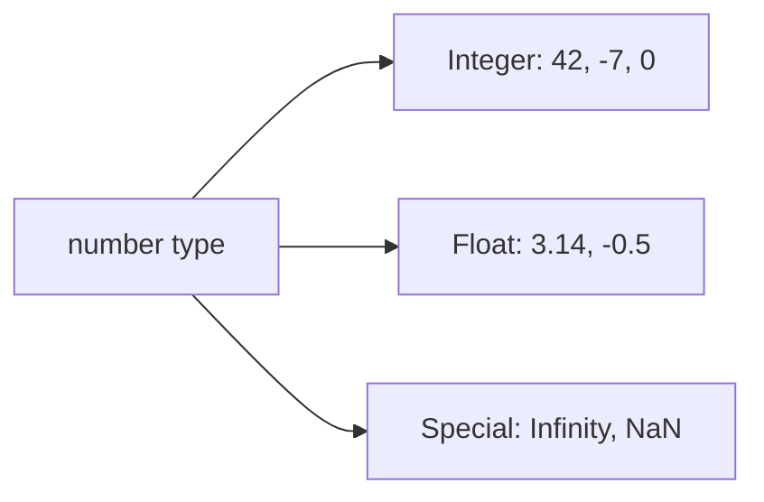
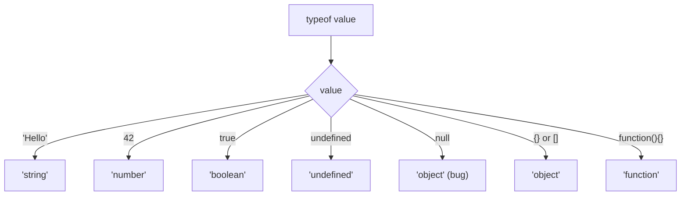

## Variables and Data Types

> **Connection with the previous lesson:** in Lesson 1 we wrote our first JavaScript program and learned how scripts are connected to HTML. Today we move on to what any program stores and operates on — data. Before we can make programs do useful things, we need a way to store and work with information.

---

## Lesson Goal

Understand what variables are, how to declare them using `let`, `const`, and `var`, learn all primitive data types in JavaScript, and master type conversion — so that by the end of the lesson you can confidently store, retrieve, and manipulate data in your programs.

## What You Will Learn by the End of the Lesson

- Explain what a variable is and why programs need them.
- Declare variables using `let`, `const`, and `var` — and know when to use each.
- Identify and work with all seven primitive data types: `string`, `number`, `boolean`, `null`, `undefined`, `symbol`, `bigint`.
- Use template literals (backtick strings) to build dynamic text.
- Apply the `typeof` operator to check a value's type.
- Distinguish between implicit and explicit type conversion.

---

## Lesson Timeline

| Block | Content |
| --- | --- |
| 1. What is a variable | Box analogy, declaration syntax, `=` operator |
| 2. `let`, `const`, `var` | Three keywords compared, when to use each |
| 3. Primitive data types | string, number, boolean, null, undefined, symbol, bigint |
| 4. Template literals | Backticks, `${}` expressions, multiline strings |
| 5. Special number values and `typeof` | Infinity, NaN, the `typeof` operator |
| 6. Dynamic typing and type conversion | Implicit vs explicit conversion, summary table |
| 7. Practice and summary | Exercises and key takeaways |

---

## Block 1. What Is a Variable?

**In simple terms:** a variable is like a **labeled box**. You write a name on the box, put something inside it, and later you can open it to see what's there or replace its contents.

In programming, a **variable** is a named container that stores a value. You create it, put data in, and use that data whenever you need it.

```javascript
let name = 'Anna';
let age = 25;
let isLoggedIn = true;
```

The syntax has three parts:

1. A **keyword** (`let`, `const`, or `var`) — tells JavaScript you are creating a variable.
2. A **name** (`name`, `age`, `isLoggedIn`) — the label on the box.
3. An **assignment operator** `=` followed by a **value** — what goes inside the box.

### Naming Rules

Variable names must follow these rules:

- Only letters, digits, `_`, and `$` are allowed.
- A name cannot start with a digit.
- Names are case-sensitive (`age` and `Age` are different variables).
- You cannot use reserved words (`let`, `class`, `return`, etc.) as names.

```javascript
let userName = 'John';     // valid
let 2ndPlace = 'runner';   // error: starts with a digit
let my-var = 'hello';      // error: contains a hyphen
```

**Convention (not a rule):** use `camelCase` for multi-word names — start lowercase, capitalize each new word (`firstName`, `maxRetries`, `isGameOver`).

---

## Block 2. Declaring Variables: `let`, `const`, and `var`

JavaScript provides three keywords for creating variables. In modern code you should use **`let`** and **`const`**. The keyword **`var`** is considered outdated.

### `let` — Mutable Variable

A variable declared with `let` can change its value at any time.

```javascript
let score = 0;
console.log(score); // 0

score = 10;
console.log(score); // 10

score = score + 5;
console.log(score); // 15
```

**Characteristics:**

- Value can be reassigned.
- **Block-scoped**: visible only inside the nearest `{ }`.
- Recommended default choice for variables that change.

### `const` — Constant (Cannot Reassign)

A variable declared with `const` must be assigned a value immediately and **cannot be reassigned** after that.

```javascript
const PI = 3.14159;
console.log(PI); // 3.14159

PI = 3.14; // TypeError: Assignment to constant variable
```

**Characteristics:**

- Value cannot be reassigned.
- Must be initialized at declaration.
- **Block-scoped**, like `let`.
- Recommended for values that should never change.

### `const` with Objects and Arrays

For objects and arrays declared with `const`, you **cannot reassign the variable**, but you **can change its contents**.

```javascript
const user = { name: 'John' };
user.name = 'Jane';     // allowed — changing a property
console.log(user.name); // 'Jane'

user = { name: 'Bob' }; // TypeError — reassignment is forbidden
```

```javascript
const colors = ['red', 'green'];
colors.push('blue');    // allowed — modifying the array
console.log(colors);    // ['red', 'green', 'blue']

colors = ['yellow'];    // TypeError — reassignment is forbidden
```

### `var` — Legacy (Do Not Use)

`var` is the original way to declare variables in JavaScript. It works differently from `let` and `const` in important ways that often cause bugs.

```javascript
var oldVariable = 'old style';
```

**Why not use `var`:**

- **Function-scoped** instead of block-scoped — it "leaks" out of `{ }` blocks.
- **Hoisted** to the top of its scope in a confusing way.
- Can be accidentally redeclared.

```javascript
if (true) {
    var leaked = 'I am visible outside';
}
console.log(leaked); // 'I am visible outside' — unexpected!
```

With `let`, this does not happen:

```javascript
if (true) {
    let scoped = 'I stay inside';
}
console.log(scoped); // ReferenceError: scoped is not defined
```

### Comparison Table

| Feature | `let` | `const` | `var` |
| --- | --- | --- | --- |
| Reassignment | Yes | No | Yes |
| Block-scoped | Yes | Yes | No (function-scoped) |
| Hoisting | Yes (temporal dead zone) | Yes (temporal dead zone) | Yes (initialized as `undefined`) |
| Redeclaration | No | No | Yes |
| Recommended | Yes | Yes | No |

### Common Beginner Mistakes

| Error | How to Fix |
| --- | --- |
| Forgetting to declare a variable (creates a global) | Always use `let` or `const` before the variable name |
| Reassigning a `const` | Use `let` if the value needs to change |
| Using `var` out of habit | Switch to `let` or `const` — `var` is outdated |
| Declaring `const` without initialization | `const x;` is a syntax error — provide a value right away |

---

## Block 3. Primitive Data Types

JavaScript has **seven primitive types**. Primitives are the simplest, most basic values the language offers — they are immutable (cannot be changed) and compared by value.

### 3.1. String (`string`)

A **string** is a sequence of characters enclosed in quotes. Strings represent text.

```javascript
let greeting = 'Hello';
let city = "Tashkent";
let empty = '';
```

You can use single quotes `' '` or double quotes `" "` — they behave identically. Choose one style and stay consistent.

### 3.2. Number (`number`)

The **number** type covers all numeric values — integers and decimals (floating-point). JavaScript does not distinguish between `int` and `float` like some other languages.

```javascript
let count = 42;
let price = 9.99;
let negative = -100;
```



### 3.3. Boolean (`boolean`)

A **boolean** has exactly two values: `true` and `false`. Used for logical decisions and conditions.

```javascript
let isAdult = true;
let hasLicense = false;
```

### 3.4. `null` — Intentional Absence of Value

`null` means "nothing" or "empty" — you assign it deliberately when a variable should have no value.

```javascript
let user = null;
let result = null;
```

### 3.5. `undefined` — No Value Assigned

`undefined` means a variable has been declared but **no value has been given** to it yet. JavaScript assigns this automatically.

```javascript
let city;
console.log(city); // undefined
```

The difference between `null` and `undefined`:

- **`null`** is intentional — you set it yourself to indicate "no value."
- **`undefined`** is automatic — JavaScript gives it when nothing is assigned.

### 3.6. `symbol` — Unique Identifier

`Symbol` creates a guaranteed unique value. Two symbols with the same description are still different.

```javascript
let id1 = Symbol('id');
let id2 = Symbol('id');
console.log(id1 === id2); // false
```

### 3.7. `bigint` — Large Integers

`BigInt` handles whole numbers larger than `Number.MAX_SAFE_INTEGER` (which is 2^53 - 1). Append `n` to the number.

```javascript
let large = 9007199254740991n;
let huge = BigInt('9007199254740991');
```

---

## Block 4. Template Literals

Template literals are strings written with **backticks** (`` ` ``) instead of single or double quotes. They have two powerful features.

### String Interpolation with `${}`

Inside backticks, `${expression}` inserts the value of any expression directly into the string.

```javascript
let name = 'Anna';
let age = 25;

let message = `My name is ${name} and I am ${age} years old.`;
console.log(message); // My name is Anna and I am 25 years old.
```

You can put any valid expression inside `${ }`:

```javascript
let a = 10;
let b = 20;
console.log(`The sum is ${a + b}`);      // The sum is 30
console.log(`In 5 years: ${a + 5}`);    // In 5 years: 15
```

### Multiline Strings

Backtick strings can span multiple lines without any special syntax.

```javascript
let poem = `Roses are red,
Violets are blue,
JavaScript is fun,
And so are you.`;
console.log(poem);
```

With regular quotes, this would require `\n`:

```javascript
let poem = "Roses are red,\nViolets are blue";
```

Template literals are the modern, preferred way to build strings with dynamic values.

---

## Block 5. Special Number Values and `typeof`

### Special Number Values

Not every number in JavaScript is a regular finite value.

**`Infinity`** — the result of dividing a positive number by zero:

```javascript
console.log(10 / 0);   // Infinity
console.log(-10 / 0);  // -Infinity
```

**`NaN`** (Not a Number) — the result of a math operation that doesn't make sense:

```javascript
console.log('abc' / 2);   // NaN
console.log('hello' * 3); // NaN
console.log(undefined + 1); // NaN
```

Important: `NaN` is a number type, despite its name:

```javascript
console.log(typeof NaN); // 'number'
```

### The `typeof` Operator

`typeof` tells you the type of a value. It returns a string.

```javascript
console.log(typeof 'Hello');     // 'string'
console.log(typeof 42);          // 'number'
console.log(typeof true);        // 'boolean'
console.log(typeof undefined);   // 'undefined'
console.log(typeof null);        // 'object'  <-- historical bug
console.log(typeof {});          // 'object'
console.log(typeof []);          // 'object'
console.log(typeof function(){}); // 'function'
```

**The `typeof null` trap:** `typeof null` returns `'object'` — this is a well-known bug in JavaScript that has existed since the language's first implementation. It was never fixed for backward compatibility reasons. Remember this quirk: `null` is **not** an object, despite what `typeof` says.



---

## Block 6. Dynamic Typing and Type Conversion

### Dynamic Typing

JavaScript is **dynamically typed**: the type of a variable is determined by its value, not by a declaration. A variable can hold a string, then a number, then a boolean — all with `let`.

```javascript
let value = 'Hello';   // string
value = 42;            // number
value = true;          // boolean
value = null;          // object (null)
```

This flexibility is convenient but requires care — you must keep track of what type a variable currently holds.

### Implicit Type Conversion (Type Coercion)

JavaScript automatically converts types in some situations, which can produce surprising results.

```javascript
console.log('5' + 3);    // '53'  — number 3 becomes string '3', then concatenated
console.log('5' - 3);    // 2     — string '5' becomes number 5, then subtracted
console.log(true + 1);   // 2     — true becomes 1
console.log(false + 1);  // 1     — false becomes 0
console.log('' == false); // true
```

The key rule: the `+` operator with a string always **concatenates**; other operators (`-`, `*`, `/`) try to convert strings to numbers.

### Explicit Type Conversion

You can (and should) convert types intentionally when you need to.

```javascript
String(42);         // '42'
String(true);       // 'true'
String(null);       // 'null'

Number('42');       // 42
Number('hello');    // NaN
Number('');         // 0
Number(true);       // 1
Number(null);       // 0

parseInt('42px');   // 42 — parses until it hits a non-digit
parseFloat('3.14em'); // 3.14

Boolean(0);         // false
Boolean('');        // false
Boolean(null);      // false
Boolean(undefined); // false
Boolean('hello');   // true
Boolean(42);        // true
```

### Falsy and Truthy Values

In JavaScript, every value is either **truthy** or **falsy** when used in a boolean context (like `if`).

**Falsy values** (the only ones):

- `false`
- `0` and `-0`
- `''` (empty string)
- `null`
- `undefined`
- `NaN`

Everything else is **truthy**, including:

- `'0'` (string with a zero)
- `[]` (empty array)
- `{}` (empty object)

```javascript
if ('0') {
    console.log('This runs!'); // '0' is truthy
}
```

### Summary Table

| Concept | Description |
| --- | --- |
| Variable | A named container for storing data |
| `let` | Mutable, block-scoped — default choice |
| `const` | Immutable reference, block-scoped — use when value should not change |
| `var` | Legacy, function-scoped — avoid in new code |
| string | Text in quotes: `'hello'`, `"hello"`, `` `hello` `` |
| number | Integers and decimals, plus `Infinity` and `NaN` |
| boolean | `true` or `false` |
| null | Intentional absence of value |
| undefined | No value assigned yet |
| symbol | Unique identifier |
| bigint | Arbitrary-precision integer (append `n`) |
| template literal | Backtick string with `${expression}` interpolation |
| typeof | Operator returning the type of a value as a string |
| implicit conversion | Automatic type coercion by JS engine |
| explicit conversion | Manual conversion via `String()`, `Number()`, `Boolean()`, etc. |

---

## Practice

1. Declare variables using `let` and `const` for your name, age, and whether you are a student. Print each with `console.log`.
2. Create a `const` object representing a book (title, author, pages). Change the title property. Then try reassigning the variable — observe the error.
3. Use `typeof` to check the type of `null`, `'42'`, `42`, `true`, and `undefined`. Note which result is surprising.
4. Write a template literal that says `"Hello, my name is {name} and I will be {age + 1} years old next year."` with your actual data.
5. Predict the output of each expression before running it: `'10' - 5`, `'10' + 5`, `true + false`, `'' + 0`.
6. Convert the string `'3.14159'` to a number using `Number()`, and to a float using `parseFloat()`. Compare the results.

---

## Lesson Summary

- A **variable** is a named container for storing data — think of it as a labeled box.
- **`let`** declares a mutable, block-scoped variable — your default choice.
- **`const`** declares a constant that cannot be reassigned — use it for values that should not change. For objects and arrays, you can still modify contents.
- **`var`** is the legacy keyword with function scope — avoid it in new code.
- JavaScript has **seven primitive types**: `string`, `number`, `boolean`, `null`, `undefined`, `symbol`, `bigint`.
- **Template literals** (backticks) let you embed expressions with `${}` and write multiline strings.
- **`typeof`** reveals a value's type — but remember the historical bug where `typeof null` returns `'object'`.
- JavaScript is **dynamically typed**: a variable's type can change at any time.
- **Type conversion** can happen implicitly (coercion) or explicitly via `String()`, `Number()`, `parseInt()`, `Boolean()`.

---

[Next lesson: Operators and Arrays →](../../Lesson-3/en/Operators%20and%20Arrays.md)
