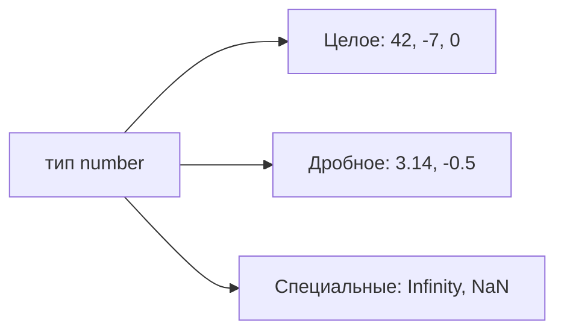
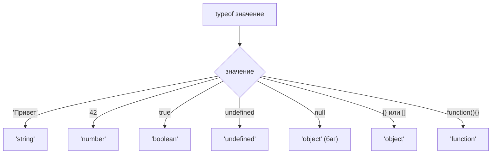

## Переменные и типы данных

> **Связь с предыдущим уроком:** в первом уроке мы написали первую программу на JavaScript и узнали, как подключать скрипты к HTML. Сегодня мы переходим к тому, что любая программа хранит и обрабатывает — к данным. Прежде чем программы смогут выполнять полезные задачи, нам нужен способ хранить и работать с информацией.

---

## Цель урока

Понять, что такое переменные, как их объявлять с помощью `let`, `const` и `var`, изучить все примитивные типы данных в JavaScript и освоить преобразование типов — чтобы к концу урока вы уверенно хранили, извлекали и оперировали данными в своих программах.

## Что вы узнаете к концу урока

- Объяснить, что такое переменная и зачем они нужны программам.
- Объявлять переменные с помощью `let`, `const` и `var` — и знать, когда использовать каждый.
- Определять и работать со всеми семью примитивными типами: `string`, `number`, `boolean`, `null`, `undefined`, `symbol`, `bigint`.
- Использовать шаблонные строки (строки в обратных кавычках) для построения динамического текста.
- Применять оператор `typeof` для определения типа значения.
- Различать неявное и явное преобразование типов.

---

## Хронология урока

| Блок | Содержание |
| --- | --- |
| 1. Что такое переменная | Аналогия с коробкой, синтаксис объявления, оператор `=` |
| 2. `let`, `const`, `var` | Три ключевых слова, сравнение, когда какое использовать |
| 3. Примитивные типы данных | string, number, boolean, null, undefined, symbol, bigint |
| 4. Шаблонные строки | Обратные кавычки, выражения `${}`, многострочные строки |
| 5. Специальные числа и `typeof` | Infinity, NaN, оператор `typeof` |
| 6. Динамическая типизация и преобразование | Неявное vs явное преобразование, итоговая таблица |
| 7. Практика и итоги | Упражнения и ключевые выводы |

---

## Блок 1. Что такое переменная?

**Простыми словами:** переменная — это **коробка с названием**. На коробке написано имя, внутри лежит какое-то содержимое (значение), а позже можно открыть коробку, посмотреть, что внутри, или заменить содержимое.

В программировании **переменная** — это именованный контейнер для хранения данных. Вы создаёте её, кладёте туда данные и используете их по мере необходимости.

```javascript
let name = 'Анна';
let age = 25;
let isLoggedIn = true;
```

Синтаксис состоит из трёх частей:

1. **Ключевое слово** (`let`, `const` или `var`) — сообщает JavaScript, что вы создаёте переменную.
2. **Имя** (`name`, `age`, `isLoggedIn`) — наклейка на коробке.
3. **Оператор присваивания** `=` и **значение** — то, что кладётся внутрь коробки.

### Правила именования

Имена переменных должны соблюдать следующие правила:

- Допускаются только буквы, цифры, `_` и `$`.
- Имя не может начинаться с цифры.
- Имена чувствительны к регистру (`age` и `Age` — разные переменные).
- Нельзя использовать зарезервированные слова (`let`, `class`, `return` и т.д.) как имена.

```javascript
let userName = 'Антон';      // допустимо
let _count = 10;              // допустимо
let $price = 9.99;            // допустимо
let 2ndPlace = 'runner';      // ошибка: начинается с цифры
let my-var = 'hello';         // ошибка: содержит дефис
```

**Соглашение (не правило):** используйте `camelCase` для составных имён — начинайте с маленькой буквы, каждое новое слово — с заглавной.

```javascript
let firstName = 'Анна';
let maxRetries = 3;
let isGameOver = false;
```

---

## Блок 2. Способы объявления переменных: `let`, `const` и `var`

В JavaScript есть три ключевых слова для создания переменных. В современном коде следует использовать **`let`** и **`const`**. Ключевое слово **`var`** считается устаревшим.

### `let` — изменяемая переменная

Переменная, объявленная через `let`, может менять своё значение в любой момент.

```javascript
let score = 0;
console.log(score); // 0

score = 10;
console.log(score); // 10

score = score + 5;
console.log(score); // 15
```

**Характеристики:**

- Значение может быть изменено.
- **Блочная область видимости**: видна только внутри ближайшего `{ }`.
- Рекомендуется как вариант по умолчанию для переменных, которые меняются.

### `const` — неизменяемая константа

Переменная, объявленная через `const`, должна быть инициализирована сразу и **не может быть переназначена** после этого.

```javascript
const PI = 3.14159;
console.log(PI); // 3.14159

PI = 3.14; // TypeError: Assignment to constant variable
```

**Характеристики:**

- Значение не может быть переназначено.
- Обязательна инициализация при объявлении.
- **Блочная область видимости**, как и у `let`.
- Рекомендуется для значений, которые не должны меняться.

### `const` с объектами и массивами

Для объектов и массивов, объявленных через `const`, **нельзя переназначить саму переменную**, но **можно изменять её содержимое**.

```javascript
const user = { name: 'Антон' };
user.name = 'Дмитрий';      // допустимо — изменяем свойство
console.log(user.name);     // 'Дмитрий'

user = { name: 'Борис' };   // TypeError — переназначение запрещено
```

```javascript
const colors = ['красный', 'зелёный'];
colors.push('синий');       // допустимо — модифицируем массив
console.log(colors);        // ['красный', 'зелёный', 'синий']

colors = ['жёлтый'];        // TypeError — переназначение запрещено
```

### `var` — устаревший способ (не рекомендуется)

`var` — это оригинальный способ объявления переменных в JavaScript. Он работает иначе, чем `let` и `const`, что часто приводит к ошибкам.

```javascript
var oldVariable = 'старый стиль';
```

**Почему не стоит использовать `var`:**

- **Функциональная область видимости** вместо блочной — «вытекает» из блоков `{ }`.
- **Поднимается (hoisting)** в начало области видимости confusing образом.
- Можно случайно объявить повторно.

```javascript
if (true) {
    var leaked = 'Я видна снаружи';
}
console.log(leaked); // 'Я видна снаружи' — неожиданно!
```

С `let` этого не происходит:

```javascript
if (true) {
    let scoped = 'Я остаюсь внутри';
}
console.log(scoped); // ReferenceError: scoped is not defined
```

### Сравнительная таблица

| Особенность | `let` | `const` | `var` |
| --- | --- | --- | --- |
| Переназначение | Да | Нет | Да |
| Блочная область видимости | Да | Да | Нет (функциональная) |
| Поднятие | Да (временная мёртвая зона) | Да (временная мёртвая зона) | Да (инициализируется как `undefined`) |
| Повторное объявление | Нет | Нет | Да |
| Рекомендуется | Да | Да | Нет |

### Типичные ошибки новичков

| Ошибка | Как исправить |
| --- | --- |
| Забыли объявить переменную (создаётся глобальная) | Всегда ставьте `let` или `const` перед именем |
| Переназначение `const` | Используйте `let`, если значение должно меняться |
| Использование `var` по привычке | Переходите на `let` или `const` — `var` устарел |
| `const` без инициализации | `const x;` — синтаксическая ошибка — задайте значение сразу |

---

## Блок 3. Примитивные типы данных

В JavaScript есть **семь примитивных типов**. Примитивы — это самые простые и базовые значения, которые предлагает язык. Они неизменяемы (immutable) и сравниваются по значению.

### 3.1. Строка (`string`)

**Строка** — это последовательность символов, заключённая в кавычки. Строки представляют текст.

```javascript
let greeting = 'Привет';
let city = "Ташкент";
let empty = '';
```

Можно использовать одинарные `' '` или двойные `" "` кавычки — они работают одинаково. Выберите один стиль и придерживайтесь его.

### 3.2. Число (`number`)

Тип **number** включает все числовые значения — целые и дробные (с плавающей точкой). JavaScript не разделяет `int` и `float`, как некоторые другие языки.

```javascript
let count = 42;
let price = 9.99;
let negative = -100;
```



### 3.3. Логический тип (`boolean`)

**Булев тип** имеет ровно два значения: `true` и `false`. Используется для логических решений и условий.

```javascript
let isAdult = true;
let hasLicense = false;
```

### 3.4. `null` — намеренное отсутствие значения

`null` означает «ничего» или «пусто» — вы присваиваете его намеренно, когда переменная не должна иметь значения.

```javascript
let user = null;
let result = null;
```

### 3.5. `undefined` — значение по умолчанию

`undefined` означает, что переменная объявлена, но **значение ей ещё не присвоено**. JavaScript назначает это автоматически.

```javascript
let city;
console.log(city); // undefined
```

Разница между `null` и `undefined`:

- **`null`** — намеренно: вы сами устанавливаете его, чтобы указать «нет значения».
- **`undefined`** — автоматически: JavaScript присваивает его, когда значение не задано.

### 3.6. `symbol` — уникальный идентификатор

`Symbol` создаёт гарантированно уникальное значение. Два символа с одинаковым описанием всё равно различаются.

```javascript
let id1 = Symbol('id');
let id2 = Symbol('id');
console.log(id1 === id2); // false
```

### 3.7. `bigint` — большие целые числа

`BigInt` работает с целыми числами, превышающими `Number.MAX_SAFE_INTEGER` (2^53 - 1). Добавьте `n` к числу.

```javascript
let large = 9007199254740991n;
let huge = BigInt('9007199254740991');
```

---

## Блок 4. Шаблонные строки

Шаблонные строки — это строки, написанные в **обратных кавычках** (`` ` ``) вместо одинарных или двойных. У них есть две мощные возможности.

### Интерполяция с `${}`

Внутри обратных кавычек `${expression}` вставляет значение любого выражения прямо в строку.

```javascript
let name = 'Анна';
let age = 25;

let message = `Меня зовут ${name}, мне ${age} лет.`;
console.log(message); // Меня зовут Анна, мне 25 лет.
```

Внутри `${ }` можно использовать любое допустимое выражение:

```javascript
let a = 10;
let b = 20;
console.log(`Сумма: ${a + b}`);           // Сумма: 30
console.log(`Через 5 лет: ${a + 5}`);    // Через 5 лет: 15
```

### Многострочные строки

Строки в обратных кавычках могут занимать несколько строк без специального синтаксиса.

```javascript
let poem = `Розы красные, фиалки синие,
JavaScript — это весело,
И ты тоже.`;
console.log(poem);
```

С обычными кавычками пришлось бы использовать `\n`:

```javascript
let poem = "Розы красные, фиалки синие,\nJavaScript — это весело";
```

Шаблонные строки — современный и предпочтительный способ построения строк с динамическими значениями.

---

## Блок 5. Специальные числовые значения и `typeof`

### Специальные числовые значения

Не все числа в JavaScript являются обычными конечными значениями.

**`Infinity`** — результат деления положительного числа на ноль:

```javascript
console.log(10 / 0);   // Infinity
console.log(-10 / 0);  // -Infinity
```

**`NaN`** (Not a Number — «не число») — результат математической операции, не имеющей смысла:

```javascript
console.log('abc' / 2);      // NaN
console.log('привет' * 3);   // NaN
console.log(undefined + 1);  // NaN
```

Важно: `NaN` относится к типу `number`, несмотря на своё название:

```javascript
console.log(typeof NaN); // 'number'
```

### Оператор `typeof`

`typeof` определяет тип значения. Возвращает строку.

```javascript
console.log(typeof 'Привет');     // 'string'
console.log(typeof 42);           // 'number'
console.log(typeof true);         // 'boolean'
console.log(typeof undefined);    // 'undefined'
console.log(typeof null);         // 'object'  <-- историческая ошибка
console.log(typeof {});           // 'object'
console.log(typeof []);           // 'object'
console.log(typeof function(){}); // 'function'
```

**Ловушка `typeof null`:** `typeof null` возвращает `'object'` — это известная ошибка JavaScript, существующая с первого релиза языка. Она никогда не была исправлена ради обратной совместимости. Запомните эту особенность: `null` **не является** объектом, несмотря на то, что говорит `typeof`.



---

## Блок 6. Динамическая типизация и преобразование типов

### Динамическая типизация

JavaScript — язык с **динамической типизацией**: тип переменной определяется её значением, а не объявлением. Одна и та же переменная может хранить строку, затем число, затем логическое значение — всё с использованием `let`.

```javascript
let value = 'Привет';  // string
value = 42;            // number
value = true;          // boolean
value = null;          // object (null)
```

Такая гибкость удобна, но требует внимания — нужно отслеживать, какого типа значение находится в переменной в данный момент.

### Неявное преобразование (автоматическое приведение типов)

JavaScript автоматически преобразует типы в некоторых ситуациях, что может привести к неожиданным результатам.

```javascript
console.log('5' + 3);    // '53'  — число 3 превращается в строку '3', затем конкатенация
console.log('5' - 3);    // 2     — строка '5' превращается в число 5, затем вычитание
console.log(true + 1);   // 2     — true становится 1
console.log(false + 1);  // 1     — false становится 0
console.log('' == false); // true
```

Ключевое правило: оператор `+` со строкой всегда **конкатенирует**; другие операторы (`-`, `*`, `/`) пытаются преобразовать строки в числа.

### Явное преобразование

Вы можете (и должны) преобразовывать типы намеренно, когда это необходимо.

```javascript
String(42);          // '42'
String(true);        // 'true'
String(null);        // 'null'

Number('42');        // 42
Number('привет');    // NaN
Number('');          // 0
Number(true);        // 1
Number(null);        // 0

parseInt('42px');    // 42 — разбирает до первого нечислового символа
parseFloat('3.14em'); // 3.14

Boolean(0);          // false
Boolean('');         // false
Boolean(null);       // false
Boolean(undefined);  // false
Boolean('привет');   // true
Boolean(42);         // true
```

### Ложные (falsy) и истинные (truthy) значения

В JavaScript каждое значение является либо **truthy**, либо **falsy** при использовании в логическом контексте (например, в `if`).

**Falsy-значения** (единственные):

- `false`
- `0` и `-0`
- `''` (пустая строка)
- `null`
- `undefined`
- `NaN`

Всё остальное — **truthy**, включая:

- `'0'` (строка с нулём)
- `[]` (пустой массив)
- `{}` (пустой объект)

```javascript
if ('0') {
    console.log('Это выполнится!'); // '0' — truthy
}
```

### Итоговая таблица

| Понятие | Описание |
| --- | --- |
| Переменная | Именованный контейнер для хранения данных |
| `let` | Изменяемая переменная с блочной областью видимости — вариант по умолчанию |
| `const` | Неизменяемая ссылка, блочная область видимости — когда значение не должно меняться |
| `var` | Устаревшее ключевое слово с функциональной областью видимости — избегайте в новом коде |
| string | Текст в кавычках: `'привет'`, `"привет"`, `` `привет` `` |
| number | Целые и дробные числа, а также `Infinity` и `NaN` |
| boolean | `true` или `false` |
| null | Намеренное отсутствие значения |
| undefined | Значение ещё не присвоено |
| symbol | Уникальный идентификатор |
| bigint | Целое число произвольной точности (добавьте `n`) |
| шаблонная строка | Строка в обратных кавычках с интерполяцией `${expression}` |
| typeof | Оператор, возвращающий тип значения в виде строки |
| неявное преобразование | Автоматическое приведение типов движком JS |
| явное преобразование | Ручное преобразование через `String()`, `Number()`, `Boolean()` и т.д. |

---

## Практика

1. Объявите переменные с помощью `let` и `const` для вашего имени, возраста и того, являетесь ли вы студентом. Выведите каждую через `console.log`.
2. Создайте `const`-объект, представляющий книгу (название, автор, количество страниц). Измените свойство «название». Затем попробуйте переназначить переменную — наблюдайте ошибку.
3. Используйте `typeof` для проверки типа `null`, `'42'`, `42`, `true` и `undefined`. Обратите внимание, какой результат неожиданный.
4. Напишите шаблонную строку вида `"Привет, меня зовут {name}, а через год мне будет {age + 1} лет."` с вашими реальными данными.
5. Предскажите результат каждого выражения перед запуском: `'10' - 5`, `'10' + 5`, `true + false`, `'' + 0`.
6. Преобразуйте строку `'3.14159'` в число с помощью `Number()` и в дробное с помощью `parseFloat()`. Сравните результаты.

---

## Итоги урока

- **Переменная** — это именованный контейнер для хранения данных — представьте коробку с наклейкой.
- **`let`** объявляет изменяемую переменную с блочной областью видимости — ваш вариант по умолчанию.
- **`const`** объявляет константу, которую нельзя переназначить — используйте для значений, которые не должны меняться. Для объектов и массивов содержимое всё равно можно изменять.
- **`var`** — устаревшее ключевое слово с функциональной областью видимости — избегайте его в новом коде.
- В JavaScript **семь примитивных типов**: `string`, `number`, `boolean`, `null`, `undefined`, `symbol`, `bigint`.
- **Шаблонные строки** (обратные кавычки) позволяют встраивать выражения через `${}` и писать многострочные строки.
- **`typeof`** показывает тип значения — но помните об исторической ошибке, когда `typeof null` возвращает `'object'`.
- JavaScript — язык с **динамической типизацией**: тип переменной может измениться в любой момент.
- **Преобразование типов** может происходить неявно (автоматически) или явно через `String()`, `Number()`, `parseInt()`, `Boolean()`.

---

[Следующий урок: Операторы и массивы →](../../Lesson-3/ru/Операторы%20и%20массивы.md)
