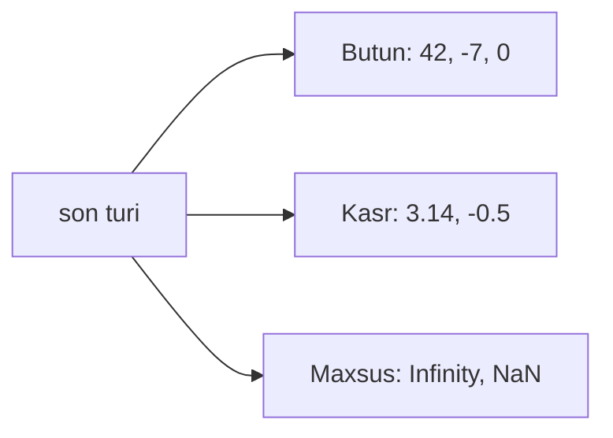
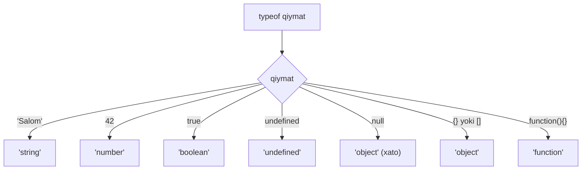

## O'zgaruvchilar va ma'lumot turlari

> **Oldingi dars bilan bog'lanish:** birinchi darsda biz birinchi JavaScript dasturini yozdik va skriptlarni HTML ga qanday ulashni o'rgandik. Bugun har qanday dastur saqlaydigan va qayta ishlaydigan narsaga — ma'lumotlarga o'tamiz. Dasturlar foydali ishlarni bajarishdan oldin, bizga ma'lumotlarni saqlash va ular bilan ishlash usuli kerak.

---

## Dars maqsadi

O'zgaruvchilar nima ekanligini, ularni `let`, `const` va `var` yordamida qanday e'lon qilishni tushunish, JavaScriptdagi barcha primitiv ma'lumot turlarini o'rganish va tur o'zgartirishni egallash — dars oxiriga siz o'z dasturlaringizda ma'lumotlarni ishonchli saqlay, olib va boshqara olishingiz kerak.

## Dars oxiriga nima bilan bilasiz

- O'zgaruvchi nima ekanligini va dasturlarga nima uchun kerakligini tushuntirish.
- `let`, `const` va `var` yordamida o'zgaruvchilar e'lon qilish — va qaysi holatda qaysi ishlatilishini bilish.
- Yettita primitiv tur: `string`, `number`, `boolean`, `null`, `undefined`, `symbol`, `bigint` ni aniqlash va ular bilan ishlash.
- Shablon satrlar (teskari qo'shtirnoqdagi satri) yordamida dinamik matn qurish.
- `typeof` operatorini qiymat turini aniqlash uchun qo'llash.
- Yashirin va ochiq tur o'zgartirishni farqlash.

---

## Dars jadvali

| Blok | Mazmun |
| --- | --- |
| 1. O'zgaruvchi nima | Quti analogiyasi, e'lon qilish sintaksisi, `=` operatori |
| 2. `let`, `const`, `var` | Uch kalit so'z taqqoslash, qachon qaysi ishlatish |
| 3. Primitiv ma'lumot turlari | string, number, boolean, null, undefined, symbol, bigint |
| 4. Shablon satrlar | Teskari qo'shtirnoqlar, `${}` ifodalar, ko'p qatorli satrlar |
| 5. Maxsus son qiymatlari va `typeof` | Infinity, NaN, `typeof` operatori |
| 6. Dinamik tipizatsiya va tur o'zgartirish | Yashirin vs ochiq o'zgartirish, umumiy jadval |
| 7. Amaliyot va xulosa | Mashqlar va asosiy xulosalar |

---

## Blok 1. O'zgaruvchi nima?

**Oddiy qilib aytganda:** o'zgaruvchi — bu **yozuv yorlig'i bor quti**. Qutiga nom yozilgan, ichida qiymat bor, keyin qutini ochib, nimasi borligini ko'rishingiz yoki ichidagini almashtirishingiz mumkin.

Dasturlashda **o'zgaruvchi** — bu ma'lumot saqlash uchun nomlangan konteyner. Siz uni yaratasiz, ma'lumot qo'yatasiz va kerak bo'lganda foydalanasiz.

```javascript
let name = 'Aziza';
let age = 25;
let isLoggedIn = true;
```

Sintaksis uch qismdan iborat:

1. **Kalit so'z** (`let`, `const` yoki `var`) — JavaScript ga o'zgaruvchi yaratayotganingizni aytadi.
2. **Nom** (`name`, `age`, `isLoggedIn`) — qutidagi yorliq.
3. **Tayinlash operatori** `=` va **qiymat** — qutiga qo'yiladigan narsa.

### Nomlash qoidalari

O'zgaruvchi nomlari quyidagi qoidalarga rioya qilishi kerak:

- Faqat harflar, raqamlar, `_` va `$` ruxsat etiladi.
- Nom raqam bilan boshlanmasligi kerak.
- Nomlar katta-kichik harfga sezgir (`age` va `Age` — turli o'zgaruvchilar).
- Band qilingan so'zlarni (`let`, `class`, `return` va boshqalar) nom sifatida ishlatib bo'lmaydi.

```javascript
let userName = 'Zafar';      // to'g'ri
let _count = 10;              // to'g'ri
let $price = 9.99;            // to'g'ri
let 2ndPlace = 'runner';      // xato: raqam bilan boshlangan
let my-var = 'hello';         // xato: defis mavjud
```

**Kelishuv (qoida emas):** ko'p so'zli nomlar uchun `camelCase` ishlating — kichik harf bilan boshlang, har yangi so'z katta harf bilan.

```javascript
let firstName = 'Aziza';
let maxRetries = 3;
let isGameOver = false;
```

---

## Blok 2. O'zgaruvchilarni e'lon qilish: `let`, `const` va `var`

JavaScript da o'zgaruvchilar yaratish uchun uchta kalit so'z mavjud. Zamonaviy kodda **`let`** va **`const`** ishlatishingiz kerak. **`var`** kalit so'zi eski hisoblanadi.

### `let` — o'zgaruvchan o'zgaruvchi

`let` orqali e'lon qilingan o'zgaruvchi qiymatini istalgan vaqtda o'zgartirishi mumkin.

```javascript
let score = 0;
console.log(score); // 0

score = 10;
console.log(score); // 10

score = score + 5;
console.log(score); // 15
```

**Xususiyatlari:**

- Qiymat qayta tayinlanishi mumkin.
- **Blok ko'rinish maydoni**: faqat eng yaqin `{ }` ichida ko'rinadi.
- O'zgaruvchan o'zgaruvchilar uchun standart tanlov sifatida tavsiya etiladi.

### `const` — o'zgarmas konstanta

`const` orqali e'lon qilingan o'zgaruvchi darhol qiymatga ega bo'lishi kerak va keyin **qayta tayinlanmasligi** kerak.

```javascript
const PI = 3.14159;
console.log(PI); // 3.14159

PI = 3.14; // TypeError: Assignment to constant variable
```

**Xususiyatlari:**

- Qiymat qayta tayinlanmaydi.
- E'lon qilganda darhol boshlang'ich qiymat berilishi shart.
- `let` kabi **blok ko'rinish maydoni**.
- O'zgarmasligi kerak bo'lgan qiymatlar uchun tavsiya etiladi.

### `const` ob'ektlar va massivlar bilan

`const` bilan e'lon qilingan ob'ektlar va massivlar uchun **o'zgaruvchini qayta tayinlab bo'lmaydi**, lekin **ichki mazmunini o'zgartirish mumkin**.

```javascript
const user = { name: 'Zafar' };
user.name = 'Dilshod';      // ruxsat etiladi — xususiyatni o'zgartiramiz
console.log(user.name);     // 'Dilshod'

user = { name: 'Bobur' };   // TypeError — qayta tayinlash taqiqlangan
```

```javascript
const colors = ['qizil', 'yashil'];
colors.push("ko'k");        // ruxsat etiladi — massivni o'zgartiramiz
console.log(colors);        // ['qizil', 'yashil', 'ko'k']

colors = ['sariq'];         // TypeError — qayta tayinlash taqiqlangan
```

### `var` — eski usul (tavsiya etilmaydi)

`var` — JavaScript da o'zgaruvchilar yaratishning dastlabki usuli. U `let` va `const` dan farqli ishlaydi, bu ko'p buglarga olib keladi.

```javascript
var oldVariable = 'eski stil';
```

**Nima uchun `var` ishlatmaslik kerak:**

- Blok o'rniga **funktsiya ko'rinish maydoni** — bloklardan `{ }` «sizib chiqadi».
- Qo'rquvli tarzda scope boshiga **ko'tariladi (hoisting)**.
- Tasodifan qayta e'lon qilinishi mumkin.

```javascript
if (true) {
    var leaked = "Men tashqarida ko'rinaman";
}
console.log(leaked); // "Men tashqarida ko'rinaman" — kutilmagan!
```

`let` bilan bu sodir bo'lmaydi:

```javascript
if (true) {
    let scoped = 'Men ichida qolaman';
}
console.log(scoped); // ReferenceError: scoped is not defined
```

### Taqqoslash jadvali | Xususiyat | `let` | `const` | `var` |
| --- | --- | --- | --- |
| Qayta tayinlash | Ha | Yo'q | Ha |
| Blok ko'rinish maydoni | Ha | Ha | Yo'q (funktsiya) |
| Ko'tarilish (hoisting) | Ha (vaqtincha o'lik zona) | Ha (vaqtincha o'lik zona) | Ha (`undefined` bilan boshlanadi) |
| Qayta e'lon qilish | Yo'q | Yo'q | Ha |
| Tavsiya etiladi | Ha | Ha | Yo'q |

### Yangi boshlovchilar uchun xatolar

| Xato | Qanday tuzatish |
| --- | --- |
| O'zgaruvchini e'lon qilishni unutish (global yaratiladi) | Har doim ism oldiga `let` yoki `const` qo'ying |
| `const` ni qayta tayinlash | Qiymat o'zgarishi kerak bo'lsa `let` ishlating |
| Odat tufayli `var` ishlatish | `let` yoki `const` ga o'ting — `var` eskirgan |
| `const` ni boshlang'ich qiymatsiz e'lon qilish | `const x;` — sintaktik xato — darhol qiymat bering |

---

## Blok 3. Primitiv ma'lumot turlari

JavaScript da **yettita primitiv tur** mavjud. Primitivlar — bu til taklif qilgan eng oddiy va eng asosiy qiymatlar. Ularni o'zgartirib bo'lmaydi (immutable) va ular qiymat bo'yicha solishtiriladi.

### 3.1. Satr (`string`)

**Satr** — bu qo'shtirnoqqa olingan belgilar ketma-ketligi. Satrlar matnni ifodalaydi.

```javascript
let greeting = 'Salom';
let city = "Toshkent";
let empty = '';
```

Bitta qo'shtirnoq `' '` yoki ikki qo'shtirnoq `" "` ishlatishingiz mumkin — ular bir xil ishlaydi. Bitta usulni tanlang va unga rioya qiling.

### 3.2. Son (`number`)

**Son** turi barcha raqamli qiymatlarni qamrab oladi — butun va kasr (suzuvchi nuqtali). JavaScript ba'zi boshqa tillardagi kabi `int` va `float` ni ajratmaydi.

```javascript
let count = 42;
let price = 9.99;
let negative = -100;
```



### 3.3. Mantiqiy tur (`boolean`)

**Mantiqiy tur** faqat ikki qiymatga ega: `true` va `false`. Mantiqiy qarorlar va shartlar uchun ishlatiladi.

```javascript
let isAdult = true;
let hasLicense = false;
```

### 3.4. `null` — qiymatning ongli yo'qligi

`null` «hech narsa» yoki «bo'sh» degan ma'noni anglatadi — o'zgaruvchining qiymati bo'lmasligi kerak bo'lganda uni o'zingiz tayinlaysiz.

```javascript
let user = null;
let result = null;
```

### 3.5. `undefined` — standart qiymat yo'qligi

`undefined` o'zgaruvchi e'lon qilingan, lekin hali **qiymat tayinlanmagan** degan ma'noni anglatadi. JavaScript buni avtomatik beradi.

```javascript
let city;
console.log(city); // undefined
```

`null` va `undefined` o'rtasidagi farq:

- **`null`** — ongli: siz o'zingiz «qiymat yo'q» belgilash uchun o'rnatasiz.
- **`undefined`** — avtomatik: qiymat tayinlanmagan bo'lsa JavaScript beradi.

### 3.6. `symbol` — noyob identifikator

`Symbol` kafolatlangan noyob qiymat yaratadi. Tavsif bir xil bo'lgan ikki symbol hali ham farq qiladi.

```javascript
let id1 = Symbol('id');
let id2 = Symbol('id');
console.log(id1 === id2); // false
```

### 3.7. `bigint` — katta butun sonlar

`BigInt` `Number.MAX_SAFE_INTEGER` (2^53 - 1) dan katta butun sonlar bilan ishlash uchun mo'ljallangan. Son qo'shing `n`.

```javascript
let large = 9007199254740991n;
let huge = BigInt('9007199254740991');
```

---

## Blok 4. Shablon satrlar

Shablon satrlar — bu bitta yoki ikki qo'shtirnoq o'rniga **teskari qo'shtirnoqlarda** (`` ` ``) yozilgan satrlar. Ularning ikta kuchli imkoniyati bor.

### `${}` interpolatsiya

Teskari qo'shtirnoqlar ichida `${expression}` har qanday ifoda qiymatini to'g'ridan-to'g'ri satrga kiritadi.

```javascript
let name = 'Aziza';
let age = 25;

let message = `Mening ismim ${name}, men ${age} yoshdaman.`;
console.log(message); // Mening ismim Aziza, men 25 yoshdaman.
```

`${ }` ichida har qanday yaroqli ifodani ishlatishingiz mumkin:

```javascript
let a = 10;
let b = 20;
console.log(`Yig'indi: ${a + b}`);        // Yig'indi: 30
console.log(`5 yildan keyin: ${a + 5}`);  // 5 yildan keyin: 15
```

### Ko'p qatorli satrlar

Teskari qo'shtirnoqdagi satrlar maxsus sintaksissiz bir nechta qatorni egallashi mumkin.

```javascript
let poem = `Gullar qizil,
Zambakkular ko'k,
JavaScript qiziq,
Siz ham shunday.`;
console.log(poem);
```

Oddiy qo'shtirnoqlar bilan bu `\n` talab qilardi:

```javascript
let poem = "Gullar qizil,\nZambakkular ko'k";
```

Shablon satrlar — dinamik qiymatlar bilan satrlar qurishning zamonaviy va afzal usuli.

---

## Blok 5. Maxsus son qiymatlari va `typeof`

### Maxsus son qiymatlari

JavaScriptdagi har bir son oddiy cheklangan qiymat emas.

**`Infinity`** — musbat sonni nolga bo'lish natijasi:

```javascript
console.log(10 / 0);   // Infinity
console.log(-10 / 0);  // -Infinity
```

**`NaN`** (Not a Number — «son emas») — ma'nosiz matematik amal natijasi:

```javascript
console.log('abc' / 2);       // NaN
console.log('salom' * 3);    // NaN
console.log(undefined + 1);  // NaN
```

Muhim: `NaN` turi `number`, garchi nomi boshqacha:

```javascript
console.log(typeof NaN); // 'number'
```

### `typeof` operatori

`typeof` qiymat turini aniqlaydi. Satr qaytaradi.

```javascript
console.log(typeof 'Salom');      // 'string'
console.log(typeof 42);           // 'number'
console.log(typeof true);         // 'boolean'
console.log(typeof undefined);    // 'undefined'
console.log(typeof null);         // 'object'  <-- tarixiy xato
console.log(typeof {});           // 'object'
console.log(typeof []);           // 'object'
console.log(typeof function(){}); // 'function'
```

**`typeof null` tuzog'i:** `typeof null` `'object'` qaytaradi — bu JavaScript ning birinchi versiyasidan beri mavjud bo'lgan mashhur xato. U backward compatibility uchun hech qachon tuzatilmagan. Bu xususiyatni eslab qoling: `null` — ob'ekt **emas**, `typeof` aytsa ham.



---

## Blok 6. Dinamik tipizatsiya va tur o'zgartirish

### Dinamik tipizatsiya

JavaScript — **dinamik tipizatsiyalangan til**: o'zgaruvchining turi uning qiymatiga qarab aniqlanadi, e'lon qilishga emas. Bitta o'zgaruvchi satr, keyin son, keyin mantiqiy qiymat saqlashi mumkin — hammasi `let` bilan.

```javascript
let value = 'Salom';   // string
value = 42;            // number
value = true;          // boolean
value = null;          // object (null)
```

Bu moslashuvchanlik qulay, lekin e'tiqorat talab qiladi — o'zgaruvchining hozir qanday turda ekanligini kuzatib borishingiz kerak.

### Yashirin tur o'zgartirish (tur majburlash)

JavaScript ba'zi holatlarda turlarni avtomatik o'zgartiradi, bu kutilmagan natijalarga olib kelishi mumkin.

```javascript
console.log('5' + 3);    // '53'  — 3 soni '3' satrga aylanadi, keyin birlashtiriladi
console.log('5' - 3);    // 2     — '5' satri 5 songa aylanadi, keyin ayiriladi
console.log(true + 1);   // 2     — true 1 ga aylanadi
console.log(false + 1);  // 1     — false 0 ga aylanadi
console.log('' == false); // true
```

Asosiy qoida: `+` operatori satr bilan doimo **birlashtiradi**; boshqa operatorlar (`-`, `*`, `/`) satrlarni songa o'zgartirishga harakat qiladi.

### Ochiq tur o'zgartirish

Siz kerak bo'lganda turlarni ongli o'zgartirishingiz kerak (va kerak).

```javascript
String(42);          // '42'
String(true);        // 'true'
String(null);        // 'null'

Number('42');        // 42
Number('salom');     // NaN
Number('');          // 0
Number(true);        // 1
Number(null);        // 0

parseInt('42px');    // 42 — raqam bo'lmaguncha tahlil qiladi
parseFloat('3.14em'); // 3.14

Boolean(0);          // false
Boolean('');         // false
Boolean(null);       // false
Boolean(undefined);  // false
Boolean('salom');    // true
Boolean(42);         // true
```

### Yolg'on (falsy) va rost (truthy) qiymatlar

JavaScript da har bir qiymat mantiqiy kontekstda (masalan, `if` da) **truthy** yoki **falsy**.

**Falsy qiymatlar** (yagona):

- `false`
- `0` va `-0`
- `''` (bo'sh satr)
- `null`
- `undefined`
- `NaN`

Qolgan hammasi **truthy**, shu jumladan:

- `'0'` (nolli satr)
- `[]` (bo'sh massiv)
- `{}` (bo'sh ob'ekt)

```javascript
if ('0') {
    console.log('Bu bajariladi!'); // '0' — truthy
}
```

### Umumiy jadval

| Tushuncha | Tavsif |
| --- | --- |
| O'zgaruvchi | Ma'lumot saqlash uchun nomlangan konteyner |
| `let` | O'zgaruvchan, blok ko'rinish maydoni — standart tanlov |
| `const` | O'zgarmas referens, blok ko'rinish maydoni — qiymat o'zgarmasligi kerak bo'lganda |
| `var` | Eski kalit so'z, funksiya ko'rinish maydoni — yangi kodda ishlatmang |
| string | Qo'shtirnoqdagi matn: `'salom'`, `"salom"`, `` `salom` `` |
| number | Butun va kasr sonlar, shuningdek `Infinity` va `NaN` |
| boolean | `true` yoki `false` |
| null | Qiymatning ongli yo'qligi |
| undefined | Qiymat hali tayinlanmagan |
| symbol | Noyob identifikator |
| bigint | Ixtiyoriy aniqlikdagi butun son (`n` qo'shing) |
| shablon satr | Teskari qo'shtirnoqdagi satr, `${expression}` interpolatsiya bilan |
| typeof | Qiymat turini satri sifatida qaytaruvchi operator |
| yashirin o'zgartirish | JS motori tomonidan avtomatik tur o'zgartirish |
| ochiq o'zgartirish | `String()`, `Number()`, `Boolean()` orqali qo'lda o'zgartirish |

---

## Amaliyot

1. `let` va `const` yordamida ismingiz, yoshingiz va talaba ekanligingiz uchun o'zgaruvchilar e'lon qiling. Har birini `console.log` bilan chiqaring.
2. Kitobni ifodalovchi `const` ob'ekt yarating (sarlavha, muallif, sahifalar soni). Sarlavha xususiyatini o'zgartiring. Keyin o'zgaruvchini qayta tayinlashga urinib ko'ring — xatoni kuzating.
3. `typeof` dan `null`, `'42'`, `42`, `true` va `undefined` turlarini tekshirish uchun foydalaning. Qaysi natija kutilmagan ekanligiga e'tibor bering.
4. `"Salom, mening ismim {name}, yoshim {age + 1} da."` ko'rinishidagi shablon satrni haqiqiy ma'lumotlaringiz bilan yozing.
5. Har bir ifodaning natijasini ishga tushirishdan oldin bashorat qiling: `'10' - 5`, `'10' + 5`, `true + false`, `'' + 0`.
6. `'3.14159'` satrini `Number()` yordam songa va `parseFloat()` yordamida kasr songa o'zgartiring. Natijalarni solishtiring.

---

## Dars xulosasi

- **O'zgaruvchi** — bu ma'lumot saqlash uchun nomlangan konteyner — yorliqli qutini tasavvur qiling.
- **`let`** o'zgaruvchan, blok ko'rinish maydoniga ega o'zgaruvchi e'lon qiladi — sizning standart tanlovingiz.
- **`const`** qayta tayinlab bo'lmaydigan konstantani e'lon qiladi — qiymati o'zgarmasligi kerak bo'lganda ishlating. Ob'ektlar va massivlar uchun ichki mazmun hali ham o'zgartirilishi mumkin.
- **`var`** — funksiya ko'rinish maydoniga ega eski kalit so'z — yangi kodda undan saqlaning.
- JavaScript da **yettita primitiv tur** mavjud: `string`, `number`, `boolean`, `null`, `undefined`, `symbol`, `bigint`.
- **Shablon satrlar** (teskari qo'shtirnoqlar) ifodalarni `${}` orqali kiritishga va ko'p qatorli satrlar yozishga imkon beradi.
- **`typeof`** qiymat turini ko'rsatadi — lekin `typeof null` `'object'` qaytaradigan tarixiy xatoni eslang.
- JavaScript — **dinamik tipizatsiyalangan til**: o'zgaruvchining turi istalgan vaqtda o'zgarishi mumkin.
- **Tur o'zgartirish** yashirin (avtomatik) yoki ochiq `String()`, `Number()`, `parseInt()`, `Boolean()` orqali sodir bo'lishi mumkin.

---

[Keyingi dars: Operatorlar va massivlar →](../../Lesson-3/uz/Operatorlar%20va%20massivlar.md)
