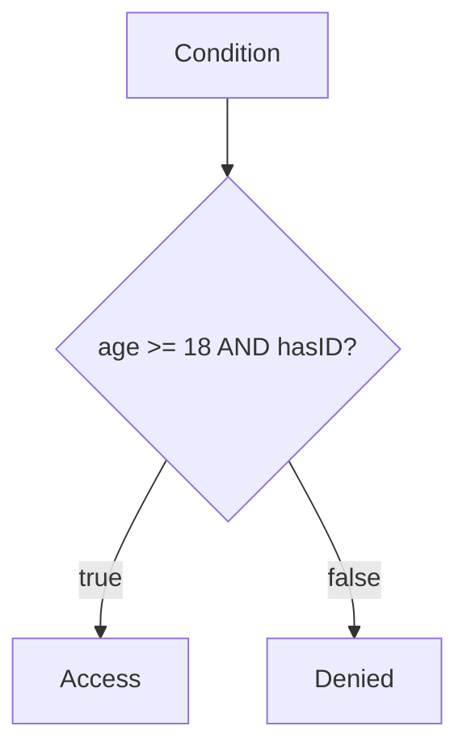
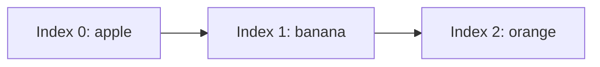

## Operators and Arrays

> **Connection with the previous lesson:** in Lesson 2 we learned about variables, data types, and how to store values. But storing values is only half the story -- now we need to **work** with them: compare, calculate, combine, and store multiple values at once. That is exactly what operators and arrays are for.

---

## Lesson Goal

Understand the different types of JavaScript operators (arithmetic, assignment, comparison, logical, increment/decrement) and learn what arrays are, how to create them, access their elements, destructure them, and use common array methods -- so that by the end of the lesson you can confidently manipulate collections of data.

## What You Will Learn by the End of the Lesson

- Distinguish between operands and operators using the `5 + 3` example.
- Use arithmetic, assignment, comparison, logical, and increment/decrement operators.
- Know why `===` should always be preferred over `==`.
- Create arrays using six different methods, access and modify elements by index, use `length` and `at()`, and destructure them.
- Use core array methods: `push`, `pop`, `unshift`, `shift`, `indexOf`, `lastIndexOf`, `includes`, `join`, `slice`, `splice`, `concat`, `reverse`, `toString`.
- Iterate over arrays with `for`, `for...of`, and `forEach`.

---

## Lesson Timeline

| Block                                         | Content                                              |
| --------------------------------------------- | ---------------------------------------------------- |
| 1. Operands and operators                     | What they are, the `5 + 3` breakdown                 |
| 2. Arithmetic operators                       | `+` `-` `*` `/` `%` `**`                             |
| 3. Assignment operators                       | `=` `+=` `-=` `*=` `/=` `%=`                         |
| 4. Comparison operators                       | `>` `<` `>=` `<=` `==` `===` `!=` `!==`              |
| 5. Logical operators                          | `&&` `||` `!`                                         |
| 6. Increment and decrement                    | `++` `--`, prefix vs postfix                          |
| 7. Arrays: introduction and creation          | What arrays are, six ways to create them              |
| 8. Accessing elements and destructuring       | Indexing from 0, `length`, `at(-1)`, destructuring   |
| 9. Array methods                              | `push`/`pop`, search, `join`, `slice`/`splice`, etc. |
| 10. Iterating arrays                          | `for`, `for...of`, `forEach`                          |
| 11. Practice                                  | Hands-on exercises                                   |
| 12. Summary                                   | Recap and key takeaways                               |

---

## Block 1. Operands and Operators

**In simple terms:** imagine a calculator. The numbers you type in (`5` and `3`) are the **operands** -- the data. The button you press (`+`) is the **operator** -- the action.

```javascript
5 + 3
```

- `5` -- first operand
- `+` -- operator (addition)
- `3` -- second operand

Operators work with variables too, and with different data types:

```javascript
let price = 10;
let tax = 2;
let total = price + tax;
console.log(total);

'Hello' + ' ' + 'World'
```

JavaScript evaluates the expression and produces a **result**. Some operators return numbers, some return strings, and comparison/logical operators always return `true` or `false`.

---

## Block 2. Arithmetic Operators

**In simple terms:** these are the math operators you learned in school -- just written with programming symbols.

| Operator | Name               | Example    | Result                              |
| -------- | ------------------ | ---------- | ----------------------------------- |
| `+`      | Addition           | `10 + 2`   | `12`                                |
| `-`      | Subtraction        | `10 - 2`   | `8`                                 |
| `*`      | Multiplication     | `10 * 2`   | `20`                                |
| `/`      | Division           | `10 / 2`   | `5`                                 |
| `%`      | Remainder (modulo) | `10 % 3`   | `1` (10 divided by 3 leaves 1)      |
| `**`     | Exponentiation     | `2 ** 3`   | `8` (2 to the power of 3)           |

```javascript
let a = 15;
let b = 4;
console.log(a + b); // 19
console.log(a % b); // 3
```

**Why is `%` useful?** Check if a number is even (`x % 2 === 0`) or get the last digit (`123 % 10 === 3`).

---

## Block 3. Assignment Operators

**In simple terms:** assignment operators are how you **store** a value in a variable. The basic `=` operator writes a value; the compound forms (`+=`, `-=`, etc.) are shorthand shortcuts.

| Operator | Name                    | Example  | Equivalent      |
| -------- | ----------------------- | -------- | --------------- |
| `=`      | Assignment              | `x = 5`  | `x = 5`         |
| `+=`     | Add and assign          | `x += 3` | `x = x + 3`     |
| `-=`     | Subtract and assign     | `x -= 2` | `x = x - 2`     |
| `*=`     | Multiply and assign     | `x *= 4` | `x = x * 4`     |
| `/=`     | Divide and assign       | `x /= 2` | `x = x / 2`     |
| `%=`     | Remainder and assign    | `x %= 3` | `x = x % 3`     |
| `**=`    | Exponentiate and assign | `x **= 2`| `x = x ** 2`    |

```javascript
let score = 10;
score += 5;
console.log(score); // 15

score -= 3;
console.log(score); // 12

score *= 2;
console.log(score); // 24
```

---

## Block 4. Comparison Operators

**In simple terms:** comparison operators are like asking a yes-or-no question. They always return `true` (yes) or `false` (no).

| Operator | Meaning                      | Example      | Result  |
| -------- | ---------------------------- | ------------ | ------- |
| `>`      | Greater than                 | `5 > 3`      | `true`  |
| `<`      | Less than                    | `5 < 3`      | `false` |
| `>=`     | Greater than or equal to     | `5 >= 5`     | `true`  |
| `<=`     | Less than or equal to        | `5 <= 3`     | `false` |
| `==`     | Equal (with type coercion)   | `5 == '5'`   | `true`  |
| `===`    | Strictly equal (no coercion) | `5 === '5'`  | `false` |
| `!=`     | Not equal                    | `5 != 3`     | `true`  |
| `!==`    | Strictly not equal           | `5 !== '5'`  | `true`  |

**Always use `===` and `!==`.** The `==` operator converts types before comparing, which can produce surprising results. Strict comparison checks both the value and the type.

```javascript
console.log(10 > 5);
console.log(10 === '10');
console.log(10 !== '10');
console.log(0 == '');
console.log(0 === '');
```

---

## Block 5. Logical Operators

**In simple terms:** logical operators let you combine multiple conditions into one decision. Think of them as the words "and", "or", and "not" in everyday language.

| Operator | Name | What it does                         | Example               | Result  |
| -------- | ---- | ------------------------------------ | --------------------- | ------- |
| `&&`     | AND  | Both conditions must be `true`       | `(5 > 3) && (2 < 4)` | `true`  |
| `||`     | OR   | At least one condition must be `true`| `(5 > 10) \|\| (2 < 4)` | `true` |
| `!`      | NOT  | Flips `true` to `false` and vice versa| `!(5 > 3)`           | `false` |

```javascript
let age = 20;
let hasID = true;

console.log(age >= 18 && hasID); // true
console.log(age >= 18 || hasID); // true
console.log(!hasID);             // false
```

**Operator precedence:** `!` (NOT) is evaluated first, then `&&` (AND), then `||` (OR). Use parentheses to make your intent clear.

```javascript
let temperature = 25;
let isRaining = false;

if (temperature > 20 && !isRaining) {
  console.log('Go for a walk');
}
```



---

## Block 6. Increment and Decrement

**In simple terms:** increment (`++`) adds 1 to a variable, decrement (`--`) subtracts 1. They are shortcuts for `x = x + 1` and `x = x - 1`.

**Prefix vs postfix -- the important difference:**

| Form     | Operator | Example   | What happens                                  |
| -------- | -------- | --------- | --------------------------------------------- |
| Postfix  | `x++`    | `y = x++` | Returns the old value of x, then increments x |
| Prefix   | `++x`    | `y = ++x` | Increments x first, then returns the new value|

```javascript
let a = 5;
let b = a++;  // b = 5 (old value), a = 6
console.log(b, a);

let c = 5;
let d = ++c;  // c = 6, d = 6 (new value)
console.log(d, c);
```

---

## Block 7. Arrays: Introduction and Creation

**In simple terms:** imagine a shelf of books. Each book has a position (first, second, third...). An **array** is like that shelf -- a single variable that holds a **list** of values, each identified by its position (called an **index**).

```javascript
let fruits = ['apple', 'banana', 'orange'];
let mixed = [1, 'hello', true, null, [10, 20]];
```

There are six ways to create arrays. The **array literal `[]`** is by far the most common.

```javascript
let empty = [];
let fruits = ['apple', 'banana', 'orange'];
let nested = [[1, 2], [3, 4]];
```

**Constructor `new Array()`** -- one number sets the **length**, not a value:

```javascript
let arr1 = new Array('apple', 'banana', 'orange');
let wrong = new Array(3);
let correct = new Array(3, 4);
```

**`Array.of()`** -- fixes the `new Array()` pitfall (a single number becomes an element):

```javascript
let arr1 = Array.of(5);
let arr2 = Array.of(1, 2, 3);
```

**`Array.from()`** -- converts iterables (strings, Sets, Maps):

```javascript
let arr1 = Array.from('hello');
let arr2 = Array.from([1, 2, 3], x => x * 2);
```

**`split()`** -- splits a string into an array by a delimiter:

```javascript
let arr1 = 'apple,banana,orange'.split(',');
let arr2 = 'hello world'.split(' ');
```

**Spread operator `...`** -- expands an iterable (also copies arrays):

```javascript
let arr1 = [...'hello'];
let original = [1, 2, 3];
let copy = [...original];
```

### Comparison Table

| Method           | Syntax                 | When to use                                   |
| ---------------- | ---------------------- | --------------------------------------------- |
| Literal `[]`     | `[1, 2, 3]`           | **Almost always** -- simplest and fastest     |
| `new Array()`    | `new Array(5)`         | Rarely, for pre-allocating empty slots        |
| `Array.of()`     | `Array.of(5)`          | Creating an array from individual numbers     |
| `Array.from()`   | `Array.from('abc')`    | Converting an iterable or pseudo-array        |
| `split()`        | `'a,b'.split(',')`     | Creating an array from a string               |
| `...spread`      | `[...'abc']`           | Short way to copy or expand                   |



---

## Block 8. Accessing Elements and Destructuring

**In simple terms:** each element has a numbered address called an **index**, starting from **0**. Use square brackets `[index]` to retrieve or change an element.

### Reading and modifying

```javascript
let fruits = ['apple', 'banana', 'orange'];

console.log(fruits[0]); // apple
console.log(fruits[1]); // banana
console.log(fruits[5]); // undefined

let colors = ['red', 'green', 'blue'];
colors[1] = 'yellow';   // ['red', 'yellow', 'blue']
```

### The `length` property and the last element

```javascript
let nums = [10, 20, 30];
console.log(nums.length);          // 3
console.log(nums[nums.length - 1]); // 30
```

### Accessing from the end with `at()`

```javascript
let letters = ['a', 'b', 'c', 'd'];
console.log(letters.at(-1)); // 'd'
console.log(letters.at(-2)); // 'c'
```

### Destructuring Arrays

Destructuring lets you "unpack" array elements into separate variables in one statement:

```javascript
let fruits = ['apple', 'banana', 'orange'];

let [first, second, third] = fruits;
console.log(first); // apple

let [a, , c] = fruits;
console.log(c); // orange

let [head, ...tail] = fruits;
console.log(tail); // ['banana', 'orange']

let [x, y, z = 10] = [1, 2];
console.log(z); // 10
```

---

## Block 9. Array Methods

### Adding and Removing Elements

| Method               | Action                        | Returns         | Mutates? |
| -------------------- | ----------------------------- | --------------- | -------- |
| `push(element)`      | Add to the **end**            | New length      | Yes      |
| `pop()`              | Remove from the **end**       | Removed element | Yes      |
| `unshift(element)`   | Add to the **beginning**      | New length      | Yes      |
| `shift()`            | Remove from the **beginning** | Removed element | Yes      |

```javascript
let stack = [1, 2, 3];

stack.push(4);
console.log(stack); // [1, 2, 3, 4]

stack.pop();
console.log(stack); // [1, 2, 3]

stack.unshift(0);
console.log(stack); // [0, 1, 2, 3]

stack.shift();
console.log(stack); // [1, 2, 3]
```

### Searching in an Array

```javascript
let letters = ['a', 'b', 'c', 'b'];

console.log(letters.indexOf('b'));      // 1
console.log(letters.lastIndexOf('b'));  // 3
console.log(letters.includes('c'));     // true
```

### Joining Elements into a String

```javascript
let words = ['Hello', 'world'];
console.log(words.join(' '));   // 'Hello world'
console.log(words.join(', '));  // 'Hello, world'
```

### `slice` vs `splice`

`slice` creates a **copy** without modifying the original. `splice` **modifies** the original.

```javascript
let nums = [10, 20, 30, 40, 50];
let sliced = nums.slice(1, 4);
console.log(sliced); // [20, 30, 40]
console.log(nums);   // [10, 20, 30, 40, 50]

let items = [1, 2, 3, 4, 5];
let deleted = items.splice(1, 2);
console.log(deleted); // [2, 3]
console.log(items);   // [1, 4, 5]

items.splice(1, 0, 'a', 'b');
console.log(items);   // [1, 'a', 'b', 4, 5]
```

### `concat`, `reverse`, `toString`

```javascript
console.log([1, 2].concat([3, 4]));     // [1, 2, 3, 4]

let nums = [1, 2, 3, 4, 5];
nums.reverse();
console.log(nums);                      // [5, 4, 3, 2, 1]

console.log([1, 2, 3].toString());       // '1,2,3'
```

---

## Block 10. Iterating Arrays

### Method 1: Classic `for` loop

```javascript
let fruits = ['apple', 'banana', 'orange'];

for (let i = 0; i < fruits.length; i++) {
  console.log(fruits[i]);
}
```

### Method 2: `for...of` loop

```javascript
for (let fruit of fruits) {
  console.log(fruit);
}
```

### Method 3: `forEach` method

```javascript
fruits.forEach(function(fruit, index) {
  console.log(index + ': ' + fruit);
});
```

### Combining operators with arrays

```javascript
let numbers = [5, 12, 7, 20, 3];
let evens = [];

for (let num of numbers) {
  if (num % 2 === 0) evens.push(num);
}
console.log(evens); // [12, 20]

let prices = [100, 200, 300];
for (let i = 0; i < prices.length; i++) {
  prices[i] *= 0.8;
}
console.log(prices); // [80, 160, 240]
```

---

### Common Beginner Mistakes

| Error                                                        | How to Fix                                                                   |
| ------------------------------------------------------------ | ---------------------------------------------------------------------------- |
| Confusing `=` (assignment) with `===` (comparison)           | `=` stores a value; `===` compares. They are not the same.                   |
| Using `==` instead of `===` "because it works"               | `==` hides type bugs. Always use `===` unless you have a specific reason.    |
| Using `new Array(3)` expecting `[3]`                         | A single number sets the length. Use `Array.of(3)` instead.                  |
| Forgetting that arrays are **zero-indexed**                   | The first element is at index `0`, not `1`.                                  |

---

## Practice

1. Given `let scores = [85, 92, 78, 95, 88]`, use a `for` loop to calculate the **average** score.
2. Given `let words = ['JavaScript', 'is', 'awesome']`, use `join(' ')` to produce `'JavaScript is awesome'`.
3. Create an array of 5 numbers. Use `push` and `shift` to add a number to the end and remove one from the beginning.
4. Use destructuring to extract the first and third elements from `['red', 'green', 'blue', 'yellow']`.
5. Write a loop that finds all numbers in `[3, 7, 12, 5, 9, 14, 8]` greater than 10 and stores them in a new array.

---

## Lesson Summary

- **Operators** are actions; **operands** are the values they act on.
- Arithmetic operators: `+` `-` `*` `/` `%` `**` -- for math.
- Assignment operators: `=` `+=` `-=` `*=` `/=` `%=` -- for storing and updating values.
- Comparison operators: `>` `<` `>=` `<=` `==` `===` `!=` `!==` -- always return `true` or `false`. **Prefer `===`.**
- Logical operators: `&&` `||` `!` -- for combining conditions.
- Increment `++` and decrement `--` add or subtract 1. Postfix returns the old value first; prefix changes first then returns.
- **Arrays** store ordered lists of values in a single variable.
- Six ways to create arrays: literal `[]`, `new Array()`, `Array.of()`, `Array.from()`, `split()`, spread `...`. The literal `[]` is preferred.
- Elements are accessed by **zero-based** index: `arr[0]`, `arr[1]`, etc. Use `at(-1)` for the last element.
- **Destructuring** extracts array elements into variables in one statement.
- Core methods: `push`/`pop`, `unshift`/`shift`, `indexOf`/`includes`, `join`, `slice`/`splice`, `concat`, `reverse`, `toString`.
- Three ways to iterate: `for`, `for...of`, `forEach`.

---

[Next lesson: Objects ->](../../Lesson-4/en/Objects.md)
