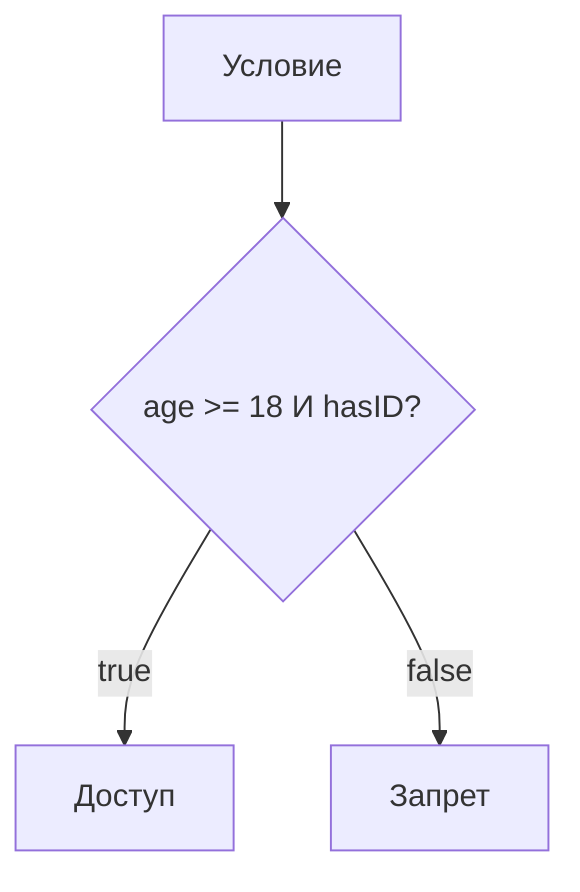

## Операторы и массивы

> **Связь с предыдущим уроком:** на уроке 2 мы изучили переменные, типы данных и научились сохранять значения. Но хранить значения -- это только половина дела. Теперь нужно научиться с ними **работать**: сравнивать, вычислять, объединять и хранить сразу несколько значений. Именно для этого нужны операторы и массивы.

---

## Цель урока

Разобраться в различных типах операторов JavaScript (арифметические, присваивания, сравнения, логические, инкремент и декремент) и узнать, что такое массивы, как их создавать, обращаться к элементам, применять деструктуризацию и использовать основные методы -- чтобы к концу урока вы уверенно работали с коллекциями данных.

## Что вы узнаете к концу урока

- Отличать операнды от операторов на примере `5 + 3`.
- Использовать арифметические, операторы присваивания, сравнения, логические, инкремент и декремент.
- Понимать, почему всегда нужно использовать `===` вместо `==`.
- Создавать массивы шестью способами, обращаться к элементам по индексу, использовать `length` и `at()`, применять деструктуризацию.
- Использовать основные методы: `push`, `pop`, `unshift`, `shift`, `indexOf`, `lastIndexOf`, `includes`, `join`, `slice`, `splice`, `concat`, `reverse`, `toString`.
- Перебирать массивы с помощью `for`, `for...of` и `forEach`.

---

## Хронология урока

| Блок                                          | Содержание                                                            |
| --------------------------------------------- | --------------------------------------------------------------------- |
| 1. Операнды и операторы                       | Что это такое, разбор `5 + 3`                                         |
| 2. Арифметические операторы                   | `+` `-` `*` `/` `%` `**`                                              |
| 3. Операторы присваивания                     | `=` `+=` `-=` `*=` `/=` `%=`                                          |
| 4. Операторы сравнения                        | `>` `<` `>=` `<=` `==` `===` `!=` `!==`                               |
| 5. Логические операторы                       | `&&` `||` `!`                                                          |
| 6. Инкремент и декремент                      | `++` `--`, постфиксная и префиксная формы                             |
| 7. Массивы: введение и создание               | Что такое массивы, шесть способов создания                            |
| 8. Обращение к элементам и деструктуризация   | Индексация с нуля, `length`, `at(-1)`, деструктуризация               |
| 9. Методы массивов                            | `push`/`pop`, поиск, `join`, `slice`/`splice` и др.                   |
| 10. Перебор массивов                          | `for`, `for...of`, `forEach`                                           |
| 11. Практика                                  | Упражнения                                                            |
| 12. Резюме                                    | Итоги и ключевые моменты                                               |

---

## Блок 1. Операнды и операторы

**Простым языком:** представьте калькулятор. Числа, которые вы вводите (`5` и `3`) -- это **операнды**, то есть данные. А кнопку, которую вы нажимаете (`+`), -- это **оператор**, то есть действие.

```javascript
5 + 3
```

- `5` -- первый операнд
- `+` -- оператор (сложение)
- `3` -- второй операнд

Операторы работают и с переменными, и с разными типами данных:

```javascript
let price = 10;
let tax = 2;
let total = price + tax;
console.log(total);

'Привет' + ' ' + 'мир'
```

JavaScript вычисляет выражение и возвращает **результат**. Одни операторы возвращают числа, другие -- строки, а операторы сравнения и логические операторы всегда возвращают `true` или `false`.

---

## Блок 2. Арифметические операторы

**Простым языком:** это операторы математики, которые вы видели в школе -- просто записанные в символьном виде.

| Оператор | Название             | Пример    | Результат                                |
| -------- | -------------------- | --------- | ---------------------------------------- |
| `+`      | Сложение             | `10 + 2`  | `12`                                     |
| `-`      | Вычитание            | `10 - 2`  | `8`                                      |
| `*`      | Умножение            | `10 * 2`  | `20`                                     |
| `/`      | Деление              | `10 / 2`  | `5`                                      |
| `%`      | Остаток от деления   | `10 % 3`  | `1` (10 делится на 3, остаток 1)         |
| `**`     | Возведение в степень | `2 ** 3`  | `8` (2 в степени 3)                      |

```javascript
let a = 15;
let b = 4;
console.log(a + b); // 19
console.log(a % b); // 3
```

**Зачем нужен `%`?** Проверить, чётное ли число (`x % 2 === 0`), или получить последнюю цифру (`123 % 10 === 3`).

---

## Блок 3. Операторы присваивания

**Простым языком:** операторы присваивания -- это способ **сохранить** значение в переменную. Основной оператор `=` записывает значение; составные формы (`+=`, `-=` и т.д.) являются краткими записями.

| Оператор | Название                | Пример  | Эквивалент          |
| -------- | ----------------------- | ------- | ------------------- |
| `=`      | Присваивание            | `x = 5` | `x = 5`             |
| `+=`     | Сложение с присваиванием| `x += 3`| `x = x + 3`         |
| `-=`     | Вычитание с присваиванием| `x -= 2`| `x = x - 2`        |
| `*=`     | Умножение с присваиванием| `x *= 4`| `x = x * 4`        |
| `/=`     | Деление с присваиванием | `x /= 2`| `x = x / 2`         |
| `%=`     | Остаток с присваиванием | `x %= 3`| `x = x % 3`         |
| `**=`    | Степень с присваиванием | `x **= 2`| `x = x ** 2`      |

```javascript
let score = 10;
score += 5;
console.log(score); // 15

score -= 3;
console.log(score); // 12

score *= 2;
console.log(score); // 24
```

---

## Блок 4. Операторы сравнения

**Простым языком:** операторы сравнения -- это как задать вопрос с ответом "да" или "нет". Они всегда возвращают `true` (да) или `false` (нет).

| Оператор | Значение                      | Пример       | Результат |
| -------- | ----------------------------- | ------------ | --------- |
| `>`      | Больше                        | `5 > 3`      | `true`    |
| `<`      | Меньше                        | `5 < 3`      | `false`   |
| `>=`     | Больше или равно              | `5 >= 5`     | `true`    |
| `<=`     | Меньше или равно              | `5 <= 3`     | `false`   |
| `==`     | Равно (с приведением типов)   | `5 == '5'`   | `true`    |
| `===`    | Строго равно (без приведения) | `5 === '5'`  | `false`   |
| `!=`     | Не равно                      | `5 != 3`     | `true`    |
| `!==`    | Строго не равно               | `5 !== '5'`  | `true`    |

**Всегда используйте `===` и `!==`.** Оператор `==` приводит типы перед сравнением, что может привести к неожиданным результатам. Строгое сравнение проверяет и значение, и тип.

```javascript
console.log(10 > 5);
console.log(10 === '10');
console.log(10 !== '10');
console.log(0 == '');
console.log(0 === '');
```

---

## Блок 5. Логические операторы

**Простым языком:** логические операторы позволяют объединить несколько условий в одно решение. Подумайте о них как о словах "и", "или" и "не" в повседневной речи.

| Оператор | Название | Что делает                             | Пример               | Результат |
| -------- | -------- | -------------------------------------- | -------------------- | --------- |
| `&&`     | И        | Оба условия должны быть `true`         | `(5 > 3) && (2 < 4)`| `true`    |
| `||`     | ИЛИ      | Хотя бы одно условие должно быть `true`| `(5 > 10) \|\| (2 < 4)` | `true` |
| `!`      | НЕ       | Меняет `true` на `false` и наоборот   | `!(5 > 3)`           | `false`   |

```javascript
let age = 20;
let hasID = true;

console.log(age >= 18 && hasID); // true
console.log(age >= 18 || hasID); // true
console.log(!hasID);             // false
```

**Приоритет операторов:** `!` (НЕ) вычисляется первым, затем `&&` (И), затем `||` (ИЛИ). Используйте скобки, чтобы намерение было явным.

```javascript
let temperature = 25;
let isRaining = false;

if (temperature > 20 && !isRaining) {
  console.log('Пойти на прогулку');
}
```



---

## Блок 6. Инкремент и декремент

**Простым языком:** инкремент (`++`) увеличивает переменную на 1, декремент (`--`) уменьшает на 1. Это сокращения для `x = x + 1` и `x = x - 1`.

**Постфиксная и префиксная форма -- важное отличие:**

| Форма      | Пример    | Что происходит                                        |
| ---------- | --------- | ----------------------------------------------------- |
| Постфиксная| `y = x++` | Возвращает старое значение x, затем увеличивает x     |
| Префиксная | `y = ++x` | Сначала увеличивает x, затем возвращает новое значение|

```javascript
let a = 5;
let b = a++;  // b = 5 (старое значение), a = 6
console.log(b, a);

let c = 5;
let d = ++c;  // c = 6, d = 6 (новое значение)
console.log(d, c);
```

---

## Блок 7. Массивы: введение и создание

**Простым языком:** представьте полку с книгами. У каждой книги есть позиция (первая, вторая, третья...). **Массив** -- это как эта полка: одна переменная, содержащая **список** значений, каждое из которых идентифицируется своей позицией (**индексом**).

```javascript
let fruits = ['яблоко', 'банан', 'апельсин'];
let mixed = [1, 'текст', true, null, [10, 20]];
```

Есть шесть способов создать массив. **Литерал `[]`** -- самый распространённый.

```javascript
let empty = [];
let fruits = ['яблоко', 'банан', 'апельсин'];
let nested = [[1, 2], [3, 4]];
```

**Конструктор `new Array()`** -- один числовой аргумент задаёт **длину**, а не значение:

```javascript
let arr1 = new Array('яблоко', 'банан', 'апельсин');
let wrong = new Array(3);
let correct = new Array(3, 4);
```

**`Array.of()`** -- исправляет проблему `new Array()` (единственное число становится элементом):

```javascript
let arr1 = Array.of(5);
let arr2 = Array.of(1, 2, 3);
```

**`Array.from()`** -- преобразует итерируемые объекты (строки, Set, Map):

```javascript
let arr1 = Array.from('hello');
let arr2 = Array.from([1, 2, 3], x => x * 2);
```

**`split()`** -- разбивает строку на массив по разделителю:

```javascript
let arr1 = 'яблоко,банан,апельсин'.split(',');
let arr2 = 'привет мир'.split(' ');
```

**Spread-оператор `...`** -- разворачивает итерируемый объект (также копирует массивы):

```javascript
let arr1 = [...'hello'];
let original = [1, 2, 3];
let copy = [...original];
```

### Таблица сравнения

| Способ           | Синтаксис               | Когда использовать                                            |
| ---------------- | ----------------------- | ------------------------------------------------------------- |
| Литерал `[]`     | `[1, 2, 3]`            | **Почти всегда** -- проще и быстрее                           |
| `new Array()`    | `new Array(5)`          | Редко, для создания пустых слотов                             |
| `Array.of()`     | `Array.of(5)`           | Создание массива из отдельных чисел                           |
| `Array.from()`   | `Array.from('abc')`     | Преобразование итерируемого объекта                           |
| `split()`        | `'a,b'.split(',')`      | Создание массива из строки                                    |
| `...spread`      | `[...'abc']`            | Краткий способ скопировать или развернуть                     |


---

## Блок 8. Обращение к элементам и деструктуризация

**Простым языком:** у каждого элемента есть номерной адрес -- **индекс**, начинающийся с **0**. Используйте квадратные скобки `[индекс]`.

### Чтение и изменение

```javascript
let fruits = ['яблоко', 'банан', 'апельсин'];

console.log(fruits[0]); // яблоко
console.log(fruits[1]); // банан
console.log(fruits[5]); // undefined

let colors = ['красный', 'зеленый', 'синий'];
colors[1] = 'желтый';   // ['красный', 'желтый', 'синий']
```

### Свойство `length` и последний элемент

```javascript
let nums = [10, 20, 30];
console.log(nums.length);           // 3
console.log(nums[nums.length - 1]); // 30
```

### Обращение с конца методом `at()`

```javascript
let letters = ['a', 'b', 'c', 'd'];
console.log(letters.at(-1)); // 'd'
console.log(letters.at(-2)); // 'c'
```

### Деструктуризация

Деструктуризация позволяет "извлечь" элементы массива в отдельные переменные одной строкой:

```javascript
let fruits = ['яблоко', 'банан', 'апельсин'];

let [first, second, third] = fruits;
console.log(first); // яблоко

let [a, , c] = fruits;
console.log(c); // апельсин

let [head, ...tail] = fruits;
console.log(tail); // ['банан', 'апельсин']

let [x, y, z = 10] = [1, 2];
console.log(z); // 10
```

---

## Блок 9. Методы массивов

### Добавление и удаление элементов

| Метод                | Действие                          | Возвращает        | Изменяет? |
| -------------------- | --------------------------------- | ----------------- | --------- |
| `push(элемент)`      | Добавить в **конец**              | Новую длину       | Да        |
| `pop()`              | Удалить с **конца**               | Удалённый элемент | Да        |
| `unshift(элемент)`   | Добавить в **начало**             | Новую длину       | Да        |
| `shift()`            | Удалить с **начала**              | Удалённый элемент | Да        |

```javascript
let stack = [1, 2, 3];

stack.push(4);
console.log(stack); // [1, 2, 3, 4]

stack.pop();
console.log(stack); // [1, 2, 3]

stack.unshift(0);
console.log(stack); // [0, 1, 2, 3]

stack.shift();
console.log(stack); // [1, 2, 3]
```

### Поиск в массиве

```javascript
let letters = ['a', 'b', 'c', 'b'];

console.log(letters.indexOf('b'));      // 1
console.log(letters.lastIndexOf('b'));  // 3
console.log(letters.includes('c'));     // true
```

### Объединение элементов в строку

```javascript
let words = ['Привет', 'мир'];
console.log(words.join(' '));   // 'Привет мир'
console.log(words.join(', '));  // 'Привет, мир'
```

### `slice` против `splice`

`slice` создаёт **копию** части массива, не изменяя оригинал. `splice` **изменяет** оригинал.

```javascript
let nums = [10, 20, 30, 40, 50];
let sliced = nums.slice(1, 4);
console.log(sliced); // [20, 30, 40]
console.log(nums);   // [10, 20, 30, 40, 50]

let items = [1, 2, 3, 4, 5];
let deleted = items.splice(1, 2);
console.log(deleted); // [2, 3]
console.log(items);   // [1, 4, 5]

items.splice(1, 0, 'a', 'b');
console.log(items);   // [1, 'a', 'b', 4, 5]
```

### `concat`, `reverse`, `toString`

```javascript
console.log([1, 2].concat([3, 4]));     // [1, 2, 3, 4]

let nums = [1, 2, 3, 4, 5];
nums.reverse();
console.log(nums);                      // [5, 4, 3, 2, 1]

console.log([1, 2, 3].toString());      // '1,2,3'
```

---

## Блок 10. Перебор массивов

### Способ 1: классический цикл `for`

```javascript
let fruits = ['яблоко', 'банан', 'апельсин'];

for (let i = 0; i < fruits.length; i++) {
  console.log(fruits[i]);
}
```

### Способ 2: цикл `for...of`

```javascript
for (let fruit of fruits) {
  console.log(fruit);
}
```

### Способ 3: метод `forEach`

```javascript
fruits.forEach(function(fruit, index) {
  console.log(index + ': ' + fruit);
});
```

### Операторы и массивы вместе

```javascript
let numbers = [5, 12, 7, 20, 3];
let evens = [];

for (let num of numbers) {
  if (num % 2 === 0) evens.push(num);
}
console.log(evens); // [12, 20]

let prices = [100, 200, 300];
for (let i = 0; i < prices.length; i++) {
  prices[i] *= 0.8;
}
console.log(prices); // [80, 160, 240]
```

---

### Типичные ошибки новичков

| Ошибка                                                         | Как исправить                                                                   |
| -------------------------------------------------------------- | ------------------------------------------------------------------------------- |
| Путают `=` (присваивание) с `===` (сравнение)                 | `=` сохраняет значение; `===` сравнивает. Это разные вещи.                      |
| Используют `==` вместо `===` "потому что работает"             | `==` скрывает ошибки с типами. Всегда используйте `===`.                       |
| Используют `new Array(3)` ожидая `[3]`                        | Один числовой аргумент задаёт длину. Используйте `Array.of(3)`.                 |
| Забывают, что массивы нумеруются **с нуля**                    | Первый элемент имеет индекс `0`, а не `1`.                                      |

---

## Практика

1. Дано `let scores = [85, 92, 78, 95, 88]`. Используйте цикл `for`, чтобы вычислить **средний** балл.
2. Дано `let words = ['JavaScript', 'это', 'классно']`. Используйте `join(' ')`, чтобы получить строку `'JavaScript это классно'`.
3. Создайте массив из 5 чисел. Используйте `push` и `shift`, чтобы добавить число в конец и удалить одно из начала.
4. Используйте деструктуризацию, чтобы извлечь первый и третий элементы из `['красный', 'зеленый', 'синий', 'желтый']`.
5. Напишите цикл, который найдёт все числа в `[3, 7, 12, 5, 9, 14, 8]`, большие 10, и сохранит их в новый массив.

---

## Резюме урока

- **Операторы** -- это действия; **операнды** -- значения, к которым они применяются.
- Арифметические операторы: `+` `-` `*` `/` `%` `**` -- для математики.
- Операторы присваивания: `=` `+=` `-=` `*=` `/=` `%=` -- для сохранения и обновления значений.
- Операторы сравнения: `>` `<` `>=` `<=` `==` `===` `!=` `!==` -- всегда возвращают `true` или `false`. **Предпочтительнее `===`.**
- Логические операторы: `&&` `||` `!` -- для объединения условий.
- Инкремент `++` и декремент `--` увеличивают или уменьшают значение на 1. Постфикс возвращает старое значение; префикс сначала изменяет.
- **Массивы** хранят упорядоченные списки значений в одной переменной.
- Шесть способов создания массивов: литерал `[]`, `new Array()`, `Array.of()`, `Array.from()`, `split()`, spread `...`. Рекомендуется литерал `[]`.
- Элементы доступны по **индексу, начинающемуся с нуля**: `arr[0]`, `arr[1]`. Для последнего элемента используйте `at(-1)`.
- **Деструктуризация** извлекает элементы массива в переменные одной строкой.
- Основные методы: `push`/`pop`, `unshift`/`shift`, `indexOf`/`includes`, `join`, `slice`/`splice`, `concat`, `reverse`, `toString`.
- Три способа перебора: `for`, `for...of`, `forEach`.

---

[Следующий урок: Объекты ->](../../Lesson-4/ru/Объекты.md)
