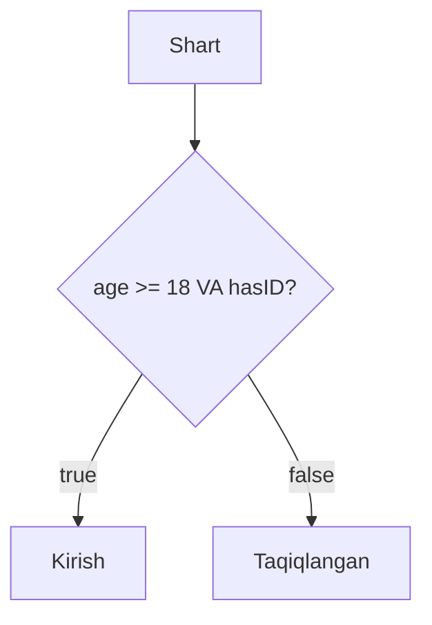

## Operatorlar va massivlar

> **Oldingi dars bilan bog'lanish:** 2-darsda biz o'zgaruvchilar, ma'lumot turlari va qiymatlarni saqlashni o'rgandik. Lekin qiymatlarni saqlash -- bu yarim ish. Endi biz ular bilan **ishlashni** o'rganimiz kerak: taqqoslash, hisoblash, birlashtirish va bir vaqtda bir nechta qiymatni saqlash. Aynan operatorlar va massivlar uchun kerak.

---

## Dars maqsadi

JavaScript operatorlarining turli xillarini (arifmetik, tayinlash, taqqoslash, mantiqiy, inkrement va dekrement) tushunish va massivlar nima, ularni qanday yaratish, elementlarga murojaat qilish, destrukturlashtirishni qo'llash va umumiy metodlarni o'rganish -- dars oxiriga siz ma'lumotlar to'plamlari bilan ishonchli ishlashni bilasiz.

## Dars oxiriga nimalarni bilib qolasiz

- `5 + 3` misolida operandlarni operatorlardan ajratish.
- Arifmetik, tayinlash, taqqoslash, mantiqiy operatorlarni, inkrement va dekrementni qo'llash.
- Nima uchun `===` doimo `==` o'rniga ishlatilishi kerakligini tushunish.
- Olti usulda massiv yaratish, indeks orqali elementlarga murojaat qilish, `length` va `at()` ishlatish, destrukturlashtirishni qo'llash.
- Asosiy metodlarni ishlatish: `push`, `pop`, `unshift`, `shift`, `indexOf`, `lastIndexOf`, `includes`, `join`, `slice`, `splice`, `concat`, `reverse`, `toString`.
- Massivlarni `for`, `for...of` va `forEach` bilan aylanish.

---

## Dars jadvali

| Blok                                          | Kontent                                                                    |
| --------------------------------------------- | -------------------------------------------------------------------------- |
| 1. Operandlar va operatorlar                  | Nima ular, `5 + 3` tahlili                                                 |
| 2. Arifmetik operatorlar                      | `+` `-` `*` `/` `%` `**`                                                   |
| 3. Tayinlash operatorlari                     | `=` `+=` `-=` `*=` `/=` `%=`                                               |
| 4. Taqqoslash operatorlari                    | `>` `<` `>=` `<=` `==` `===` `!=` `!==`                                    |
| 5. Mantiqiy operatorlar                       | `&&` `||` `!`                                                               |
| 6. Inkrement va dekrement                      | `++` `--`, prefiks va postfiks shakllari                                   |
| 7. Massivlar: kirish va yaratish             | Massivlar nima, olti usulda yaratish                                      |
| 8. Elementlarga murojaat va destrukturlashtirish | 0 dan boshlanuvchi indeksatsiya, `length`, `at(-1)`, destrukturlashtirish |
| 9. Massiv metodlari                          | `push`/`pop`, qidirish, `join`, `slice`/`splice` va boshqalar              |
| 10. Massivlarni aylanish                      | `for`, `for...of`, `forEach`                                                |
| 11. Amaliyot                                  | Mashqlar                                                                    |
| 12. Xulosa                                    | Umumiy xulosalar                                                            |

---

## Blok 1. Operandlar va operatorlar

**Oddiy qilib aytganda:** kalkulyatorni tasavvur qiling. Siz kiritgan sonlar (`5` va `3`) -- bu **operandlar**, ya'ni ma'lumotlar. Bosingiz tugma (`+`) -- bu **operator**, ya'ni harakat.

```javascript
5 + 3
```

- `5` -- birinchi operand
- `+` -- operator (qo'shish)
- `3` -- ikkinchi operand

Operatorlar o'zgaruvchilar va har xil ma'lumot turlari bilan ham ishlaydi:

```javascript
let price = 10;
let tax = 2;
let total = price + tax;
console.log(total);

'Assalomu' + ' ' + 'aleykum'
```

JavaScript ifodani hisoblaydi va **natijani** qaytaradi. Ba'zi operatorlar son qaytaradi, ba'zilari satr, taqqoslash va mantiqiy operatorlar esa doimo `true` yoki `false` qaytaradi.

---

## Blok 2. Arifmetik operatorlar

**Oddiy qilib aytganda:** bu maktabda ko'rgan matematik operatorlari -- faqat dasturlash belgilarida yozilgan.

| Operator | Nomi                 | Misol     | Natija                                    |
| -------- | -------------------- | --------- | ----------------------------------------- |
| `+`      | Qo'shish             | `10 + 2`  | `12`                                      |
| `-`      | Ayirish              | `10 - 2`  | `8`                                       |
| `*`      | Ko'paytirish         | `10 * 2`  | `20`                                      |
| `/`      | Bo'lish              | `10 / 2`  | `5`                                       |
| `%`      | Qoldiq (modul)       | `10 % 3`  | `1` (10 / 3 = 3 va qoldiq 1)             |
| `**`     | Darajaga ko'tarish   | `2 ** 3`  | `8` (2 ning 3-darajasi)                   |

```javascript
let a = 15;
let b = 4;
console.log(a + b); // 19
console.log(a % b); // 3
```

**`%` nima uchun foydali?** Sonning juftligini tekshirish (`x % 2 === 0`) yoki oxirgi raqamni olish (`123 % 10 === 3`).

---

## Blok 3. Tayinlash operatorlari

**Oddiy qilib aytganda:** tayinlash operatorlari -- bu qiymatni o'zgaruvchida **saqlash** usuli. Asosiy `=` operatori qiymatni yozadi; tarkibiy shakllar (`+=`, `-=` va boshqalar) qisqa variantlar.

| Operator | Nomi                      | Misol   | Ekvivalenti          |
| -------- | ------------------------- | ------- | -------------------- |
| `=`      | Tayinlash                 | `x = 5` | `x = 5`              |
| `+=`     | Qo'shish va tayinlash     | `x += 3`| `x = x + 3`          |
| `-=`     | Ayirish va tayinlash      | `x -= 2`| `x = x - 2`          |
| `*=`     | Ko'paytirish va tayinlash | `x *= 4`| `x = x * 4`          |
| `/=`     | Bo'lish va tayinlash      | `x /= 2`| `x = x / 2`          |
| `%=`     | Qoldiq va tayinlash       | `x %= 3`| `x = x % 3`          |
| `**=`    | Daraja va tayinlash       | `x **= 2`| `x = x ** 2`        |

```javascript
let score = 10;
score += 5;
console.log(score); // 15

score -= 3;
console.log(score); // 12

score *= 2;
console.log(score); // 24
```

---

## Blok 4. Taqqoslash operatorlari

**Oddiy qilib aytganda:** taqqoslash operatorlari -- bu "ha" yoki "yo'q" javob beradigan savol. Ular doimo `true` (ha) yoki `false` (yo'q) qaytaradi.

| Operator | Ma'nosi                       | Misol         | Natija  |
| -------- | ----------------------------- | ------------- | ------- |
| `>`      | Kattaroq                      | `5 > 3`       | `true`  |
| `<`      | Kichikroq                     | `5 < 3`       | `false` |
| `>=`     | Kattaroq yoki teng            | `5 >= 5`      | `true`  |
| `<=`     | Kichikroq yoki teng           | `5 <= 3`      | `false` |
| `==`     | Teng (tur ajratmasdan)        | `5 == '5'`    | `true`  |
| `===`    | Qat'iy teng (tur ajratib)     | `5 === '5'`   | `false` |
| `!=`     | Teng emas                     | `5 != 3`      | `true`  |
| `!==`    | Qat'iy teng emas              | `5 !== '5'`   | `true`  |

**Doimo `===` va `!==` ishlating.** `==` operatori taqqoslashdan oldin turlarni birlashtiradi, bu kutilmagan natijalarga olib kelishi mumkin. Qat'iy taqqoslash qiymatni va turini tekshiradi.

```javascript
console.log(10 > 5);
console.log(10 === '10');
console.log(10 !== '10');
console.log(0 == '');
console.log(0 === '');
```

---

## Blok 5. Mantiqiy operatorlar

**Oddiy qilib aytganda:** mantiqiy operatorlar bir nechta shartni bitta qarorga birlashtirishga imkon beradi. Ularni kundalik hayotdagi "va", "yoki" va "emas" so'zlari sifatida tasavvur qiling.

| Operator | Nomi | Nima qiladi                            | Misol              | Natija  |
| -------- | ---- | -------------------------------------- | ------------------ | ------- |
| `&&`     | VA    | Ikkala shart ham `true` bo'lishi kerak | `(5 > 3) && (2 < 4)`| `true` |
| `||`     | YOKI  | Kamida bitta shart `true` bo'lishi kerak| `(5 > 10) \|\| (2 < 4)` | `true` |
| `!`      | EMAS | `true` ni `false` ga o'zgartiradi      | `!(5 > 3)`         | `false` |

```javascript
let age = 20;
let hasID = true;

console.log(age >= 18 && hasID); // true
console.log(age >= 18 || hasID); // true
console.log(!hasID);             // false
```

**Operator ustuvorligi:** `!` (EMAS) birinchi hisoblanadi, keyin `&&` (VA), keyin `||` (YOKI). Maqsadingiz aniq bo'lishi uchun qavslardan foydalaning.

```javascript
let temperature = 25;
let isRaining = false;

if (temperature > 20 && !isRaining) {
  console.log('Sayrga chiqish');
}
```



---

## Blok 6. Inkrement va dekrement

**Oddiy qilib aytganda:** inkrement (`++`) o'zgaruvchini 1 ga oshiradi, dekrement (`--`) 1 ga kamaytiradi. Bu `x = x + 1` va `x = x - 1` qisqartmalari.

**Postfiks va prefiks -- muhim farq:**

| Shakl     | Misol   | Nima sodir bo'ladi                                          |
| --------- | ------- | ----------------------------------------------------------- |
| Postfiks  | `y = x++` | X ning eski qiymatini qaytaradi, keyin x ni oshiradi       |
| Prefiks   | `y = ++x` | Avval x ni oshiradi, keyin yangi qiymatini qaytaradi       |

```javascript
let a = 5;
let b = a++;  // b = 5 (eski qiymat), a = 6
console.log(b, a);

let c = 5;
let d = ++c;  // c = 6, d = 6 (yangi qiymat)
console.log(d, c);
```

---

## Blok 7. Massivlar: kirish va yaratish

**Oddiy qilib aytganda:** kitoblar tokchasini tasavvur qiling. Har bir kitobning pozitsiyasi bor (birinchi, ikkinchi, uchinchi...). **Massiv** -- bu tokcha kabi: bitta o'zgaruvchida **ro'yxat** saqlanadi, har biri o'z pozitsiyasi (**indeks**) orqali aniqlanadi.

```javascript
let fruits = ['olma', 'banan', 'apelsin'];
let mixed = [1, 'matn', true, null, [10, 20]];
```

Olti usulda massiv yaratish mumkin. **Literal `[]`** eng ko'p qo'llaniladi.

```javascript
let empty = [];
let fruits = ['olma', 'banan', 'apelsin'];
let nested = [[1, 2], [3, 4]];
```

**Konstruktor `new Array()`** -- bitta son argument **uzunlikni** belgilaydi, qiymatni emas:

```javascript
let arr1 = new Array('olma', 'banan', 'apelsin');
let wrong = new Array(3);
let correct = new Array(3, 4);
```

**`Array.of()`** -- `new Array()` muammosini tuzatadi (bitta son elementga aylanadi):

```javascript
let arr1 = Array.of(5);
let arr2 = Array.of(1, 2, 3);
```

**`Array.from()`** -- iteratsiya qilinadigan ob'ektlarni (satr, Set, Map) o'zgartiradi:

```javascript
let arr1 = Array.from('hello');
let arr2 = Array.from([1, 2, 3], x => x * 2);
```

**`split()`** -- satrni ajratuvchi belgi bo'yicha massivga bo'ladi:

```javascript
let arr1 = 'olma,banan,apelsin'.split(',');
let arr2 = 'salom dunyo'.split(' ');
```

**Spread operator `...`** -- iteratsiya qilinadigan ob'ektni kengaytiradi (massivlarni ham nusxalaydi):

```javascript
let arr1 = [...'hello'];
let original = [1, 2, 3];
let copy = [...original];
```

### Taqqoslash jadvali

| Usul              | Sintaksis                 | Qachon ishlatish                                             |
| ----------------- | ------------------------- | ----------------------------------------------------------- |
| Literal `[]`      | `[1, 2, 3]`              | **Dek deyarli doimo** -- oddroq va tezroq                    |
| `new Array()`     | `new Array(5)`            | Kamdan-kam, bo'sh slotlar uchun                            |
| `Array.of()`      | `Array.of(5)`             | Individual sonlardan massiv yaratish kerak bo'lganda        |
| `Array.from()`    | `Array.from('abc')`       | Iteratsiya qilinadigan ob'ektni o'zgartirganda             |
| `split()`         | `'a,b'.split(',')`        | Satrdan massiv yaratganda                                   |
| `...spread`       | `[...'abc']`              | Nusxa olish yoki kengaytirishning qisqa usuli               |


---

## Blok 8. Elementlarga murojaat va destrukturlashtirish

**Oddiy qilib aytganda:** massivning har bir elementining **indeks** deb ataluvchi raqamli manzili bor, **0** dan boshlanadi. Elementni olish yoki o'zgartirish uchun kvadrat qavslar `[indeks]` ishlatiladi.

### O'qish va o'zgartirish

```javascript
let fruits = ['olma', 'banan', 'apelsin'];

console.log(fruits[0]); // olma
console.log(fruits[1]); // banan
console.log(fruits[5]); // undefined

let colors = ['qizil', 'yashil', 'ko\'k'];
colors[1] = 'sariq';    // ['qizil', 'sariq', 'ko\'k']
```

### `length` xususiyati va oxirgi element

```javascript
let nums = [10, 20, 30];
console.log(nums.length);            // 3
console.log(nums[nums.length - 1]);  // 30
```

### `at()` orqali oxiridan murojaat

```javascript
let letters = ['a', 'b', 'c', 'd'];
console.log(letters.at(-1)); // 'd'
console.log(letters.at(-2)); // 'c'
```

### Destrukturlashtirish

Destrukturlashtirish massiv elementlarini bir qator kodda alohida o'zgaruvchilarga "ochish" imkonini beradi:

```javascript
let fruits = ['olma', 'banan', 'apelsin'];

let [first, second, third] = fruits;
console.log(first); // olma

let [a, , c] = fruits;
console.log(c); // apelsin

let [head, ...tail] = fruits;
console.log(tail); // ['banan', 'apelsin']

let [x, y, z = 10] = [1, 2];
console.log(z); // 10
```

---

## Blok 9. Massiv metodlari

### Elementlarni qo'shish va o'chirish

| Metod                 | Harakat                            | Qaytaradi          | O'zgartiradi? |
| --------------------- | ---------------------------------- | ------------------ | ------------- |
| `push(element)`       | **Oxiriga** qo'shish               | Yangi uzunlik      | Ha           |
| `pop()`               | **Oxiridan** o'chirish             | O'chirilgan element| Ha           |
| `unshift(element)`    | **Boshiga** qo'shish               | Yangi uzunlik      | Ha           |
| `shift()`             | **Boshidan** o'chirish             | O'chirilgan element| Ha           |

```javascript
let stack = [1, 2, 3];

stack.push(4);
console.log(stack); // [1, 2, 3, 4]

stack.pop();
console.log(stack); // [1, 2, 3]

stack.unshift(0);
console.log(stack); // [0, 1, 2, 3]

stack.shift();
console.log(stack); // [1, 2, 3]
```

### Massivda qidirish

```javascript
let letters = ['a', 'b', 'c', 'b'];

console.log(letters.indexOf('b'));      // 1
console.log(letters.lastIndexOf('b'));  // 3
console.log(letters.includes('c'));     // true
```

### Elementlarni satrga birlashtirish

```javascript
let words = ['Salom', 'dunyo'];
console.log(words.join(' '));   // 'Salom dunyo'
console.log(words.join(', '));  // 'Salom, dunyo'
```

### `slice` va `splice` farqi

`slice` asl massivni **o'zgartirmasdan** qisman nusxa yaratadi. `splice` asl massivni **o'zgartiradi**.

```javascript
let nums = [10, 20, 30, 40, 50];
let sliced = nums.slice(1, 4);
console.log(sliced); // [20, 30, 40]
console.log(nums);   // [10, 20, 30, 40, 50]

let items = [1, 2, 3, 4, 5];
let deleted = items.splice(1, 2);
console.log(deleted); // [2, 3]
console.log(items);   // [1, 4, 5]

items.splice(1, 0, 'a', 'b');
console.log(items);   // [1, 'a', 'b', 4, 5]
```

### `concat`, `reverse`, `toString`

```javascript
console.log([1, 2].concat([3, 4]));     // [1, 2, 3, 4]

let nums = [1, 2, 3, 4, 5];
nums.reverse();
console.log(nums);                      // [5, 4, 3, 2, 1]

console.log([1, 2, 3].toString());      // '1,2,3'
```

---

## Blok 10. Massivlarni aylanish

### Usul 1: klassik `for` sikli

```javascript
let fruits = ['olma', 'banan', 'apelsin'];

for (let i = 0; i < fruits.length; i++) {
  console.log(fruits[i]);
}
```

### Usul 2: `for...of` sikli

```javascript
for (let fruit of fruits) {
  console.log(fruit);
}
```

### Usul 3: `forEach` metodi

```javascript
fruits.forEach(function(fruit, index) {
  console.log(index + ': ' + fruit);
});
```

### Operatorlar va massivlar birgalikda

```javascript
let numbers = [5, 12, 7, 20, 3];
let evens = [];

for (let num of numbers) {
  if (num % 2 === 0) evens.push(num);
}
console.log(evens); // [12, 20]

let prices = [100, 200, 300];
for (let i = 0; i < prices.length; i++) {
  prices[i] *= 0.8;
}
console.log(prices); // [80, 160, 240]
```

---

### Klassik xatolar

| Xato                                                          | Qanday tuzatish                                                                    |
| ------------------------------------------------------------- | ---------------------------------------------------------------------------------- |
| `=` (tayinlash) ni `===` (taqqoslash) bilan adashtirish        | `=` qiymatni saqlaydi; `===` taqqoslaydi. Bu har xil narsalar.                      |
| `==` ni `===` o'rniga ishlatish "ishlaydi degan uchun"        | `==` tur xatolarini yashiradi. Doimo `===` ishlating.                              |
| `new Array(3)` ni `[3]` deb kutish                           | Bitta son argument uzunlikni belgilaydi. `Array.of(3)` ishlating.                   |
| Massivlar **0 dan** boshlanishini unutish                     | Birinchi element `0` indeksida, `1` da emas.                                        |

---

## Amaliyot

1. `let scores = [85, 92, 78, 95, 88]` berilgan. O'rtacha ballni hisoblash uchun `for` siklini ishlating.
2. `let words = ['JavaScript', 'zo\'r', 'tarqalmoqda']` berilgan. `'JavaScript zo\'r tarqalmoqda'` satrini olish uchun `join(' ')` ishlating.
3. 5 ta sondan iborat massiv yarating. Oxiriga son qo'shish va boshidan birini o'chirish uchun `push` va `shift` ishlating.
4. `['qizil', 'yashil', 'ko\'k', 'sariq']` massividan birinchi va uchinchi elementlarni olish uchun destrukturlashtirishni ishlating.
5. `[3, 7, 12, 5, 9, 14, 8]` massividagi 10 dan katta barcha sonlarni topib, yangi massivga saqlaydigan sikl yozing.

---

## Dars xulosa

- **Operatorlar** -- bu harakatlar; **operandlar** -- ular qo'llaniladigan qiymatlar.
- Arifmetik operatorlar: `+` `-` `*` `/` `%` `**` -- matematika uchun.
- Tayinlash operatorlari: `=` `+=` `-=` `*=` `/=` `%=` -- qiymatlarni saqlash va yangilash uchun.
- Taqqoslash operatorlari: `>` `<` `>=` `<=` `==` `===` `!=` `!==` -- doimo `true` yoki `false` qaytaradi. **`===` afzal.**
- Mantiqiy operatorlar: `&&` `||` `!` -- shartlarni birlashtirish uchun.
- Inkrement `++` va dekrement `--` qiymatni 1 ga oshiradi yoki kamaytiradi. Postfiks eski qiymatni qaytaradi; prefiks avval o'zgartiradi.
- **Massivlar** tartiblangan qiymatlar ro'yxatini bitta o'zgaruvchida saqlaydi.
- Massivlarni yaratishning olti usuli: literal `[]`, `new Array()`, `Array.of()`, `Array.from()`, `split()`, spread `...`. Literal `[]` tavsiya etiladi.
- Elementlar **0 dan boshlanuvchi indeks** orqali mavjud: `arr[0]`, `arr[1]`. Oxirgi element uchun `at(-1)` ishlating.
- **Destrukturlashtirish** massiv elementlarini bir qator kodda o'zgaruvchilarga ajratadi.
- Asosiy metodlar: `push`/`pop`, `unshift`/`shift`, `indexOf`/`includes`, `join`, `slice`/`splice`, `concat`, `reverse`, `toString`.
- Aylanishning uch usuli: `for`, `for...of`, `forEach`.

---

[Keyingi dars: Ob'ektlar ->](../../Lesson-4/uz/Ob'ektlar.md)
