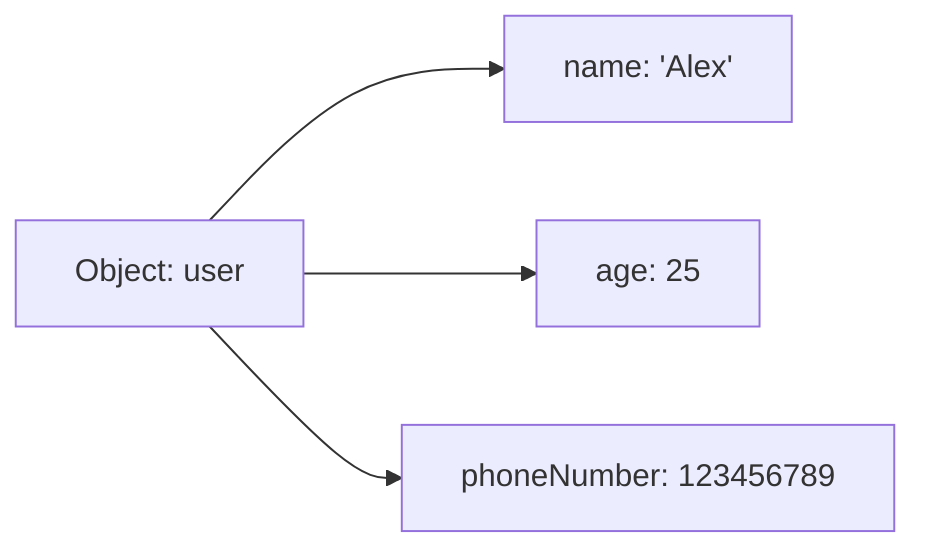
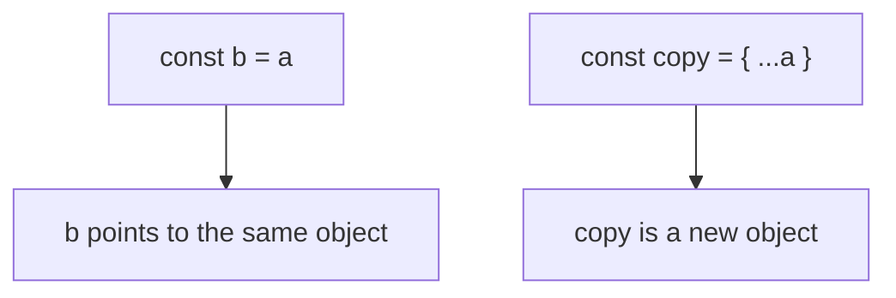

## Objects

> **Connection with the previous lesson:** in the last few lessons we learned about variables and data types, and about arrays. An array stores an *ordered list* of values, each addressed by a number (an index). But real life rarely organises things into numbered lists -- often we want to give each piece of data a *name*. That is exactly what objects are for.

---

## Lesson Goal

Understand what objects are, how to create and read them, how to modify and delete their properties, how to write methods and use `this`, how to iterate over keys, and how to copy objects -- so that by the end of the lesson you can store structured data in a natural, readable way.

## What You Will Learn by the End of the Lesson

- Explain what an object is as a collection of `key: value` pairs.
- Create objects using the `{}` literal syntax.
- Read property values using dot notation and bracket notation, including dynamic keys.
- Modify, add, and delete properties (the `delete` operator).
- Write object methods and use the `this` keyword inside them.
- Iterate over an object's keys with the `for...in` loop.
- Understand that objects are passed by reference and create a shallow copy with the spread operator `{...obj}`.
- Use shorthand property syntax `{ name, age }` and computed property keys `[propName]: value`.
- Check whether a property exists using the `undefined` check, the `in` operator, and `hasOwnProperty()`.

---

## Lesson Timeline

| Block                                  | Content                                              |
| -------------------------------------- | ---------------------------------------------------- |
| 1. What an object is                   | Folder-of-files analogy, `key: value` pairs          |
| 2. Creating an object                  | The `{}` literal, data types of values               |
| 3. Accessing properties                | Dot notation, bracket notation, dynamic keys         |
| 4. Modifying, adding, deleting         | Changing values, adding new, the `delete` operator   |
| 5. Methods and `this`                  | Functions as values, `this` referring to the object  |
| 6. Iterating with `for...in`           | Looping over keys                                    |
| 7. Objects by reference and copies     | Reference semantics, shallow copy `{...obj}`         |
| 8. Shorthand and computed keys         | `{ name, age }`, `[propName]: value`                 |
| 9. Checking property existence         | `undefined`, `in`, `hasOwnProperty()`                 |
| 10. Practice and summary               | Hands-on exercises, recap and key takeaways            |

---

## Block 1. What an Object Is

**In simple terms:** imagine a folder in a filing cabinet. The folder has a **label** written on its tab -- for example, "Alex" -- and inside it there are papers with the actual data: his age, phone number, height. An **object** in JavaScript works the same way: it is a collection of pairs "**label: content**", where the label is called a **key** (or property name) and the content is called a **value**.

Expand the analogy: a single folder can hold a number (age), a line of text (name), a list (friends), or even another folder with its own label (a nested object). JavaScript objects are exactly this flexible -- a value can be any data type.

Key facts:

- A **key** (property name) is always a string (or a `Symbol`).
- A **value** can be any type: a number, a string, an array, a function (then it is called a *method*), another object, and so on.

```javascript
let user = {
    name: 'Alex',
    age: 25
};
```

Read this as: "the object `user` stores the key `name` with the value `'Alex'`, and the key `age` with the value `25`."



---

## Block 2. Creating an Object

The most common way to create an object is the **object literal** -- curly braces `{}`.

```javascript
let user = {
    name: 'Alex',
    age: 25,
    height: 1.8,
    phoneNumber: 123456789
};
```

Notes:

- Keys (property names) go before the colon `:`; values after it.
- Each pair is separated from the next by a comma `,`.
- An empty object is written as `{}`: `let emptyObject = {};`

You can also mix different value types inside one object:

```javascript
let car = {
    brand: 'Toyota',
    model: 'Camry',
    year: 2020,
    available: true,
    owners: ['Ann', 'Bob']
};
```

Here `owners` is an array -- objects and arrays combine naturally to describe real-world data.

---

## Block 3. Accessing Properties

**In simple terms:** once the data is stored in the folder, you need a way to open it and look at a specific sheet. JavaScript gives you two tools: the **dot notation** (`.`) and the **bracket notation** (`[]`).

### Method 1: Dot Notation (`.`) -- used when you know the exact key name

```javascript
let car = {
    brand: 'Toyota',
    model: 'Camry',
    year: 2020
};

console.log(car.brand); // 'Toyota'
console.log(car.year);  // 2020
```

### Method 2: Bracket Notation (`[]`)

Used when:

- The key name is stored in a **variable**.
- The key name contains **spaces or special characters**.

```javascript
console.log(car['model']); // 'Camry'

const key = 'year';
console.log(car[key]);     // 2020 (key here is a variable!)
```

The difference is important: `car.key` would literally look for a key named `key`, while `car[key]` evaluates the variable `key` first and looks up whatever name it holds.

Bracket notation also allows keys with spaces:

```javascript
let book = {
    'author name': 'J. Rowling',
    pages: 400
};

console.log(book['author name']); // 'J. Rowling'
```

---

## Block 4. Modifying, Adding, and Deleting Properties

**In simple terms:** objects are like a folder you can edit freely -- take out a sheet (change a value), put in a new sheet (add a property), or throw a sheet away (delete a property).

### Change or add: the syntax is the same -- assignment

```javascript
let car = {
    brand: 'Toyota',
    year: 2020
};

car.year = 2025;      // Changed: the year is now 2025
car.color = 'red';    // Added: a new 'color' property appears
console.log(car);     // { brand: 'Toyota', year: 2025, color: 'red' }
```

### Delete a property with `delete`

The `delete` operator removes a property entirely. After deletion, reading the property gives `undefined`.

```javascript
let car = {
    brand: 'Toyota',
    isNew: true,
    year: 2020
};

delete car.isNew;
console.log(car.isNew); // undefined (the property is gone)
```

### Common Beginner Mistakes

| Error                                                        | How to Fix                                                            |
| ------------------------------------------------------------ | --------------------------------------------------------------------- |
| Reading a property that doesn't exist and expecting an error | No error happens -- you simply get `undefined`. Check with `in` first |
| Forgetting the difference between `car.key` and `car[key]`   | `car.key` looks for a literal key `key`; `car[key]` uses the variable |
| Expecting `delete` to also delete the value's memory         | `delete` only removes the property from the object                    |

---

## Block 5. Object Methods and `this`

**In simple terms:** if a property's value is a **function**, we call it a **method**. The object then not only stores data -- it can also *do* things with that data. To look at itself, the method uses the special keyword `this`, which refers to the object itself.

```javascript
const person = {
    name: 'Alice',
    age: 30,

    greet: function() {
        console.log('Hello, my name is ' + this.name);
    },

    sayAge() {
        console.log('I am ' + this.age);
    }
};

person.greet(); // Hello, my name is Alice
person.sayAge(); // I am 30
```

**Key idea:** `this` inside a method points to the object on which the method was called. So inside `greet`, `this.name` is the same as `person.name`. `greet: function() { ... }` is the classic form; `sayAge() { ... }` is the modern shorthand -- both work identically.

---

## Block 6. Iterating Over an Object with `for...in`

**In simple terms:** sometimes you need to look through every sheet in the folder. The `for...in` loop walks through all the keys of the object one by one.

```javascript
const user = { name: 'John', age: 25, city: 'NY' };

for (let key in user) {
    console.log(key + ': ' + user[key]);
}
// Output:
// name: John
// age: 25
// city: NY
```

Notes:

- The loop variable `key` takes the name of each property, so inside the loop we **must** use bracket notation `user[key]` -- `user.key` would look for a literal key named `key`.
- Here `in` means "is a key of the object", which differs from its use in the checking section below.

---

## Block 7. Objects Are Passed by Reference

**In simple terms:** this is where two identical-looking pieces of paper behave very differently. If you write down a *number* on a sticky note and copy it to another, you get two independent copies -- changing one doesn't affect the other. But an object is more like a **single folder in the file cabinet**: when you "copy" it, you don't make a second folder; you just make another label that points to the **same folder**.

This is the **most common beginner mistake** with objects: assigning `const b = a` copies the *reference* (the pointer to the memory location), not the object itself -- only **one** real object exists in memory.

```javascript
const a = { value: 10 };
const b = a;   // b now points to the SAME object as a

b.value = 20;

console.log(a.value); // 20 (changed!)
console.log(b.value); // 20
```

### How to make a real copy: the spread operator `{...obj}`

```javascript
const a = { value: 10 };
const copy = { ...a };   // spread operator -- shallow copy

copy.value = 99;

console.log(a.value);    // 10 (a is unchanged)
console.log(copy.value); // 99
```

**Important:** `{...a}` is a **shallow** copy -- it copies the top-level properties, but nested objects are still shared by reference.



### Common Beginner Mistakes

| Error                                                          | How to Fix                                                            |
| -------------------------------------------------------------- | --------------------------------------------------------------------- |
| Thinking `const b = a` creates a copy                           | It copies a reference. Use `{ ...a }` for a real copy                 |
| Expecting `delete` to free all memory                          | `delete` removes the property, not the underlying value automatically |
| Forgetting that nested objects stay shared in a shallow copy   | For deep copies you need to copy each nested level                     |

---

## Block 8. Shorthand Properties and Computed Keys

### Shorthand property syntax

**In simple terms:** often you have a variable and you want to store it under a property with the *same name*. JavaScript provides a shortcut: you can write the key and the variable together.

```javascript
const name = 'Bob';
const age = 22;

// Instead of: { name: name, age: age }
const user = { name, age };

console.log(user); // { name: 'Bob', age: 22 }
```

This works because the shorthand `{ name }` means `{ name: name }`.

### Computed property keys

**In simple terms:** normally you write key names literally when creating an object. But what if the key name itself is dynamic -- stored in a variable? You can put the key name inside **square brackets** `[]`, and JavaScript will evaluate it and use the result as the key. This is called a **computed property key**.

```javascript
const propName = 'color';
const obj = {
    [propName]: 'blue'   // the key will be 'color'
};

console.log(obj.color); // 'blue'
```

The brackets tell JavaScript: "evaluate `propName` first, then use whatever it contains as the key name."

---

## Block 9. Checking Whether a Property Exists

**In simple terms:** before you use a property, it's often wise to confirm it exists -- especially with data that came from outside. JavaScript gives you three ways, using `const obj = { a: 1 }` as an example.

### Method 1: Compare to `undefined`

Read the property and check it's not `undefined`:

```javascript
if (obj.a !== undefined) {
    // the property 'a' exists
}
```

This is simple, but it has a subtle flaw: a property may exist yet still hold `undefined` as an explicit value.

### Method 2: The `in` operator

The `in` operator checks whether a key exists in the object -- a stricter, more reliable check:

```javascript
if ('a' in obj) {
    // the property 'a' exists
}
```

Note: `'a'` here is a **string** (the key name), and `in` checks it as a key of the object.

### Method 3: `hasOwnProperty()`

This method checks that the property is the object's **own** property and not inherited from its prototype:

```javascript
if (obj.hasOwnProperty('a')) {
    // the property 'a' is owned by obj itself
}
```

### Comparison Table

| Method             | Syntax                              | Best for                                   |
| ------------------ | ----------------------------------- | ------------------------------------------ |
| `undefined` check  | `if (obj.a !== undefined)`          | Quick check, most common case              |
| `in` operator      | `if ('a' in obj)`                   | A stricter check, including inherited keys |
| `hasOwnProperty()` | `if (obj.hasOwnProperty('a'))`      | Ensuring the property is own, not inherited|

---

## Practice

1. Create an object `user` with properties `name`, `age`, and `hobby`. Read each of them using dot notation.
2. Add a new property `city` to the object, change `age`, then delete `hobby`. Print the object and confirm the property is gone.
3. Create an object `car` with a `describe()` method that prints its brand and year using `this`.
4. Using `for...in`, print all keys and values of the `user` object you built.
5. Create `const obj1 = { count: 5 }`. Assign `const obj2 = obj1`, then change `obj2.count` -- check `obj1`. Now build `const obj3 = { ...obj1 }` and repeat -- notice the difference.
6. Use shorthand syntax to build `{ name, age }` from two variables, and a computed key `[keyName]: value` where `keyName` is a variable.
7. For `const o = { x: 1 }`, check the existence of `x` and of a missing key using all three methods: the `undefined` check, the `in` operator, and `hasOwnProperty()`.

---

## Lesson Summary

- An **object** is a collection of `{ key: value }` pairs -- like a folder of labeled files.
- Create objects with the **literal** `{}`: `{ key: value, key: value }`.
- Reading properties: **dot notation** `obj.key` and **bracket notation** `obj['key']`. Use brackets when the key is in a variable or has special characters.
- Change, add (same assignment syntax), and delete (`delete obj.key`) properties.
- A function stored as a property is a **method**; inside a method, **`this`** refers to the object itself.
- The **`for...in`** loop iterates over an object's keys -- remember to use `obj[key]` inside it.
- Objects are **passed by reference**: `const b = a` shares the same object. Use the spread `{...obj}` for a **shallow** copy.
- **Shorthand** `{ name, age }` and **computed keys** `[propName]: value` make creating objects more convenient.
- To check a property's existence: the `undefined` check, the `in` operator, or `hasOwnProperty()`.

> **Remember:** an object is a collection `{ key: value }`, accessible by dot or brackets, and mutated by reference.

---

[Next lesson: Conditional Statements ->](../../Lesson-5/en/Conditional%20Statements.md)
