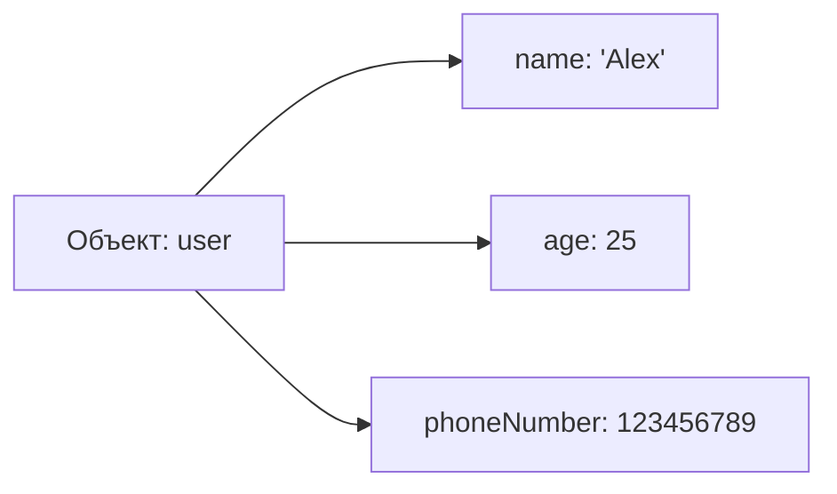
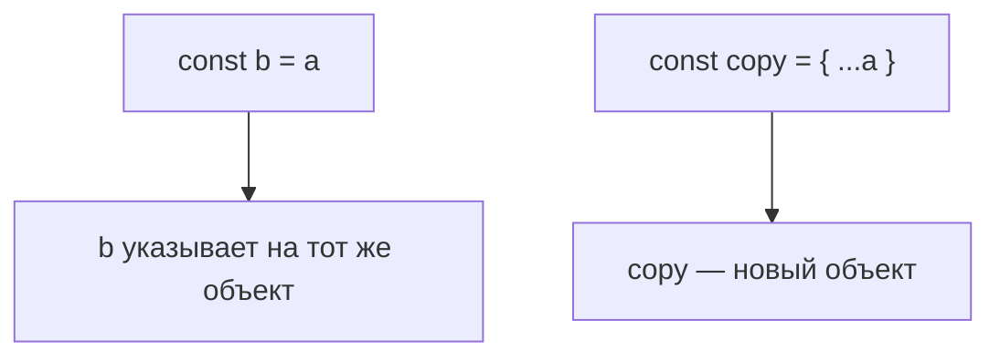

## Объекты

> **Связь с предыдущим уроком:** в прошлых уроках мы узнали о переменных, типах данных и массивах. Массив хранит *упорядоченный список* значений, каждое из которых адресуется числом (индексом). Но в реальной жизни данные редко организуются в нумерованные списки — часто мы хотим дать каждому фрагменту данных *имя*. Именно для этого и нужны объекты.

---

## Цель урока

Понять, что такое объекты, как их создавать и читать, как изменять и удалять свойства, как писать методы и использовать `this`, как перебирать ключи и копировать объекты — чтобы к концу урока вы могли хранить структурированные данные естественным и понятным способом.

## Что вы узнаете к концу урока

- Объяснить, что такое объект как набор пар «ключ: значение».
- Создавать объекты с помощью литерала `{}`.
- Читать значения свойств через точечную и квадратную нотацию, включая динамические ключи.
- Изменять, добавлять и удалять свойства (оператор `delete`).
- Писать методы объекта и использовать ключевое слово `this` внутри них.
- Перебирать ключи объекта с помощью цикла `for...in`.
- Понимать, что объекты передаются по ссылке, и создавать поверхностную копию с помощью оператора spread `{...obj}`.
- Использовать сокращённый синтаксис `{ name, age }` и вычисляемые ключи `[propName]: value`.
- Проверять существование свойства с помощью проверки на `undefined`, оператора `in` и метода `hasOwnProperty()`.

---

## Хронология урока

| Блок | Содержание |
| --- | --- |
| 1. Что такое объект | Аналогия с папкой с файлами, пары «ключ: значение» |
| 2. Создание объекта | Литерал `{}`, типы данных значений |
| 3. Доступ к свойствам | Точечная нотация, квадратная нотация, динамические ключи |
| 4. Изменение, добавление, удаление | Изменение значений, добавление новых, оператор `delete` |
| 5. Методы и `this` | Функции как значения, `this`, ссылающийся на объект |
| 6. Цикл `for...in` | Перебор ключей |
| 7. Объекты по ссылке и копии | Семантика ссылки, поверхностная копия `{...obj}` |
| 8. Сокращения и вычисляемые ключи | `{ name, age }`, `[propName]: value` |
| 9. Проверка существования свойства | `undefined`, `in`, `hasOwnProperty()` |
| 10. Практика и итоги | Упражнения, ключевые выводы |

---

## Блок 1. Что такое объект

**Простыми словами:** представьте папку в картотеке. На корешке папки написана **наклейка** — например, «Алекс», а внутри лежат листы с реальными данными: его возраст, номер телефона, рост. **Объект** в JavaScript работает так же: это набор пар «**наклейка: содержимое**», где наклейка называется **ключом** (или именем свойства), а содержимое — **значением**.

Разовьём аналогию: в одну папку можно положить что угодно — число (возраст), строку (имя), список (друзей) или даже другую папку со своей наклейкой (вложенный объект). Объекты JavaScript именно так гибки — значением может быть любой тип данных.

Ключевые факты:

- **Ключ** (имя свойства) — всегда строка (или `Symbol`).
- **Значение** — может быть любым типом: число, строка, массив, функция (тогда это *метод*), другой объект и т.д.

```javascript
let user = {
    name: 'Alex',
    age: 25
};
```

Прочитаем так: «объект `user` хранит ключ `name` со значением `'Alex'` и ключ `age` со значением `25`».



---

## Блок 2. Создание объекта

Самый распространённый способ создать объект — **литерал объекта**: фигурные скобки `{}`.

```javascript
let user = {
    name: 'Alex',
    age: 25,
    height: 1.8,
    phoneNumber: 123456789
};
```

Замечания:

- Ключи (имена свойств) пишутся перед двоеточием `:`; значения — после него.
- Каждая пара отделяется от следующей запятой `,`.
- Пустой объект записывается как `{}`: `let emptyObject = {};`

В одном объекте можно смешивать разные типы значений:

```javascript
let car = {
    brand: 'Toyota',
    model: 'Camry',
    year: 2020,
    available: true,
    owners: ['Ann', 'Bob']
};
```

Здесь `owners` — это массив: объекты и массивы естественным образом сочетаются для описания реальных данных.

---

## Блок 3. Доступ к свойствам

**Простыми словами:** когда данные положены в папку, нужен способ открыть её и посмотреть конкретный лист. JavaScript даёт два инструмента: **точечную нотацию** (`.`) и **квадратные скобки** (`[]`).

### Способ 1: Точечная нотация (`.`) — когда вы точно знаете имя ключа

```javascript
let car = {
    brand: 'Toyota',
    model: 'Camry',
    year: 2020
};

console.log(car.brand); // 'Toyota'
console.log(car.year);  // 2020
```

### Способ 2: Квадратные скобки (`[]`)

Используются, когда:

- Имя ключа хранится в **переменной**.
- Имя ключа содержит **пробелы или спецсимволы**.

```javascript
console.log(car['model']); // 'Camry'

const key = 'year';
console.log(car[key]);     // 2020 (key — это переменная!)
```

Разница важна: `car.key` дословно ищет ключ с именем `key`, а `car[key]` сначала вычисляет переменную `key` и ищет то имя, которое она хранит.

Квадратные скобки также позволяют ключи с пробелами:

```javascript
let book = {
    'author name': 'J. Rowling',
    pages: 400
};

console.log(book['author name']); // 'J. Rowling'
```

---

## Блок 4. Изменение, добавление и удаление свойств

**Простыми словами:** объект — это папка, которую можно свободно редактировать: достать лист (изменить значение), положить новый лист (добавить свойство) или выбросить лист (удалить свойство).

### Изменить или добавить: синтаксис один — присваивание

```javascript
let car = {
    brand: 'Toyota',
    year: 2020
};

car.year = 2025;      // Изменили: теперь год 2025
car.color = 'red';    // Добавили: появилось новое свойство 'color'
console.log(car);     // { brand: 'Toyota', year: 2025, color: 'red' }
```

### Удалить свойство оператором `delete`

Оператор `delete` полностью удаляет свойство. После удаления чтение свойства даёт `undefined`.

```javascript
let car = {
    brand: 'Toyota',
    isNew: true,
    year: 2020
};

delete car.isNew;
console.log(car.isNew); // undefined (свойства больше нет)
```

### Типичные ошибки новичков

| Ошибка | Как исправить |
| --- | --- |
| Читать несуществующее свойство и ждать ошибку | Ошибки не будет — просто получите `undefined`. Лучше проверить через `in` |
| Путать `car.key` и `car[key]` | `car.key` ищет ключ с именем `key`; `car[key]` использует переменную |
| Ожидать, что `delete` освободит память значения | `delete` лишь убирает свойство из объекта |

---

## Блок 5. Методы объекта и `this`

**Простыми словами:** если значением свойства является **функция**, её называют **методом**. Тогда объект не только хранит данные — он ещё и умеет с ними *работать*. Чтобы «посмотреть на себя», метод использует специальное ключевое слово `this`, которое ссылается на сам объект.

```javascript
const person = {
    name: 'Alice',
    age: 30,

    greet: function() {
        console.log('Hello, my name is ' + this.name);
    },

    sayAge() {
        console.log('I am ' + this.age);
    }
};

person.greet();   // Hello, my name is Alice
person.sayAge();  // I am 30
```

**Ключевая идея:** `this` внутри метода указывает на объект, на котором метод был вызван. То есть внутри `greet` `this.name` — то же самое, что `person.name`. `greet: function() { ... }` — классическая форма; `sayAge() { ... }` — современное сокращение. Обе работают одинаково.

---

## Блок 6. Перебор свойств объекта: `for...in`

**Простыми словами:** иногда нужно просмотреть каждый лист в папке. Цикл `for...in` по очереди проходит по всем ключам объекта.

```javascript
const user = { name: 'John', age: 25, city: 'NY' };

for (let key in user) {
    console.log(key + ': ' + user[key]);
}
// Вывод:
// name: John
// age: 25
// city: NY
```

Замечания:

- Переменная цикла `key` принимает имя каждого свойства, поэтому внутри цикла **обязательно** использовать квадратные скобки `user[key]` — `user.key` искал бы ключ с буквальным именем `key`.
- Здесь `in` означает «является ключом объекта» — это отличается от его использования при проверке ниже.

---

## Блок 7. Объекты передаются по ссылке

**Простыми словами:** здесь два внешне одинаковых действия ведут себя очень по-разному. Если вы записали *число* на стикер и переписали его на другой, у вас две независимые копии — изменение одной не влияет на другую. А объект больше похож на **единственную папку в картотеке**: когда вы её «копируете», вторая папка не создаётся — просто появляется ещё одна наклейка, указывающая на **ту же самую папку**.

Это самая частая ошибка новичков: присваивание `const b = a` копирует *ссылку* (указатель на место в памяти), а не сам объект — в памяти существует только **один** реальный объект.

```javascript
const a = { value: 10 };
const b = a;   // b теперь указывает на ТОТ ЖЕ объект, что и a

b.value = 20;

console.log(a.value); // 20 (изменилось!)
console.log(b.value); // 20
```

### Как сделать настоящую копию: оператор spread `{...obj}`

```javascript
const a = { value: 10 };
const copy = { ...a };   // оператор spread — поверхностная копия

copy.value = 99;

console.log(a.value);    // 10 (a не изменился)
console.log(copy.value); // 99
```

**Важно:** `{...a}` — это **поверхностная** копия — она копирует свойства верхнего уровня, но вложенные объекты по-прежнему передаются по ссылке.



### Типичные ошибки новичков

| Ошибка | Как исправить |
| --- | --- |
| Считать, что `const b = a` создаёт копию | Копируется ссылка. Для настоящей копии используйте `{ ...a }` |
| Ожидать, что `delete` освободит всю память | `delete` убирает свойство, а не автоматически освобождает значение |
| Забывать, что во вложенных объектах поверхностная копия делит их по ссылке | Для глубокой копии нужно копировать каждый вложенный уровень |

---

## Блок 8. Сокращённые свойства и вычисляемые ключи

### Сокращённый синтаксис свойств

**Простыми словами:** часто у вас есть переменная, которую нужно сохранить под свойством с *тем же именем*. JavaScript предлагает сокращение: можно написать ключ и переменную вместе.

```javascript
const name = 'Bob';
const age = 22;

// Вместо: { name: name, age: age }
const user = { name, age };

console.log(user); // { name: 'Bob', age: 22 }
```

Это работает потому, что сокращение `{ name }` означает `{ name: name }`.

### Вычисляемые ключи (динамические ключи)

**Простыми словами:** обычно при создании объекта имена ключей пишутся буквально. Но что, если имя ключа само динамично — хранится в переменной? Можно заключить имя ключа в **квадратные скобки** `[]`, и JavaScript вычислит выражение, а результат использует как ключ. Это называется **вычисляемым ключом**.

```javascript
const propName = 'color';
const obj = {
    [propName]: 'blue'   // ключом будет 'color'
};

console.log(obj.color); // 'blue'
```

Квадратные скобки сообщают JavaScript: «сначала вычисли `propName`, затем используй то, что он содержит, как имя ключа».

---

## Блок 9. Проверка существования свойства

**Простыми словами:** прежде чем использовать свойство, часто разумно убедиться, что оно существует — особенно для данных, пришедших извне. JavaScript даёт три способа, рассмотрим на примере `const obj = { a: 1 }`.

### Способ 1: Сравнение с `undefined`

Прочитайте свойство и проверьте, что оно не равно `undefined`:

```javascript
if (obj.a !== undefined) {
    // свойство 'a' существует
}
```

Это просто, но имеет тонкий недостаток: свойство может существовать и при этом явно хранить значение `undefined`.

### Способ 2: Оператор `in`

Оператор `in` проверяет, существует ли ключ в объекте — более строгая и надёжная проверка:

```javascript
if ('a' in obj) {
    // свойство 'a' существует
}
```

Заметьте: `'a'` здесь — это **строка** (имя ключа), а `in` проверяет её как ключ объекта.

### Способ 3: Метод `hasOwnProperty()`

Этот метод проверяет, что свойство является **собственным** свойством объекта, а не унаследованным от его прототипа:

```javascript
if (obj.hasOwnProperty('a')) {
    // свойство 'a' принадлежит самому obj
}
```

### Сравнительная таблица

| Способ | Синтаксис | Для чего лучше |
| --- | --- | --- |
| Проверка на `undefined` | `if (obj.a !== undefined)` | Быстрая проверка, самый частый случай |
| Оператор `in` | `if ('a' in obj)` | Более строгая проверка, включая наследуемые ключи |
| Метод `hasOwnProperty()` | `if (obj.hasOwnProperty('a'))` | Убедиться, что свойство своё, а не унаследованное |

---

## Практика

1. Создайте объект `user` со свойствами `name`, `age` и `hobby`. Прочитайте каждое через точечную нотацию.
2. Добавьте объекту новое свойство `city`, измените `age`, затем удалите `hobby`. Выведите объект и убедитесь, что свойство исчезло.
3. Создайте объект `car` с методом `describe()`, который через `this` выводит его марку и год.
4. С помощью `for...in` выведите все ключи и значения созданного объекта `user`.
5. Создайте `const obj1 = { count: 5 }`. Присвойте `const obj2 = obj1`, затем измените `obj2.count` — проверьте `obj1`. Теперь создайте `const obj3 = { ...obj1 }` и повторите — обратите внимание на разницу.
6. Используя сокращённый синтаксис, соберите `{ name, age }` из двух переменных, а вычисляемым ключом `[keyName]: value` — из переменной `keyName`.
7. Для `const o = { x: 1 }` проверьте существование `x` и отсутствующего ключа всеми тремя способами: проверкой на `undefined`, оператором `in` и `hasOwnProperty()`.

---

## Итоги урока

- **Объект** — это набор пар `{ ключ: значение }` — как папка с подписанными файлами.
- Создаются объекты **литералом** `{}`: `{ key: value, key: value }`.
- Чтение свойств: **точечная нотация** `obj.key` и **квадратные скобки** `obj['key']`. Скобки используйте, когда ключ в переменной или содержит спецсимволы.
- Свойства можно изменять и добавлять (один и тот же синтаксис присваивания) и удалять (`delete obj.key`).
- Функция, хранящаяся как свойство, — это **метод**; внутри метода **`this`** ссылается на сам объект.
- Цикл **`for...in`** перебирает ключи объекта — не забывайте внутри использовать `obj[key]`.
- Объекты **передаются по ссылке**: `const b = a` делит один объект. Для **поверхностной** копии используйте spread `{...obj}`.
- **Сокращение** `{ name, age }` и **вычисляемые ключи** `[propName]: value` делают создание объектов удобнее.
- Существование свойства проверяют: проверкой на `undefined`, оператором `in` или `hasOwnProperty()`.

> **Главное запомнить:** объект — это коллекция `{ ключ: значение }`, доступ по точке или скобкам, мутации по ссылке.

---

[Следующий урок: Условные конструкции →](../../Lesson-5/ru/Условные%20конструкции.md)