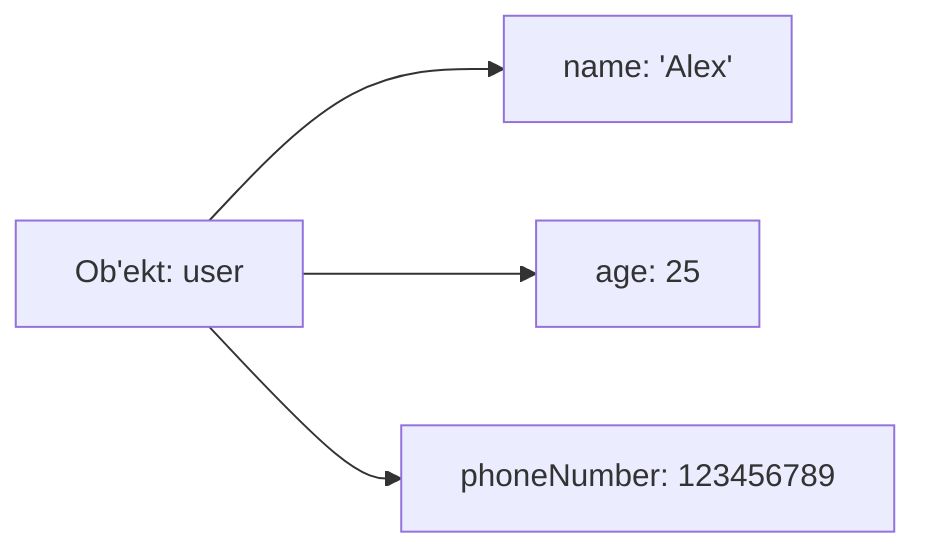
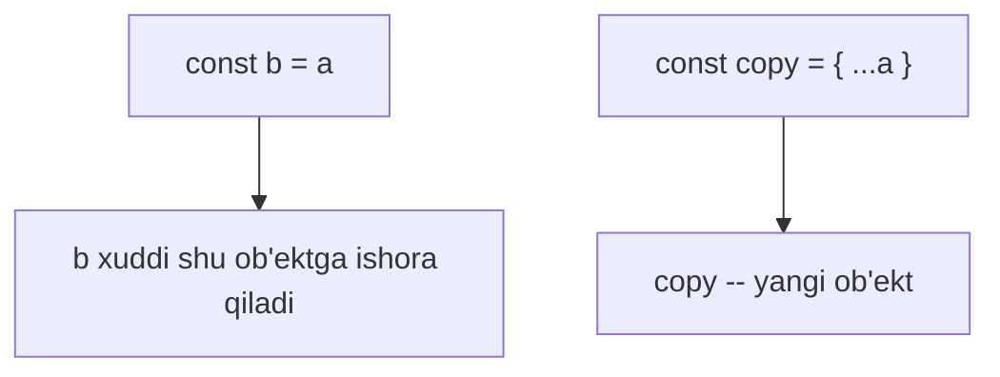

## Ob'ektlar

> **Oldingi dars bilan bog'lanish:** o'tgan darslarda biz o'zgaruvchilar, ma'lumot turlari va massivlar haqida o'rgandik. Massiv qiymatlarning *tartiblangan ro'yxatini* saqlaydi, ularning har biri raqam (indeks) orqali belgilanadi. Lekin real hayotda ma'lumotlar kamdan-kam raqamlangan ro'yxat shaklida bo'ladi -- ko'pincha biz har bir ma'lumotga *nom* berishni xohlaymiz. Aynan shuning uchun ob'ektlar kerak.

---

## Dars maqsadi

Ob'ektlar nima ekanini, ularni qanday yaratish va o'qish, xossalarni o'zgartirish va o'chirish, metodlar yozish va `this` ni ishlatish, kalitlarni aylanib chiqish va ob'ektlarni nusxalashni tushunish -- dars oxiriga siz strukturalangan ma'lumotlarni tabiiy va tushunarli usulda saqlay olasiz.

## Dars oxiriga nimalarni bilib qolasiz

- Ob'ekt nima ekanini `kalit: qiymat` juftliklari to'plami sifatida tushuntirish.
- `{}` literal yordamida ob'ekt yaratish.
- Xossa qiymatlarini nuqtali va kvadrat qavs notatsiyalari orqali, shu jumladan dinamik kalitlar bilan o'qish.
- Xossalarni o'zgartirish, qo'shish va o'chirish (`delete` operatori).
- Ob'ekt metodlarini yozish va ularda `this` kalit so'zini ishlatish.
- `for...in` sikli bilan ob'ekt kalitlarini aylanib chiqish.
- Ob'ektlar havola (reference) orqali uzatilishini tushunish va `{...obj}` spread operatori bilan yuzaki nusxa olish.
- Qisqa sintaksis `{ name, age }` va hisoblanadigan kalitlarni `[propName]: value` ishlatish.
- Xossaning mavjudligini `undefined` tekshiruvi, `in` operatori va `hasOwnProperty()` orqali tekshirish.

---

## Dars jadvali

| Blok | Kontent |
| --- | --- |
| 1. Ob'ekt nima | Fayllar papkasi o'xshashligi, `kalit: qiymat` juftliklari |
| 2. Ob'ekt yaratish | `{}` literal, qiymatlarning ma'lumot turlari |
| 3. Xossalarga murojaat | Nuqtali notatsiya, kvadrat qavs notatsiyasi, dinamik kalitlar |
| 4. O'zgartirish, qo'shish, o'chirish | Qiymatni o'zgartirish, yangi qo'shish, `delete` operatori |
| 5. Metodlar va `this` | Funksiyalar qiymat sifatida, ob'ektga murojaat qiluvchi `this` |
| 6. `for...in` sikli | Kalitlarni aylanib chiqish |
| 7. Havola orqali ob'ektlar va nusxalar | Havola semantikasi, `{...obj}` yuzaki nusxasi |
| 8. Qisqartmalar va hisoblanadigan kalitlar | `{ name, age }`, `[propName]: value` |
| 9. Xossa mavjudligini tekshirish | `undefined`, `in`, `hasOwnProperty()` |
| 10. Amaliyot va xulosa | Mashqlar, umumiy xulosalar |

---

## Blok 1. Ob'ekt nima

**Oddiy qilib aytganda:** kartotekadagi papkani tasavvur qiling. Papkaning chetida **yorliq** yozilgan -- masalan, "Alex" -- ichida esa haqiqiy ma'lumotlar yozilgan varaqlar: uning yoshi, telefon raqami, bo'yi. **Ob'ekt** JavaScriptda xuddi shunday ishlaydi: bu "**yorliq: tarkib**" juftliklari to'plami, bunda yorliq **kalit** (yoki xossa nomi), tarkib esa **qiymat** deb ataladi.

Keling, o'xshashlikni kengaytiraylik: bitta papkaga istalgan narsani solish mumkin -- son (yosh), matn qatori (ism), ro'yxat (do'stlar) yoki hatto o'z yorlig'i bo'lgan boshqa papka (ichma-ich ob'ekt). JavaScript ob'ektlari aynan shunday moslashuvchan -- qiymat istalgan ma'lumot turi bo'lishi mumkin.

Asosiy faktlar:

- **Kalit** (xossa nomi) -- doimo satr (yoki `Symbol`).
- **Qiymat** -- istalgan tur bo'lishi mumkin: son, satr, massiv, funksiya (unda u *metod* deyiladi), boshqa ob'ekt va hokazo.

```javascript
let user = {
    name: 'Alex',
    age: 25
};
```

Buni shunday o'qiymiz: "`user` ob'ekti `name` kalitini `'Alex'` qiymati va `age` kalitini `25` qiymati bilan saqlaydi".



---

## Blok 2. Ob'ekt yaratish

Ob'ekt yaratishning eng keng tarqalgan usuli -- **ob'ekt literali**: figurali qavslar `{}`.

```javascript
let user = {
    name: 'Alex',
    age: 25,
    height: 1.8,
    phoneNumber: 123456789
};
```

Eslatmalar:

- Kalitlar (xossa nomlari) ikki nuqta `:` dan oldin yoziladi; qiymatlar undan keyin.
- Har bir juftlik keyingisidan vergul `,` bilan ajratiladi.
- Bo'sh ob'ekt `{}` ko'rinishida yoziladi: `let emptyObject = {};`

Bitta ob'ektda turli ma'lumot turlarini aralashtirish mumkin:

```javascript
let car = {
    brand: 'Toyota',
    model: 'Camry',
    year: 2020,
    available: true,
    owners: ['Ann', 'Bob']
};
```

Bu yerda `owners` -- massiv: ob'ektlar va massivlar real ma'lumotlarni tavsiflashda tabiiy ravishda birlashadi.

---

## Blok 3. Xossalarga murojaat

**Oddiy qilib aytganda:** ma'lumotlar papkaga solingach, uni ochib, aniq varaqni ko'rish usuli kerak. JavaScript ikkita vositani beradi: **nuqtali notatsiya** (`.`) va **kvadrat qavslar** (`[]`).

### Usul 1: Nuqtali notatsiya (`.`) -- kalit nomini aniq bilganingizda

```javascript
let car = {
    brand: 'Toyota',
    model: 'Camry',
    year: 2020
};

console.log(car.brand); // 'Toyota'
console.log(car.year);  // 2020
```

### Usul 2: Kvadrat qavslar (`[]`)

Quyidagi hollarda ishlatiladi:

- Kalit nomi **o'zgaruvchida** saqlanganda.
- Kalit nomi **probellar yoki maxsus belgilar** o'z ichiga olganda.

```javascript
console.log(car['model']); // 'Camry'

const key = 'year';
console.log(car[key]);     // 2020 (key -- o'zgaruvchi!)
```

Farq muhim: `car.key` so'zma-so'z `key` nomli kalitni qidiradi, `car[key]` esa avval `key` o'zgaruvchisini hisoblab, u saqlagan nomni qidiradi.

Kvadrat qavslar probelli kalitlarga ham imkon beradi:

```javascript
let book = {
    'author name': 'J. Rowling',
    pages: 400
};

console.log(book['author name']); // 'J. Rowling'
```

---

## Blok 4. Xossalarni o'zgartirish, qo'shish va o'chirish

**Oddiy qilib aytganda:** ob'ekt -- erkin tahrirlanadigan papka: varaqni olib tashlash (qiymatni o'zgartirish), yangi varaq solish (xossa qo'shish) yoki varaqni uloqtirish (xossani o'chirish).

### O'zgartirish yoki qo'shish: sintaksis bir xil -- tayinlash

```javascript
let car = {
    brand: 'Toyota',
    year: 2020
};

car.year = 2025;      // O'zgartirdik: endi yil 2025
car.color = 'red';    // Qo'shdik: yangi 'color' xossasi paydo bo'ldi
console.log(car);     // { brand: 'Toyota', year: 2025, color: 'red' }
```

### `delete` operatori bilan xossani o'chirish

`delete` operatori xossani butunlay o'chiradi. O'chirilgach, xossani o'qish `undefined` qaytaradi.

```javascript
let car = {
    brand: 'Toyota',
    isNew: true,
    year: 2020
};

delete car.isNew;
console.log(car.isNew); // undefined (xossa yo'q)
```

### Klassik xatolar

| Xato | Qanday tuzatish |
| --- | --- |
| Mavjud bo'lmagan xossani o'qib, xato kutish | Xato bo'lmaydi -- shunchaki `undefined` olasiz. Avval `in` bilan tekshiring |
| `car.key` va `car[key]` ni adashtirish | `car.key` `key` nomli kalitni qidiradi; `car[key]` o'zgaruvchini ishlatadi |
| `delete` qiymatning xotirasini bo'shatishini kutish | `delete` faqat xossani ob'ektdan olib tashlaydi |

---

## Blok 5. Ob'ekt metodlari va `this`

**Oddiy qilib aytganda:** agar xossaning qiymati **funksiya** bo'lsa, uni **metod** deyiladi. U holda ob'ekt faqat ma'lumot saqlamaydi -- u ma'lumot bilan *ishlashni* ham biladi. O'ziga "qarash" uchun metod `this` maxsus kalit so'zidan foydalanadi, u ob'ektning o'ziga murojaat qiladi.

```javascript
const person = {
    name: 'Alice',
    age: 30,

    greet: function() {
        console.log('Hello, my name is ' + this.name);
    },

    sayAge() {
        console.log('I am ' + this.age);
    }
};

person.greet();   // Hello, my name is Alice
person.sayAge();  // I am 30
```

**Asosiy g'oya:** metod ichidagi `this` metod chaqirilgan ob'ektga ishora qiladi. Ya'ni `greet` ichida `this.name` -- xuddi `person.name` bilan bir xil. `greet: function() { ... }` -- klassik shakl; `sayAge() { ... }` -- zamonaviy qisqartma. Ikkalasi ham bir xil ishlaydi.

---

## Blok 6. Ob'ektni `for...in` bilan aylanib chiqish

**Oddiy qilib aytganda:** ba'zan papkadagi har bir varaqni ko'rib chiqish kerak. `for...in` sikli ob'ektning barcha kalitlari bo'ylab birma-bir yuradi.

```javascript
const user = { name: 'John', age: 25, city: 'NY' };

for (let key in user) {
    console.log(key + ': ' + user[key]);
}
// Chiqish:
// name: John
// age: 25
// city: NY
```

Eslatmalar:

- Sikl o'zgaruvchisi `key` har bir xossaning nomini qabul qiladi, shuning uchun sikl ichida **albatta** kvadrat qavslar `user[key]` ishlatiladi -- `user.key` so'zma-so'z `key` nomli kalitni qidiradi.
- Bu yerdagi `in` so'zi "ob'ektning kaliti" degan ma'noni anglatadi -- bu quyidagi tekshirish qismidagi ishlatilishidan farq qiladi.

---

## Blok 7. Ob'ektlar havola orqali uzatiladi

**Oddiy qilib aytganda:** bu yerda tashqi ko'rinishi bir xil bo'lgan ikkita harakat juda boshqacha ishlaydi. Agar *son*ni qog'ozga yozib, boshqa qog'ozga ko'chirsangiz, ikkita mustaqil nusxa bo'ladi -- birini o'zgartirish ikkinchisiga ta'sir qilmaydi. Lekin ob'ekt ko'proq kartotekadagi **yagona papkaga** o'xshaydi: uni "nusxalaganda" ikkinchi papka yaratilmaydi -- shunchaki **xuddi o'sha papkaga** ishora qiladigan yana bir yorliq paydo bo'ladi.

Bu yangi boshlanuvchilarning eng keng tarqalgan xatosi: `const b = a` tayinlashi *havolani* (xotiradagi o'ringa ko'rsatkichni) nusxalaydi, ob'ektning o'zini emas -- xotirada faqat **bitta** haqiqiy ob'ekt mavjud.

```javascript
const a = { value: 10 };
const b = a;   // b endi a bilan BIR XIL ob'ektga ishora qiladi

b.value = 20;

console.log(a.value); // 20 (o'zgardi!)
console.log(b.value); // 20
```

### Haqiqiy nusxa olish: `{...obj}` spread operatori

```javascript
const a = { value: 10 };
const copy = { ...a };   // spread operatori -- yuzaki nusxa

copy.value = 99;

console.log(a.value);    // 10 (a o'zgarmadi)
console.log(copy.value); // 99
```

**Muhim:** `{...a}` -- bu **yuzaki** nusxa -- u yuqori darajadagi xossalarni nusxalaydi, lekin ichma-ich ob'ektlar hali ham havola orqali bo'lishadi.



### Klassik xatolar

| Xato | Qanday tuzatish |
| --- | --- |
| `const b = a` nusxa yaratadi deb o'ylash | Havola nusxalanadi. Haqiqiy nusxa uchun `{ ...a }` ishlating |
| `delete` butun xotirani bo'shatishini kutish | `delete` xossani olib tashlaydi, qiymatni avtomatik bo'shatmaydi |
| Yuzaki nusxada ichma-ich ob'ektlar ulashishini unutish | Chuqur nusxa uchun har bir ichki darajani nusxalash kerak |

---

## Blok 8. Qisqa xossalar va hisoblanadigan kalitlar

### Qisqa xossa sintaksisi

**Oddiy qilib aytganda:** ko'pincha sizda o'zgaruvchi bor va uni *xuddi shu nomdagi* xossa ostida saqlash kerak. JavaScript qisqartmani taklif qiladi: kalit va o'zgaruvchini birga yozish mumkin.

```javascript
const name = 'Bob';
const age = 22;

// O'rniga: { name: name, age: age }
const user = { name, age };

console.log(user); // { name: 'Bob', age: 22 }
```

Bu ishlaydi, chunki `{ name }` qisqartmasi `{ name: name }` degani.

### Hisoblanadigan kalitlar (dinamik kalitlar)

**Oddiy qilib aytganda:** odatda ob'ekt yaratishda kalit nomlari so'zma-so'z yoziladi. Lekin kalit nomining o'zi dinamik bo'lsa -- o'zgaruvchida saqlansa-chi? Kalit nomini **kvadrat qavslar** `[]` ichiga qo'yish mumkin, JavaScript uni hisoblab, natijani kalit sifatida ishlatadi. Bu **hisoblanadigan kalit** deb ataladi.

```javascript
const propName = 'color';
const obj = {
    [propName]: 'blue'   // kalit 'color' bo'ladi
};

console.log(obj.color); // 'blue'
```

Kvadrat qavslar JavaScriptga shunday deydi: "avval `propName` ni hisobla, keyin u saqlagan narsani kalit nomi sifatida ishlat".

---

## Blok 9. Xossaning mavjudligini tekshirish

**Oddiy qilib aytganda:** xossani ishlatishdan oldin ko'pincha uning mavjudligiga ishonch hosil qilish oqilona -- ayniqsa tashqaridan kelgan ma'lumotlar uchun. JavaScript uchta usulni beradi; `const obj = { a: 1 }` misolida ko'rib chiqamiz.

### Usul 1: `undefined` bilan taqqoslash

Xossani o'qing va uning `undefined` ga teng emasligini tekshiring:

```javascript
if (obj.a !== undefined) {
    // 'a' xossasi mavjud
}
```

Bu oddiy, lekin yupqa kamchiligi bor: xossa mavjud bo'lib, qiymat sifatida aniq `undefined` saqlashi ham mumkin.

### Usul 2: `in` operatori

`in` operatori kalit ob'ektda mavjudligini tekshiradi -- aniqroq va ishonchliroq tekshiruv:

```javascript
if ('a' in obj) {
    // 'a' xossasi mavjud
}
```

E'tibor bering: bu yerdagi `'a'` -- bu **satr** (kalit nomi), `in` esa uni ob'ektning kaliti sifatida tekshiradi.

### Usul 3: `hasOwnProperty()` metodi

Bu metod xossa ob'ektning **o'z** xossasi ekanini, prototipidan meros olinganini emas tekshiradi:

```javascript
if (obj.hasOwnProperty('a')) {
    // 'a' xossasi obj ning o'ziga tegishli
}
```

### Taqqoslash jadvali

| Usul | Sintaksis | Nima uchun yaxshi |
| --- | --- | --- |
| `undefined` tekshiruvi | `if (obj.a !== undefined)` | Tez tekshiruv, eng keng tarqalgan holat |
| `in` operatori | `if ('a' in obj)` | Aniqroq tekshiruv, meros kalitlarni ham o'z ichiga oladi |
| `hasOwnProperty()` | `if (obj.hasOwnProperty('a'))` | Xossaning o'ziga tegishli ekaniga ishonch hosil qilish |

---

## Amaliyot

1. `name`, `age` va `hobby` xossali `user` ob'ektini yarating. Har birini nuqtali notatsiya bilan o'qing.
2. Ob'ektga yangi `city` xossasini qo'shing, `age` ni o'zgartiring, so'ng `hobby`ni o'chiring. Ob'ektni chiqaring va xossa yo'qolganiga ishonch hosil qiling.
3. `car` ob'ektini `describe()` metodi bilan yarating, u `this` orqali marka va yilni chiqaradi.
4. `for...in` yordamida yaratilgan `user` ob'ektining barcha kalitlari va qiymatlarini chiqaring.
5. `const obj1 = { count: 5 }` yarating. `const obj2 = obj1` tayinlang, so'ng `obj2.count` ni o'zgartiring -- `obj1` ni tekshiring. Endi `const obj3 = { ...obj1 }` yarating va takrorlang -- farqni e'tiborga oling.
6. Qisqa sintaksis bilan ikkita o'zgaruvchidan `{ name, age }` yig'ing, `[keyName]: value` hisoblanadigan kaliti bilan esa `keyName` o'zgaruvchisidan ob'ekt tuzing.
7. `const o = { x: 1 }` uchun `x` va mavjud bo'lmagan kalitning mavjudligini uchala usulda tekshiring: `undefined` tekshiruvi, `in` operatori va `hasOwnProperty()`.

---

## Dars xulosa

- **Ob'ekt** -- bu `{ kalit: qiymat }` juftliklari to'plami -- yorliqlangan fayllar papkasi kabi.
- Ob'ektlar **literal** `{}` bilan yaratiladi: `{ key: value, key: value }`.
- Xossani o'qish: **nuqtali notatsiya** `obj.key` va **kvadrat qavslar** `obj['key']`. Kalit o'zgaruvchida bo'lsa yoki maxsus belgilar bo'lsa, qavslarni ishlating.
- Xossalar o'zgartiriladi va qo'shiladi (bir xil tayinlash sintaksisi) hamda o'chiriladi (`delete obj.key`).
- Xossa sifatida saqlangan funksiya -- bu **metod**; metod ichida **`this`** ob'ektning o'ziga murojaat qiladi.
- **`for...in`** sikli ob'ekt kalitlarini aylanadi -- ichida `obj[key]` ishlatishni unutmang.
- Ob'ektlar **havola orqali uzatiladi**: `const b = a` bitta ob'ektni bo'lishadi. **Yuzaki** nusxa uchun `{...obj}` spread ishlating.
- **Qisqartma** `{ name, age }` va **hisoblanadigan kalitlar** `[propName]: value` ob'ekt yaratishni qulayroq qiladi.
- Xossaning mavjudligi tekshiriladi: `undefined` tekshiruvi, `in` operatori yoki `hasOwnProperty()` orqali.

> **Asosiy esda saqlang:** ob'ekt -- bu `{ kalit: qiymat }` to'plami, nuqta yoki qavslar orqali murojaat qilinadi, havola orqali o'zgartiriladi.

---

[Keyingi dars: Shartli konstruksiyalar →](../../Lesson-5/uz/Shartli%20konstruksiyalar.md)