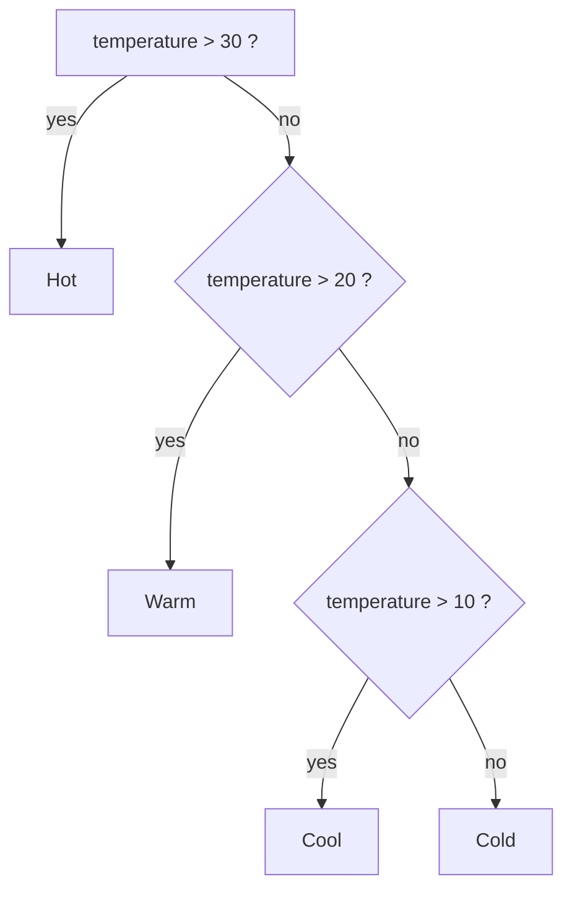
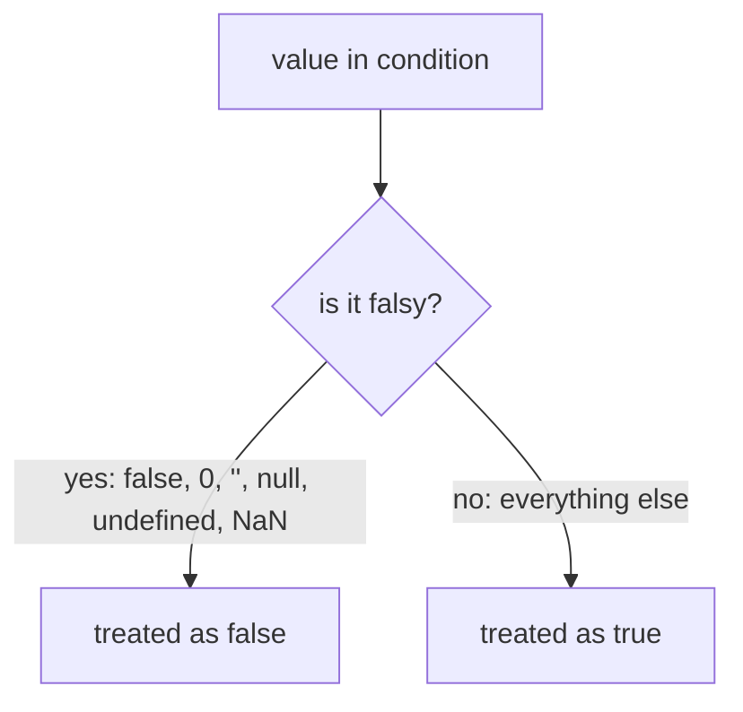

## Conditional Statements

> **Connection with the previous lesson:** in lesson 4, we learned about objects - containers that store related data (properties and methods). But up until now, our programs have executed strictly from top to bottom, line by line. Today we learn to make our code "smart": conditional statements allow the program to check something and, depending on the result, choose which block of code to run - and which to skip.

---

## Lesson Goal

Understand what a "condition" is in JavaScript, learn the comparison and logical operators that create these conditions, and master the main constructs for branching (`if...else`, the ternary operator, `switch`) - so that by the end of the lesson you can write programs that make decisions on their own.

## What You Will Learn by the End of the Lesson

- Explain what a condition (boolean expression) is and how a program "decides" what to do.
- Use comparison operators (`>`, `<`, `>=`, `<=`, `==`, `===`, `!=`, `!==`) and understand why strict equality `===` is always preferred.
- Combine several conditions with the logical operators `&&`, `||`, and `!`.
- Build `if...else if...else` chains and understand the order in which they are checked.
- Use the ternary operator `? :` for short conditional assignments.
- Use `switch...case` when comparing one value against many options, and understand the role of `break`.
- Remember the falsy values and write safer, shorter checks.

---

## Lesson Timeline

| Block | Content |
| ---- | ---- |
| 1. What a condition is | Boolean type, analogy with a navigator |
| 2. Comparison operators | `>`, `<`, `>=`, `<=`, `==/===`, `!=/!==` |
| 3. Logical operators | `&&`, `||`, `!` - combining conditions |
| 4. `if...else if...else` | The main branching construct, temperature example |
| 5. Ternary operator | `? :` - a short form of `if...else` |
| 6. `switch...case` | Comparing one value with many options, the role of `break` |
| 7. Falsy and truthy values | The most important subtlety of conditions |
| 8. Examples from real life | Form validation and optional chaining `?.` |
| 9. Cheat sheet and homework | Which construct to choose |

---

## Block 1. What a Condition Is

**In simple terms:** imagine a **navigator**: "If you turn right - you'll reach the center; if you turn left - you'll reach the station." It looks at the current situation, makes a decision, and points you in one direction. A condition in a program works the same way: it **checks** some expression for truth (whether it is `true` or `false`) and, depending on the result, runs one block of code or another.

**A condition is a boolean expression** - that is, an expression whose result is the boolean type, which can have only two values: `true` or `false`.

```javascript
const isRaining = true;
const temperature = 25;

if (isRaining) {
  console.log('Take an umbrella');
}
```

The program itself cannot "think" - but it can compare values and act on the result. The result of that comparison is what we call a condition.

---

## Block 2. Comparison Operators

Before writing conditions, we need to learn how to obtain `true` or `false` at all. This is done by **comparison operators** - each one returns a boolean value.

### Comparison Operators Table

| Operator | Meaning | Example | Result |
| ------ | ------ | ------ | ------ |
| `>` | Greater than | `5 > 3` | `true` |
| `<` | Less than | `5 < 3` | `false` |
| `>=` | Greater than or equal | `5 >= 5` | `true` |
| `<=` | Less than or equal | `5 <= 4` | `false` |
| `==` | **Loose** equality (with type conversion) | `'5' == 5` | `true` (dangerous!) |
| `===` | **Strict** equality (no type conversion) | `'5' === 5` | `false` (use this!) |
| `!=` | Loose inequality | `'5' != 5` | `false` |
| `!==` | Strict inequality | `'5' !== 5` | `true` (use this!) |

**Golden rule:** **always use `===` and `!==`**. The loose operators `==` and `!=` silently convert types before comparing. For example, `'5' == 5` returns `true` because the string is turned into a number. This behavior produces unexpected bugs that are very hard to find.

```javascript
console.log('5' == 5);   // true  - loose, converts the string to a number
console.log('5' === 5);  // false - strict, string is not the same as number
```

---

## Block 3. Logical Operators

A single comparison is simple. But real life rarely fits one condition: "it's cold AND it's raining", "I have a ticket OR I know the owner". To combine conditions, JavaScript has **logical operators**.

### Logical Operators Table

| Operator | Name | What it does |
| ------ | ------ | ------ |
| `&&` | AND | `true` only if **all** conditions are `true` |
| `||` | OR | `true` if **at least one** condition is `true` |
| `!` | NOT | Inverts the result (turns `true` into `false` and vice versa) |

```javascript
const age = 25;
const hasLicense = true;

// Check that the age is greater than 18 AND there is a license
if (age > 18 && hasLicense) {
  console.log('Can drive a car');
}
```

Here `age > 18` is `true`, and `hasLicense` is `true`. Since both parts of `&&` are true, the whole condition is true, and the message is printed.

```javascript
const dayOff = false;
const isHoliday = true;

// At least one must be true in order to sleep in
if (dayOff || isHoliday) {
  console.log('You can sleep in');
}
```

```mermaid
flowchart TD
    A["condition"] --> B{&&}
    A --> C{||}
    B -->|"true if ALL parts true"| D["run block"]
    C -->|"true if ANY part true"| D
```

---

## Block 4. The `if...else if...else` Construct

This is the most basic and most frequently used construct. It checks conditions one after another and runs the first block whose condition is `true`.

```javascript
const temperature = 25;

if (temperature > 30) {
  console.log('Hot, turn on the air conditioner');
} else if (temperature > 20) {
  console.log('Warm, you can go for a walk'); // this one runs
} else if (temperature > 10) {
  console.log('Cool, put on a jacket');
} else {
  console.log('Cold, stay at home');
}
```

**How it works:**

1. The `if` is checked first. If it is `true` - the block runs and the whole construct exits.
2. If it is `false`, the `else if` is checked (there can be as many of these as you need).
3. If all conditions are `false`, the `else` runs - the optional part that catches all remaining cases.

**In simple terms:** this is like choosing clothes by the weather, one step at a time. First you ask "hot?" - if yes, turn on the air conditioner; if not, ask "warm?" - and so on down the line, until one answer fits.



---

## Block 5. The Ternary Operator (`? :`)

The ternary operator is a **short way of writing `if...else`** that **returns a value**. It is used for simple assignments, when you need to choose one of two values in a single line.

**Syntax:** `condition ? value_if_true : value_if_false`

```javascript
const age = 20;

// Long form
let status;
if (age >= 18) {
  status = 'Adult';
} else {
  status = 'Child';
}

// Short form (ternary)
const statusShort = age >= 18 ? 'Adult' : 'Child';

console.log(statusShort); // 'Adult'
```

**Important:** do not overuse the ternary operator. If the logic is complex or nested - use `if...else` so that the code stays readable. The ternary operator wins when the whole construction fits on one short line.

---

## Block 6. The `switch...case` Construct

The `switch` construct is used when you need to compare **one single value** with many possible options. In a chain of many `else if`, the code becomes long and difficult to read; `switch` makes it cleaner.

```javascript
const dayOfWeek = 3;

switch (dayOfWeek) {
  case 1:
    console.log('Monday');
    break; // without break execution "falls through" further
  case 2:
    console.log('Tuesday');
    break;
  case 3:
    console.log('Wednesday'); // this one runs
    break;
  case 4:
    console.log('Thursday');
    break;
  case 5:
    console.log('Friday');
    break;
  default: // if no value matched
    console.log('Weekend');
}
```

**Key subtlety:** `break` is essential if you don't want the code to "fall through" into the following `case` blocks. Without `break`, after finding a match, JavaScript keeps executing all subsequent blocks until it encounters a `break` or the end of the `switch`. In the example above, without `break` after the `case 3` block, the program would also print 'Thursday' and 'Friday'.

---

## Block 7. Falsy and Truthy Values

This is one of the **most important subtleties** of conditions. In JavaScript, when a value is placed in a condition, it is automatically converted to a boolean. But it is not only `false` that counts as "false" - a whole list of values behave like false, and everything else behaves like true.

### Always falsy

- `false`
- `0` (zero)
- `''` (empty string)
- `null`
- `undefined`
- `NaN`

### Everything else is truthy

- Any numbers except `0`, for example `-1`, `42`
- Any strings, even `' '` (a space) or `'false'`
- Empty arrays `[]`
- Empty objects `{}`

```javascript
const userName = '';

// This works because an empty string -> false
if (userName) {
  console.log('Hello, ' + userName);
} else {
  console.log('Name is not specified'); // this one runs
}
```



This allows writing short checks like `if (userName)`. But be careful: this way you can accidentally skip `0` as a perfectly valid value. For example, if a user scores `0` points, `if (score)` will treat that as "no score" - even though zero points is a meaningful result. In such cases, check explicitly with `===`.

---

## Block 8. Examples from Real Life

### Example 1: Form Validation

Most web forms are validated with conditions: check that the email contains `@` **and** the password is long enough.

```javascript
const email = 'test@mail.com';
const password = '12345';

if (email.includes('@') && password.length >= 6) {
  console.log('Registration successful');
} else {
  console.log('Check your email or password (min. 6 characters)');
}
```

The `includes('@')` method returns a boolean, and `password.length >= 6` is a comparison. Both are combined with `&&`, so the message about success appears only when both checks pass.

### Example 2: Checking Whether Something Exists (Optional Chaining `?.`)

When you work with nested objects, it is common to need to check whether an object, its property, and a nested property all exist. Accessing a property of `undefined` throws an error, so the check used to be long and verbose.

```javascript
const user = {
  profile: {
    name: 'Alex'
  }
};

// Old check (deep condition)
if (user && user.profile && user.profile.name) {
  console.log(user.profile.name);
}

// Modern check (optional chaining ?.)
if (user?.profile?.name) {
  console.log(user.profile.name); // 'Alex'
}
```

The optional chaining operator `?.` stops the whole expression and returns `undefined` as soon as any of the intermediate values turns out to be `null` or `undefined` - instead of throwing an error. Combined with truthiness, this gives a short and safe check.

---

## Block 9. Cheat Sheet: What to Use in Which Situation

| Situation | What to use |
| ------ | ------ |
| Checking one condition | `if (condition) { ... }` |
| Checking several mutually exclusive conditions | `if ... else if ... else` |
| Assigning a value depending on a condition (one short line) | Ternary operator `? :` |
| Comparing one variable with many values | `switch...case` |
| Checking "does a property exist" or "is it non-empty" | `if (user?.name)` |

---

## Practice

1. Write a program that asks for a number and prints "positive", "negative", or "zero" depending on its value (use `if...else if...else`).
2. Rewrite the result of task 1 using the ternary operator, and then compare which version is easier to read.
3. Write a `switch` that, given the number of the month (`1` to `12`), prints the name of the season (winter, spring, summer, autumn). Remember about `break`.
4. Create a `const user = {}` - an empty object. Write a check using optional chaining that prints "no data" if the name is absent, and the name itself if it is present.
5. Write a validity check for a password: print "strong password" if its length is at least 8 characters **and** it contains at least one digit. Otherwise - "weak password".

---

## Lesson Summary

Today you learned:

- **Conditions control the flow of execution** of the code: the program checks a boolean expression and chooses which block to run.
- **Always use `===` and `!==`** for comparisons to avoid type-conversion bugs.
- Logical operators `&&`, `||`, `!` let you combine several conditions into one.
- `if...else if...else` is the main branching construct, the ternary operator `? :` is its short form for simple assignments, and `switch...case` compares one value with many options.
- **Remember the falsy values** (`false`, `0`, `''`, `null`, `undefined`, `NaN`) so you don't fall into a trap.
- Don't complicate things: if a condition in an `if` becomes longer than one line - extract it into a variable with a clear name.

---

[Next lesson: Loops →](../../Lesson-6/en/Loops.md)
