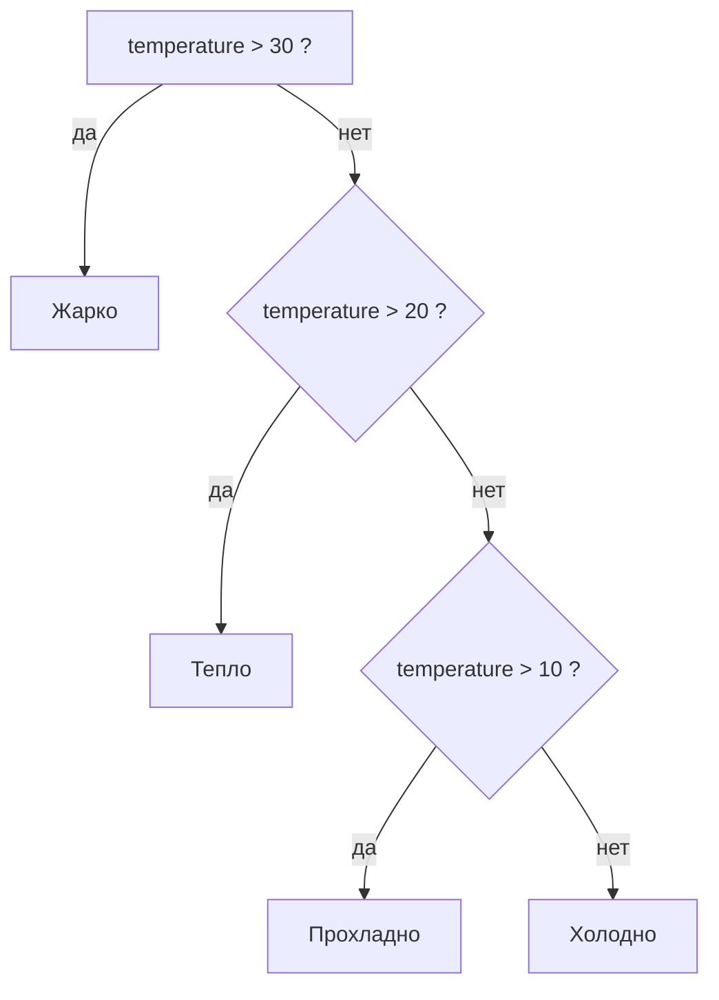
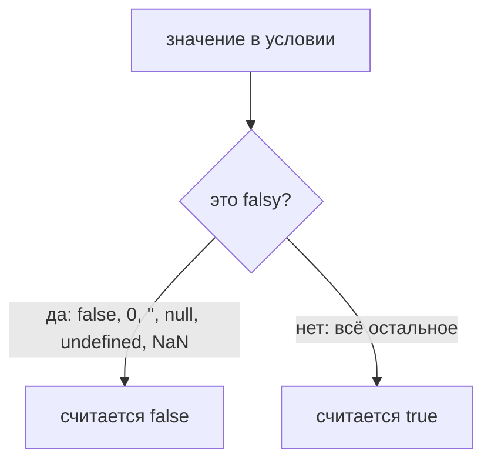

## Условные конструкции

> **Связь с предыдущим уроком:** на уроке 4 мы познакомились с объектами — контейнерами, которые хранят связанные данные (свойства и методы). Но до сих пор наша программа выполнялась строго сверху вниз, строка за строкой. Сегодня мы научим наш код «думать»: условные конструкции позволяют программе что-то проверить и, в зависимости от результата, выбрать, какой блок кода выполнить, а какой — пропустить.

---

## Цель урока

Понять, что такое «условие» в JavaScript, выучить операторы сравнения и логические операторы, которые эти условия создают, и освоить основные конструкции ветвления (`if...else`, тернарный оператор, `switch`) — чтобы к концу урока вы могли писать программы, которые принимают решения самостоятельно.

## Что вы узнаете к концу урока

- Объяснить, что такое условие (булево выражение) и как программа «решает», что делать.
- Использовать операторы сравнения (`>`, `<`, `>=`, `<=`, `==`, `===`, `!=`, `!==`) и понимать, почему строгое равенство `===` всегда предпочтительнее.
- Объединять несколько условий логическими операторами `&&`, `||` и `!`.
- Строить цепочки `if...else if...else` и понимать порядок их проверки.
- Использовать тернарный оператор `? :` для коротких условных присваиваний.
- Использовать `switch...case` при сравнении одного значения со множеством вариантов и понимать роль `break`.
- Запомнить falsy-значения и писать более короткие и безопасные проверки.

---

## План урока

| Блок | Содержание |
| ---- | ---- |
| 1. Что такое условие | Логический тип, аналогия с навигатором |
| 2. Операторы сравнения | `>`, `<`, `>=`, `<=`, `==`/`===`, `!=`/`!==` |
| 3. Логические операторы | `&&`, `||`, `!` — объединение условий |
| 4. `if...else if...else` | Основная конструкция ветвления, пример с температурой |
| 5. Тернарный оператор | `? :` — короткая запись `if...else` |
| 6. `switch...case` | Сравнение одного значения со множеством вариантов, роль `break` |
| 7. Falsy и truthy значения | Самая важная тонкость условий |
| 8. Примеры из реальной жизни | Валидация формы и опциональная цепочка `?.` |
| 9. Шпаргалка и домашнее задание | Какую конструкцию выбрать |

---

## Блок 1. Что такое условие

**Простыми словами:** представьте **навигатор**: «Если повернуть направо — поедешь в центр, если налево — на вокзал». Он смотрит на текущую ситуацию, принимает решение и указывает направление. Условие в программе работает так же: оно **проверяет** какое-либо выражение на истинность (является ли оно `true` или `false`) и, в зависимости от результата, выполняет тот или иной блок кода.

**Условие — это булево выражение**, то есть выражение, результатом которого является логический тип, который может принимать только два значения: `true` или `false`.

```javascript
const isRaining = true;
const temperature = 25;

if (isRaining) {
  console.log('Возьми зонт');
}
```

Программа сама не умеет «думать» — но она умеет сравнивать значения и действовать по результату. Результат этого сравнения и есть условие.

---

## Блок 2. Операторы сравнения

Прежде чем писать условия, нужно понять, как мы вообще получаем `true` или `false`. Это делают **операторы сравнения** — каждый из них возвращает булево значение.

### Таблица операторов сравнения

| Оператор | Значение | Пример | Результат |
| ------ | ------ | ------ | ------ |
| `>` | Больше | `5 > 3` | `true` |
| `<` | Меньше | `5 < 3` | `false` |
| `>=` | Больше или равно | `5 >= 5` | `true` |
| `<=` | Меньше или равно | `5 <= 4` | `false` |
| `==` | **Нестрогое** равенство (с приведением типов) | `'5' == 5` | `true` (опасно!) |
| `===` | **Строгое** равенство (без приведения типов) | `'5' === 5` | `false` (используйте это!) |
| `!=` | Нестрогое неравенство | `'5' != 5` | `false` |
| `!==` | Строгое неравенство | `'5' !== 5` | `true` (используйте это!) |

**Золотое правило:** **всегда используйте `===` и `!==`**. Нестрогие операторы `==` и `!=` молча приводят типы перед сравнением. Например, `'5' == 5` возвращает `true`, потому что строка превращается в число. Такое поведение порождает неожиданные баги, которые очень сложно найти.

```javascript
console.log('5' == 5);   // true  - нестрогое, строка приводится к числу
console.log('5' === 5);  // false - строгое, строка не равна числу
```

---

## Блок 3. Логические операторы

Одно сравнение — просто. Но в реальной жизни редко бывает одно условие: «холодно И идёт дождь», «у меня есть билет ИЛИ я знаю владельца». Чтобы объединять условия, в JavaScript есть **логические операторы**.

### Таблица логических операторов

| Оператор | Название | Что делает |
| ------ | ------ | ------ |
| `&&` | И (AND) | `true` только если **все** условия `true` |
| `||` | ИЛИ (OR) | `true` если **хотя бы одно** условие `true` |
| `!` | НЕ (NOT) | Инвертирует результат (делает `true` из `false` и наоборот) |

```javascript
const age = 25;
const hasLicense = true;

// Проверяем, что возраст больше 18 И есть права
if (age > 18 && hasLicense) {
  console.log('Можно водить машину');
}
```

Здесь `age > 18` равно `true`, и `hasLicense` равно `true`. Так как обе части `&&` истинны, истинно и всё условие — сообщение выводится.

```javascript
const dayOff = false;
const isHoliday = true;

// Чтобы поспать, достаточно одного истинного условия
if (dayOff || isHoliday) {
  console.log('Можно поспать подольше');
}
```

```mermaid
flowchart TD
    A["условие"] --> B{&&}
    A --> C{||}
    B -->|"true, если ВСЕ части true"| D["выполнить блок"]
    C -->|"true, если ЛЮБАЯ часть true"| D
```

---

## Блок 4. Конструкция `if...else if...else`

Это самая базовая и часто используемая конструкция. Она проверяет условия одно за другим и выполняет первый блок, чьё условие оказалось `true`.

```javascript
const temperature = 25;

if (temperature > 30) {
  console.log('Жарко, включи кондиционер');
} else if (temperature > 20) {
  console.log('Тепло, можно гулять'); // Выполнится это
} else if (temperature > 10) {
  console.log('Прохладно, надень куртку');
} else {
  console.log('Холодно, сиди дома');
}
```

**Схема работы:**

1. Сначала проверяется `if`. Если `true` — блок выполняется, и вся конструкция завершается.
2. Если `false` — проверяется `else if` (их может быть сколько угодно).
3. Если все условия `false` — выполняется `else` (необязательная часть, которая ловит все остальные случаи).

**Простыми словами:** это как выбирать одежду по погоде, шаг за шагом. Сначала спрашиваешь «жарко?» — если да, включаешь кондиционер; если нет, спрашиваешь «тепло?» — и так по цепочке, пока один из ответов не совпадёт.



---

## Блок 5. Тернарный оператор (`? :`)

Тернарный оператор — это **сокращённая запись `if...else`**, которая **возвращает значение**. Он используется для простых присваиваний, когда нужно выбрать одно из двух значений в одну строку.

**Синтаксис:** `условие ? значение_если_true : значение_если_false`

```javascript
const age = 20;

// Длинная запись
let status;
if (age >= 18) {
  status = 'Взрослый';
} else {
  status = 'Ребенок';
}

// Короткая запись (тернарный)
const statusShort = age >= 18 ? 'Взрослый' : 'Ребенок';

console.log(statusShort); // 'Взрослый'
```

**Важно:** не злоупотребляйте тернарником. Если логика сложная или вложенная — используйте `if...else`, чтобы код был читаемым. Тернарный оператор выигрывает, когда вся конструкция помещается в одну короткую строку.

---

## Блок 6. Конструкция `switch...case`

`switch` используется, когда нужно сравнить **одно единственное значение** со множеством возможных вариантов. В длинной цепочке `else if` код становится громоздким и трудночитаемым; `switch` делает его аккуратнее.

```javascript
const dayOfWeek = 3;

switch (dayOfWeek) {
  case 1:
    console.log('Понедельник');
    break; // Без break выполнение провалится дальше
  case 2:
    console.log('Вторник');
    break;
  case 3:
    console.log('Среда'); // Выполнится это
    break;
  case 4:
    console.log('Четверг');
    break;
  case 5:
    console.log('Пятница');
    break;
  default: // Если не совпало ни одно значение
    console.log('Выходной');
}
```

**Ключевой нюанс:** `break` обязателен, если вы не хотите, чтобы код «проваливался» в следующие блоки `case`. Без `break`, после совпадения JavaScript продолжит выполнять последующие блоки, пока не встретит `break` или конец `switch`. В примере выше без `break` после блока `case 3` программа вывела бы ещё и «Четверг» и «Пятницу».

---

## Блок 7. Falsy и truthy значения

Это одна из **самых важных тонкостей** условий. В JavaScript, когда значение попадает в условие, оно автоматически приводится к булеву типу. Но ложью считается не только `false` — ложным ведёт себя целый список значений, а всё остальное — истинно.

### Всегда ложные (falsy)

- `false`
- `0` (ноль)
- `''` (пустая строка)
- `null`
- `undefined`
- `NaN`

### Всё остальное — истина (truthy)

- Любые числа, кроме `0`, например `-1`, `42`
- Любые строки, даже `' '` (пробел) или `'false'`
- Пустые массивы `[]`
- Пустые объекты `{}`

```javascript
const userName = '';

// Это сработает, потому что пустая строка -> false
if (userName) {
  console.log('Привет, ' + userName);
} else {
  console.log('Имя не указано'); // Выполнится это
}
```



Это позволяет писать короткие проверки вроде `if (userName)`. Но будьте внимательны: так можно случайно пропустить `0` как валидное значение. Например, если пользователь набрал `0` очков, `if (score)` посчитает это «нет очков» — хотя ноль очков это вполне осмысленный результат. В таких случаях проверяйте явно через `===`.

---

## Блок 8. Примеры из реальной жизни

### Пример 1: Валидация формы

Большинство веб-форм проверяются именно условиями: проверяем, что в email есть `@`, **и** что пароль достаточно длинный.

```javascript
const email = 'test@mail.com';
const password = '12345';

if (email.includes('@') && password.length >= 6) {
  console.log('Регистрация успешна');
} else {
  console.log('Проверьте email или пароль (мин. 6 символов)');
}
```

Метод `includes('@')` возвращает булево значение, а `password.length >= 6` — сравнение. Оба объединены через `&&`, поэтому сообщение об успехе появится только тогда, когда пройдены обе проверки.

### Пример 2: Проверка на существование (опциональная цепочка `?.`)

При работе с вложенными объектами часто нужно проверить, существуют ли и объект, и его свойство, и вложенное свойство. Обращение к свойству `undefined` вызывает ошибку, поэтому раньше проверка была длинной и громоздкой.

```javascript
const user = {
  profile: {
    name: 'Alex'
  }
};

// Старая проверка (глубокое условие)
if (user && user.profile && user.profile.name) {
  console.log(user.profile.name);
}

// Современная проверка (опциональная цепочка ?.)
if (user?.profile?.name) {
  console.log(user.profile.name); // 'Alex'
}
```

Оператор опциональной цепочки `?.` прерывает всю цепочку и возвращает `undefined`, как только любое из промежуточных значений окажется `null` или `undefined`, — вместо того чтобы вызвать ошибку. В сочетании с truthy-логикой получается короткая и безопасная проверка.

---

## Блок 9. Шпаргалка: что использовать в какой ситуации

| Ситуация | Что использовать |
| ------ | ------ |
| Проверка одного условия | `if (условие) { ... }` |
| Проверка нескольких взаимоисключающих условий | `if ... else if ... else` |
| Присвоение значения в зависимости от условия (одна короткая строка) | Тернарный оператор `? :` |
| Сравнение одной переменной со множеством значений | `switch...case` |
| Проверка «существует ли свойство» или «не пустое ли» | `if (user?.name)` |

---

## Практика

1. Напишите программу, которая запрашивает число и выводит «положительное», «отрицательное» или «ноль» в зависимости от его значения (используйте `if...else if...else`).
2. Перепишите результат задания 1 с помощью тернарного оператора, а затем сравните, какой вариант легче читать.
3. Напишите `switch`, который по номеру месяца (от `1` до `12`) выводит название сезона (зима, весна, лето, осень). Не забудьте про `break`.
4. Создайте `const user = {}` — пустой объект. Напишите проверку через опциональную цепочку, которая выводит «нет данных», если имя отсутствует, и само имя, если оно есть.
5. Напишите проверку надёжности пароля: выводите «надёжный пароль», если его длина не меньше 8 символов **и** он содержит хотя бы одну цифру. Иначе — «слабый пароль».

---

## Итог урока

Сегодня вы узнали:

- **Условия управляют потоком выполнения** кода: программа проверяет булево выражение и выбирает, какой блок выполнить.
- **Всегда используйте `===` и `!==`** для сравнений, чтобы избежать багов с приведением типов.
- Логические операторы `&&`, `||`, `!` позволяют объединять несколько условий в одно.
- `if...else if...else` — основная конструкция ветвления, тернарный оператор `? :` — её короткая форма для простых присваиваний, а `switch...case` сравнивает одно значение со множеством вариантов.
- **Запомните falsy-значения** (`false`, `0`, `''`, `null`, `undefined`, `NaN`), чтобы не попасть в ловушку.
- Не усложняйте: если условие в `if` стало длиннее одной строки — вынесите его в переменную с понятным именем.

---

[Следующий урок: Циклы →](../../Lesson-6/ru/Циклы.md)
