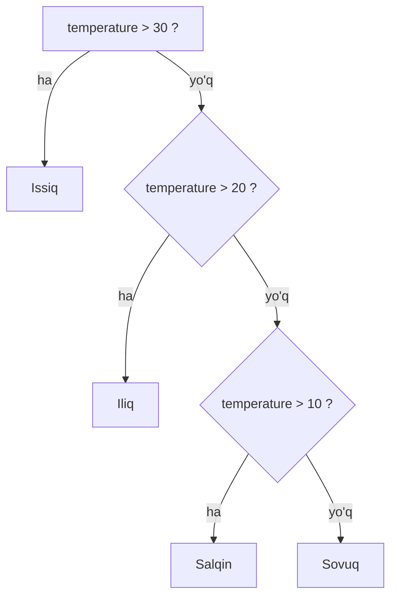
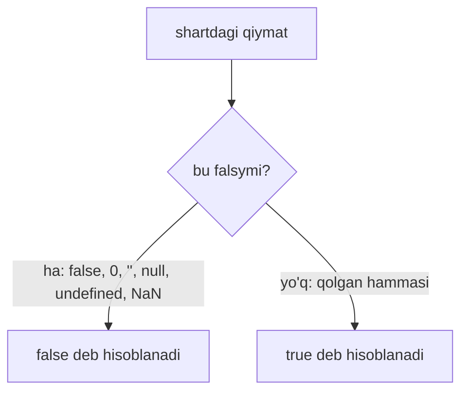

## Shartli konstruksiyalar

> **Oldingi dars bilan bog'liqlik:** 4-darsda ob'ektlar bilan tanishdik — bir-biriga bog'liq ma'lumotlarni saqlaydigan konteynerlar (xususiyatlar va metodlar). Ammo hozirgacha dasturimiz qat'iy yuqoridan pastga, satrma-satr bajarilardi. Bugun kodimizni «o'ylashga» o'rgatamiz: shartli konstruksiyalar dasturga biror narsani tekshirishga va natijaga qarab qaysi kod blokini bajarishni, qaysinisini esa o'tkazib yuborishni tanlashga imkon beradi.

---

## Dars maqsadi

JavaScriptda «shart» nima ekanligini tushunish, shartlarni yaratadigan taqqoslash va mantiqiy operatorlarni o'rganish hamda tarmoqlanishning asosiy konstruksiyalarini (`if...else`, ternar operator, `switch`) o'zlashtirish — dars oxirida mustaqil qaror qabul qiladigan dasturlar yozishingiz mumkin bo'ladi.

## Dars oxirida nimani o'rganasiz

- Shart (boolean ifoda) nima ekanligini va dastur qanday «qaror qabul qilishini» tushuntirish.
- Taqqoslash operatorlaridan (`>`, `<`, `>=`, `<=`, `==`, `===`, `!=`, `!==`) foydalanish va nima uchun qat'iy tenglik `===` har doim afzal ekanini tushunish.
- Bir nechta shartni `&&`, `||` va `!` mantiqiy operatorlari orqali birlashtirish.
- `if...else if...else` zanjirlarini qurish va ularning tekshirish tartibini tushunish.
- Qisqa shartli tanlash uchun ternar operator `? :` dan foydalanish.
- Bitta qiymatni ko'plab variantlar bilan taqqoslashda `switch...case` dan foydalanish va `break` ning rolini tushunish.
- Falsy qiymatlarni yodlab olish va qisqaroq hamda xavfsizroq tekshiruvlar yozish.

---

## Dars rejasi

| Blok | Mazmuni |
| ---- | ---- |
| 1. Shart nima | Mantiqiy tur, navigator o'xshatmasi |
| 2. Taqqoslash operatorlari | `>`, `<`, `>=`, `<=`, `==`/`===`, `!=`/`!==` |
| 3. Mantiqiy operatorlar | `&&`, `||`, `!` — shartlarni birlashtirish |
| 4. `if...else if...else` | Asosiy tarmoqlanish konstruksiyasi, harorat misoli |
| 5. Ternar operator | `? :` — `if...else` ning qisqa yozuvi |
| 6. `switch...case` | Bitta qiymatni ko'p variantlar bilan taqqoslash, `break` roli |
| 7. Falsy va truthy qiymatlar | Shartlarning eng muhim nozik tomoni |
| 8. Hayotiy misollar | Formani tekshirish va ixtiyoriy zanjir `?.` |
| 9. Eslatma va uy vazifasi | Qaysi konstruksiyani tanlash |

---

## Blok 1. Shart nima

**Oddiy qilib aytganda:** **navigator**ni tasavvur qiling: «Agar o'ngga burilsang — markazga borasan, agar chapga — vokzalga». U hozirgi vaziyatga qaraydi, qaror qabul qiladi va yo'nalishni ko'rsatadi. Dasturdagi shart ham xuddi shunday ishlaydi: u qandaydir ifodani haqiqatga tekshiradi (`true` yoki `false` ekanligini) va natijaga qarab u yoki bu kod blokini bajaradi.

**Shart — bu boolean ifoda**, ya'ni natijasi mantiqiy tur bo'lgan ifoda. Mantiqiy tur faqat ikkita qiymatga ega: `true` yoki `false`.

```javascript
const isRaining = true;
const temperature = 25;

if (isRaining) {
  console.log('Soyabon ol');
}
```

Dasturning o'zi «o'ylay olmaydi» — lekin qiymatlarni taqqoslab, natijaga qarab harakat qila oladi. Shu taqqoslash natijasi shart deyiladi.

---

## Blok 2. Taqqoslash operatorlari

Shartlar yozishdan oldin, biz umuman `true` yoki `false` ni qanday olishimizni tushunishimiz kerak. Buni **taqqoslash operatorlari** bajaradi — ularning har biri boolean qiymat qaytaradi.

### Taqqoslash operatorlari jadvali

| Operator | Ma'nosi | Misol | Natija |
| ------ | ------ | ------ | ------ |
| `>` | Katta | `5 > 3` | `true` |
| `<` | Kichik | `5 < 3` | `false` |
| `>=` | Katta yoki teng | `5 >= 5` | `true` |
| `<=` | Kichik yoki teng | `5 <= 4` | `false` |
| `==` | **Yumshoq** tenglik (turlarni o'zgartirish bilan) | `'5' == 5` | `true` (xavfli!) |
| `===` | **Qat'iy** tenglik (turlarni o'zgartirmasdan) | `'5' === 5` | `false` (buni ishlating!) |
| `!=` | Yumshoq tengsizlik | `'5' != 5` | `false` |
| `!==` | Qat'iy tengsizlik | `'5' !== 5` | `true` (buni ishlating!) |

**Oltin qoida:** **har doim `===` va `!==` dan foydalaning**. Yumshoq operatorlar `==` va `!=` solishtirishdan oldin turlarni jimgina o'zgartiradi. Masalan, `'5' == 5` `true` qaytaradi, chunki satr songa aylantiriladi. Bunday xatti-harakat topish qiyin bo'lgan kutilmagan xatolarni keltirib chiqaradi.

```javascript
console.log('5' == 5);   // true  - yumshoq, satr songa aylanadi
console.log('5' === 5);  // false - qat'iy, satr songa teng emas
```

---

## Blok 3. Mantiqiy operatorlar

Bitta taqqoslash — oddiy. Lekin real hayotda bitta shart kamdan-kam bo'ladi: «sovuq VA yomg'ir yog'ayapti», «menda chipta bor YOKI egasini bilaman». Shartlarni birlashtirish uchun JavaScriptda **mantiqiy operatorlar** mavjud.

### Mantiqiy operatorlar jadvali

| Operator | Nomi | Nima qiladi |
| ------ | ------ | ------ |
| `&&` | VA (AND) | Faqat **barcha** shartlar `true` bo'lsa, `true` |
| `||` | YOKI (OR) | **Kamida bitta** shart `true` bo'lsa, `true` |
| `!` | YO'Q (NOT) | Natijani teskari qiladi (`true` dan `false`, `false` dan `true`) |

```javascript
const age = 25;
const hasLicense = true;

// Yosh 18 dan katta VA haydovchilik guvohnomasi borligini tekshiramiz
if (age > 18 && hasLicense) {
  console.log('Mashina haydash mumkin');
}
```

Bu yerda `age > 18` — `true`, va `hasLicense` — `true`. `&&` ning ikkala qismi ham rost bo'lgani uchun butun shart rost bo'ladi — xabar chiqariladi.

```javascript
const dayOff = false;
const isHoliday = true;

// Uzoqroq uxlash uchun bitta rost shart yetarli
if (dayOff || isHoliday) {
  console.log('Uzoqroq uxlash mumkin');
}
```

```mermaid
flowchart TD
    A["shart"] --> B{&&}
    A --> C{||}
    B -->|"hamma qismi true bo'lsa, true"| D["blokni bajarish"]
    C -->|"istalgan qismi true bo'lsa, true"| D
```

---

## Blok 4. `if...else if...else` konstruksiyasi

Bu eng asosiy va eng ko'p ishlatiladigan konstruksiya. U shartlarni birma-bir tekshiradi va sharti `true` bo'lgan birinchi blokni bajaradi.

```javascript
const temperature = 25;

if (temperature > 30) {
  console.log('Issiq, konditsionerni yoqing');
} else if (temperature > 20) {
  console.log('Iliq, sayr qilish mumkin'); // Shu bajariladi
} else if (temperature > 10) {
  console.log('Salqin, ko'ylagi kiying');
} else {
  console.log('Sovuq, uyda o'tiring');
}
```

**Qanday ishlaydi:**

1. Avval `if` tekshiriladi. Agar `true` bo'lsa — blok bajariladi va butun konstruksiya tugaydi.
2. Agar `false` bo'lsa — `else if` tekshiriladi (ularning soni cheklanmagan).
3. Agar barcha shartlar `false` bo'lsa — `else` bajariladi (qolgan barcha holatlarni tutadigan ixtiyoriy qism).

**Oddiy qilib aytganda:** bu ob-havoga qarab kiyim tanlashga o'xshaydi, bosqichma-bosqich. Avval «issiqmi?» deb so'raysan — ha bo'lsa, konditsionerni yoqasan; yo'q bo'lsa, «iliqmi?» deb so'raysan — va shu zanjir bo'ylab, bitta javob mos kelguncha davom etasan.



---

## Blok 5. Ternar operator (`? :`)

Ternar operator — bu **`if...else` ning qisqartirilgan yozuvi** bo'lib, u **qiymat qaytaradi**. U oddiy o'zlashtirishlar uchun, bir qatorda ikkita qiymatdan birini tanlash kerak bo'lganda ishlatiladi.

**Sintaksis:** `shart ? rost_bo'lsa_qiymat : yolg'on_bo'lsa_qiymat`

```javascript
const age = 20;

// Uzun yozuv
let status;
if (age >= 18) {
  status = 'Katta yoshli';
} else {
  status = 'Bola';
}

// Qisqa yozuv (ternar)
const statusShort = age >= 18 ? 'Katta yoshli' : 'Bola';

console.log(statusShort); // 'Katta yoshli'
```

**Muhim:** ternardan ko'p foydalanmang. Agar mantiq murakkab yoki ichma-ich bo'lsa — kod o'qilishi uchun `if...else` dan foydalaning. Ternar operator butun konstruksiya bitta qisqa qatorga sig'ganda ustunlik qiladi.

---

## Blok 6. `switch...case` konstruksiyasi

`switch` **bitta yagona qiymatni** ko'plab mumkin bo'lgan variantlar bilan taqqoslash kerak bo'lganda ishlatiladi. Uzun `else if` zanjirida kod katta va o'qish qiyin bo'lib qoladi; `switch` uni toza qiladi.

```javascript
const dayOfWeek = 3;

switch (dayOfWeek) {
  case 1:
    console.log('Dushanba');
    break; // break bo'lmasa, bajarilish davom etadi
  case 2:
    console.log('Seshanba');
    break;
  case 3:
    console.log('Chorshanba'); // Shu bajariladi
    break;
  case 4:
    console.log('Payshanba');
    break;
  case 5:
    console.log('Juma');
    break;
  default: // Hech qaysi qiymat mos kelmasa
    console.log('Dam olish kuni');
}
```

**Asosiy nozik jihat:** agar kodning keyingi `case` bloklariga «oqib o'tishini» xohlamasangiz, `break` shart. `break` bo'lmasa, mos kelgandan so'ng JavaScript keyingi bloklarni ham bajarishda davom etadi — `break` yoki `switch` oxiriga yetguncha. Yuqoridagi misolda `case 3` blokidan keyin `break` bo'lmasa, dastur «Payshanba» va «Juma» ni ham chiqargan bo'lardi.

---

## Blok 7. Falsy va truthy qiymatlar

Bu shartlarning **eng muhim nozik tomonlaridan biri**. JavaScriptda qiymat shartga tushganda avtomatik ravishda boolean turga o'zgartiriladi. Lekin faqat `false` emas, balki butun bir ro'yxatdagi qiymatlar «yolg'on» sifatida harakat qiladi, qolgan hammasi esa — «rost».

### Har doim yolg'on (falsy)

- `false`
- `0` (nol)
- `''` (bo'sh satr)
- `null`
- `undefined`
- `NaN`

### Qolgan hammasi — rost (truthy)

- `0` dan boshqa istalgan sonlar, masalan `-1`, `42`
- Istalgan satrlar, hatto `' '` (bo'sh joy) yoki `'false'`
- Bo'sh massivlar `[]`
- Bo'sh ob'ektlar `{}`

```javascript
const userName = '';

// Bu ishlaydi, chunki bo'sh satr -> false
if (userName) {
  console.log('Salom, ' + userName);
} else {
  console.log('Ism ko'rsatilmagan'); // Shu bajariladi
}
```



Bu `if (userName)` kabi qisqa tekshiruvlar yozishga imkon beradi. Lekin ehtiyot bo'ling: shu yo'l bilan `0` ni to'g'ri qiymat sifatida tasodifan o'tkazib yuborish mumkin. Masalan, foydalanuvchi `0` ball to'plagan bo'lsa, `if (score)` buni «ball yo'q» deb hisoblaydi — garchi nol ball ham mazmunli natija bo'lsa ham. Bunday hollarda `===` orqali aniq tekshiring.

---

## Blok 8. Hayotiy misollar

### 1-misol: Formani tekshirish

Ko'pchilik veb-formalar aynan shartlar orqali tekshiriladi: emailda `@` borligini **va** parolning yetarli uzunligini tekshiramiz.

```javascript
const email = 'test@mail.com';
const password = '12345';

if (email.includes('@') && password.length >= 6) {
  console.log('Ro'yxatdan o'tish muvaffaqiyatli');
} else {
  console.log('Email yoki parolni tekshiring (kamida 6 ta belgi)');
}
```

`includes('@')` metodi boolean qiymat qaytaradi, `password.length >= 6` esa — taqqoslash. Ikkalasi `&&` orqali birlashtirilgan, shuning uchun muvaffaqiyat haqidagi xabar faqat ikkala tekshiruv ham o'tganda chiqadi.

### 2-misol: Mavjudligini tekshirish (ixtiyoriy zanjir `?.`)

Ichma-ich ob'ektlar bilan ishlashda ob'ekt ham, uning xususiyati ham, ichki xususiyat ham mavjudligini tekshirish kerak bo'ladi. `undefined` ning xususiyatiga murojaat qilish xatolik keltirib chiqaradi, shuning uchun ilgari tekshiruv uzun va og'ir edi.

```javascript
const user = {
  profile: {
    name: 'Ali'
  }
};

// Eski tekshiruv (chuqur shart)
if (user && user.profile && user.profile.name) {
  console.log(user.profile.name);
}

// Zamonaviy tekshiruv (ixtiyoriy zanjir ?.)
if (user?.profile?.name) {
  console.log(user.profile.name); // 'Ali'
}
```

Ixtiyoriy zanjir operatori `?.` oraliq qiymatlardan istalgani `null` yoki `undefined` bo'lib qolishi bilan butun ifodani to'xtatib, xatolik o'rniga `undefined` qaytaradi. Truthy mantiq bilan birgalikda bu qisqa va xavfsiz tekshiruv beradi.

---

## Blok 9. Eslatma: qaysi holatda nimani ishlatish kerak

| Holat | Nimani ishlatish |
| ------ | ------ |
| Bitta shartni tekshirish | `if (shart) { ... }` |
| Bir nechta bir-birini istisno qiluvchi shartlar | `if ... else if ... else` |
| Shartga qarab qiymat berish (bitta qisqa qator) | Ternar operator `? :` |
| Bitta o'zgaruvchini ko'p qiymatlar bilan taqqoslash | `switch...case` |
| «Xususiyat mavjudmi» yoki «bo'sh emasmi» tekshiruvi | `if (user?.name)` |

---

## Amaliyot

1. Sonni so'rab, qiymatiga qarab «musbat», «manfiy» yoki «nol» chiqaradigan dastur yozing (`if...else if...else` ishlating).
2. 1-topshiriq natijasini ternar operator yordamida qayta yozing, so'ng qaysi varianti o'qish osonroq ekanini solishtiring.
3. Oy raqami bo'yicha (`1` dan `12` gacha) fasl nomini (qish, bahor, yoz, kuz) chiqaradigan `switch` yozing. `break` ni unutmang.
4. `const user = {}` — bo'sh ob'ekt yarating. Ixtiyoriy zanjir orqali: ism bo'lmasa «ma'lumot yo'q», bo'lsa ismning o'zini chiqaradigan tekshiruv yozing.
5. Parol mustahkamligini tekshirishni yozing: uzunligi kamida 8 belgi **va** kamida bitta raqam bo'lsa — «mustahkam parol», aks holda — «zaif parol» chiqaring.

---

## Dars xulosasi

Bugun siz quyidagilarni o'rgandingiz:

- **Shartlar kodning bajarilish oqimini boshqaradi**: dastur boolean ifodani tekshiradi va qaysi blokni bajarishni tanlaydi.
- **Taqqoslashlarda har doim `===` va `!==` dan foydalaning** — tur o'zgartirish bilan bog'liq xatolarni oldini olish uchun.
- `&&`, `||`, `!` mantiqiy operatorlari bir nechta shartni bittaga birlashtirishga imkon beradi.
- `if...else if...else` — asosiy tarmoqlanish konstruksiyasi, ternar operator `? :` — oddiy o'zlashtirishlar uchun uning qisqa shakli, `switch...case` esa bitta qiymatni ko'p variantlar bilan taqqoslaydi.
- **Falsy qiymatlarni yodda saqlang** (`false`, `0`, `''`, `null`, `undefined`, `NaN`) — tuzoqqa tushmaslik uchun.
- Murakkablashtirmang: agar `if` dagi shart bir qatordan uzun bo'lib qolsa — uni aniq nomli o'zgaruvchiga chiqaring.

---

[Keyingi dars: Sikllar →](../../Lesson-6/uz/Sikllar.md)
