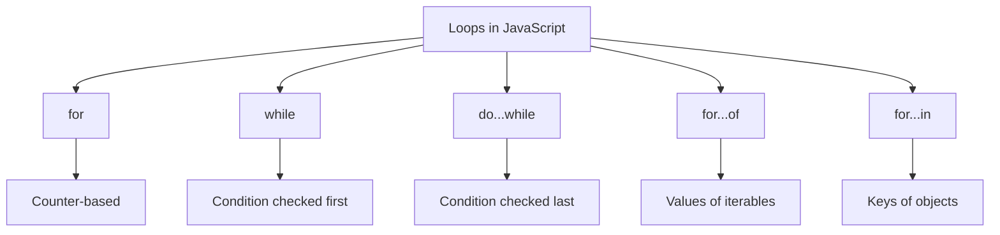

## Loops

> **Connection with the previous course:** in the previous lessons, we learned about variables, data types, operators, and control flow with `if...else`. But what if we need to repeat the same action many times — for example, print every number from 1 to 100? Loops solve this problem: they let us execute a block of code repeatedly with minimal effort.

---

## Lesson Goal

Understand what loops are and how they work in JavaScript — so that by the end of the lesson, you can choose the right type of loop for any situation, control loop execution with `break` and `continue`, and avoid common pitfalls like infinite loops.

## What You Will Learn by the End of the Lesson

- Explain what a loop is and identify its three core components: initialization, condition, and step.
- Use a `for` loop for situations where the number of iterations is known.
- Use a `while` loop when the number of iterations depends on a condition.
- Use a `do...while` loop when the body must execute at least once.
- Control loop flow with `break` (exit early) and `continue` (skip an iteration).
- Use `for...of` to iterate over values of arrays and strings.
- Use `for...in` to iterate over keys of objects — and understand why it should not be used for arrays.
- Recognize and prevent infinite loops.
- Use nested loops and labeled `break` to exit from an outer loop.

---

## Lesson Timeline

| Block | Content |
| --- | --- |
| 1. What Is a Loop | Analogy with a running track, core components |
| 2. The `for` Loop | Syntax, execution order, examples |
| 3. The `while` Loop | Condition-first design, examples |
| 4. The `do...while` Loop | Body-first design, comparison with `while` |
| 5. Loop Control: `break` and `continue` | Early exit, skipping iterations |
| 6. `for...of` and `for...in` | Iterating values vs. keys |
| 7. Infinite Loops | Causes, prevention |
| 8. Nested Loops and Labeled `break` | Multiplication table, outer-loop exit |
| 9. Comparison Table | All loops at a glance |
| 10. Practice and Summary | Exercises and key takeaways |

---

## Block 1. What Is a Loop

**In simple terms:** imagine you are on a running track. You run laps — each lap is the same action (running), and you stop when you have completed a set number of laps or when you are too tired. A loop in programming works the same way: it repeats a block of code until a condition is no longer met.

A **loop** is a control structure that allows you to execute a block of code repeatedly, as long as a given condition remains true.

Every loop revolves around three ideas:

| Component | What It Does | Example |
| --- | --- | --- |
| **Initialization** | Sets a starting value (a counter variable) | `let i = 0` |
| **Condition** | Checked before each iteration; loop runs only while true | `i < 5` |
| **Step** | Updates the counter after each iteration | `i++` |

---

## Block 2. The `for` Loop

The `for` loop is the most common loop in JavaScript. It is used when you know **in advance** how many times you want to repeat something.

### Syntax

```javascript
for (initialization; condition; step) {
    // loop body
}
```

### Execution Order

1. **Initialization** runs **once** at the very beginning.
2. **Condition** is checked **before** each iteration.
3. The **loop body** runs only if the condition is true.
4. The **step** runs **after** the body.
5. Steps 2-4 repeat until the condition becomes false.

### Examples

Basic iteration:

```javascript
for (let i = 1; i <= 5; i++) {
    console.log(`Lap: ${i}`);
}
```

Sum of numbers from 1 to 10:

```javascript
let sum = 0;
for (let i = 1; i <= 10; i++) {
    sum += i;
}
console.log(sum); // 55
```

Traversing an array:

```javascript
const fruits = ['apple', 'banana', 'orange'];
for (let i = 0; i < fruits.length; i++) {
    console.log(fruits[i]);
}
// apple
// banana
// orange
```

Counting down and step greater than 1:

```javascript
for (let i = 10; i > 0; i--) {
    console.log(i);
}
// 10, 9, 8, 7, 6, 5, 4, 3, 2, 1

for (let i = 0; i < 10; i += 2) {
    console.log(i); // 0, 2, 4, 6, 8
}
```

### Common Beginner Mistakes

| Error | How to Fix |
| --- | --- |
| Off-by-one: writing `i <= fruits.length` when using an array index | Array indices start at 0 and end at `length - 1` |
| Forgetting the step — `i++` is missing, causing an infinite loop | Always include a step that moves toward the exit condition |
| Placing the step before the body | The step runs **after** the body |

---

## Block 3. The `while` Loop

The `while` loop is ideal when you **do not know** in advance how many iterations you need. The condition is checked **before** each iteration, so it may execute **zero times**.

### Syntax

```javascript
while (condition) {
    // loop body
}
```

### Examples

```javascript
let count = 1;
while (count <= 5) {
    console.log(`count = ${count}`);
    count++;
}
```

Reading array elements:

```javascript
const numbers = [10, 20, 30, 40, 50];
let index = 0;
while (index < numbers.length) {
    console.log(numbers[index]);
    index++;
}
```

Waiting for user input:

```javascript
let password = '';
while (password !== 'secret') {
    password = prompt('Enter the password:');
}
console.log('Access granted!');
```

---

## Block 4. The `do...while` Loop

The `do...while` loop executes the body **first**, then checks the condition. This guarantees the body runs **at least once**.

### Syntax

```javascript
do {
    // loop body
} while (condition);
```

Note the semicolon after the closing parenthesis — it is required.

### Comparing `while` and `do...while`

```javascript
// while — may run 0 times
let a = 5;
while (a < 0) {
    console.log('Never prints');
}

// do...while — runs at least once
let b = 5;
do {
    console.log('Runs once');
} while (b < 0);
```

### Example: Validating User Input

```javascript
let age;
do {
    age = parseInt(prompt('Enter your age (0 to 120):'));
} while (isNaN(age) || age < 0 || age > 120);
console.log(`Your age: ${age}`);
```

---

## Block 5. Loop Control: `break` and `continue`

### The `break` Operator

`break` immediately **exits** the loop. Execution continues with the first statement after the loop.

```javascript
for (let i = 0; i < 10; i++) {
    if (i === 5) {
        break;
    }
    console.log(i);
}
// 0, 1, 2, 3, 4
```

### The `continue` Operator

`continue` **skips** the rest of the current iteration and jumps to the next one. The loop itself does not end.

The modulo operator `%` is useful here: `i % 2 === 0` means the number is even.

```javascript
for (let i = 0; i < 10; i++) {
    if (i % 2 === 0) {
        continue;
    }
    console.log(i);
}
// 1, 3, 5, 7, 9
```

### Practical Example: Searching an Array

```javascript
const numbers = [3, 7, 12, 5, 9, 1];
let target = 5;
let found = false;

for (let i = 0; i < numbers.length; i++) {
    if (numbers[i] === target) {
        console.log(`Found ${target} at position ${i}`);
        found = true;
        break;
    }
}

if (!found) {
    console.log('Number not found');
}
```

---

## Block 6. `for...of` and `for...in`

### `for...of` — Iterating Over Values

`for...of` is a modern ES6+ loop designed for **iterable objects** — arrays, strings, Maps, Sets. It gives you direct access to **values**, not indices.

```javascript
const colors = ['red', 'green', 'blue'];
for (const color of colors) {
    console.log(color);
}
// red, green, blue

const str = 'Hello';
for (const char of str) {
    console.log(char);
}
// H, e, l, l, o
```

### `for...in` — Iterating Over Keys

`for...in` iterates over the **enumerable property names** (keys) of an object. It is designed for objects, not arrays.

```javascript
const user = {
    name: 'John',
    age: 30,
    city: 'New York'
};

for (const key in user) {
    console.log(`${key}: ${user[key]}`);
}
// name: John
// age: 30
// city: New York
```

### Warning: Do Not Use `for...in` for Arrays

`for...in` iterates over **all enumerable properties**, not just numeric indices. If any code has added properties to `Array.prototype`, those will appear too.

```javascript
const arr = ['a', 'b', 'c'];
Array.prototype.extra = 'extra';

for (const key in arr) {
    console.log(key); // '0', '1', '2', 'extra' — problem!
}

for (const value of arr) {
    console.log(value); // 'a', 'b', 'c' — correct
}
```

| Loop | Use For | Returns | Warning |
| --- | --- | --- | --- |
| `for` | Arrays (when you need the index) | Index | None |
| `for...of` | Arrays, strings, collections | Values | None |
| `for...in` | Objects | Keys (strings) | Do not use for arrays |

---

## Block 7. Infinite Loops

An **infinite loop** is a loop whose condition never becomes false. The program will hang, freeze, or crash.

### Common Causes

```javascript
while (true) {
    console.log('Infinite!');
}

let i = 0;
while (i < 5) {
    console.log(i);
    // i++ is missing!
}

for (let i = 0; i >= 0; i++) {
    console.log(i); // runs forever
}
```

### How to Prevent

```javascript
let counter = 0;
while (counter < 5) {
    console.log(counter);
    counter++;
}

let attempts = 0;
while (true) {
    attempts++;
    if (attempts > 3) {
        console.log('Max attempts exceeded');
        break;
    }
}

let input;
do {
    input = prompt('Enter a number greater than 0:');
} while (isNaN(input) || Number(input) <= 0);
```

---

## Block 8. Nested Loops and Labeled `break`

A **nested loop** is a loop inside another loop. On each iteration of the outer loop, the inner loop runs completely from start to finish.

```javascript
for (let i = 0; i < 3; i++) {
    for (let j = 0; j < 3; j++) {
        console.log(`i=${i}, j=${j}`);
    }
}
```

### Example: Multiplication Table

```javascript
for (let i = 1; i <= 5; i++) {
    let row = '';
    for (let j = 1; j <= 5; j++) {
        row += (i * j) + '\t';
    }
    console.log(row);
}
// 1    2    3    4    5
// 2    4    6    8    10
// 3    6    9    12   15
// 4    8    12   16   20
// 5    10   15   20   25
```

### `break` Inside a Nested Loop

By default, `break` only exits the **innermost** loop:

```javascript
for (let i = 0; i < 3; i++) {
    for (let j = 0; j < 3; j++) {
        if (j === 1) break;
        console.log(`i=${i}, j=${j}`);
    }
}
```

### Labeled `break` — Exiting the Outer Loop

A **label** lets you target a specific loop:

```javascript
outer: for (let i = 0; i < 3; i++) {
    for (let j = 0; j < 3; j++) {
        if (i === 1 && j === 1) {
            break outer;
        }
        console.log(`i=${i}, j=${j}`);
    }
}
```

---

## Block 9. Comparison Table

| Loop Type | Syntax | When to Use | Runs At Least Once? |
| --- | --- | --- | --- |
| `for` | `for (init; cond; step) { }` | Known number of iterations | No |
| `while` | `while (cond) { }` | Unknown iterations, condition-first | No |
| `do...while` | `do { } while (cond)` | Must run at least once | Yes |
| `for...of` | `for (const x of iterable) { }` | Iterating values of arrays/strings | No |
| `for...in` | `for (const key in obj) { }` | Iterating keys of objects | No |



---

## Block 10. Practice and Summary

### Practice

**Exercise 1:** Write a `for` loop that prints all even numbers from 2 to 20.

**Exercise 2:** Write a `while` loop that repeatedly asks the user to guess a number between 1 and 10 until they guess correctly.

**Exercise 3:** Write a `do...while` loop that asks for a password until the user types the correct one.

**Exercise 4:** Use `for...of` to iterate over the string `'JavaScript'` and print each character on its own line.

**Exercise 5:** Use `for...in` to print all keys and values of `{ title: 'The Great Gatsby', author: 'F. Scott Fitzgerald', year: 1925 }`.

**Exercise 6:** Write a nested loop that prints a 5x5 multiplication table.

### Lesson Summary

- A **loop** is a control structure that repeats code. Its three components are initialization, condition, and step.
- **`for`** — best when the number of iterations is known in advance.
- **`while`** — checks the condition **before** the body; may run zero times.
- **`do...while`** — checks the condition **after** the body; always runs at least once.
- **`break`** exits the loop entirely; **`continue`** skips the current iteration.
- **`for...of`** iterates over **values** of arrays, strings, and other iterables.
- **`for...in`** iterates over **keys** of objects; it should not be used for arrays.
- **Infinite loops** happen when the condition never becomes false — always update the counter.
- **Nested loops** run the inner loop fully on each iteration of the outer loop. Use labeled `break` to exit from the outer loop when needed.

---

[Next lesson: Functions →](../../Lesson-7/en/Functions.md)
