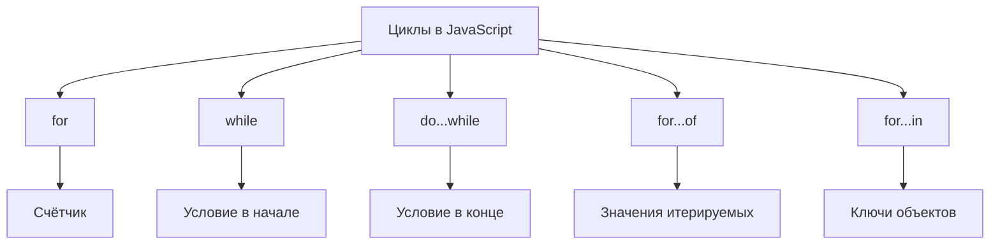

## Циклы

> **Связь с предыдущим курсом:** в предыдущих уроках мы изучили переменные, типы данных, операторы и управление потоком с помощью `if...else`. Но что, если нужно повторить одно и то же действие много раз — например, вывести все числа от 1 до 100? Циклы решают эту задачу: они позволяют многократно выполнять блок кода с минимальными усилиями.

---

## Цель урока

Понять, что такое циклы и как они работают в JavaScript — чтобы к концу урока вы могли выбирать нужный тип цикла для любой ситуации, управлять выполнением цикла с помощью `break` и `continue`, а также избегать бесконечных циклов.

## Что вы узнаете к концу урока

- Объяснить, что такое цикл, и назвать три основных компонента: инициализация, условие и шаг.
- Использовать цикл `for`, когда количество итераций известно заранее.
- Использовать цикл `while`, когда количество итераций зависит от условия.
- Использовать цикл `do...while`, когда тело должно выполниться хотя бы один раз.
- Управлять потоком цикла с помощью `break` и `continue`.
- Использовать `for...of` для перебора значений массивов и строк.
- Использовать `for...in` для перебора ключей объектов — и понимать, почему его не следует использовать для массивов.
- Распознавать и предотвращать бесконечные циклы.
- Использовать вложенные циклы и метки с `break` для выхода из внешнего цикла.

---

## Хронология урока

| Блок | Содержание |
| --- | --- |
| 1. Что такое цикл | Аналогия с беговой дорожкой, основные компоненты |
| 2. Цикл `for` | Синтаксис, порядок выполнения, примеры |
| 3. Цикл `while` | Проверка условия в начале, примеры |
| 4. Цикл `do...while` | Проверка условия в конце, сравнение с `while` |
| 5. Управление циклом: `break` и `continue` | Досрочный выход, пропуск итерации |
| 6. `for...of` и `for...in` | Перебор значений vs. ключей |
| 7. Бесконечные циклы | Причины, профилактика |
| 8. Вложенные циклы и метки с `break` | Таблица умножения, выход из внешнего цикла |
| 9. Сравнительная таблица | Все циклы в одном месте |
| 10. Практика и итог | Задания и ключевые выводы |

---

## Блок 1. Что такое цикл

**Простыми словами:** представьте, что вы находитесь на беговой дорожке. Вы бегаете круги — каждый круг это одно и то же действие (бег), и вы останавливаетесь, когда пробежали нужное количество кругов. Цикл в программировании работает так же: он повторяет блок кода до тех пор, пока выполняется условие.

**Цикл** — это управляющая конструкция, которая позволяет многократно выполнять блок кода, пока выполняется определённое условие.

Каждый цикл строится вокруг трёх идей:

| Компонент | Что делает | Пример |
| --- | --- | --- |
| **Инициализация** | Задаёт начальное значение (счётчик) | `let i = 0` |
| **Условие** | Проверяется перед каждой итерацией; цикл работает, пока истинно | `i < 5` |
| **Шаг** | Обновляет счётчик после каждой итерации | `i++` |

---

## Блок 2. Цикл `for`

Цикл `for` — самый распространённый цикл в JavaScript. Он используется, когда заранее известно, сколько раз нужно повторить действие.

### Синтаксис

```javascript
for (инициализация; условие; шаг) {
    // тело цикла
}
```

### Порядок выполнения

1. **Инициализация** выполняется **один раз** в самом начале.
2. **Условие** проверяется **перед** каждой итерацией.
3. **Тело цикла** выполняется только если условие истинно.
4. **Шаг** выполняется **после** тела.
5. Шаги 2-4 повторяются, пока условие не станет ложным.

### Примеры

Базовый перебор:

```javascript
for (let i = 1; i <= 5; i++) {
    console.log(`Круг: ${i}`);
}
```

Сумма чисел от 1 до 10:

```javascript
let sum = 0;
for (let i = 1; i <= 10; i++) {
    sum += i;
}
console.log(sum); // 55
```

Перебор массива:

```javascript
const fruits = ['apple', 'banana', 'orange'];
for (let i = 0; i < fruits.length; i++) {
    console.log(fruits[i]);
}
// apple
// banana
// orange
```

Обратный отсчёт и шаг больше 1:

```javascript
for (let i = 10; i > 0; i--) {
    console.log(i);
}
// 10, 9, 8, 7, 6, 5, 4, 3, 2, 1

for (let i = 0; i < 10; i += 2) {
    console.log(i); // 0, 2, 4, 6, 8
}
```

### Типичные ошибки начинающих

| Ошибка | Как исправить |
| --- | --- |
| Ошибка на единицу: `i <= fruits.length` при обращении по индексу | Индексы начинаются с 0 и заканчиваются `length - 1` |
| Забыли шаг — нет `i++`, цикл становится бесконечным | Всегда включайте шаг, приближающий к условию выхода |
| Поместили шаг перед телом | Шаг выполняется **после** тела |

---

## Блок 3. Цикл `while`

Цикл `while` подходит, когда заранее **неизвестно**, сколько итераций потребуется. Условие проверяется **перед** каждой итерацией, поэтому цикл может выполниться **ни разу**.

### Синтаксис

```javascript
while (условие) {
    // тело цикла
}
```

### Примеры

```javascript
let count = 1;
while (count <= 5) {
    console.log(`count = ${count}`);
    count++;
}
```

Чтение элементов массива:

```javascript
const numbers = [10, 20, 30, 40, 50];
let index = 0;
while (index < numbers.length) {
    console.log(numbers[index]);
    index++;
}
```

Ожидание ввода пользователя:

```javascript
let password = '';
while (password !== 'secret') {
    password = prompt('Введите пароль:');
}
console.log('Доступ разрешён!');
```

---

## Блок 4. Цикл `do...while`

Цикл `do...while` выполняет тело **сначала**, а условие проверяет **после**. Это гарантирует, что тело выполнится **хотя бы один раз**.

### Синтаксис

```javascript
do {
    // тело цикла
} while (условие);
```

Точка с запятой после закрывающей скобки обязательна.

### Сравнение `while` и `do...while`

```javascript
// while — может не выполниться ни разу
let a = 5;
while (a < 0) {
    console.log('Не выполнится');
}

// do...while — выполняется хотя бы один раз
let b = 5;
do {
    console.log('Выполнится один раз');
} while (b < 0);
```

### Пример: Валидация ввода

```javascript
let age;
do {
    age = parseInt(prompt('Введите ваш возраст (от 0 до 120):'));
} while (isNaN(age) || age < 0 || age > 120);
console.log(`Ваш возраст: ${age}`);
```

---

## Блок 5. Управление циклом: `break` и `continue`

### Оператор `break`

`break` **полностью прекращает** выполнение цикла.

```javascript
for (let i = 0; i < 10; i++) {
    if (i === 5) {
        break;
    }
    console.log(i);
}
// 0, 1, 2, 3, 4
```

### Оператор `continue`

`continue` **пропускает** остаток текущей итерации и переходит к следующей. Сам цикл не завершается.

Оператор остатка от деления `%` полезен: `i % 2 === 0` означает, что число чётное.

```javascript
for (let i = 0; i < 10; i++) {
    if (i % 2 === 0) {
        continue;
    }
    console.log(i);
}
// 1, 3, 5, 7, 9
```

### Практический пример: Поиск в массиве

```javascript
const numbers = [3, 7, 12, 5, 9, 1];
let target = 5;
let found = false;

for (let i = 0; i < numbers.length; i++) {
    if (numbers[i] === target) {
        console.log(`Найдено число ${target} на позиции ${i}`);
        found = true;
        break;
    }
}

if (!found) {
    console.log('Число не найдено');
}
```

---

## Блок 6. `for...of` и `for...in`

### `for...of` — перебор значений

`for...of` — современный цикл ES6+ для перебора **итерируемых объектов** — массивов, строк, Map, Set. Он даёт прямой доступ к **значениям**, а не к индексам.

```javascript
const colors = ['red', 'green', 'blue'];
for (const color of colors) {
    console.log(color);
}
// red, green, blue

const str = 'Hello';
for (const char of str) {
    console.log(char);
}
// H, e, l, l, o
```

### `for...in` — перебор ключей

`for...in` перебирает **имена перечисляемых свойств** (ключи) объекта. Предназначен для объектов, а не для массивов.

```javascript
const user = {
    name: 'John',
    age: 30,
    city: 'New York'
};

for (const key in user) {
    console.log(`${key}: ${user[key]}`);
}
// name: John
// age: 30
// city: New York
```

### Предупреждение: не используйте `for...in` для массивов

`for...in` перебирает **все перечисляемые свойства**, а не только числовые индексы.

```javascript
const arr = ['a', 'b', 'c'];
Array.prototype.extra = 'extra';

for (const key in arr) {
    console.log(key); // '0', '1', '2', 'extra' — проблема!
}

for (const value of arr) {
    console.log(value); // 'a', 'b', 'c' — правильно
}
```

| Цикл | Использование | Возвращает | Предупреждение |
| --- | --- | --- | --- |
| `for` | Массивы (когда нужен индекс) | Индекс | Нет |
| `for...of` | Массивы, строки, коллекции | Значения | Нет |
| `for...in` | Объекты | Ключи (строки) | Не использовать для массивов |

---

## Блок 7. Бесконечные циклы

**Бесконечный цикл** — это цикл, условие которого никогда не становится ложным. Программа зависнет, замёрзнет или упадёт.

### Типичные причины

```javascript
while (true) {
    console.log('Бесконечность!');
}

let i = 0;
while (i < 5) {
    console.log(i);
    // i++ пропущен!
}

for (let i = 0; i >= 0; i++) {
    console.log(i); // бесконечно
}
```

### Как избежать

```javascript
let counter = 0;
while (counter < 5) {
    console.log(counter);
    counter++;
}

let attempts = 0;
while (true) {
    attempts++;
    if (attempts > 3) {
        console.log('Превышено количество попыток');
        break;
    }
}

let input;
do {
    input = prompt('Введите число больше 0:');
} while (isNaN(input) || Number(input) <= 0);
```

---

## Блок 8. Вложенные циклы и метки с `break`

**Вложенный цикл** — это цикл внутри другого цикла. На каждой итерации внешнего цикла внутренний выполняется **полностью**.

```javascript
for (let i = 0; i < 3; i++) {
    for (let j = 0; j < 3; j++) {
        console.log(`i=${i}, j=${j}`);
    }
}
```

### Пример: Таблица умножения

```javascript
for (let i = 1; i <= 5; i++) {
    let row = '';
    for (let j = 1; j <= 5; j++) {
        row += (i * j) + '\t';
    }
    console.log(row);
}
// 1    2    3    4    5
// 2    4    6    8    10
// 3    6    9    12   15
// 4    8    12   16   20
// 5    10   15   20   25
```

### `break` во вложенном цикле

По умолчанию `break` выходит только из **внутреннего** цикла:

```javascript
for (let i = 0; i < 3; i++) {
    for (let j = 0; j < 3; j++) {
        if (j === 1) break;
        console.log(`i=${i}, j=${j}`);
    }
}
```

### Метки с `break` — выход из внешнего цикла

**Метка** позволяет обратиться к конкретному циклу:

```javascript
outer: for (let i = 0; i < 3; i++) {
    for (let j = 0; j < 3; j++) {
        if (i === 1 && j === 1) {
            break outer;
        }
        console.log(`i=${i}, j=${j}`);
    }
}
```

---

## Блок 9. Сравнительная таблица

| Тип цикла | Синтаксис | Когда использовать | Выполняется хотя бы раз? |
| --- | --- | --- | --- |
| `for` | `for (нач; усв; шаг) { }` | Известное число итераций | Нет |
| `while` | `while (условие) { }` | Неизвестное число итераций | Нет |
| `do...while` | `do { } while (условие)` | Тело должно выполниться хотя бы раз | Да |
| `for...of` | `for (const x of итерир) { }` | Перебор значений массивов/строк | Нет |
| `for...in` | `for (const ключ in объект) { }` | Перебор ключей объектов | Нет |



---

## Блок 10. Практика и итог

### Практика

**Задание 1:** Напишите цикл `for`, который выводит все чётные числа от 2 до 20.

**Задание 2:** Напишите цикл `while`, который повторно запрашивает у пользователя число от 1 до 10, пока он не угадает загаданное.

**Задание 3:** Напишите цикл `do...while`, который запрашивает пароль, пока пользователь не введёт правильный.

**Задание 4:** Используйте `for...of`, чтобы перебрать строку `'JavaScript'` и вывести каждый символ на отдельной строке.

**Задание 5:** Используйте `for...in`, чтобы вывести все ключи и значения `{ title: 'Великий Гэтсби', author: 'Фрэнсис Скотт Фицджеральд', year: 1925 }`.

**Задание 6:** Напишите вложенные циклы, которые выводят таблицу умножения 5x5.

### Итог урока

- **Цикл** — это управляющая конструкция, повторяющая код. Её три компонента: инициализация, условие и шаг.
- **`for`** — лучше всего, когда число итераций известно заранее.
- **`while`** — проверяет условие **перед** телом; может выполниться ни разу.
- **`do...while`** — проверяет условие **после** тела; выполняется хотя бы один раз.
- **`break`** полностью завершает цикл; **`continue`** пропускает текущую итерацию.
- **`for...of`** перебирает **значения** массивов, строк и других итерируемых объектов.
- **`for...in`** перебирает **ключи** объектов; его не следует использовать для массивов.
- **Бесконечные циклы** возникают, когда условие никогда не становится ложным — всегда обновляйте счётчик.
- **Вложенные циклы** запускают внутренний цикл полностью на каждой итерации внешнего. Используйте метки с `break` для выхода из внешнего цикла.

---

[Следующий урок: Функции →](../../Lesson-7/ru/Функции.md)
