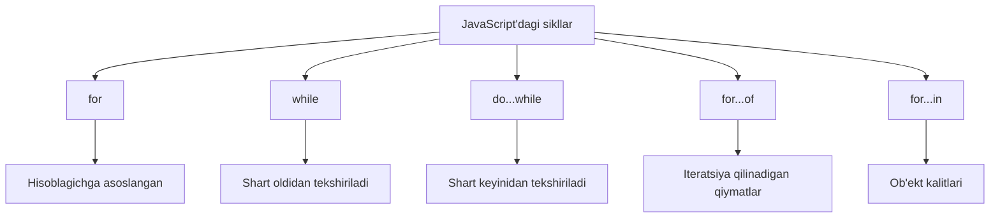

## Sikllar

> **Oldingi kurs bilan bog'liqlik:** oldingi darslarda o'zgaruvchilar, ma'lumot turlari, operatorlar va `if...else` orqali oqimni boshqarishni o'rgandik. Lekin bir xil amalni ko'p marta takrorlash kerak bo'lsa — masalan, 1-dan 100 gacha barcha sonlarni chiqarish? Sikllar shu muammoni hal qiladi: ular kod blokini minimal kuch sarflab qayta-qayta bajarish imkonini beradi.

---

## Darsning maqsadi

Sikllarning nima ekanligini va JavaScript'da qanday ishlashini tushunish — dars oxiriga qadar har qanday holat uchun to'g'ri sikl turini tanlash, `break` va `continue` orqali sikl bajarilishini boshqarish hamda cheksiz sikllardan qochishni o'rganish.

## Dars oxiriga qadar nima bilib olasiz

- Sikl nima ekanligini tushuntirish va uchta asosiy komponentni nomlash.
- Iteratsiyalar soni oldindan ma'lum bo'lganda `for` siklidan foydalanish.
- Iteratsiyalar soni shartga bog'liq bo'lganda `while` siklidan foydalanish.
- Tana kamida bir marta bajarilishi kerak bo'lganda `do...while` siklidan foydalanish.
- `break` va `continue` orqali sikl oqimini boshqarish.
- Massivlar va satrlar qiymatlarini `for...of` bilan shaffof qilish.
- Ob'ektlar kalitlarini `for...in` bilan shaffof qilish — va nima uchun massivlar uchun ishlatmaslik kerakligini tushunish.
- Cheksiz sikllarni aniqlash va oldini olish.
- Ichki sikllar va `break` bilan belgilar yordamida tashqi sikldan chiqish.

---

## Dars jadvali

| Blok | Mazmun |
| --- | --- |
| 1. Sikl nima | Yugurish yo'lagi analogiyasi, asosiy komponentlar |
| 2. `for` sikli | Sintaksis, bajarilish tartibi, misollar |
| 3. `while` sikli | Shart oldidan tekshirish, misollar |
| 4. `do...while` sikli | Shart keyinidan tekshirish, `while` bilan taqqoslash |
| 5. Sikl boshqaruvi: `break` va `continue` | Erta chiqish, iteratsiyani o'tkazib yuborish |
| 6. `for...of` va `for...in` | Qiymatlarni shaffof qilish vs. kalitlarni |
| 7. Cheksiz sikllar | Sabablari, oldini olish |
| 8. Ichki sikllar va `break` bilan belgilar | Ko'paytirish jadvali, tashqi sikldan chiqish |
| 9. Taqqoslash jadvali | Barcha sikllar bir joyda |
| 10. Amaliyot va xulosa | Topshiriqlar va asosiy xulosalar |

---

## Blok 1. Sikl nima oddiy qilib aytganda

**Oddiy qilib aytganda:** yugurish yo'lagida turganligingizni tasavvur qiling. Siz doiralar yugurasiz — har bir doira bir xil amal (yugurish) va siz belgilangan sonda to'xtaysiz. Dasturlashdagi sikl ham shunday ishlaydi: u shart bajarilguncha kod blokini takrorlaydi.

**Sikl** — bu ma'lum shart bajarilguncha kod blokini qayta-qayta bajarishga imkon beruvchi boshqaruv tuzilmasi.

| Komponent | Nima qiladi | Misol |
| --- | --- | --- |
| **Inisializatsiya** | Boshlang'ich qiymatni belgilaydi (hisoblagich) | `let i = 0` |
| **Shart** | Har bir iteratsiyadan oldin tekshiriladi; sikl faqat bajarilganda ishlaydi | `i < 5` |
| **Qadam** | Har bir iteratsiyadan keyin hisoblagichni yangilaydi | `i++` |

---

## Blok 2. `for` sikli

`for` sikli JavaScript'da eng ko'p ishlatiladigan sikldir. U oldindan necha marta takrorlash kerakligini **bilganingizda** ishlatiladi.

### Sintaksis

```javascript
for (inisializatsiya; shart; qadam) {
    // sikl tanasi
}
```

### Bajarilish tartibi

1. **Inisializatsiya** **bir marta** boshida bajariladi.
2. **Shart** har bir iteratsiyadan **oldin** tekshiriladi.
3. **Sikl tanasi** faqat shart bajarilganda ishlaydi.
4. **Qadam** tanadan **keyin** bajariladi.
5. 2-4 qadamlar shart yolg'on bo'lgunga qadar takrorlanadi.

### Misollar

Oddiy iteratsiya:

```javascript
for (let i = 1; i <= 5; i++) {
    console.log(`Davra: ${i}`);
}
```

1-dan 10 gacha sonlar yig'indisi:

```javascript
let sum = 0;
for (let i = 1; i <= 10; i++) {
    sum += i;
}
console.log(sum); // 55
```

Massivni shaffof qilish:

```javascript
const fruits = ['apple', 'banana', 'orange'];
for (let i = 0; i < fruits.length; i++) {
    console.log(fruits[i]);
}
// apple
// banana
// orange
```

Teskari sanash va qadam 1 dan katta:

```javascript
for (let i = 10; i > 0; i--) {
    console.log(i);
}
// 10, 9, 8, 7, 6, 5, 4, 3, 2, 1

for (let i = 0; i < 10; i += 2) {
    console.log(i); // 0, 2, 4, 6, 8
}
```

### Kech boshlanuvchilar uchun tipik xatolar

| Xato | Qanday tuzatish |
| --- | --- |
| Bitta xato: `i <= fruits.length` yozish | Massiv indekslari 0 dan boshlanadi va `length - 1` bilan tugaydi |
| Qadami unutish — `i++` yo'q | Har doim chiqish shartiga yaqinlashtiruvchi qadam qo'shing |
| Qadani tanadan oldin qo'yish | Qadam tanadan **keyin** bajariladi |

---

## Blok 3. `while` sikli

`while` sikli iteratsiyalar soni oldindan **noma'lum** bo'lganda mos keladi. Shart har bir iteratsiyadan **oldin** tekshiriladi, shuning uchun sikl **hech qachon** bajarilmasligi mumkin.

### Sintaksis

```javascript
while (shart) {
    // sikl tanasi
}
```

### Misollar

```javascript
let count = 1;
while (count <= 5) {
    console.log(`count = ${count}`);
    count++;
}
```

Massiv elementlarini o'qish:

```javascript
const numbers = [10, 20, 30, 40, 50];
let index = 0;
while (index < numbers.length) {
    console.log(numbers[index]);
    index++;
}
```

Foydalanuvchi kiritishini kutish:

```javascript
let password = '';
while (password !== 'secret') {
    password = prompt('Parolni kiriting:');
}
console.log('Kirish ruxsat etildi!');
```

---

## Blok 4. `do...while` sikli

`do...while` sikli tanani **avval** bajaradi, shartni **keyin** tekshiradi. Bu tananing **kamida bir marta** bajarilishini kafolatlaydi.

### Sintaksis

```javascript
do {
    // sikl tanasi
} while (shart);
```

Yopuvchi qavsdan keyin nuqta-vergul qo'yilishi shart.

### `while` va `do...while` ni taqqoslash

```javascript
// while — hech qachon bajarilmasligi mumkin
let a = 5;
while (a < 0) {
    console.log('Bajarilmaydi');
}

// do...while — kamida bir marta bajariladi
let b = 5;
do {
    console.log('Bir marta bajariladi');
} while (b < 0);
```

### Misol: Kiritishni tekshirish

```javascript
let age;
do {
    age = parseInt(prompt('Yoshingizni kiriting (0 dan 120 gacha):'));
} while (isNaN(age) || age < 0 || age > 120);
console.log(`Sizning yoshingiz: ${age}`);
```

---

## Blok 5. Sikl boshqaruvi: `break` va `continue`

### `break` operatori

`break` sikl bajarilishini **to'liq to'xtatadi**.

```javascript
for (let i = 0; i < 10; i++) {
    if (i === 5) {
        break;
    }
    console.log(i);
}
// 0, 1, 2, 3, 4
```

### `continue` operatori

`continue` joriy iteratsiyaning qolgan qismini **o'tkazib yuboradi** va keyingisiga o'tadi.

Qoldiq operatori `%` foydali: `i % 2 === 0` son juft ekanligini anglatadi.

```javascript
for (let i = 0; i < 10; i++) {
    if (i % 2 === 0) {
        continue;
    }
    console.log(i);
}
// 1, 3, 5, 7, 9
```

### Amaliy misol: Massivda qidirish

```javascript
const numbers = [3, 7, 12, 5, 9, 1];
let target = 5;
let found = false;

for (let i = 0; i < numbers.length; i++) {
    if (numbers[i] === target) {
        console.log(`${target} soni ${i}-pozitsiyada topildi`);
        found = true;
        break;
    }
}

if (!found) {
    console.log('Son topilmadi');
}
```

---

## Blok 6. `for...of` va `for...in`

### `for...of` — qiymatlarni shaffof qilish

`for...of` ES6+ ning zamonaviy sikli bo'lib, **iteratsiya qilinadigan ob'ektlarni** — massivlarni, satrlarni, Map, Set va boshqa to'plamlarni — shaffof qilish uchun mo'ljallangan. U to'g'ridan-to'g'ri **qiymatlarga** kirishni beradi.

```javascript
const colors = ['red', 'green', 'blue'];
for (const color of colors) {
    console.log(color);
}
// red, green, blue

const str = 'Hello';
for (const char of str) {
    console.log(char);
}
// H, e, l, l, o
```

### `for...in` — kalitlarni shaffof qilish

`for...in` ob'ektning **ko'rinadigan xususiyatlari nomlarini** (kalitlarni) shaffof qiladi. U ob'ektlar uchun mo'ljallangan, massivlar uchun emas.

```javascript
const user = {
    name: 'John',
    age: 30,
    city: 'New York'
};

for (const key in user) {
    console.log(`${key}: ${user[key]}`);
}
// name: John
// age: 30
// city: New York
```

### Ogohlantirish: `for...in` ni massivlar uchun ishlatmang

`for...in` **barcha ko'rinadigan xususiyatlarni** shaffof qiladi, faqat raqamli indekslarni emas.

```javascript
const arr = ['a', 'b', 'c'];
Array.prototype.extra = 'extra';

for (const key in arr) {
    console.log(key); // '0', '1', '2', 'extra' — muammo!
}

for (const value of arr) {
    console.log(value); // 'a', 'b', 'c' — to'g'ri
}
```

| Sikl | Foydalanish | Qaytaradi | Ogohlantirish |
| --- | --- | --- | --- |
| `for` | Massivlar (indeks kerak bo'lganda) | Indeks | Yo'q |
| `for...of` | Massivlar, satrlar, to'plamlar | Qiymatlar | Yo'q |
| `for...in` | Ob'ektlar | Kalitlar (satrlar) | Massivlar uchun ishlatmang |

---

## Blok 7. Cheksiz sikllar

**Cheksiz sikl** — bu sharti hech qachon yolg'on bo'lmaydigan sikl. Dastur osilib qoladi, muzlaydi yoki buziladi.

### Tarqalgan sabablari

```javascript
while (true) {
    console.log('Cheksizlik!');
}

let i = 0;
while (i < 5) {
    console.log(i);
    // i++ o'tkazib yuborildi!
}

for (let i = 0; i >= 0; i++) {
    console.log(i); // cheksiz
}
```

### Cheksiz sikllardan qanday qochish kerak

```javascript
let counter = 0;
while (counter < 5) {
    console.log(counter);
    counter++;
}

let attempts = 0;
while (true) {
    attempts++;
    if (attempts > 3) {
        console.log('Urinishlar soni oshib ketdi');
        break;
    }
}

let input;
do {
    input = prompt('0 dan katta son kiriting:');
} while (isNaN(input) || Number(input) <= 0);
```

---

## Blok 8. Ichki sikllar va `break` bilan belgilar

**Ichki sikl** — bu boshqa sikl ichidagi sikl. Tashqi siklning har bir iteratsiyasida ichki sikl **to'liq** bajariladi.

```javascript
for (let i = 0; i < 3; i++) {
    for (let j = 0; j < 3; j++) {
        console.log(`i=${i}, j=${j}`);
    }
}
```

### Misol: Ko'paytirish jadvali

```javascript
for (let i = 1; i <= 5; i++) {
    let row = '';
    for (let j = 1; j <= 5; j++) {
        row += (i * j) + '\t';
    }
    console.log(row);
}
// 1    2    3    4    5
// 2    4    6    8    10
// 3    6    9    12   15
// 4    8    12   16   20
// 5    10   15   20   25
```

### Ichki siklda `break`

Standart holatda `break` faqat **ichki** sikldan chiqadi:

```javascript
for (let i = 0; i < 3; i++) {
    for (let j = 0; j < 3; j++) {
        if (j === 1) break;
        console.log(`i=${i}, j=${j}`);
    }
}
```

### Belgilar bilan `break` — tashqi sikldan chiqish

**Belgi** ma'lum siklni aniqlashga imkon beradi:

```javascript
outer: for (let i = 0; i < 3; i++) {
    for (let j = 0; j < 3; j++) {
        if (i === 1 && j === 1) {
            break outer;
        }
        console.log(`i=${i}, j=${j}`);
    }
}
```

---

## Blok 9. Taqqoslash jadvali

| Sikl turi | Sintaksis | Qachon ishlatish | Kamida bir marta bajariladimi? |
| --- | --- | --- | --- |
| `for` | `for (bosh; shart; qadam) { }` | Iteratsiyalar soni ma'lum | Yo'q |
| `while` | `while (shart) { }` | Iteratsiyalar soni noma'lum | Yo'q |
| `do...while` | `do { } while (shart)` | Tana kamida bir marta bajarilishi kerak | Ha |
| `for...of` | `for (const x of iteratsiya) { }` | Iteratsiya qilinadigan qiymatlar | Yo'q |
| `for...in` | `for (const kalit in ob'ekt) { }` | Ob'ekt kalitlari | Yo'q |



---

## Blok 10. Amaliyot va xulosa

### Amaliyot

**Topshiriq 1:** 2 dan 20 gacha barcha juft sonlarni chiqaruvchi `for` siklini yozing.

**Topshiriq 2:** Foydalanuvchidan 1 dan 10 gacha son taxmin qilishini so'raydigan `while` siklini yozing.

**Topshiriq 3:** Foydalanuvchi to'g'ri parolni kiritguncha parol so'raydigan `do...while` siklini yozing.

**Topshiriq 4:** `for...of` dan foydalanib, `'JavaScript'` satrini shaffof qiling va har bir belgini alohida qatorga chiqaring.

**Topshiriq 5:** `for...in` dan foydalanib, `{ title: 'Buyuk Gatsby', author: 'Frensis Skott Ficjerald', year: 1925 }` ob'ektidagi barcha kalitlar va qiymatlarni chiqaring.

**Topshiriq 6:** 5x5 ko'paytirish jadvalini chiqaruvchi ichki sikllar yozing.

### Dars xulosasi

- **Sikl** — kodni takrorlaydigan boshqaruv tuzilmasi. Uning uchta komponenti: inisializatsiya, shart va qadam.
- **`for`** — iteratsiyalar soni oldindan ma'lum bo'lganda eng yaxshi.
- **`while`** tanadan **oldin** shartni tekshiradi; hech qachon bajarilmasligi mumkin.
- **`do...while`** tanadan **keyin** shartni tekshiradi; kamida bir marta bajariladi.
- **`break`** siklni to'liq tugatadi; **`continue`** joriy iteratsiyani o'tkazib yuboradi.
- **`for...of`** massivlar, satrlar va boshqa iteratsiya qilinadigan ob'ektlar **qiymatlarini** shaffof qiladi.
- **`for...in`** ob'ektlar **kalitlarini** shaffof qiladi; uni massivlar uchun ishlatmaslik kerak.
- **Cheksiz sikllar** shart hech qachon yolg'on bo'lmaganda yuzaga keladi — har doim hisoblagichni o'zgartiring.
- **Ichki sikllar** tashqi siklning har bir iteratsiyasida ichki siklni to'liq ishga tushiradi. Kerak bo'lganda belgilar bilan `break` dan foydalaning.

---

[Keyingi dars: Funksiyalar →](../../Lesson-7/uz/Funksiyalar.md)
