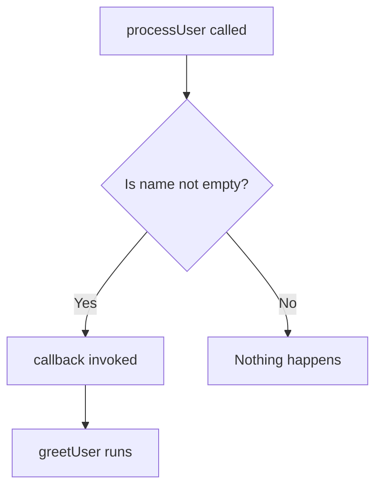
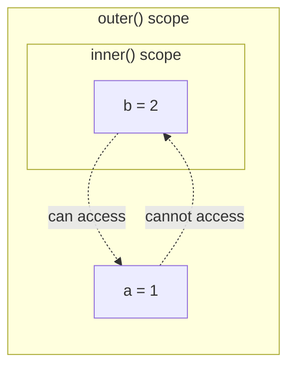
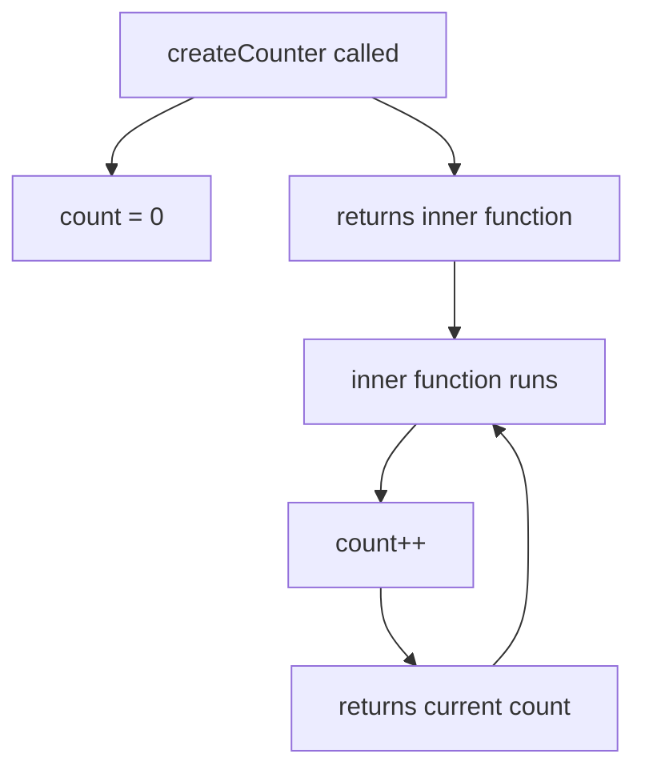

## Functions

> **Connection with the previous course:** in Lesson 6 we studied variables, data types, and operators — the building blocks of any program. Now it is time to learn how to package reusable logic into self-contained units called **functions**. Functions are the foundation of organized, maintainable JavaScript code.

---

## Lesson Goal

Understand what functions are, how to define and call them, and master the key concepts — parameters, return values, scope, closures, and recursion — so that by the end of the lesson you can break any complex problem into small, reusable pieces.

## What You Will Learn by the End of the Lesson

- Explain what a function is and distinguish between **definition** and **invocation**.
- Create functions in three ways: Function Declaration, Function Expression, and Arrow Function.
- Understand **hoisting** and why declarations can be called before they appear in the code.
- Use **parameters vs arguments** and set **default parameter values**.
- Return values with the `return` keyword and understand that it stops execution immediately.
- Pass functions as arguments (**callbacks**) — the concept of first-class functions.
- Distinguish between **global**, **function**, and **block** scope; understand the difference between `var`, `let`, and `const`.
- Recognize how **closures** allow a function to remember variables from its outer scope.
- Apply **recursion** with a proper base case and recursive step.

---

## Lesson Timeline

| Block | Content |
| --- | --- |
| 1. What a function is | Definition vs invocation, recipe analogy |
| 2. Three ways to create functions | Declaration, Expression, Arrow Function, hoisting |
| 3. Parameters and arguments | Parameters vs arguments, default values |
| 4. The return keyword | Returning values, early termination |
| 5. First-class functions and callbacks | Passing functions as arguments |
| 6. Scope | Global, function, block scope; var vs let/const |
| 7. Closures | How functions remember outer variables |
| 8. Recursion | Base case, recursive step, countdown example |
| 9. Practice | Hands-on exercises |
| 10. Summary | Key takeaways |

---

## Block 1. What a Function Is

**In simple terms:** a function is like a recipe in a cookbook. You write down the steps and ingredients once, and then you can follow that recipe as many times as you want — each time optionally substituting different ingredients (parameters) to get a different dish.

```javascript
function sayHello() {
    console.log('Hello, world!');
}

sayHello();
sayHello();
```

Here `function sayHello()` is the **definition** — we describe what the function does but nothing runs yet. The line `sayHello()` is the **invocation** — we actually execute the code inside the function.

### Definition vs Invocation

| Concept | What it does | When code runs |
| --- | --- | --- |
| **Definition** `function sayHello() { ... }` | Describes the function | Not until it is called |
| **Invocation** `sayHello()` | Executes the function body | Immediately when the line is reached |

---

## Block 2. Three Ways to Create Functions

### Method 1: Function Declaration (classic)

```javascript
function greet() {
    console.log('Hello!');
}

greet();
```

Function Declarations are **hoisted** — the JavaScript engine moves them to the top of their scope during preparation, so you can call a declared function **before** the line where it appears:

```javascript
sayHi();

function sayHi() {
    console.log('Hi!');
}
```

This works without errors because of hoisting.

### Method 2: Function Expression (function as a value)

```javascript
const sayGoodbye = function() {
    console.log('Goodbye!');
};

sayGoodbye();
```

Function Expressions are **not** hoisted. If you try to call them before the assignment, you get an error:

```javascript
sayHello2();

const sayHello2 = function() {
    console.log('Hello!');
};
// Error: Cannot access 'sayHello2' before initialization
```

### Method 3: Arrow Function (modern standard)

```javascript
const greet = () => {
    console.log('Hello!');
};

greet();
```

Arrow functions were introduced in ES6 and are shorter to write. They behave similarly to Function Expressions in terms of hoisting (they are **not** hoisted). For single-expression bodies, you can omit the braces and `return`:

```javascript
const double = (x) => x * 2;
console.log(double(5)); // 10
```

### Comparison Table

| Method | Syntax | Hoisted? | Typical Use |
| --- | --- | --- | --- |
| Function Declaration | `function name() { }` | Yes | Named standalone functions |
| Function Expression | `const name = function() { }` | No | Assigning a function to a variable |
| Arrow Function | `const name = () => { }` | No | Short callbacks, concise one-liners |

---

## Block 3. Parameters and Arguments

Functions can accept data on input.

- **Parameters** are the variable names listed in the function definition — they are placeholders.
- **Arguments** are the actual values you pass when you call the function.

```javascript
function greet(name, age) {
    console.log('My name is ' + name + ', I am ' + age + ' years old.');
}

greet('Alex', 25);
greet('Maria', 30);
```

Here `name` and `age` are parameters; `'Alex'` and `25` (or `'Maria'` and `30`) are arguments.

### Default Parameter Values

If an argument is not passed, the parameter becomes `undefined`. To avoid this, set default values:

```javascript
function multiply(a, b = 2) {
    return a * b;
}

console.log(multiply(5, 3)); // 15
console.log(multiply(5));    // 10 (5 * 2)
```

Defaults can also be computed at call time:

```javascript
function greet(name, greeting = 'Hello, ' + name + '!') {
    return greeting;
}

console.log(greet('Anna'));            // 'Hello, Anna!'
console.log(greet('Anna', 'Hi!'));     // 'Hi!'
```

---

## Block 4. The return Keyword

The most important thing a function can do is **return** a result using the `return` keyword. After `return`, the function **stops executing immediately** — any code after `return` is never reached.

```javascript
function sum(a, b) {
    const result = a + b;
    return result;
}

const total = sum(5, 3);
console.log(total); // 8
```

If a function has no `return` statement, it returns `undefined` by default:

```javascript
function doNothing() {}
console.log(doNothing()); // undefined
```

### return stops execution immediately

```javascript
function test() {
    console.log('Start');
    return 'End';
    console.log('This will never run');
}

console.log(test()); // 'Start', then 'End'
```

The string `'This will never run'` is never printed because `return` terminates the function before reaching it.

---

## Block 5. First-Class Functions and Callbacks

In JavaScript, functions are **first-class citizens** — they can be stored in variables, passed as arguments, and returned from other functions.

A **callback** is a function that you pass as an argument to another function, to be called later:

```javascript
function greetUser(name) {
    console.log('Hello, ' + name);
}

function processUser(name, callback) {
    if (name.length > 0) {
        callback(name);
    }
}

processUser('Maxim', greetUser); // 'Hello, Maxim'
processUser('', greetUser);      // nothing is printed
```

`processUser` does not know in advance what `greetUser` does — it simply receives a function as an argument and decides whether to call it based on a condition. This makes `processUser` reusable with any callback.



---

### Common Beginner Mistakes

| Error | How to Fix |
| --- | --- |
| Forgetting to pass a callback argument and getting `TypeError: callback is not a function` | Always make sure the callback parameter is a function before calling it |
| Calling the callback with parentheses when passing it: `processUser('Max', greetUser())` | Pass the function itself without `()`: `processUser('Max', greetUser)` |
| Assuming the function "knows" what the callback does | The receiving function should be written generically — it only calls the callback, it does not care about its internal logic |

---

## Block 6. Scope

**Scope** determines where a variable is accessible in your code. Think of it as rooms in a house — things inside a room are only visible to people in that room, while things in the hallway (global scope) are visible from everywhere.

### Global Scope

A variable declared outside any function or block is accessible everywhere:

```javascript
let city = 'Tashkent';

function showCity() {
    console.log(city);
}

showCity(); // 'Tashkent'
```

### Function Scope

Variables declared inside a function (with `var`, `let`, or `const`) are only accessible inside that function:

```javascript
function greet() {
    let message = 'Hello!';
    console.log(message);
}

greet();    // 'Hello!'
// console.log(message); // Error: message is not defined
```

### Block Scope

`let` and `const` respect block scope — they are confined to the nearest `{ }`. `var` does **not** respect block scope and leaks out:

```javascript
if (true) {
    let x = 10;
    var y = 20;
}

console.log(y); // 20 — var escaped the block
// console.log(x); // Error: x is not defined
```

### Scope Chain

An inner function can see variables of the outer function, but not the other way around:

```javascript
function outer() {
    let a = 1;

    function inner() {
        let b = 2;
        console.log(a); // 1 — inner sees outer's variables
    }

    inner();
    // console.log(b); // Error: outer cannot see inner's variables
}
```



---

## Block 7. Closures

A **closure** is when a function "remembers" variables from its outer scope, even after the outer function has finished executing.

```javascript
function createCounter() {
    let count = 0;

    return function() {
        count++;
        return count;
    };
}

const counter = createCounter();
console.log(counter()); // 1
console.log(counter()); // 2
console.log(counter()); // 3
```

After `createCounter()` returns, its local variable `count` would normally be destroyed. But the inner function returned holds a reference to it — this is a closure. Every call to `counter()` accesses and modifies the same `count`.



---

## Block 8. Recursion

**Recursion** is when a function calls itself to solve a problem. A large task is broken into smaller versions of itself until the simplest case — the **base case** — is reached.

Every recursive function needs two things:

1. **Base case** — the condition under which the function stops calling itself.
2. **Recursive step** — the function calls itself with modified arguments, moving toward the base case.

```javascript
function countdown(n) {
    if (n <= 0) {
        console.log('Start!');
        return;
    }
    console.log(n);
    countdown(n - 1);
}

countdown(3);
```

Output:

```
3
2
1
Start!
```

Without a base case, the function calls itself forever until the browser throws `RangeError: Maximum call stack size exceeded`.

**Analogy:** recursion is like a set of nesting dolls — you keep opening the next one until you reach the smallest doll that cannot be opened (the base case).

---

### Common Beginner Mistakes

| Error | How to Fix |
| --- | --- |
| Forgetting the base case, causing infinite recursion | Always define a clear stopping condition before the recursive call |
| Mutating the arguments incorrectly so the base case is never reached | Make sure each recursive step moves closer to the base case |
| Using recursion when a simple loop would suffice | Prefer iteration for straightforward repetition; use recursion for problems that naturally decompose into sub-problems (trees, divide-and-conquer) |

---

## Practice

1. Write a function `add(a, b)` that returns the sum of two numbers and log the result.
2. Rewrite `add` as an Arrow Function assigned to a `const`.
3. Write a function `factorial(n)` using recursion that returns the factorial of `n`.
4. Create a function `makeGreeter(defaultGreeting)` that returns a new function. The returned function should accept a `name` and print `defaultGreeting + name`. Test it with two different greetings.
5. Write a function that demonstrates block scope: declare a `let` and a `var` inside an `if` block, and show which one is accessible outside.

---

## Lesson Summary

Today you learned:

- A **function** is a reusable block of code defined once and called many times.
- There are three ways to create functions: **Function Declaration**, **Function Expression**, and **Arrow Function**.
- **Hoisting** allows Function Declarations to be called before they appear in the code; expressions and arrow functions are not hoisted.
- **Parameters** are placeholders in the definition; **arguments** are the actual values passed at call time; **default parameters** handle missing arguments.
- The `return` keyword sends a value back to the caller and **stops execution** immediately.
- Functions are **first-class** — they can be passed as **callbacks** to other functions.
- **Scope** controls where variables are visible: global, function, or block scope; `var` leaks out of blocks, `let` and `const` do not.
- A **closure** is a function that retains access to variables from its enclosing scope.
- **Recursion** solves problems by calling the function itself with a base case that stops the chain.

---

[Next lesson: Date and Time →](../../Lesson-8/en/Date%20and%20Time.md)
