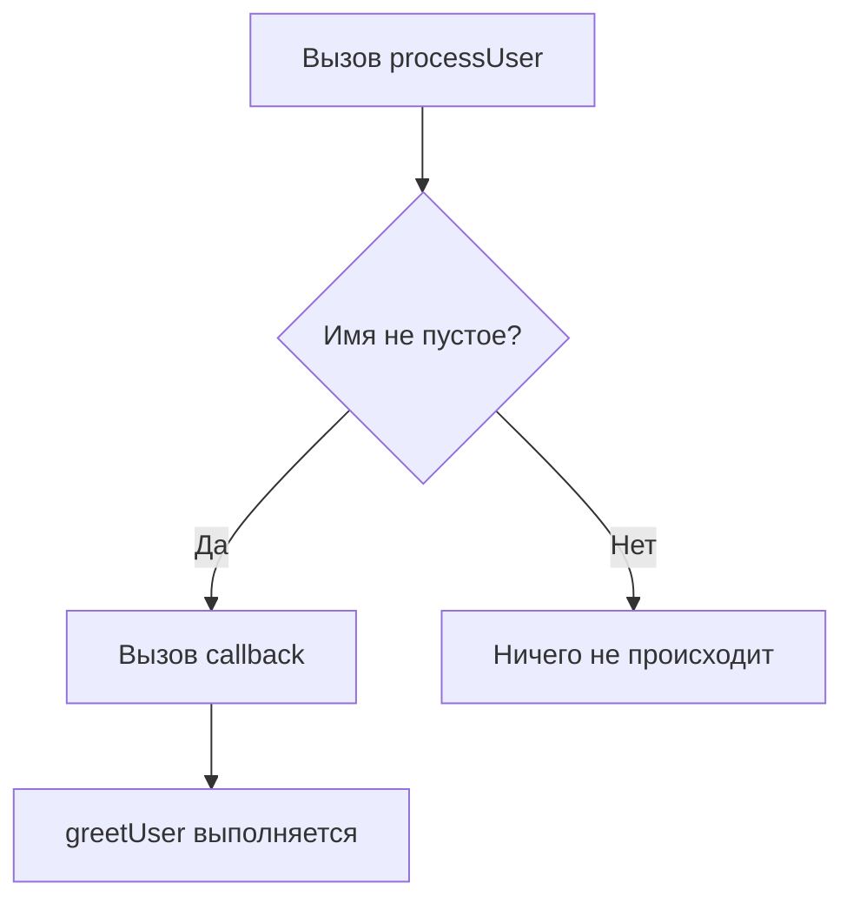
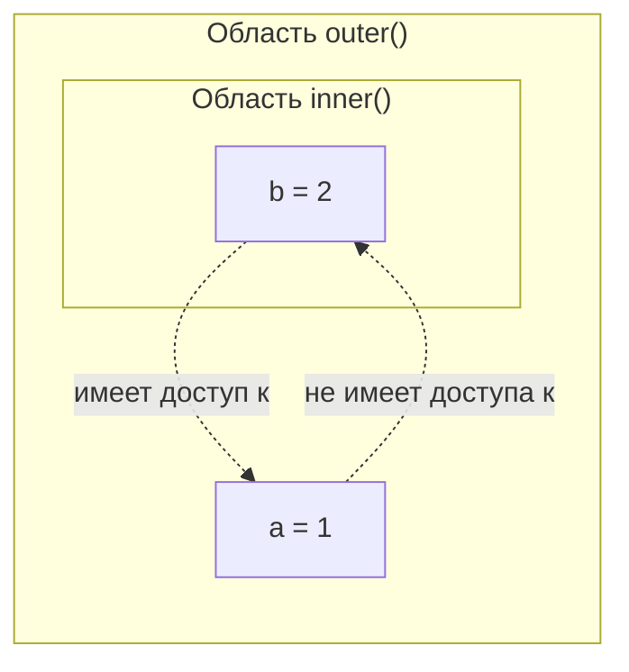
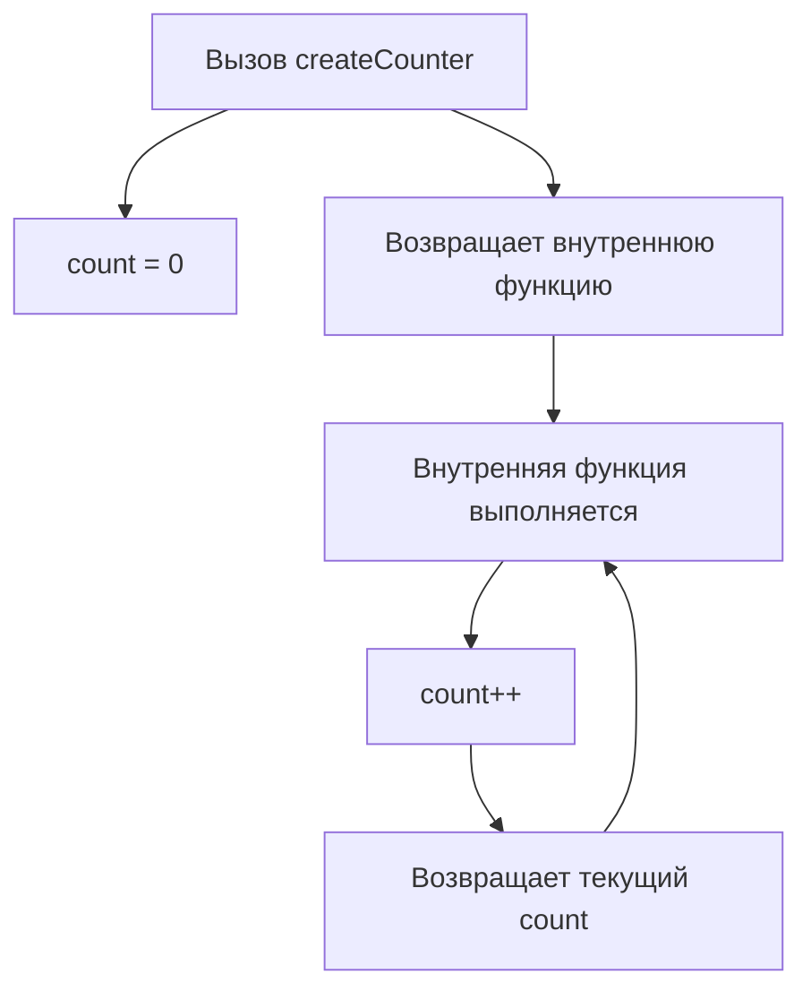

## Функции

> **Связь с предыдущим курсом:** в уроке 6 мы изучили переменные, типы данных и операторы — строительные блоки любой программы. Теперь пришло время научиться упаковывать повторяемую логику в самостоятельные единицы, называемые **функциями**. Функции — это основа организованного и удобного для сопровождения JavaScript-кода.

---

## Цель урока

Понять, что такое функции, научиться их определять и вызывать, освоить ключевые концепции — параметры, возврат значений, область видимости, замыкания и рекурсия — чтобы к концу урока вы могли разбивать любую сложную задачу на мелкие, переиспользуемые части.

## Что вы узнаете к концу урока

- Объяснить, что такое функция, и различать **определение** и **вызов**.
- Создавать функции тремя способами: Function Declaration, Function Expression и Arrow Function.
- Понять **hoisting** и почему объявленные функции можно вызывать до их появления в коде.
- Использовать **параметры и аргументы**, задавать **значения по умолчанию**.
- Возвращать значения с помощью `return` и понимать, что он немедленно останавливает выполнение.
- Передавать функции как аргументы (**callback-функции**) — концепция функций первого класса.
- Различать **глобальную**, **функциональную** и **блочную** области видимости; понимать разницу между `var`, `let` и `const`.
- Понять, как **замыкания** позволяют функции запоминать переменные из внешней области.
- Применять **рекурсию** с правильным базовым случаем и рекурсивным шагом.

---

## Хронология урока

| Блок | Содержание |
| --- | --- |
| 1. Что такое функция | Определение и вызов, аналогия с рецептом |
| 2. Три способа создания функций | Declaration, Expression, Arrow Function, hoisting |
| 3. Параметры и аргументы | Параметры vs аргументы, значения по умолчанию |
| 4. Ключевое слово return | Возврат значений, раннее завершение |
| 5. Функции первого класса и callback | Передача функций как аргументов |
| 6. Область видимости | Глобальная, функциональная, блочная; var vs let/const |
| 7. Замыкания | Как функции запоминают внешние переменные |
| 8. Рекурсия | Базовый случай, рекурсивный шаг, пример обратного отсчёта |
| 9. Практика | Практические задания |
| 10. Итоги урока | Ключевые выводы |

---

## Блок 1. Что такое функция

**Простыми словами:** функция — это как рецепт в кулинарной книге. Вы один раз записываете, как готовить борщ (ингредиенты и шаги), а потом используете этот рецепт много раз, просто подставляя нужные продукты (параметры).

```javascript
function sayHello() {
    console.log('Привет, мир!');
}

sayHello();
sayHello();
```

Здесь `function sayHello()` — это **определение** — мы описываем, что делает функция, но ничего не выполняется. Строка `sayHello()` — это **вызов** — мы фактически запускаем код внутри функции.

### Определение и вызов

| Понятие | Что делает | Когда выполняется код |
| --- | --- | --- |
| **Определение** `function sayHello() { ... }` | Описывает функцию | Не пока её не вызовут |
| **Вызов** `sayHello()` | Выполняет тело функции | Немедленно при достижении строки |

---

## Блок 2. Три способа создания функций

### Способ 1: Function Declaration (классическое объявление)

```javascript
function greet() {
    console.log('Привет!');
}

greet();
```

Function Declarations **всплывают** (hoisting) — движок JavaScript перемещает их в начало области видимости при подготовке, поэтому можно вызвать объявленную функцию **до** строки, где она написана:

```javascript
sayHi();

function sayHi() {
    console.log('Привет!');
}
```

Это работает без ошибок благодаря hoisting.

### Способ 2: Function Expression (функция как значение)

```javascript
const sayGoodbye = function() {
    console.log('Пока!');
};

sayGoodbye();
```

Function Expression **не** всплывают. Если попытаться вызвать их до присваивания, возникнет ошибка:

```javascript
sayHello2();

const sayHello2 = function() {
    console.log('Привет!');
};
// Ошибка: Cannot access 'sayHello2' before initialization
```

### Способ 3: Стрелочная функция (современный стандарт)

```javascript
const greet = () => {
    console.log('Привет!');
};

greet();
```

Стрелочные функции появились в ES6 и короче по записи. По поводу hoisting они ведут себя как Function Expression ( **не всплывают** ). Для тел из одного выражения можно опустить фигурные скобки и `return`:

```javascript
const double = (x) => x * 2;
console.log(double(5)); // 10
```

### Сравнительная таблица

| Способ | Синтаксис | Всплывает? | Типичное применение |
| --- | --- | --- | --- |
| Function Declaration | `function name() { }` | Да | Именованные standalone-функции |
| Function Expression | `const name = function() { }` | Нет | Присвоение функции переменной |
| Arrow Function | `const name = () => { }` | Нет | Короткие callback-функции |

---

## Блок 3. Параметры и аргументы

Функции могут принимать данные на вход.

- **Параметры** — это имена переменных в определении функции — заглушки.
- **Аргументы** — это конкретные значения, которые вы передаёте при вызове.

```javascript
function greet(name, age) {
    console.log('Меня зовут ' + name + ', мне ' + age + ' лет.');
}

greet('Алексей', 25);
greet('Мария', 30);
```

Здесь `name` и `age` — параметры; `'Алексей'` и `25` (или `'Мария'` и `30`) — аргументы.

### Значения параметров по умолчанию

Если аргумент не передан, параметр становится `undefined`. Чтобы этого избежать, задайте значения по умолчанию:

```javascript
function multiply(a, b = 2) {
    return a * b;
}

console.log(multiply(5, 3)); // 15
console.log(multiply(5));    // 10 (5 * 2)
```

Значения по умолчанию могут вычисляться при вызове:

```javascript
function greet(name, greeting = 'Привет, ' + name + '!') {
    return greeting;
}

console.log(greet('Анна'));            // 'Привет, Анна!'
console.log(greet('Анна', 'Здравствуйте!')); // 'Здравствуйте!'
```

---

## Блок 4. Ключевое слово return

Самое важное, что может сделать функция — **возвратить** результат с помощью ключевого слова `return`. После `return` функция **немедленно прекращает выполнение** — любой код после `return` никогда не выполнится.

```javascript
function sum(a, b) {
    const result = a + b;
    return result;
}

const total = sum(5, 3);
console.log(total); // 8
```

Если в функции нет оператора `return`, она возвращает `undefined` по умолчанию:

```javascript
function doNothing() {}
console.log(doNothing()); // undefined
```

### return прерывает выполнение

```javascript
function test() {
    console.log('Старт');
    return 'Конец';
    console.log('Это не выведется');
}

console.log(test()); // 'Старт', затем 'Конец'
```

Строка `'Это не выведется'` никогда не печатается, потому что `return` завершает функцию раньше.

---

## Блок 5. Функции первого класса и callback-функции

В JavaScript функции являются **объектами первого класса** — их можно сохранять в переменные, передавать как аргументы и возвращать из других функций.

**Callback** — это функция, которую вы передаёте как аргумент другой функции, чтобы вызвать её позже:

```javascript
function greetUser(name) {
    console.log('Привет, ' + name);
}

function processUser(name, callback) {
    if (name.length > 0) {
        callback(name);
    }
}

processUser('Максим', greetUser); // 'Привет, Максим'
processUser('', greetUser);       // ничего не выведется
```

`processUser` не знает заранее, что делает `greetUser` — она просто получает функцию как аргумент и решает, вызывать её или нет, в зависимости от условия. Благодаря этому одну и ту же `processUser` можно использовать с любым другим callback.



---

### Типичные ошибки начинающих

| Ошибка | Как исправить |
| --- | --- |
| Забыли передать callback-аргумент и получили `TypeError: callback is not a function` | Всегда проверяйте, что callback-параметр является функцией перед вызовом |
| Вызывают callback с скобками при передаче: `processUser('Макс', greetUser())` | Передавайте саму функцию без `()`: `processUser('Макс', greetUser)` |
| Полагают, что функция «знает», что делает callback | Принимающая функция должна быть написана универсально — она просто вызывает callback, не зная его внутренней логики |

---

## Блок 6. Область видимости (Scope)

**Область видимости** определяет, где переменная доступна в вашем коде. Представьте это как комнаты в доме — вещи в конкретной комнате видны только тем, кто в ней находится, а вещи в общем коридоре (глобальная область) видны из любой комнаты.

### Глобальная область видимости

Переменная, объявленная вне любой функции или блока, доступна везде:

```javascript
let city = 'Ташкент';

function showCity() {
    console.log(city);
}

showCity(); // 'Ташкент'
```

### Функциональная область видимости

Переменные, объявленные внутри функции (через `var`, `let` или `const`), доступны только внутри этой функции:

```javascript
function greet() {
    let message = 'Привет!';
    console.log(message);
}

greet();    // 'Привет!'
// console.log(message); // Ошибка: message не определена
```

### Блочная область видимости

`let` и `const` соблюдают блочную область видимости — они ограничены ближайшими `{ }`. `var` **не** соблюдает блочную область видимости и «выходит» за пределы блока:

```javascript
if (true) {
    let x = 10;
    var y = 20;
}

console.log(y); // 20 — var «вышла» за пределы блока
// console.log(x); // Ошибка: x не определена
```

### Цепочка областей видимости

Внутренняя функция видит переменные внешней, но не наоборот:

```javascript
function outer() {
    let a = 1;

    function inner() {
        let b = 2;
        console.log(a); // 1 — inner видит переменные outer
    }

    inner();
    // console.log(b); // Ошибка: outer не видит переменные inner
}
```



---

## Блок 7. Замыкания (Closures)

**Замыкание** — это когда функция «запоминает» переменные из внешней области видимости, даже после того, как внешняя функция завершила работу.

```javascript
function createCounter() {
    let count = 0;

    return function() {
        count++;
        return count;
    };
}

const counter = createCounter();
console.log(counter()); // 1
console.log(counter()); // 2
console.log(counter()); // 3
```

После того как `createCounter()` завершается, её локальная переменная `count` в норме была бы уничтожена. Но возвращённая внутренняя функция сохраняет на неё ссылку — это и есть замыкание. Каждый вызов `counter()` обращается к одному и тому же `count` и изменяет его.



---

## Блок 8. Рекурсия (Recursion)

**Рекурсия** — это когда функция вызывает саму себя для решения задачи. Большая задача разбивается на более простые версии самой себя, пока не будет достигнут самый простой случай — **базовый случай (base case)**.

Каждая рекурсивная функция должна содержать два элемента:

1. **Базовый случай** — условие, при котором функция перестаёт вызывать саму себя.
2. **Рекурсивный переход** — вызов функции с изменёнными аргументами, приближающими к базовому случаю.

```javascript
function countdown(n) {
    if (n <= 0) {
        console.log('Старт!');
        return;
    }
    console.log(n);
    countdown(n - 1);
}

countdown(3);
```

Вывод:

```
3
2
1
Старт!
```

Без базового случая функция будет вызывать себя бесконечно, пока не произойдёт переполнение стека вызовов: `RangeError: Maximum call stack size exceeded`.

**Аналогия:** рекурсия похожа на матрёшку — нужно открывать каждую следующую куколку по очереди, пока не дойдёте до той, что уже не открывается (базовый случай).

---

### Типичные ошибки начинающих

| Ошибка | Как исправить |
| --- | --- |
| Забыли базовый случай, что приводит к бесконечной рекурсии | Всегда определяйте чёткое условие остановки до рекурсивного вызова |
| Неправильно изменяют аргументы так, что базовый случай никогда не достигается | Убедитесь, что каждый рекурсивный шаг приближает к базовому случаю |
| Используют рекурсию там, где подошёл бы простой цикл | Предпочитайте итерацию для обычного повторения; используйте рекурсию для задач, которые естественно разбиваются на подзадачи (деревья, divide-and-conquer) |

---

## Практика

1. Напишите функцию `add(a, b)`, которая возвращает сумму двух чисел, и выведите результат в консоль.
2. Перепишите `add` как Arrow Function, присвоив её `const`.
3. Напишите функцию `factorial(n)` с использованием рекурсии, которая возвращает факториал `n`.
4. Создайте функцию `makeGreeter(defaultGreeting)`, которая возвращает новую функцию. Возвращённая функция должна принимать `name` и печатать `defaultGreeting + name`. Протестируйте её с двумя различными приветствиями.
5. Напишите функцию, демонстрирующую блочную область видимости: объявите `let` и `var` внутри блока `if` и покажите, какая из них доступна снаружи.

---

## Итоги урока

Сегодня вы узнали:

- **Функция** — это повторяемый блок кода, который определяется один раз и вызывается много раз.
- Существует три способа создания функций: **Function Declaration**, **Function Expression** и **Arrow Function**.
- **Hoisting** позволяет вызывать Function Declaration до их появления в коде; expression и arrow-функции не всплывают.
- **Параметры** — это заглушки в определении; **аргументы** — это реальные значения, передаваемые при вызове; **параметры по умолчанию** обрабатывают непереданные аргументы.
- Ключевое слово `return` отправляет значение вызывающему коду и **немедленно останавливает** выполнение.
- Функции являются **объектами первого класса** — их можно передавать как **callback-функции** другим функциям.
- **Область видимости** определяет, где переменные видны: глобальная, функциональная или блочная; `var` «выходит» за пределы блоков, `let` и `const` — нет.
- **Замыкание** — это функция, которая сохраняет доступ к переменным из окружающей области видимости.
- **Рекурсия** решает задачи путём вызова функции самой себя с базовым случаем, который останавливает цепочку.

---

[Следующий урок: Дата и время →](../../Lesson-8/ru/Дата%20и%20время.md)
