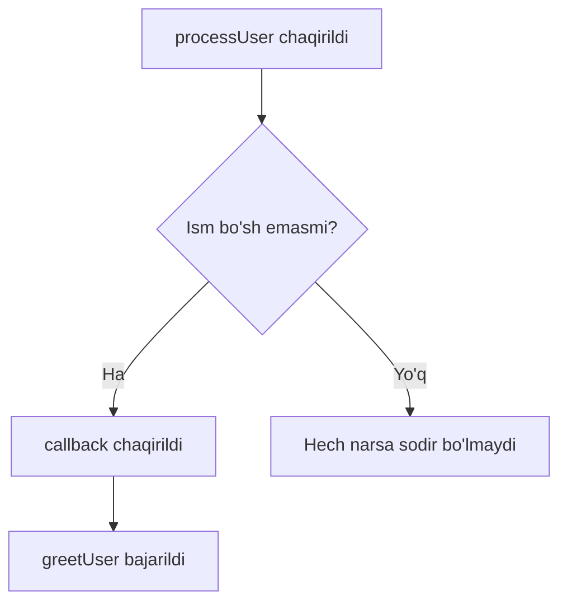
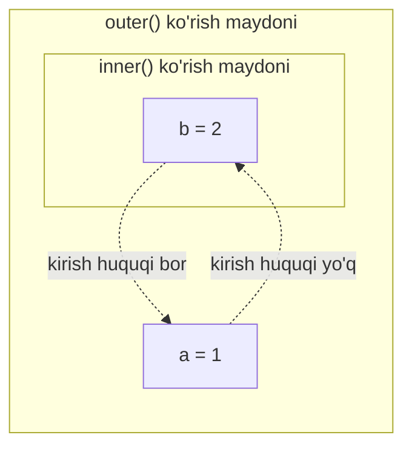
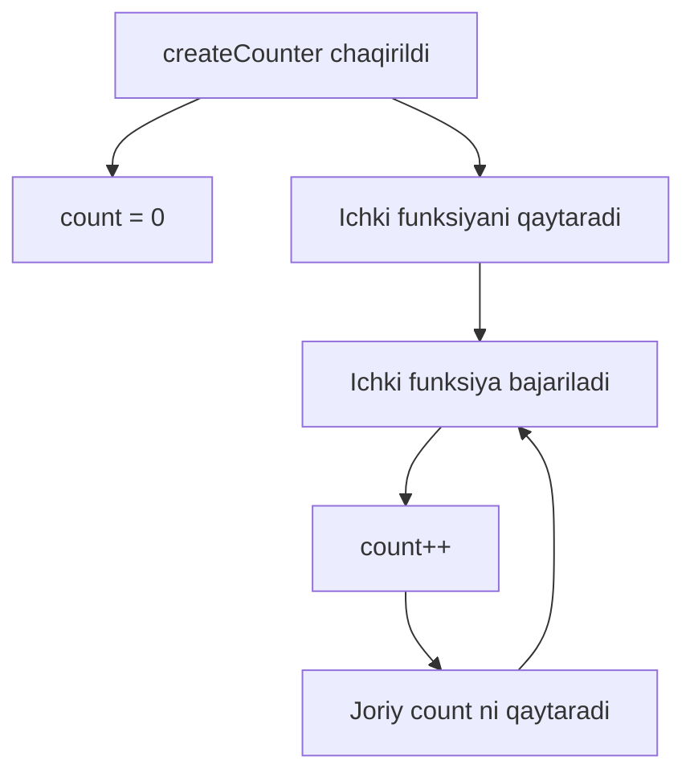

## Funksiyalar

> **Oldingi kurs bilan bog'lanish:** 6-darsda biz o'zgaruvchilarni, turkumlar operatorlarini o'rgandik — har qanday dasturning qurilish bloklarini. Endi qayta ishlatiladigan mantiqni o'z mustahkam bloklarga — **funksiyalarga** — qanday joylashtirishni o'rganish vaqti keldi. Funksiyalar tartibli va qo'llab-quvvatlanadigan JavaScript kodining asosidir.

---

## Darsning maqsadi

Funksiyalar nima ekanligini, ularni qanday aniqlash va chaqirishni tushunish, asosiy tushunchalarni — parametrlar, qiymatni qaytarish, ko'rish maydoni, closure va rekursiyani — egallash, shunda dars oxirida har qanday murakkab muammoni kichik, qayta ishlatiladigan qismlarga bo'la olasiz.

## Dars oxiriga qadar nimalarni bilib olasiz

- Funksiya nima ekanligini tushuntirish va **aniqlash** hamda **chaqirish** orasidagi farqni aniqlash.
- Uch usulda funksiya yaratish: Function Declaration, Function Expression va Arrow Function.
- **Hoisting** tushunchasini va Function Declaration ni kodning oldinda paydo bo'lishidan oldin chaqirish mumkinligini tushunish.
- **Parametrlar va argumentlarni** ishlatish, **standart qiymatlar** belgilash.
- `return` kalit so'zi orqali qiymatni qaytarish va u bajarilishni **darhol to'xtatishini** tushunish.
- Funksiyalarni argument sifatida uzatish (**callback funksiyalar**) — birinchi darajali funksiyalar tushunchasi.
- **Global**, **funksional** va **blok** ko'rish maydonini ajratish; `var`, `let` va `const` orasidagi farqni tushunish.
- **Closure** yordamida funksiya tashqi ko'rish maydonidagi o'zgaruvchilarni qanday eslab qolishini tushunish.
- To'g'ri asosiy holat va rekursiv qadam bilan **rekursiyani** qo'llash.

---

## Dars jadvali | Blok | Kontent |
| --- | --- |
| 1. Funksiya nima | Aniqlash va chaqirish, retsept analogiyasi |
| 2. Funksiya yaratishning uch usuli | Declaration, Expression, Arrow Function, hoisting |
| 3. Parametrlar va argumentlar | Parametrlar vs argumentlar, standart qiymatlar |
| 4. return kalit so'zi | Qiymatlarni qaytarish, erta tugallash |
| 5. Birinchi darajali funksiyalar va callback | Funksiyalarni argument sifatida uzatish |
| 6. Ko'rish maydoni | Global, funksional, blok; var vs let/const |
| 7. Closure | Funksiyalar tashqi o'zgaruvchilarni qanday eslab qolishi |
| 8. Rekursiya | Asosiy holat, rekursiv qadam, teskari sanash misoli |
| 9. Amaliyot | Amaliy mashqlar |
| 10. Xulosa | Asosiy xulosalar |

---

## 1-blok. Funksiya nima

**Oddiy qilib aytganda:** funksiya oshpazlik kitobidagi retseptga o'xshaydi. Siz bir marta borsht qanday pishirilishini (ingrediyentlar va qadamlar) yozasiz, keyin shu retseptni istalgancha ko'p marta ishlatasiz — har safar turli ingrediyentlar (parametrlar) qo'shib, o'z taomingizni olasiz.

```javascript
function sayHello() {
    console.log('Salom, dunyo!');
}

sayHello();
sayHello();
```

Bu yerda `function sayHello()` — bu **aniqlash** — biz funksiya nima qilishini tasvirlaymiz, lekin hech narsa hali bajarilmaydi. `sayHello()` satri — bu **chaqirish** — biz funksiya ichidagi kodni haqiqatda ishga tushiramiz.

### Aniqlash va chaqirish

| Tushuncha | Nima qiladi | Kod qachon bajariladi |
| --- | --- | --- |
| **Aniqlash** `function sayHello() { ... }` | Funksiyani tasvirlaydi | Uni chaqirmaguncha |
| **Chaqirish** `sayHello()` | Funksiya tanasini bajaradi | Satrga yetgan zahoti |

---

## 2-blok. Funksiya yaratishning uch usuli

### Usul 1: Function Declaration (klassik e'lon)

```javascript
function greet() {
    console.log('Salom!');
}

greet();
```

Function Declarations **ko'tariladi** (hoisting) — JavaScript motori ularni tayyorlash davomida ko'rish maydonining boshiga ko'chiradi, shuning uchun e'lon qilingan funksiyani kodning oldinda paydo bo'lishidan **oldin** chaqirish mumkin:

```javascript
sayHi();

function sayHi() {
    console.log('Salom!');
}
```

Bu xatosiz ishlaydi, hoisting tufayli.

### Usul 2: Function Expression (funksiya qiymat sifatida)

```javascript
const sayGoodbye = function() {
    console.log('Xayr!');
};

sayGoodbye();
```

Function Expression **ko'tarilmaydi**. Agar ularni tayinlashdan oldin chaqirsangiz, xatolik yuz beradi:

```javascript
sayHello2();

const sayHello2 = function() {
    console.log('Salom!');
};
// Xatolik: Cannot access 'sayHello2' before initialization
```

### Usul 3: Strelka funksiyasi (zamonaviy standart)

```javascript
const greet = () => {
    console.log('Salom!');
};

greet();
```

Strelka funksiyalari ES6 da paydo bo'lgan va yozishda qisqaroq. Hoisting jihatidan Function Expression ga o'xshab harakat qiladi ( **ko'tarilmaydi** ). Bitta ifodadan iborat tanalar uchun qavslarni va `return` ni tashlab ketish mumkin:

```javascript
const double = (x) => x * 2;
console.log(double(5)); // 10
```

### Taqqoslash jadvali

| Usul | Sintaksis | Ko'tariladi? | Oddiy ishlatilishi |
| --- | --- | --- | --- |
| Function Declaration | `function name() { }` | Ha | Nomlangan mustaqil funksiyalar |
| Function Expression | `const name = function() { }` | Yo'q | Funksiyani o'zgaruvchiga tayinlash |
| Arrow Function | `const name = () => { }` | Yo'q | Qisqa callback funksiyalar |

---

## 3-blok. Parametrlar va argumentlar

Funksiyalar kirish sifatida ma'lumot qabul qilishi mumkin.

- **Parametrlar** — bu funksiya aniqlashida ko'rsatilgan o'zgaruvchi nomlari — qo'g'irchoqlar.
- **Argumentlar** — bu chaqirishda uzatilgan aniq qiymatlar.

```javascript
function greet(name, age) {
    console.log('Mening ismim ' + name + ', men ' + age + ' yoshdaman.');
}

greet('Alex', 25);
greet('Maria', 30);
```

Bu yerda `name` va `age` — parametrlar; `'Alex'` va `25` (yoki `'Maria'` va `30`) — argumentlar.

### Standart parametr qiymatlari

Agar argument uzatilmasa, parametr `undefined` bo'ladi. Buni oldini olish uchun standart qiymatlarni belgilang:

```javascript
function multiply(a, b = 2) {
    return a * b;
}

console.log(multiply(5, 3)); // 15
console.log(multiply(5));    // 10 (5 * 2)
```

Standart qiymatlar chaqirish vaqtida hisoblanishi mumkin:

```javascript
function greet(name, greeting = 'Salom, ' + name + '!') {
    return greeting;
}

console.log(greet('Anna'));            // 'Salom, Anna!'
console.log(greet('Anna', 'Assalomu alaykum!')); // 'Assalomu alaykum!'
```

---

## 4-blok. return kalit so'zi

Funksiya qila oladigan eng muhim narsa — `return` kalit so'zi yordamida **natijani qaytarishdir**. `return` dan keyin funksiya **darhol bajarilishni to'xtatadi** — `return` dan keyingi kod hech qachon bajarilmaydi.

```javascript
function sum(a, b) {
    const result = a + b;
    return result;
}

const total = sum(5, 3);
console.log(total); // 8
```

Agar funksiyada `return operatori` bo'lmasa, u standart ravishda `undefined` qaytaradi:

```javascript
function doNothing() {}
console.log(doNothing()); // undefined
```

### return bajarilishni to'xtatadi

```javascript
function test() {
    console.log('Boshlash');
    return 'Tugash';
    console.log('Bu chiqarilmaydi');
}

console.log(test()); // 'Boshlash', keyin 'Tugash'
```

`'Bu chiqarilmaydi'` satri hech qachon chiqarilmaydi, chunki `return` funksiyani kodga yetib kelishdan oldin tugallaydi.

---

## 5-blok. Birinchi darajali funksiyalar va callback funksiyalar

JavaScript da funksiyalar **birinchi darajali fuqarolar** — ularni o'zgaruvchilarda saqlash, argument sifatida uzatish va boshqa funksiyalardan qaytarish mumkin.

**Callback** — bu siz boshqa funksiyaga argument sifatida uzatadigan va keyinroq chaqiriladigan funksiya:

```javascript
function greetUser(name) {
    console.log('Salom, ' + name);
}

function processUser(name, callback) {
    if (name.length > 0) {
        callback(name);
    }
}

processUser('Maxim', greetUser); // 'Salom, Maxim'
processUser('', greetUser);      // hech narsa chiqarilmaydi
```

`processUser` oldindan `greetUser` nima qilishini bilmaydi — u shunchaki funksiyani argument sifatida qabul qiladi va shartga qarab chaqirishga qaror qiladi. Shuning uchun bir xil `processUser` ni boshqa callback bilan ham ishlatish mumkin.



---

### Yangi boshlovchilar uchun xatolar

| Xato | Qanday tuzatish |
| --- | --- |
| Callback argumentni uzutishni unutib, `TypeError: callback is not a function` olish | Callback parametriga chaqirishdan oldin funksiya ekanligini har doim tekshiring |
| Callbackni uzatishda qavslar bilan chaqirish: `processUser('Max', greetUser())` | Funksiyani o'zi, qavslarsiz uzating: `processUser('Max', gather)` |
| Funksiya callback nima qilishini "biladi" deb o'ylash | Qabul qiluvchi funksiya umumiy bo'lishi kerak — u shunchaki callback chaqiradi, uning ichki mantiqini bilmaydi |

---

## 6-blok. Ko'rish maydoni (Scope)

**Ko'rish maydoni** o'zgaruvchingiz kodda qayerda mavjudligini belgilaydi. Buni uyda xonalarga solishtirish mumkin — ma'lum xonada (lokal o'zgaruvchi) mavjud narsalar faqat o'sha xonada bo'lganlarga ko'rinadi, umumiy holda (global o'zgaruvchi) mavjud narsalar esa uyning istalgan xonasidan ko'rinadi.

### Global ko'rish maydoni

Har qanday funksiya yoki blokdan tashqarida e'lon qilingan o'zgaruvchi hamma joyda mavjud:

```javascript
let city = 'Toshkent';

function showCity() {
    console.log(city);
}

showCity(); // 'Toshkent'
```

### Funksional ko'rish maydoni

Funksiya ichida (`var`, `let` yoki `const` orqali) e'lon qilingan o'zgaruvchilar faqat o'sha funksiya ichida mavjud:

```javascript
function greet() {
    let message = 'Salom!';
    console.log(message);
}

greet();    // 'Salom!'
// console.log(message); // Xatolik: message aniqlanmagan
```

### Blok ko'rish maydoni

`let` va `const` blok ko'rish maydoniga rioya qiladi — ular eng yaqin `{ }` bilan cheklangan. `var` blok ko'rish maydoniga **rioya qilmaydi** va blokdan "tashqariga chiqadi":

```javascript
if (true) {
    let x = 10;
    var y = 20;
}

console.log(y); // 20 — var blokdan "chiqdi"
// console.log x); // Xatolik: x aniqlanmagan
```

### Ko'rish maydoni zanjiri

Ichki funksiya tashqi funksiyaning o'zgaruvchilarini ko'rishi mumkin, lekin teskari emas:

```javascript
function outer() {
    let a = 1;

    function inner() {
        let b = 2;
        console.log(a); // 1 — inner outer o'zgaruvchilarini ko'radi
    }

    inner();
    // console.log(b); // Xatolik: outer inner o'zgaruvchilarini ko'rmaydi
}
```



---

## 7-blok. Closure

**Closure** — bu funksiya tashqi ko'rish maydonidagi o'zgaruvchilarni, tashqi funksiya tugallanganidan keyin ham "eslab qolishidir".

```javascript
function createCounter() {
    let count = 0;

    return function() {
        count++;
        return count;
    };
}

const counter = createCounter();
console.log(counter()); // 1
console.log(counter()); // 2
console.log(counter()); // 3
```

`createCounter()` tugallangandan keyin uning lokal o'zgaruvchisi `count` odatda yo'q qilinadi. Lekin qaytarilgan ichki funksiya unga referansni saqlab qoladi — bu closure. Har bir `counter()` chaqiruvi bir xil `count` ga murojaat qiladi va uni o'zgartiradi.



---

## 8-blok. Rekursiya

**Rekursiya** — bu funksiya muammoni hal qilish uchun o'zini o'zi chaqirganda. Katta muammo o'zining kichik versiyalariga bo'linadi, eng oddiy holatga — **asosiy holatga (base case)** — yetilguncha.

Har bir rekursiv funksiyada ikki narsa bo'lishi kerak:

1. **Asosiy holat** — funksiya o'zini chaqirishni to'xtatadigan shart.
2. **Rekursiv qadam** — funksiya asosiy holatga yaqinlashtirilgan o'zgartirilgan argumentlar bilan o'zini chaqiradi.

```javascript
function countdown(n) {
    if (n <= 0) {
        console.log('Boshlash!');
        return;
    }
    console.log(n);
    countdown(n - 1);
}

countdown(3);
```

Chiqarish:

```
3
2
1
Boshlash!
```

Asosiy holatsiz funksiya cheksiz chaqiraveradi, qo'ng'iroq stacks sig'imi to'lguncha: `RangeError: Maximum call stack size exceeded`.

**Analogiya:** rekursiya matryoshkaga o'xshaydi — eng kichik qo'g'irchoqqa yetish uchun (asosiy holat) har birini navbatma-navbat ochish kerak.

---

### Yangi boshlovchilar uchun xatolar

| Xato | Qanday tuzatish |
| --- | --- |
| Asosiy holatni unutib, cheksiz rekursiyaga olib kelish | Har doim rekursiv chaqirishdan oldin aniq to'xtash shartini belgilang |
| Argumentlarni noto'g'ri o'zgartirib, asosiy holat hech qachon yetilmasligini ta'minlash | Har bir rekursiv qadam asosiy holatga yaqinlashishini ta'minlang |
| Oddiy tsikl mos keladigan joyda rekursiyani ishlatish | Oddiy takrorlash uchun iteratsiyani afzal ko'ring; rekursiyani tabiiy ravishda yorib chiqiladigan muammolar uchun ishlating (daraxtlar, divide-and-conquer) |

---

## Amaliyot

1. `add(a, b)` funksiyasini yozing, u ikki sonning yig'indisini qaytarsin va natijani konsolga chiqaring.
2. `add` ni Arrow Function sifatida qayta yozing va `const` ga tayinlang.
3. Rekursiyadan foydalanib `factorial(n)` funksiyasini yozing, u `n` ning faktorialini qaytarsin.
4. `makeGreeter(defaultGreeting)` funksiyasini yarating, u yangi funksiyani qaytarsin. Qaytarilgan funksiya `name` qabul qilsin va `defaultGreeting + name` ni chiqarsin. Uni ikki xil salom bilan sinab ko'ring.
5. Blok ko'rish maydonini namoyon etuvchi funksiya yozing: `if` bloki ichida `let` va `var` e'lon qiling va tashqarida qaysi biri mavjudligini ko'rsating.

---

## Xulosa

Bugun siz quyidagilarni o'rgandingiz:

- **Funksiya** — bu qayta ishlatiladigan kod bloki, bir marta aniqlanadi va ko'p marta chaqiriladi.
- Funksiya yaratishning uch usuli mavjud: **Function Declaration**, **Function Expression** va **Arrow Function**.
- **Hoisting** Function Declaration ni kodning oldinda paydo bo'lishidan oldin chaqirishga imkon beradi; expression va arrow funksiyalar ko'tarilmaydi.
- **Parametrlar** aniqlashdagi qo'g'irchoqlar; **argumentlar** chaqirishda uzatilgan haqiqiy qiymatlar; **standart parametrlar** uzatilmagan argumentlarni qayta ishlaydi.
- `return` kalit so'zi qiymatni chaqiruvchiga qaytaradi va bajarilishni **darhol to'xtatadi**.
- Funksiyalar **birinchi darajali** — ularni boshqa funksiyalarga **callback** sifatida uzatish mumkin.
- **Ko'rish maydoni** o'zgaruvchilar qayerda ko'rinishini belgilaydi: global, funksional yoki blok; `var` bloklardan "chiqadi", `let` va `const` chiqmaydi.
- **Closure** — bu tashqi ko'rish maydonidagi o'zgaruvchilarga kirishni saqlab qoladigan funksiya.
- **Rekursiya** o'zini o'zi chaqirish orqali muammolarni hal qiladi, zanjirni to'xtatadigan asosiy holat bilan.

---

[Keyingi dars: Sana va vaqt →](../../Lesson-8/uz/Sana%20va%20vaqt.md)
