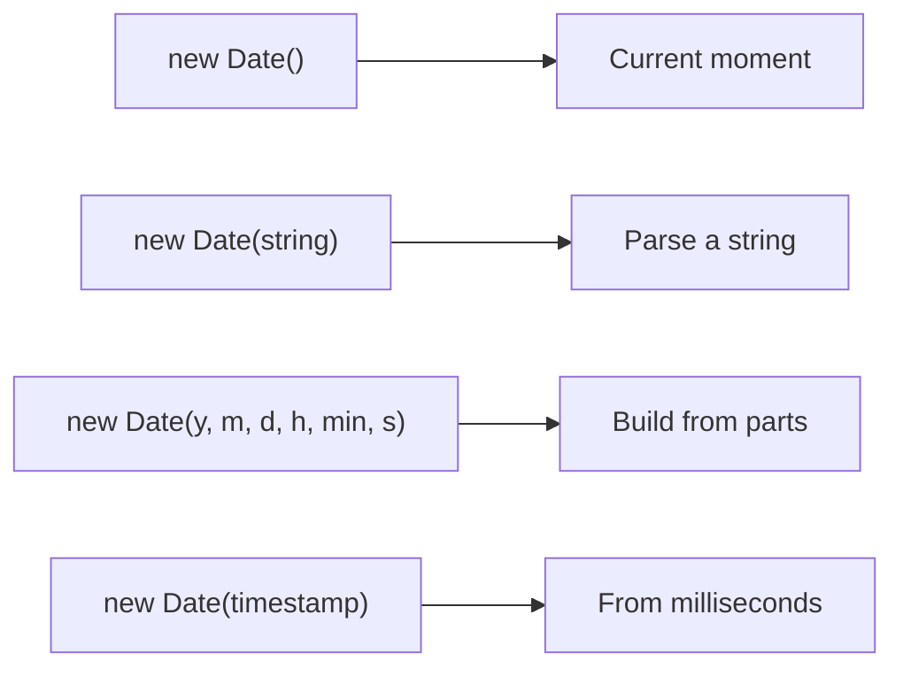
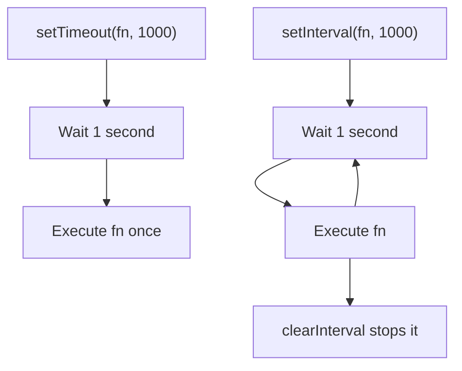

## Date and Time

> **Connection with the previous course:** in the previous lessons we covered JavaScript functions, arrays, objects, and loops. Today we turn to working with dates and time - a practical skill you will use constantly when building real applications, from displaying timestamps to scheduling tasks.

---

## Lesson Goal

Understand how JavaScript handles dates and times, master the `Date` object, and learn to create, read, format, and calculate with dates. By the end of the lesson, you will be able to work with dates confidently and use timers for delayed code execution.

## What You Will Learn by the End of the Lesson

- Create `Date` objects in four different ways and understand why months start at 0.
- Extract any component from a date using getter methods.
- Modify dates using setter methods.
- Format dates into readable strings using `toString`, `toLocaleString`, and options objects.
- Perform date arithmetic: find the difference between two dates and add time intervals.
- Use `setTimeout` and `setInterval` for delayed and repeated code execution.
- Work with timezones using `getTimezoneOffset()` and `Date.UTC()`.
- Know when to reach for libraries like `day.js` or `date-fns`.

---

## Lesson Timeline

| Block | Content |
| --- | --- |
| 1. What is the Date object | Epoch, milliseconds, four ways to create a Date |
| 2. Getting date components | Getter methods: getFullYear, getMonth, getDate, and more |
| 3. Setting date components | Setter methods to modify dates |
| 4. Formatting dates | toString, toDateString, toISOString, toLocaleString |
| 5. Date math and Date.now | Subtracting dates, converting to days, Date.now() |
| 6. Timers: setTimeout and setInterval | Delayed and repeated execution, clearing timers |
| 7. Timezones | getTimezoneOffset, Date.UTC |
| 8. Libraries for dates | day.js and date-fns |
| 9. Practice | Hands-on exercises |
| 10. Summary | Cheat sheet and recap |

---

## Block 1. What Is the Date Object

**In simple terms:** imagine a ruler that starts counting millimeters from a fixed point in history - January 1, 1970 at midnight UTC. That point is called the **Unix epoch**, and every moment in time since then is just a number: how many milliseconds have passed. The `Date` object in JavaScript is a wrapper around that single number, giving you methods to read and manipulate it.

JavaScript stores dates as a single number - milliseconds since the epoch. This means dates can be compared, subtracted, and added just like regular numbers.

### Four Ways to Create a Date

```javascript
const now = new Date();
console.log(now);
```

The most common way - `new Date()` without arguments gives you the current moment.

```javascript
const fromString = new Date('2026-12-31T23:59:59');
console.log(fromString);
```

You can pass an ISO 8601 string or other date string formats. The browser parses it into a `Date` object.

```javascript
const fromComponents = new Date(2026, 11, 31, 23, 59, 59);
console.log(fromComponents);
```

**Critical detail:** when using numeric components, the month parameter is **zero-indexed**. January is `0`, December is `11`. This is the single most common source of confusion for beginners.

```javascript
const fromTimestamp = new Date(1767225599000);
console.log(fromTimestamp);
```

You can create a `Date` directly from a Unix timestamp in milliseconds.



---

### Common Beginner Mistakes

| Error | How to Fix |
| --- | --- |
| Confusing month numbers: using `1` for January | Remember: months are 0-indexed. `0 = January`, `11 = December` |
| Passing month as a string `'12'` instead of number `11` | Always use numeric values for the component-based constructor |
| Expecting `new Date()` to be deterministic in tests | It returns the current time. Use a fixed date or `Date.UTC()` for tests |

---

## Block 2. Getting Date Components

**In simple terms:** once you have a `Date` object, it is like a Swiss Army knife with many blades - each getter method extracts one specific piece of information.

```javascript
const now = new Date();

console.log(now.getFullYear());
console.log(now.getMonth());
console.log(now.getDate());
console.log(now.getDay());
console.log(now.getHours());
console.log(now.getMinutes());
console.log(now.getSeconds());
console.log(now.getMilliseconds());
```

Each method returns a number. Notice that `getMonth()` returns `0` through `11`, while `getDate()` returns the actual day of the month (1-31). The `getDay()` method returns `0` for Sunday through `6` for Saturday.

For UTC (universal time) instead of local time, use the `UTC` variants:

```javascript
console.log(now.getUTCHours());
console.log(now.getUTCFullYear());
```

---

## Block 3. Setting Date Components

**In simple terms:** if getter methods are the "read" button, setter methods are the "write" button - they let you change individual parts of a date without recreating the whole object.

```javascript
const date = new Date();

date.setFullYear(2027);
date.setMonth(0);
date.setDate(1);
date.setHours(12, 0, 0);
```

Setters work in place - they modify the original `Date` object. Notice you can set multiple time components at once with `setHours(hours, minutes, seconds, ms)`.

A common pattern is to add days to a date:

```javascript
const today = new Date();
today.setDate(today.getDate() + 7);
console.log(today);
```

This creates a new date that is exactly one week from today. The `Date` object handles month and year rollovers automatically - adding days past the end of a month moves to the next month.

---

## Block 4. Formatting Dates

**In simple terms:** a raw `Date` object is not very readable. Formatting methods convert it into a human-friendly string.

### Basic String Conversion

```javascript
const now = new Date();

console.log(now.toString());
console.log(now.toDateString());
console.log(now.toTimeString());
console.log(now.toISOString());
```

- `toString()` gives the full local representation.
- `toDateString()` gives only the date part.
- `toTimeString()` gives only the time part.
- `toISOString()` gives the standard UTC format used in APIs and databases.

### Locale-Sensitive Formatting

The `toLocaleString` family of methods lets you display dates according to a specific locale:

```javascript
const now = new Date();

console.log(now.toLocaleString('en-US'));
console.log(now.toLocaleDateString('en-US'));
console.log(now.toLocaleTimeString('en-US'));
```

### Formatting with Options

For full control, pass an options object as the second argument:

```javascript
const now = new Date();

const options = {
  year: 'numeric',
  month: 'long',
  day: 'numeric',
  weekday: 'long',
};
console.log(now.toLocaleDateString('en-US', options));
```

This produces something like "Thursday, June 18, 2026" - a fully readable format without any external library.

---

## Block 5. Date Math and Date.now()

**In simple terms:** dates are numbers under the hood. Subtracting two dates gives you the difference in milliseconds. This is one of the most useful features of the `Date` object.

### Subtracting Dates

```javascript
const start = new Date('2026-01-01');
const end = new Date('2026-12-31');

const diffMs = end - start;
console.log(diffMs);
```

The result is in milliseconds. To convert to more useful units:

```javascript
const diffDays = diffMs / (1000 * 60 * 60 * 24);
console.log(diffDays);
```

### Date.now()

`Date.now()` is a static method that returns the current timestamp directly, without creating a `Date` object:

```javascript
console.log(Date.now());
```

This is equivalent to `new Date().getTime()` but faster and more concise. It is commonly used for performance measurement:

```javascript
const start = Date.now();
// ... some operation ...
const elapsed = Date.now() - start;
console.log('Operation took ' + elapsed + ' ms');
```

---

## Block 6. Timers: setTimeout and setInterval

**In simple terms:** timers are like setting an alarm clock in your code. `setTimeout` says "do this after a delay", while `setInterval` says "keep doing this every N milliseconds."

These are not part of the `Date` object, but they are closely related to working with time in JavaScript.

### setTimeout - Execute Once After a Delay

```javascript
setTimeout(function () {
  console.log('Three seconds have passed');
}, 3000);
```

The first argument is a function to execute, the second is the delay in milliseconds. `setTimeout` returns an ID that can be used to cancel it:

```javascript
const timerId = setTimeout(function () {
  console.log('This will never run');
}, 1000);

clearTimeout(timerId);
```

### setInterval - Execute Repeatedly

```javascript
let count = 0;
const intervalId = setInterval(function () {
  count++;
  console.log('Second ' + count);
  if (count === 5) {
    clearInterval(intervalId);
  }
}, 1000);
```

`setInterval` keeps calling the function every N milliseconds until you call `clearInterval`. Always plan to stop the interval, or it will run forever and leak memory.



---

## Block 7. Timezones

**In simple terms:** JavaScript's `Date` always works in the local timezone of the system or in UTC. It does not support arbitrary timezones natively. This is one of its biggest limitations.

### getTimezoneOffset()

```javascript
const now = new Date();
console.log(now.getTimezoneOffset());
```

This returns the offset in **minutes** from UTC. For example, UTC+3 returns `-180` (note the negative sign). UTC-5 returns `300`.

### Date.UTC()

To create a date explicitly in UTC (bypassing local time), use `Date.UTC()`:

```javascript
const utcDate = new Date(Date.UTC(2026, 11, 31, 23, 59, 59));
console.log(utcDate.toISOString());
```

This is useful when you need to work with server timestamps or when timezone consistency matters.

**Important:** the `Date` constructor interprets numeric arguments in local time, while `Date.UTC()` interprets them as UTC. This is a subtle but critical difference.

---

## Block 8. Libraries for Dates

The native `Date` object has several well-known pain points: months starting at 0, inconsistent string parsing across browsers, and no built-in time zone support beyond local/UTC. For complex date work in production, libraries are the standard solution.

### day.js (2 KB, lightweight)

```javascript
import dayjs from 'dayjs';

const now = dayjs();
console.log(now.format('DD.MM.YYYY HH:mm'));

const future = dayjs('2026-12-31');
console.log(future.diff(now, 'days'));
```

`day.js` uses an API very similar to Moment.js but is tiny and immutable by default.

### date-fns (modular, functional)

```javascript
import { format, differenceInDays } from 'date-fns';

console.log(format(new Date(), 'dd.MM.yyyy'));
console.log(differenceInDays(new Date('2026-12-31'), new Date()));
```

`date-fns` lets you import only the functions you need, keeping bundle size minimal.

**Recommendation:** for simple projects, native `Date` is sufficient. When you need complex formatting, date arithmetic, or timezone handling, reach for `day.js` or `date-fns`.

---

## Practice

1. Create a `Date` for tomorrow using numeric components. Log both today's date and tomorrow's date to the console.

2. Write a snippet that calculates how many days are left until the end of the current year.

3. Use `toLocaleDateString` with an options object to display today's date in the format "Monday, January 1, 2026".

4. Create a countdown timer using `setInterval` that prints the remaining seconds from 10 down to 0, then clears itself.

5. Use `setTimeout` to print a message after exactly 2 seconds.

---

## Lesson Summary

Today you learned that JavaScript `Date` stores time as milliseconds since the Unix epoch (January 1, 1970 UTC). You can create dates from strings, numeric components, or timestamps - always remembering that months are zero-indexed. Getter methods let you extract any part of a date, setter methods let you modify it in place, and formatting methods (`toString`, `toLocaleString`, `toISOString`) produce human-readable output. Date arithmetic works because dates are just numbers: subtract to find the difference, add milliseconds to shift forward. `Date.now()` gives you the current timestamp directly. Timers (`setTimeout` and `setInterval`) let you execute code after delays or on a repeating schedule. For advanced timezone and formatting needs, libraries like `day.js` and `date-fns` are the standard choice.

### Cheat Sheet

| Task | How |
| --- | --- |
| Get current date and time | `new Date()` or `Date.now()` |
| Get the year | `date.getFullYear()` |
| Get the month (0-11) | `date.getMonth()` |
| Get the day of the month | `date.getDate()` |
| Get the day of the week (0-6) | `date.getDay()` |
| Create from a string | `new Date('2026-12-31T23:59:59')` |
| Format with locale | `date.toLocaleDateString('en-US', { weekday: 'long' })` |
| Add one day | `date.setDate(date.getDate() + 1)` |
| Difference between two dates | `date2 - date1` (in milliseconds) |
| Execute after 2 seconds | `setTimeout(fn, 2000)` |
| Execute every 3 seconds | `setInterval(fn, 3000)` |
| Stop a timer | `clearTimeout(id)` / `clearInterval(id)` |

---

[Next lesson: DOM — Document Object Model →](../../Lesson-9/en/DOM%20—%20Document%20Object%20Model.md)
