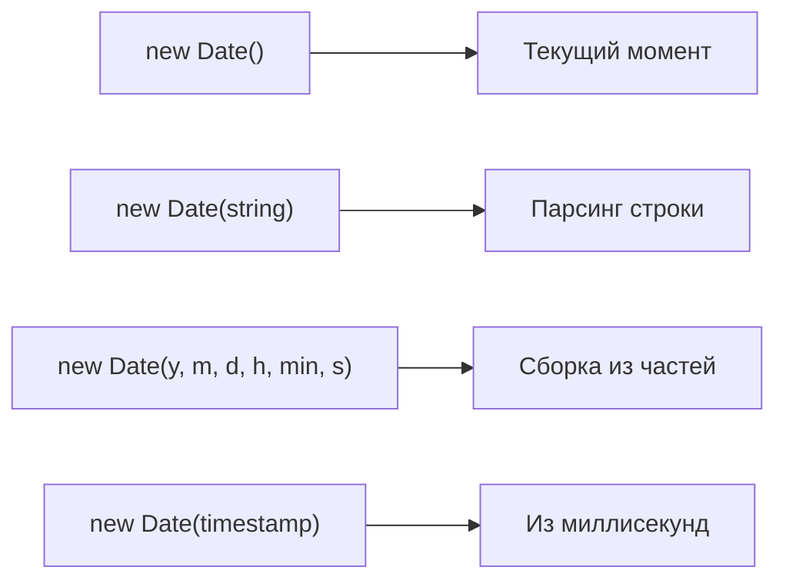
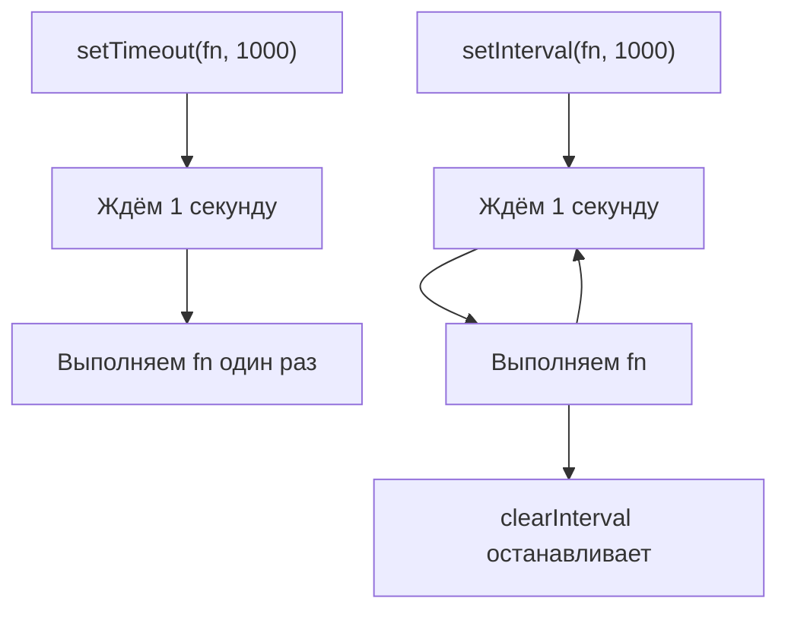

## Дата и время

> **Связь с предыдущим курсом:** в предыдущих уроках мы изучили функции, массивы, объекты и циклы в JavaScript. Сегодня мы переходим к работе с датами и временем - навыку, который вы будете использовать постоянно при создании реальных приложений: от отображения временных меток до планирования задач.

---

## Цель урока

Понять, как JavaScript работает с датами и временем, освоить объект `Date` и научиться создавать, читать, форматировать и вычислять даты. К концу урока вы сможете уверенно работать с датами и использовать таймеры для отложенного выполнения кода.

## Что вы узнаете к концу урока

- Создавать объекты `Date` четырьмя способами и понимать, почему месяцы начинаются с 0.
- Извлекать любую компоненту даты с помощью методов получения.
- Изменять даты с помощью методов установки.
- Форматировать даты в читаемые строки с помощью `toString`, `toLocaleString` и объекта опций.
- Вычислять разницу между датами и добавлять временные интервалы.
- Использовать `setTimeout` и `setInterval` для отложенного и повторного выполнения кода.
- Работать с часовыми поясами через `getTimezoneOffset()` и `Date.UTC()`.
- Знать, когда стоит обратиться к библиотекам `day.js` или `date-fns`.

---

## Хронология урока

| Блок | Содержание |
| --- | --- |
| 1. Что такое объект Date | Эпоха, миллисекунды, четыре способа создания |
| 2. Получение компонентов даты | Методы: getFullYear, getMonth, getDate и другие |
| 3. Установка компонентов даты | Методы для изменения дат |
| 4. Форматирование дат | toString, toDateString, toISOString, toLocaleString |
| 5. Математика с датами и Date.now | Разность дат, перевод в дни, Date.now() |
| 6. Таймеры: setTimeout и setInterval | Отложенное и повторное выполнение, отмена таймеров |
| 7. Часовые пояса | getTimezoneOffset, Date.UTC |
| 8. Библиотеки для работы с датами | day.js и date-fns |
| 9. Практика | Упражнения |
| 10. Итог | Шпаргалка и повторение |

---

## Блок 1. Что такое объект Date

**Простыми словами:** представьте линейку, которая начинает отсчёт миллиметров из фиксированной точки в истории - 1 января 1970 года, полночь по UTC. Эта точка называется **эпохой Unix**, и каждый момент времени с тех пор - это просто число: сколько миллисекунд прошло. Объект `Date` в JavaScript - это обёртка вокруг одного числа, дающая вам методы для чтения и манипуляции им.

JavaScript хранит даты как одно число - миллисекунды с момента эпохи. Это значит, что даты можно сравнивать, вычитать и складывать точно так же, как обычные числа.

### Четыре способа создать дату

```javascript
const now = new Date();
console.log(now);
```

Самый распространённый способ - `new Date()` без аргументов даёт вам текущий момент.

```javascript
const fromString = new Date('2026-12-31T23:59:59');
console.log(fromString);
```

Можно передать строку в формате ISO 8601 или другой формат даты. Браузер парсит её в объект `Date`.

```javascript
const fromComponents = new Date(2026, 11, 31, 23, 59, 59);
console.log(fromComponents);
```

**Важная деталь:** при использовании числовых компонентов параметр месяца нумеруется **с нуля**. Январь - это `0`, декабрь - это `11`. Это самая частая причина путаницы у начинающих.

```javascript
const fromTimestamp = new Date(1767225599000);
console.log(fromTimestamp);
```

Можно создать `Date` напрямую из Unix-метки в миллисекундах.



---

### Типичные ошибки начинающих

| Ошибка | Как исправить |
| --- | --- |
| Путаница в номерах месяцев: использование `1` вместо `0` для января | Помните: месяцы нумеруются с нуля. `0 = январь`, `11 = декабрь` |
| Передача месяца строкой `'12'` вместо числа `11` | Всегда используйте числовые значения для конструктора из компонентов |
| Ожидание, что `new Date()` будет детерминированным в тестах | Он возвращает текущее время. Используйте фиксированную дату или `Date.UTC()` в тестах |

---

## Блок 2. Получение компонентов даты

**Простыми словами:** когда у вас есть объект `Date`, он похож на швейцарский армейский нож со множеством лезвий - каждый метод получения извлекает одну конкретную часть информации.

```javascript
const now = new Date();

console.log(now.getFullYear());
console.log(now.getMonth());
console.log(now.getDate());
console.log(now.getDay());
console.log(now.getHours());
console.log(now.getMinutes());
console.log(now.getSeconds());
console.log(now.getMilliseconds());
```

Каждый метод возвращает число. Обратите внимание, что `getMonth()` возвращает `0` через `11`, в то время как `getDate()` возвращает фактический день месяца (1-31). Метод `getDay()` возвращает `0` для воскресенья через `6` для субботы.

Для работы с UTC (всемирное время) вместо локального используйте варианты с `UTC`:

```javascript
console.log(now.getUTCHours());
console.log(now.getUTCFullYear());
```

---

## Блок 3. Установка компонентов даты

**Простыми словами:** если методы получения - это кнопка "чтение", то методы установки - это кнопка "запись" - они позволяют изменить отдельные части даты без пересоздания всего объекта.

```javascript
const date = new Date();

date.setFullYear(2027);
date.setMonth(0);
date.setDate(1);
date.setHours(12, 0, 0);
```

Методы установки работают на месте - они изменяют исходный объект `Date`. Обратите внимание, что можно установить несколько компонентов времени одновременно с `setHours(часы, минуты, секунды, мс)`.

Распространённый паттерн - добавление дней к дате:

```javascript
const today = new Date();
today.setDate(today.getDate() + 7);
console.log(today);
```

Это создаёт новую дату ровно через неделю от сегодняшнего дня. Объект `Date` автоматически обрабатывает переход через месяц и год.

---

## Блок 4. Форматирование дат

**Простыми словами:** сырой объект `Date` не очень читаем. Методы форматирования преобразуют его в человеко-понятную строку.

### Базовое преобразование в строку

```javascript
const now = new Date();

console.log(now.toString());
console.log(now.toDateString());
console.log(now.toTimeString());
console.log(now.toISOString());
```

- `toString()` выдаёт полное локальное представление.
- `toDateString()` выдаёт только часть даты.
- `toTimeString()` выдаёт только часть времени.
- `toISOString()` выдаёт стандартный формат UTC, используемый в API и базах данных.

### Форматирование с учётом локали

Семейство методов `toLocaleString` позволяет отображать даты в соответствии с указанной локалью:

```javascript
const now = new Date();

console.log(now.toLocaleString('ru-RU'));
console.log(now.toLocaleDateString('ru-RU'));
console.log(now.toLocaleTimeString('ru-RU'));
```

### Форматирование с опциями

Для полного контроля передайте объект опций вторым аргументом:

```javascript
const now = new Date();

const options = {
  year: 'numeric',
  month: 'long',
  day: 'numeric',
  weekday: 'long',
};
console.log(now.toLocaleDateString('ru-RU', options));
```

Это выдаст что-то вроде "четверг, 18 июня 2026 г." - полностью читаемый формат без какой-либо внешней библиотеки.

---

## Блок 5. Математика с датами и Date.now()

**Простыми словами:** даты - это числа под капотом. Вычитание двух дат даёт разницу в миллисекундах. Это одна из самых полезных возможностей объекта `Date`.

### Вычитание дат

```javascript
const start = new Date('2026-01-01');
const end = new Date('2026-12-31');

const diffMs = end - start;
console.log(diffMs);
```

Результат - в миллисекундах. Для перевода в более удобные единицы:

```javascript
const diffDays = diffMs / (1000 * 60 * 60 * 24);
console.log(diffDays);
```

### Date.now()

`Date.now()` - статический метод, возвращающий текущую временную метку напрямую, без создания объекта `Date`:

```javascript
console.log(Date.now());
```

Это эквивалент `new Date().getTime()`, но быстрее и компактнее. Часто используется для измерения производительности:

```javascript
const start = Date.now();
// ... некоторая операция ...
const elapsed = Date.now() - start;
console.log('Операция заняла ' + elapsed + ' мс');
```

---

## Блок 6. Таймеры: setTimeout и setInterval

**Простыми словами:** таймеры - это как поставить будильник в вашем коде. `setTimeout` говорит "сделай это после задержки", а `setInterval` говорит "продолжай делать это каждые N миллисекунд."

Эти функции не являются частью объекта `Date`, но тесно связаны с работой со временем в JavaScript.

### setTimeout - выполнить один раз через задержку

```javascript
setTimeout(function () {
  console.log('Прошло три секунды');
}, 3000);
```

Первый аргумент - функция для выполнения, второй - задержка в миллисекундах. `setTimeout` возвращает ID, который можно использовать для отмены:

```javascript
const timerId = setTimeout(function () {
  console.log('Это никогда не выполнится');
}, 1000);

clearTimeout(timerId);
```

### setInterval - выполнять повторно

```javascript
let count = 0;
const intervalId = setInterval(function () {
  count++;
  console.log('Секунда ' + count);
  if (count === 5) {
    clearInterval(intervalId);
  }
}, 1000);
```

`setInterval` продолжает вызывать функцию каждые N миллисекунд, пока вы не вызовете `clearInterval`. Всегда планируйте остановку интервала, иначе он будет работать вечно и утекать память.



---

## Блок 7. Часовые пояса

**Простыми словами:** JavaScript `Date` всегда работает в локальном часовом поясе системы или в UTC. Он не поддерживает произвольные часовые пояса. Это одно из самых серьёзных ограничений.

### getTimezoneOffset()

```javascript
const now = new Date();
console.log(now.getTimezoneOffset());
```

Возвращает смещение в **минутах** от UTC. Например, UTC+3 возвращает `-180` (обратите внимание на знак минус). UTC-5 возвращает `300`.

### Date.UTC()

Для создания даты явно в UTC (в обход локального времени) используйте `Date.UTC()`:

```javascript
const utcDate = new Date(Date.UTC(2026, 11, 31, 23, 59, 59));
console.log(utcDate.toISOString());
```

Это полезно при работе с серверными временными метками или когда важна согласованность часовых поясов.

**Важно:** конструктор `Date` интерпретирует числовые аргументы в локальном времени, в то время как `Date.UTC()` интерпретирует их как UTC. Это тонкая, но критическая разница.

---

## Блок 8. Библиотеки для работы с датами

Нативный `Date` имеет несколько известных недостатков: месяцы начинаются с 0, непоследовательный парсинг строк в разных браузерах и отсутствие встроенной поддержки часовых поясов за пределами локального/UTC. Для сложной работы с датами в продакшне библиотеки - стандартное решение.

### day.js (2 КБ, лёгкая)

```javascript
import dayjs from 'dayjs';

const now = dayjs();
console.log(now.format('DD.MM.YYYY HH:mm'));

const future = dayjs('2026-12-31');
console.log(future.diff(now, 'days'));
```

`day.js` использует API, очень похожий на Moment.js, но минимален и неизменяем по умолчанию.

### date-fns (модульная, функциональная)

```javascript
import { format, differenceInDays } from 'date-fns';

console.log(format(new Date(), 'dd.MM.yyyy'));
console.log(differenceInDays(new Date('2026-12-31'), new Date()));
```

`date-fns` позволяет импортировать только те функции, которые вам нужны, минимизируя размер бандла.

**Рекомендация:** для простых проектов нативного `Date` достаточно. Когда вам нужны сложное форматирование, вычисления с датами или поддержка часовых поясов - используйте `day.js` или `date-fns`.

---

## Практика

1. Создайте `Date` для завтрашнего дня, используя числовые компоненты. Выведите в консоль сегодняшнюю дату и завтрашнюю.

2. Напишите сниппет, который вычисляет, сколько дней осталось до конца текущего года.

3. Используйте `toLocaleDateString` с объектом опций для отображения сегодняшней даты в формате "понедельник, 1 января 2026 г."

4. Создайте таймер обратного отсчёта с помощью `setInterval`, который выводит оставшиеся секунды от 10 до 0, а затем очищается.

5. Используйте `setTimeout` для вывода сообщения ровно через 2 секунды.

---

## Итог урока

Сегодня вы узнали, что JavaScript `Date` хранит время как миллисекунды с момента эпохи Unix (1 января 1970 UTC). Вы можете создавать даты из строк, числовых компонентов или временных меток - всегда помните, что месяцы нумеруются с нуля. Методы получения позволяют извлечь любую часть даты, методы установки - изменить её на месте, а методы форматирования (`toString`, `toLocaleString`, `toISOString`) создают человеко-читаемый вывод. Математика с датами работает, потому что даты - это просто числа: вычитайте для нахождения разницы, прибавляйте миллисекунды для сдвига вперёд. `Date.now()` даёт вам текущую временную метку напрямую. Таймеры (`setTimeout` и `setInterval`) позволяют выполнять код после задержки или по расписанию. Для сложных задач с часовыми поясами и форматированием библиотеки `day.js` и `date-fns` являются стандартным выбором.

### Шпаргалка

| Задача | Как сделать |
| --- | --- |
| Получить текущую дату и время | `new Date()` или `Date.now()` |
| Получить год | `date.getFullYear()` |
| Получить месяц (0-11) | `date.getMonth()` |
| Получить день месяца | `date.getDate()` |
| Получить день недели (0-6) | `date.getDay()` |
| Создать дату из строки | `new Date('2026-12-31T23:59:59')` |
| Вывести красиво по-русски | `date.toLocaleDateString('ru-RU', { weekday: 'long' })` |
| Прибавить 1 день | `date.setDate(date.getDate() + 1)` |
| Разница между датами | `date2 - date1` (в мс) |
| Выполнить через 2 секунды | `setTimeout(fn, 2000)` |
| Выполнять каждые 3 секунды | `setInterval(fn, 3000)` |
| Остановить таймер | `clearTimeout(id)` / `clearInterval(id)` |

---

[Следующий урок: DOM →](../../Lesson-9/ru/DOM.md)
