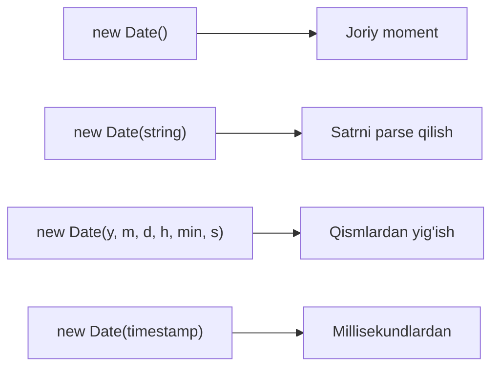
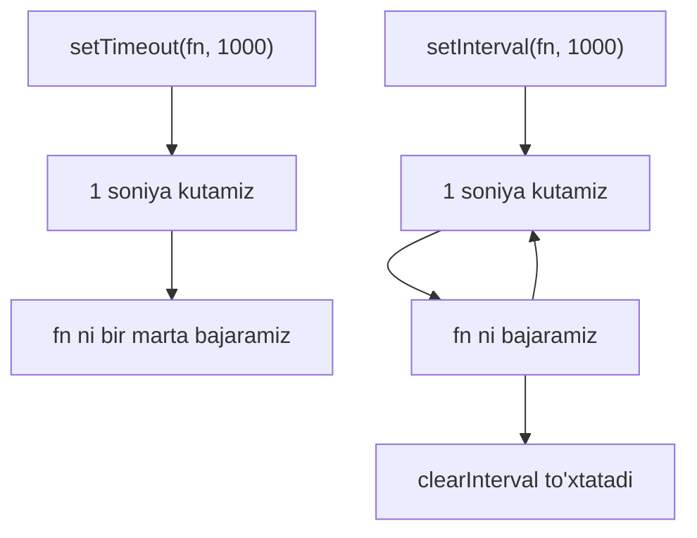

## Sana va vaqt

> **Oldingi kurs bilan bog'lanish:** oldingi darslarda JavaScript funksiyalarini, massivlarni, ob'ektlarni va tsikllarni o'rgandik. Bugun sana va vaqt bilan ishlashga o'tamiz - bu ko'nikma real ilovalar yaratishda doimiy qo'llaniladi, vaqt belgilarini ko'rsatishdan tortib, vazifalarni rejalashtirishgacha.

---

## Darsning maqsadi

JavaScript qanday qilib sanalar va vaqtni qayta ishlashini tushunish, `Date` ob'ektini o'zlashtirish va sanalarni yaratish, o'qish, formatlash va hisoblashni o'rganish. Dars oxirida siz sanalar bilan ishonchli ishlashingiz va kodni kechiktirib bajarish uchun taymerlarni qo'llay olasiz.

## Dars oxirida nimani bilib qolasiz

- `Date` ob'ektlarini to'rt xil usulda yaratish va noldingan oylar qanday ishlashini tushunish.
- Oluvchi metodlar yordamida sananing istalgan qismini ajratib olish.
- O'rnatish metodlari bilan sanalarni o'zgartirish.
- `toString`, `toLocaleString` va variantlar ob'yekti yordamida sanalarni o'qiladigan satrlarga formatlash.
- Ikki sana o'rtasidagi farqni hisoblash va vaqt oralig'ini qo'shish.
- `setTimeout` va `setInterval` yordamida kechiktirilgan va takroriy kod bajarishni boshqarish.
- `getTimezoneOffset()` va `Date.UTC()` orqali vaqt zonalari bilan ishlash.
- Qachon `day.js` yoki `date-fns` kutubxonalariga murojaat qilish kerakligini bilish.

---

## Dars jadvali

| Blok | Kontent |
| --- | --- |
| 1. Date ob'ekti nima | Epoxa, millisekundlar, to'rtta yaratish usuli |
| 2. Sana komponentlarini olish | getFullYear, getMonth, getDate va boshqa metodlar |
| 3. Sana komponentlarini o'rnatish | Sanalarni o'zgartirish metodlari |
| 4. Sanani formatlash | toString, toDateString, toISOString, toLocaleString |
| 5. Sana arifmetikasi va Date.now | Sanalar orasidagi farq, kunlarga o'tkazish, Date.now() |
| 6. Taymerlar: setTimeout va setInterval | Kechiktirilgan va takroriy bajarish, taymerlarni to'xtatish |
| 7. Vaqt zonlari | getTimezoneOffset, Date.UTC |
| 8. Sanalar uchun kutubxonalar | day.js va date-fns |
| 9. Amaliyot | Mashqlar |
| 10. Xulosa | Yordamchi jadval va takrorlash |

---

## Blok 1. Date ob'ekti nima

**Oddiy qilib aytganda:** tarixdagi qat'iy nuqtadan - 1970-yil 1-yanvar, UTC yarim tundan boshlab millimetrlarni hisoblaydigan lineyka tasavvur qiling. Bu nuqta **Unix epoxasi** deb ataladi, va o'sha paytdan beri har bir vaqt momenti - bu oddiy raqam: necha millisekund o'tgan. JavaScript'dagi `Date` ob'ekti - bu bitta raqam atrofida yaratilgan o'rab turuvchi qobiq, sizga uni o'qish va boshqarish metodlarini beradi.

JavaScript sanalarni bitta raqam sifatida saqlaydi - epoxadan beri o'tgan millisekundlarni. Bu shuni anglatadiki, sanalarni oddiy raqamlar kabi solishtirish, ayirish va qo'shish mumkin.

### Sanani yaratning to'rt usulda

```javascript
const now = new Date();
console.log(now);
```

Eng ko'p qo'llaniladigan usul - `new Date()` argumentlarsiz sizga joriy momentni beradi.

```javascript
const fromString = new Date('2026-12-31T23:59:59');
console.log(fromString);
```

ISO 8601 formatidagi yoki boshqa sana formatidagi satrni uzatishingiz mumkin. Brauzer uni `Date` ob'ektiga parse qiladi.

```javascript
const fromComponents = new Date(2026, 11, 31, 23, 59, 59);
console.log(fromComponents);
```

**Muhim tafsilot:** raqamli komponentlardan foydalanilganda, oy parametri **noldan boshlanadi**. Yanvar - `0`, dekabr - `11`. Bu yangi boshlovchilar uchun eng ko'p uchraydigan chalkashlik sababi.

```javascript
const fromTimestamp = new Date(1767225599000);
console.log(fromTimestamp);
```

`Date` ni to'g'ridan-to'g'ri Unix metkasi (millisekundlarda) dan yaratishingiz mumkin.



---

### Boshlovchilarning odatiy xatolari

| Xato | Qanday tuzatish |
| --- | --- |
| Oy raqamlarini adashish: yanvar uchun `1` ishlatish | Eslab qoling: oy indekslangan. `0 = yanvar`, `11 = dekabr` |
| Oyni son o'rniga `'12'` satr sifatida uzatish | Komponentlar asosidagi konstruktor uchun doimo raqamli qiymatlarni ishlating |
| Kutishni, `new Date()` testlarda aniqlanadigan bo'lishini | U hozirgi vaqtni qaytaradi. Testlarda qat'iy sanani yoki `Date.UTC()` ishlating |

---

## Blok 2. Sana komponentlarini olish

**Oddiy qilib aytganda:** sizda `Date` ob'ekti borligi, ko'p pichog'i bo'lgan shveytsar armiyasi pichog'iga o'xshaydi - har bir olish metodi bitta aniq ma'lumot qismini ajratib oladi.

```javascript
const now = new Date();

console.log(now.getFullYear());
console.log(now.getMonth());
console.log(now.getDate());
console.log(now.getDay());
console.log(now.getHours());
console.log(now.getMinutes());
console.log(now.getSeconds());
console.log(now.getMilliseconds());
```

Har bir metod raqam qaytaradi. `getMonth()` `0` dan `11` gacha, `getDate()` esa oyning haqiqiy kunini (1-31) qaytarishiga e'tibor bering. `getDay()` metodi `0` - yakshanbadan `6` -shanbagacha.

UTC (umumjahon vaqt) uchun lokal o'rniga `UTC` variantlarini ishlating:

```javascript
console.log(now.getUTCHours());
console.log(now.getUTCFullYear());
```

---

## Blok 3. Sana komponentlarini o'rnatish

**Oddiy qilib aytganda:** olish metodlari "o'qish" tugmasi bo'lsa, o'rnatish metodlari "yozish" tugmasi - ular butun ob'ektni qayta yaratmasdan sananing alohida qismlarini o'zgartirishga imkon beradi.

```javascript
const date = new Date();

date.setFullYear(2027);
date.setMonth(0);
date.setDate(1);
date.setHours(12, 0, 0);
```

O'rnatish metodlari joyida ishlaydi - ular asl `Date` ob'ektini o'zgartiradi. `setHours(soatlar, daqiqalar, soniyalar, ms)` yordamida bir vaqtda bir necha vaqt komponentini o'rnatishingiz mumkinligiga e'tibor bering.

Ko'p tarqalgan naqsh - sanaga kun qo'shish:

```javascript
const today = new Date();
today.setDate(today.getDate() + 7);
console.log(today);
```

Bu bugundan aynan bir hafta keyingi sanani yaratadi. `Date` ob'ekti oy va yil o'tishlarini avtomatik qayta ishlaydi.

---

## Blok 4. Sanani formatlash

**Oddiy qilib aytganda:** xom `Date` ob'ekti o'qilmas. Formatlash metodlari uni inson uquladigan satrga aylantiradi.

### Asosiy satrga o'tkazish

```javascript
const now = new Date();

console.log(now.toString());
console.log(now.toDateString());
console.log(now.toTimeString());
console.log(now.toISOString());
```

- `toString()` to'liq lokal vakilini beradi.
- `toDateString()` faqat sana qismini beradi.
- `toTimeString()` faqat vaqt qismini beradi.
- `toISOString()` API va bazalarda ishlatiladigan standart UTC formatini beradi.

### Lokalga sezgir formatlash

`toLocaleString` oilasidagi metodlar sanalarni ma'lum lokalga mos ko'rsatishga imkon beradi:

```javascript
const now = new Date();

console.log(now.toLocaleString('ru-RU'));
console.log(now.toLocaleDateString('ru-RU'));
console.log(now.toLocaleTimeString('ru-RU'));
```

### Variantlar bilan formatlash

To'liq boshqaruv uchun ikkinchi argument sifatida variantlar ob'ektini uzating:

```javascript
const now = new Date();

const options = {
  year: 'numeric',
  month: 'long',
  day: 'numeric',
  weekday: 'long',
};
console.log(now.toLocaleDateString('ru-RU', options));
```

Bu "payshanba, 18-iyun 2026-yil" kabi to'liq o'qiladigan formatni beradi - tashqi kutubxonasiz.

---

## Blok 5. Sana arifmetikasi va Date.now()

**Oddiy qilib aytganda:** sanalar tagida raqamlar yotadi. Ikta sanani ayirish millisekundlardagi farqni beradi. Bu `Date` ob'ektining eng foydali xususiyatlaridan biri.

### Sanalarni ayirish

```javascript
const start = new Date('2026-01-01');
const end = new Date('2026-12-31');

const diffMs = end - start;
console.log(diffMs);
```

Natija millisekundlarda. Qulayroq birliklarga o'tkazish uchun:

```javascript
const diffDays = diffMs / (1000 * 60 * 60 * 24);
console.log(diffDays);
```

### Date.now()

`Date.now()` statik metodi joriy vaqt belgisini to'g'ridan-to'g'ri, `Date` ob'ekti yaratmasdan qaytaradi:

```javascript
console.log(Date.now());
```

Bu `new Date().getTime()` bilan ekvivalent, lekin tezroq va qisqaroq. Ko'pincha samaradorlik o'lchash uchun ishlatiladi:

```javascript
const start = Date.now();
// ... ba'zi operatsiya ...
const elapsed = Date.now() - start;
console.log('Operatsiya ' + elapsed + ' ms davom etdi');
```

---

## Blok 6. Taymerlar: setTimeout va setInterval

**Oddiy qilib aytganda:** taymerlar kodda budilnik qo'ygandek. `setTimeout" "bu kechikishdan keyin buni qil" deydi, `setInterval` esa "har N millisekundda buni takrorla" deydi.

Bu funksiyalar `Date` ob'ektining qismi emas, lekin JavaScript'da vaqt bilan ishlash bilan bog'liq.

### setTimeout - kechikishdan keyin bir marta bajarish

```javascript
setTimeout(function () {
  console.log("Uch soniya o'tdi");
}, 3000);
```

Birinchi argument bajariladigan funksiya, ikkinchisi millisekundlardagi kechikish. `setTimeout` uni bekor qilish uchun ishlatiladigan ID qaytaradi:

```javascript
const timerId = setTimeout(function () {
  console.log("Hech qachon bajarilmaydi");
}, 1000);

clearTimeout(timerId);
```

### setInterval - takroriy bajarish

```javascript
let count = 0;
const intervalId = setInterval(function () {
  count++;
  console.log("Soniya " + count);
  if (count === 5) {
    clearInterval(intervalId);
  }
}, 1000);
```

`setInterval` `clearInterval` chaqirmaguningizcha har N millisekundda funksiyani chaqiraveradi. Doimo intervalni to'xtatishni rejalashtiring, aks holda u abadiy ishlaydi va xotira oqib ketadi.



---

## Blok 7. Vaqt zonlari

**Oddiy qilib aytganda:** JavaScript `Date` doimo tizimning lokal vaqt zonasida yoki UTC ishlaydi. U ixtiyoriy vaqt zonalarini qo'llab-quvvatlamaydi. Bu uning eng jiddiy cheklovlaridan biri.

### getTimezoneOffset()

```javascript
const now = new Date();
console.log(now.getTimezoneOffset());
```

UTC dan **daqiqalardagi** siljimni qaytaradi. Masalan, UTC+3 qaytaradi `-180` (minus belgisiga e'tibor bering). UTC-5 qaytaradi `300`.

### Date.UTC()

Sanani aniq UTC da (lokal vaqtni chetlab) yaratish uchun `Date.UTC()` ishlating:

```javascript
const utcDate = new Date(Date.UTC(2026, 11, 31, 23, 59, 59));
console.log(utcDate.toISOString());
```

Bu server vaqt belgilari bilan ishlashda yoki vaqt zona mosligi muhim bo'lganda foydali.

**Muhim:** `Date` konstrukturi raqamli argumentlarni lokal vaqtda talqin qiladi, `Date.UTC()` esa ularni UTC sifatida talqin qiladi. Bu nozik, lekin muhim farq.

---

## Blok 8. Sanalar uchun kutubxonalar

Natij `Date` ob'ektining bir nechta ma'lum kamchiliklari bor: oylar noldan boshlanadi, satrlarni parse qilish turli brauzerlarda turlicha va mahalliy/UTC dan tashqari vaqt zonasi qo'llab-quvvatlanmaydi. Ishlab chiqarishda murakkab sana bilan ishlash uchun kutubxonalar - standart yechim.

### day.js (2 KB, yengil)

```javascript
import dayjs from 'dayjs';

const now = dayjs();
console.log(now.format('DD.MM.YYYY HH:mm'));

const future = dayjs('2026-12-31');
console.log(future.diff(now, 'days'));
```

`day.js` Moment.js ga juda o'xshash API ishlatadi, lekin juda kichik va standart bo'yicha o'zgarmas.

### date-fns (modul, funksional)

```javascript
import { format, differenceInDays } from 'date-fns';

console.log(format(new Date(), 'dd.MM.yyyy'));
console.log(differenceInDays(new Date('2026-12-31'), new Date()));
```

`date-fns` sizga faqat kerakli funksiyalarni import qilishga imkon beradi, paket hajmini minimal saqlab.

**Tavsiya:** oddiy loyihalar uchun natij `Date` yetarli. Murakkab formatlash, sana arifmetikasi yoki vaqt zona qo'llab-quvvatlash kerak bo'lganda, `day.js` yoki `date-fns` dan foydalaning.

---

## Amaliyot

1. Raqamli komponentlardan foydalanib ertaga uchun `Date` yarating. Konsolga bugungi sana va ertaga sani chiqaring.

2. Joriy yil oxirigacha necha kun qolganini hisoblaydigan skript yozing.

3. `toLocaleDateString` ni variantlar ob'ekti bilan ishlatib, bugungi sanani "dushanba, 1-yanvar 2026" formatida chiqaring.

4. `setInterval` yordamida 10 dan 0 gacha qolgan soniyalarni chiqaradigan va o'zini tozalaydigan teskari sanash taymeri yarating.

5. `setTimeout` ishlatib, aynan 2 soniyadan keyin xabar chiqaring.

---

## Dars xulosa

Bugun siz JavaScript `Date` Unix epoxasidan (1970-yil 1-yanvar, UTC) berigan millisekundlar sifatida saqlashini bildingiz. Satrlardan, raqamli komponentlardan yoki vaqt belgilaridan sanalar yaratishingiz mumkin - doimo oylar noldan boshlanganligini esda tuting. Oluvchi metodlar istalgan sana qismini ajratib olishga, o'rnatish metodlari joyida o'zgartirishga, formatlash metodlari (`toString`, `toLocaleString`, `toISOString`) esa inson o'qiladigan chiqish yaratishga imkon beradi. Sana arifmetikasi ishlaydi, chunki sanalar - oddiy raqamlar: farqni topish uchun ayiring, oldinga siljish uchun millisekundlar qo'shing. `Date.now()` sizga joriy vaqt belgisini to'g'ridan-to'g'ri beradi. Taymerlar (`setTimeout` va `setInterval`) kodni kechikishdan keyin yoki jadval asosida bajarishga imkon beradi. Murakkab vaqt zona va formatlash masalalari uchun `day.js` va `date-fns` kutubxonalari standart tanlov hisoblanadi.

### Yordamchi jadval

| Vazifa | Qanday bajarish |
| --- | --- |
| Joriy sana va vaqtni olish | `new Date()` yoki `Date.now()` |
| Yilni olish | `date.getFullYear()` |
| Oyni olish (0-11) | `date.getMonth()` |
| Oy kunini olish | `date.getDate()` |
| Hafta kunini olish (0-6) | `date.getDay()` |
| Satrdan sana yaratish | `new Date('2026-12-31T23:59:59')` |
| Lokal bilan chiroyli chiqarish | `date.toLocaleDateString('ru-RU', { weekday: 'long' })` |
| 1 kun qo'shish | `date.setDate(date.getDate() + 1)` |
| Sanalar orasidagi farq | `date2 - date1` (millisekundlarda) |
| 2 soniyadan keyin bajarish | `setTimeout(fn, 2000)` |
| Har 3 soniyada bajarish | `setInterval(fn, 3000)` |
| Taymerni to'xtatish | `clearTimeout(id)` / `clearInterval(id)` |

---

[Keyingi dars: DOM — Document Object Model →](../../Lesson-9/uz/DOM%20—%20Document%20Object%20Model.md)
