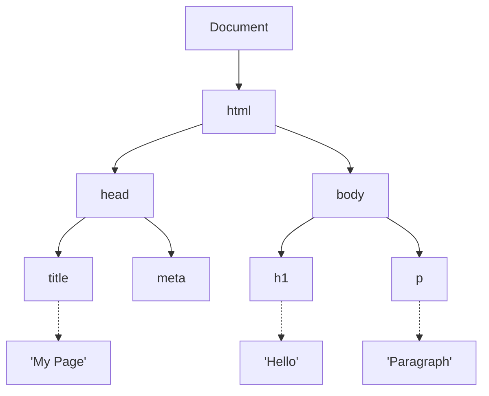
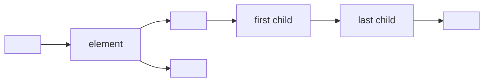
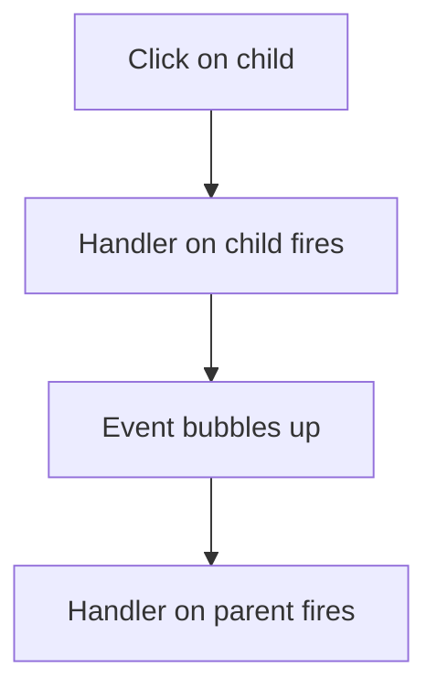
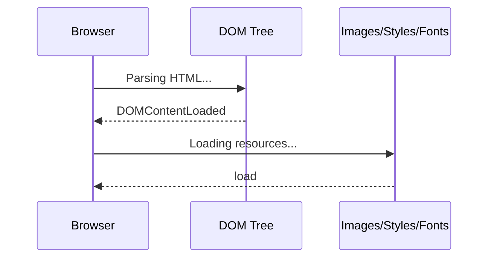

## DOM — Document Object Model

> **Connection with the previous course:** in the "HTML: From A to Z" course we learned to build the structure of a web page using tags and semantic elements. But HTML alone is static — it only describes what is on the page. Today we take a huge step forward: with JavaScript we learn to **reach into the page at runtime**, find any element, change it, create new ones, and respond to user actions. The DOM is the bridge between your code and what the user sees.

---

## Lesson Goal

Understand what the DOM is, how browsers build it from HTML, and master the key methods for finding, reading, modifying, creating, and removing elements — so that by the end of the lesson you can make any page interactive.

## What You Will Learn by the End of the Lesson

- Explain what the DOM is and how it relates to HTML.
- Find elements on the page using `getElementById`, `querySelector`, `querySelectorAll`, and other methods.
- Read and modify element content (`textContent`, `innerHTML`), styles, and CSS classes (`className`, `classList`).
- Work with attributes: `getAttribute`, `setAttribute`, `removeAttribute`, `dataset`.
- Create, insert, and remove DOM elements dynamically.
- Attach and remove event handlers with `addEventListener` and `removeEventListener`.
- Understand event bubbling and event delegation.
- Distinguish between `DOMContentLoaded` and `load`.
- Handle form data and prevent default form submission.
- Use `insertAdjacentHTML` with all four position options.

---

## Lesson Timeline

| Block | Content |
| -------------------------------------------- | ---------------------------------------------- |
| 1. What the DOM is | Tree of nodes, browser builds it from HTML |
| 2. Finding elements | getElementById, querySelector, querySelectorAll |
| 3. Reading and modifying elements | textContent, innerHTML, style, className, classList |
| 4. Working with attributes | getAttribute, setAttribute, removeAttribute, dataset |
| 5. Creating and removing elements | createElement, appendChild, prepend, insertBefore, remove |
| 6. insertAdjacentHTML | Four positions for inserting HTML strings |
| 7. Events: addEventListener | Popular events table, event object, removeEventListener |
| 8. Event bubbling and delegation | How events propagate up the tree |
| 9. DOMContentLoaded vs load | When to run your scripts |
| 10. Working with forms | input.value, submit + preventDefault |
| 11. Practice and summary | Hands-on exercises and cheat sheet |

---

## Block 1. What the DOM Is

**In simple terms:** think of the DOM as a **family tree**. Just as every person in a family has parents, children, and siblings, every element on a web page has a parent, children, and neighboring elements. JavaScript uses this tree to find and manipulate any "member" of the page.

When a browser loads an HTML file, it reads the markup line by line and builds an **in-memory model** — the Document Object Model. This model is a tree of **nodes**: every tag becomes an element node, every piece of text becomes a text node, and even comments become nodes.

```html
<!DOCTYPE html>
<html>
  <head>
    <title>My Page</title>
  </head>
  <body>
    <h1>Hello</h1>
    <p>Paragraph</p>
  </body>
</html>
```



**Key distinction:** the DOM is not the HTML source code. It is an **object model** that the browser creates in memory. JavaScript interacts with this model, not with the raw text of the file.

Every element you see on the page — headings, paragraphs, images, buttons — is a node in this tree. And every node has properties that let you read its content, check its position in the hierarchy, and change it on the fly.

---

## Block 2. Finding Elements

To work with an element, you first need to **locate it** in the DOM tree. JavaScript provides several methods for this.

### Single element methods (return the first match)

```javascript
const header = document.getElementById('header');
const mainTitle = document.querySelector('.title');
const firstItem = document.querySelector('#list li:first-child');
```

- `getElementById` is the fastest and most precise — it searches by the unique `id` attribute.
- `querySelector` is universal — it accepts any CSS selector string and returns the first matching element.

### Multiple element methods (return a collection)

```javascript
const items = document.getElementsByClassName('item');
const paragraphs = document.getElementsByTagName('p');
const allItems = document.querySelectorAll('.item');
```

### Static vs live collections

This is an important distinction that beginners often overlook:

| Method | Return type | Updates when DOM changes |
| --- | --- | --- |
| `getElementsByClassName` | HTMLCollection (live) | Yes — automatically reflects new/removed elements |
| `getElementsByTagName` | HTMLCollection (live) | Yes |
| `querySelectorAll` | NodeList (static) | No — snapshot taken at the moment of the call |

A **live** collection behaves like a live search: if you add a new `<li>` to a list, `getElementsByClassName('item')` will automatically include it. A **static** `querySelectorAll` result will not change — it captured what existed at call time.

### Advanced querySelector examples

```javascript
const activeItems = document.querySelectorAll('.active span');
const element = document.querySelector('[data-id="123"]');
const firstButton = document.querySelector('form button[type="submit"]');
```

`querySelector` and `querySelectorAll` support any valid CSS selector — attribute selectors, pseudo-classes, combinators, and more. This makes them extremely powerful.

---

### Common Beginner Mistakes

| Error | How to Fix |
| --- | --- |
| Confusing `getElementById` (no dot) with `getElementsByClassName` (has "Elements" in plural) | Remember: single element = `getElementById`, multiple = everything else |
| Using `querySelectorAll` and expecting it to update automatically | Use `getElementsByClassName` if you need a live collection, or re-query the DOM when needed |
| Forgetting that `querySelector` returns `null` if nothing is found | Always check for `null` before working with the result: `if (el) { ... }` |

---

## Block 3. Reading and Modifying Elements

Once you have a reference to an element, you can read its content or change it.

### textContent — plain text (no HTML parsing)

```javascript
const title = document.querySelector('h1');
console.log(title.textContent);
title.textContent = 'New heading';
```

`textContent` gets or sets the text inside an element, ignoring any HTML tags. It is safe and fast.

### innerHTML — full HTML content (parses tags)

```javascript
const div = document.querySelector('.content');
div.innerHTML = '<strong>Bold text</strong>';
```

`innerHTML` parses the string as HTML and renders the result. Be cautious: inserting unsanitized user input via `innerHTML` can lead to XSS (cross-site scripting) attacks. Use `textContent` when you only need to set plain text.

### style — inline CSS

```javascript
const box = document.querySelector('.box');
box.style.backgroundColor = 'red';
box.style.fontSize = '20px';
box.style.display = 'none';
```

Note that CSS properties written in kebab-case (`background-color`) become camelCase in JavaScript (`backgroundColor`).

### className and classList — working with CSS classes

```javascript
const element = document.querySelector('.my-element');

console.log(element.className);
element.className = 'new-class';

element.classList.add('highlight');
element.classList.remove('old-class');
element.classList.toggle('active');
element.classList.contains('active');
```

`className` replaces all classes at once with a string. `classList` is the recommended way — it provides methods to add, remove, toggle, and check individual classes without affecting others.

---

### Common Beginner Mistakes

| Error | How to Fix |
| --- | --- |
| Using `innerHTML` to set plain text | Use `textContent` instead — it is faster and safer |
| Writing CSS properties in kebab-case: `element.style.background-color` | Use camelCase in JS: `element.style.backgroundColor` |
| Overwriting `className` and losing existing classes | Use `classList.add()` to add a class without removing others |

---

## Block 4. Working with Attributes

HTML elements have attributes: `id`, `class`, `src`, `href`, `data-*`, and more. JavaScript provides methods to read, write, and delete them.

```javascript
const link = document.querySelector('a');

console.log(link.getAttribute('href'));
console.log(link.getAttribute('data-user-id'));

link.setAttribute('target', '_blank');
link.setAttribute('data-role', 'admin');

link.removeAttribute('target');
```

### The dataset API

For custom `data-*` attributes, JavaScript offers a convenient shorthand — the `dataset` property. Hyphens in attribute names are converted to camelCase:

```javascript
console.log(link.dataset.userId);
link.dataset.userId = '456';
```

The attribute `data-user-id` becomes `dataset.userId`. This is the cleanest way to work with custom data attributes.

---

## Block 5. Creating and Removing Elements

The DOM is not static — you can create brand-new elements and add them to the page at any time.

### Step-by-step element creation

```javascript
const newDiv = document.createElement('div');
newDiv.textContent = 'I am a new element!';
newDiv.classList.add('new-item');

const container = document.querySelector('.container');

container.appendChild(newDiv);
```

### Insertion methods

```javascript
container.appendChild(newDiv);

container.prepend(newDiv);

const reference = document.querySelector('.some-element');
container.insertBefore(newDiv, reference);
```

| Method | Where it inserts |
| --- | --- |
| `appendChild(child)` | At the end of the parent's children |
| `prepend(child)` | At the beginning of the parent's children |
| `insertBefore(newNode, referenceNode)` | Before the specified reference node |

### Removing elements

```javascript
const element = document.querySelector('.to-delete');
element.remove();
```

The `remove()` method is the modern, clean way. The older approach `parentNode.removeChild(element)` still works but is unnecessary in modern code.

---

### Common Beginner Mistakes

| Error | How to Fix |
| --- | --- |
| Using `innerHTML +=` to add content | This re-renders the entire inner HTML, destroying existing event listeners. Use `createElement` + `appendChild` instead |
| Forgetting to append the created element to the DOM | An element only appears on the page after you insert it into the document tree with `appendChild`, `prepend`, or `insertBefore` |
| Trying to `remove()` an element that is not in the DOM | Check that the element exists before calling `remove()` |

---

## Block 6. insertAdjacentHTML

When you need to insert a chunk of HTML from a string, `insertAdjacentHTML` is the right tool. Unlike `innerHTML +=`, it does **not** destroy existing elements and their event listeners.

```javascript
const container = document.querySelector('.container');
container.insertAdjacentHTML('beforeend', '<div>New block</div>');
```

The four position options:

| Position | Description |
| --- | --- |
| `beforebegin` | Before the element itself (as a previous sibling) |
| `afterbegin` | Inside the element, before its first child |
| `beforeend` | Inside the element, after its last child |
| `afterend` | After the element itself (as a next sibling) |



`insertAdjacentHTML` is especially useful when you have an HTML string (e.g., from a template or API response) and need to insert it into the page quickly and safely.

---

## Block 7. Events: addEventListener

Events are the foundation of interactivity. An **event** is something that happens in the browser — a click, a key press, a form submission, the page finishing loading. You attach **event handlers** (also called listeners) to elements so your code runs when the event occurs.

### Attaching a handler

```javascript
const button = document.querySelector('.btn');

button.addEventListener('click', function() {
  alert('Button clicked!');
});

button.addEventListener('click', () => {
  console.log('Click!');
});
```

You can attach multiple handlers to the same element and same event — they will all run in order.

### Popular events table

| Event | When it fires |
| --- | --- |
| `click` | Mouse click |
| `dblclick` | Double click |
| `mouseover` / `mouseout` | Cursor enters / leaves the element |
| `mousemove` | Cursor moves inside the element |
| `keydown` / `keyup` | Key pressed / released |
| `input` | Value changes in an input field (in real time) |
| `change` | Value changes after losing focus (for checkboxes, selects) |
| `submit` | Form submission |
| `scroll` | Page or element scrolls |
| `DOMContentLoaded` | HTML document is fully parsed and the DOM tree is ready |

### The event object

Every handler receives an **event object** with information about what happened:

```javascript
button.addEventListener('click', (event) => {
  console.log(event.target);
  console.log(event.currentTarget);
  console.log(event.clientX);
  console.log(event.clientY);
  event.preventDefault();
});
```

| Property | Meaning |
| --- | --- |
| `event.target` | The element where the event actually originated |
| `event.currentTarget` | The element the handler is attached to |
| `event.clientX` / `event.clientY` | Mouse coordinates relative to the viewport |
| `event.preventDefault()` | Cancels the default browser behavior (e.g., following a link or submitting a form) |

### Removing a handler

```javascript
function handler() {
  console.log('Click!');
}

button.addEventListener('click', handler);
button.removeEventListener('click', handler);
```

To remove a handler, you must pass the **same function reference** that was originally attached. This is why anonymous functions (arrow functions or `function() {}`) cannot be removed — there is no reference to pass to `removeEventListener`.

---

### Common Beginner Mistakes

| Error | How to Fix |
| --- | --- |
| Trying to remove an anonymous function | Store the handler in a named variable or function declaration so you can pass it to `removeEventListener` |
| Calling `removeEventListener` with a different function than the one added | The function reference must be identical — same function, same reference |
| Using `onclick = fn` instead of `addEventListener` | `addEventListener` is preferred because it allows multiple handlers and `removeEventListener` |

---

## Block 8. Event Bubbling and Event Delegation

### Event bubbling

When an event fires on an element, it does not stop there. It **bubbles up** through the element's ancestors, triggering handlers along the way.

```html
<div id="parent">
  <button id="child">Click me</button>
</div>
```

```javascript
document.getElementById('parent').addEventListener('click', () => {
  console.log('Parent received the event!');
});

document.getElementById('child').addEventListener('click', () => {
  console.log('Child received the event!');
});
```

When you click the button, the console shows:

```
Child received the event!
Parent received the event!
```

The event fires on the child first, then bubbles up to the parent.



### Event delegation

Event delegation is a technique that takes advantage of bubbling. Instead of attaching a handler to every child element, you attach **one handler on the parent** and use `event.target` to figure out which child was actually clicked.

```javascript
const list = document.getElementById('my-list');

list.addEventListener('click', (event) => {
  if (event.target.tagName === 'LI') {
    console.log('Clicked: ' + event.target.textContent);
  }
});
```

**Benefits:**

- You don't need to attach handlers to each `<li>` individually.
- New `<li>` elements added later automatically work — no re-attachment needed.
- Fewer handlers means less memory usage and better performance.

Event delegation is especially useful for dynamic lists, tables, and any container with many similar child elements.

---

## Block 9. DOMContentLoaded vs load

A very common mistake is trying to access DOM elements before they exist in the document.

### The problem

```html
<head>
  <script>
    const title = document.querySelector('h1');
    title.textContent = 'Changed!';
  </script>
</head>
```

This fails because the `<h1>` element has not been parsed yet — the script runs before the browser reaches the `<body>`.

### The solution

```javascript
document.addEventListener('DOMContentLoaded', () => {
  const title = document.querySelector('h1');
  title.textContent = 'Changed!';
});
```

Wrap all DOM-dependent code inside a `DOMContentLoaded` handler so it only runs after the DOM tree is fully built.

### Two load-related events

| Event | When it fires |
| --- | --- |
| `DOMContentLoaded` | The HTML is fully parsed and the DOM tree is ready. Images, styles, and fonts may still be loading. |
| `load` | Everything has finished loading — HTML, CSS, JavaScript, images, fonts, etc. |

Use `DOMContentLoaded` when you need to interact with the page structure. Use `load` when you need all resources (e.g., to measure image dimensions or ensure fonts are applied).



---

### Common Beginner Mistakes

| Error | How to Fix |
| --- | --- |
| Placing the script in `<head>` without `DOMContentLoaded` | Either move the script to the end of `<body>`, or wrap the code in `DOMContentLoaded` |
| Confusing `DOMContentLoaded` and `load` | Use `DOMContentLoaded` for DOM access; use `load` only when you need all resources to be ready |
| Assuming `DOMContentLoaded` has already fired when the script is at the bottom of `<body>` | If the script tag is outside the `<body>` content (e.g., after `</body>`), wrap it in `DOMContentLoaded` to be safe |

---

## Block 10. Working with Forms

Forms are one of the most common interactive elements on the web. JavaScript lets you read input values and intercept form submission.

### Reading and setting input values

```html
<input type="text" id="username" value="John">
```

```javascript
const input = document.getElementById('username');
console.log(input.value);
input.value = 'Alice';
```

### Handling form submission

```javascript
const form = document.getElementById('login-form');

form.addEventListener('submit', (event) => {
  event.preventDefault();

  const login = document.getElementById('login').value;
  const password = document.getElementById('password').value;

  console.log('Login:', login);
  console.log('Password:', password);
});
```

`event.preventDefault()` stops the browser from performing the default action — in the case of a form, that is reloading the page and sending data via an HTTP request. After preventing the default, you can process the data with JavaScript: validate it, send it to a server with `fetch`, display it on screen, and more.

---

## Practice

Now apply everything you have learned. Create an `index.html` file and complete these exercises:

1. Use `getElementById` and `querySelector` to find elements on the page and change their `textContent`.
2. Create a `<ul>` list with at least three `<li>` items using JavaScript (`createElement` + `appendChild`).
3. Add a click event listener on the `<ul>` that logs the text of the clicked `<li>` (use event delegation).
4. Build a simple form with an input and a submit button. On submit, prevent the default action and display the input value inside a `<div>` below the form.
5. Use `classList.toggle` to create a dark-mode toggle button that switches a `dark-mode` class on `<body>`.

---

## Lesson Summary

Today you learned:

- The DOM is the browser's in-memory model of the HTML page — a tree of nodes that JavaScript can read and manipulate.
- You can find elements by ID, class, tag, or any CSS selector using `getElementById`, `querySelector`, `querySelectorAll`, and the `getElementsBy...` methods.
- `textContent` and `innerHTML` let you read and change element content; `style` and `classList` let you control appearance.
- Attributes can be read, written, and removed with `getAttribute`, `setAttribute`, `removeAttribute`, and the `dataset` API.
- New elements are created with `createElement` and inserted with `appendChild`, `prepend`, or `insertBefore`. Elements are removed with `remove()`.
- `insertAdjacentHTML` inserts HTML strings at specific positions relative to an element.
- Events are attached with `addEventListener` and removed with `removeEventListener`. The event object provides `target`, `preventDefault`, and other useful properties.
- Event bubbling allows event delegation — attaching one handler on a parent to manage events from many children.
- `DOMContentLoaded` fires when the DOM is ready; `load` fires when all resources are loaded.
- Forms are handled by reading `input.value` and preventing default submission with `event.preventDefault()`.

### DOM Cheat Sheet

| Action | Code |
| --- | --- |
| Find by ID | `document.getElementById('id')` |
| Find by CSS selector | `document.querySelector('.class')` |
| Find all by selector | `document.querySelectorAll('.class')` |
| Change text | `element.textContent = 'New text'` |
| Change HTML | `element.innerHTML = '<b>bold</b>'` |
| Change style | `element.style.color = 'red'` |
| Add a class | `element.classList.add('active')` |
| Remove a class | `element.classList.remove('active')` |
| Toggle a class | `element.classList.toggle('active')` |
| Check for a class | `element.classList.contains('active')` |
| Get attribute | `element.getAttribute('href')` |
| Set attribute | `element.setAttribute('src', 'img.png')` |
| Remove attribute | `element.removeAttribute('disabled')` |
| Create element | `document.createElement('div')` |
| Append to end | `parent.appendChild(child)` |
| Prepend to start | `parent.prepend(child)` |
| Insert before | `parent.insertBefore(new, reference)` |
| Insert HTML string | `element.insertAdjacentHTML('beforeend', '<p>Hi</p>')` |
| Remove element | `element.remove()` |
| Add event listener | `element.addEventListener('click', fn)` |
| Remove event listener | `element.removeEventListener('click', fn)` |

---

[Next lesson: Final Project — To-Do List Manager →](../../Lesson-10/en/Final%20Project%20—%20To-Do%20List%20Manager.md)
