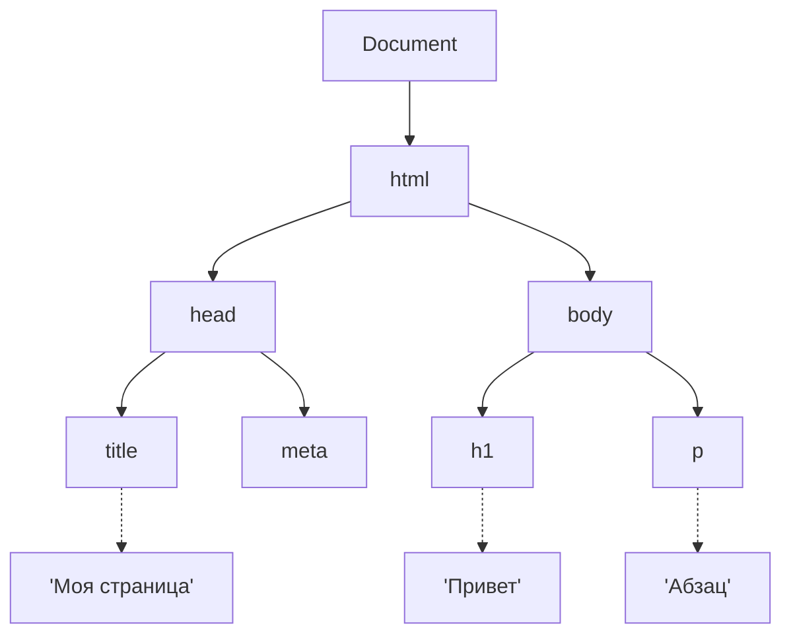
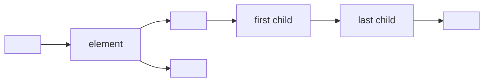
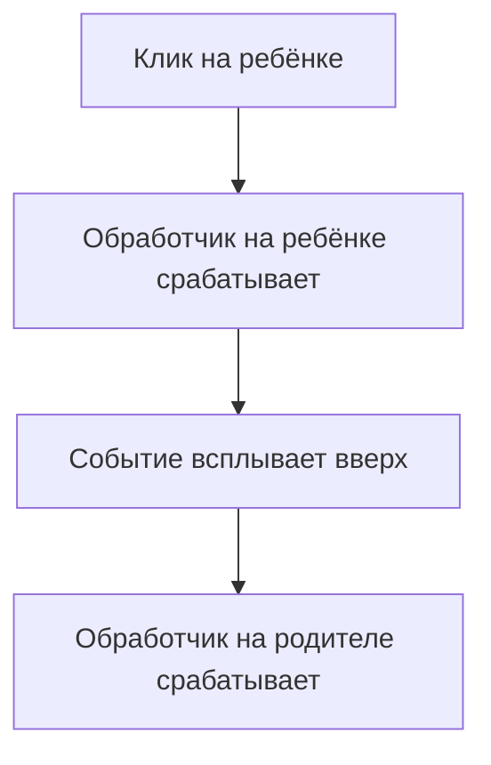
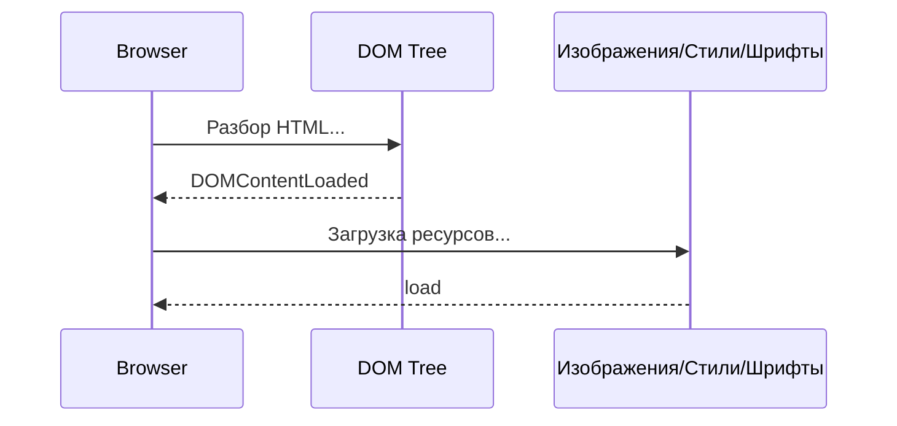

## DOM — Document Object Model

> **Связь с предыдущим курсом:** в курсе «HTML: от А до Я» мы научились строить структуру веб-страницы с помощью тегов и семантических элементов. Но один HTML статичен — он только описывает, что находится на странице. Сегодня мы делаем огромный шаг вперёд: с помощью JavaScript учимся «дотрагиваться» до страницы во время выполнения, находить любой элемент, менять его, создавать новые элементы и реагировать на действия пользователя. DOM — это мост между вашим кодом и тем, что видит пользователь.

---

## Lesson Goal

Понять, что такое DOM, как браузер строит его из HTML, и освоить основные методы поиска, чтения, изменения, создания и удаления элементов — чтобы к концу урока вы могли сделать любую страницу интерактивной.

## Что вы узнаете к концу урока

- Объяснить, что такое DOM и как он связан с HTML.
- Находить элементы на странице с помощью `getElementById`, `querySelector`, `querySelectorAll` и других методов.
- Читать и изменять содержимое элементов (`textContent`, `innerHTML`), стили и CSS-классы (`className`, `classList`).
- Работать с атрибутами: `getAttribute`, `setAttribute`, `removeAttribute`, `dataset`.
- Динамически создавать, вставлять и удалять элементы DOM.
- Подключать и удалять обработчики событий с помощью `addEventListener` и `removeEventListener`.
- Понимать всплытие событий и делегирование событий.
- Различать `DOMContentLoaded` и `load`.
- Обрабатывать данные форм и отменять стандартную отправку формы.
- Использовать `insertAdjacentHTML` со всеми четырьмя вариантами позиции.

---

## Хронология урока

| Блок | Содержание |
| --- | --- |
| 1. Что такое DOM | Дерево узлов, браузер строит его из HTML |
| 2. Поиск элементов | getElementById, querySelector, querySelectorAll |
| 3. Чтение и изменение элементов | textContent, innerHTML, style, className, classList |
| 4. Работа с атрибутами | getAttribute, setAttribute, removeAttribute, dataset |
| 5. Создание и удаление элементов | createElement, appendChild, prepend, insertBefore, remove |
| 6. insertAdjacentHTML | Четыре позиции для вставки HTML-строк |
| 7. События: addEventListener | Таблица популярных событий, объект события, removeEventListener |
| 8. Всплытие событий и делегирование | Как события всплывают вверх по дереву |
| 9. DOMContentLoaded и load | Когда запускать скрипты |
| 10. Работа с формами | input.value, submit + preventDefault |
| 11. Практика и итоги | Практические задания и шпаргалка |

---

## Блок 1. Что такое DOM

**Простыми словами:** представьте DOM как **семейное дерево**. Так же как у каждого человека в семье есть родители, дети и братья/сёстры, у каждого элемента на веб-странице есть родитель, дети и соседние элементы. JavaScript использует это дерево, чтобы находить и управлять любым «членом» страницы.

Когда браузер загружает HTML-файл, он читает разметку строка за строкой и строит **модель в памяти** — Document Object Model. Эта модель — дерево **узлов**: каждый тег превращается в узел-элемент, каждый фрагмент текста — в текстовый узел, даже комментарии становятся узлами.

```html
<!DOCTYPE html>
<html>
  <head>
    <title>Моя страница</title>
  </head>
  <body>
    <h1>Привет</h1>
    <p>Абзац</p>
  </body>
</html>
```



**Важное отличие:** DOM — это не исходный HTML-код. Это **объектная модель**, которую браузер создаёт в памяти. JavaScript взаимодействует именно с этой моделью, а не с текстом файла.

Каждый элемент, который вы видите на странице — заголовки, абзацы, изображения, кнопки — это узел в этом дереве. И у каждого узла есть свойства, которые позволяют прочитать его содержимое, проверить положение в иерархии и изменить его на лету.

---

## Блок 2. Поиск элементов

Чтобы работать с элементом, нужно сначала **найти** его в DOM-дереве. JavaScript предоставляет для этого несколько методов.

### Методы для одного элемента (возвращают первый найденный)

```javascript
const header = document.getElementById('header');
const mainTitle = document.querySelector('.title');
const firstItem = document.querySelector('#list li:first-child');
```

- `getElementById` — самый быстрый и точный: ищет по уникальному атрибуту `id`.
- `querySelector` — универсальный: принимает любую строку CSS-селектора и возвращает первый подходящий элемент.

### Методы для нескольких элементов (возвращают коллекцию)

```javascript
const items = document.getElementsByClassName('item');
const paragraphs = document.getElementsByTagName('p');
const allItems = document.querySelectorAll('.item');
```

### Статичные и живые коллекции

Это важное отличие, которое часто упускают из виду:

| Метод | Тип возврата | Обновляется при изменении DOM |
| --- | --- | --- |
| `getElementsByClassName` | HTMLCollection (живая) | Да — автоматически отражает новые/удалённые элементы |
| `getElementsByTagName` | HTMLCollection (живая) | Да |
| `querySelectorAll` | NodeList (статичная) | Нет — снимок на момент вызова |

**Живая** коллекция ведёт себя как актуальный поиск: если вы добавите новый `<li>` в список, `getElementsByClassName('item')` автоматически его включит. **Статичный** результат `querySelectorAll` не изменится — он зафиксировал то, что существовало в момент вызова.

### Продвинутые примеры querySelector

```javascript
const activeItems = document.querySelectorAll('.active span');
const element = document.querySelector('[data-id="123"]');
const firstButton = document.querySelector('form button[type="submit"]');
```

`querySelector` и `querySelectorAll` поддерживают любой валидный CSS-селектор — селекторы атрибутов, псевдоклассы, комбинаторы и многое другое. Это делает их чрезвычайно мощными.

---

### Типичные ошибки начинающих

| Ошибка | Как исправить |
| --- | --- |
| Путают `getElementById` (без точек) с `getElementsByClassName` (во множественном числе) | Запомните: один элемент = `getElementById`, несколько = все остальные |
| Используют `querySelectorAll` и ожидают автоматическое обновление | Используйте `getElementsByClassName`, если нужна живая коллекция, или повторно запрашивайте DOM при необходимости |
| Забывают, что `querySelector` возвращает `null`, если ничего не найдено | Всегда проверяйте на `null` перед работой с результатом: `if (el) { ... }` |

---

## Блок 3. Чтение и изменение элементов

Когда у вас есть ссылка на элемент, вы можете прочитать его содержимое или изменить его.

### textContent — простой текст (без парсинга HTML)

```javascript
const title = document.querySelector('h1');
console.log(title.textContent);
title.textContent = 'Новый заголовок';
```

`textContent` получает или устанавливает текст внутри элемента, игнорируя HTML-теги. Это безопасно и быстро.

### innerHTML — полное HTML-содержимое (парсит теги)

```javascript
const div = document.querySelector('.content');
div.innerHTML = '<strong>Жирный текст</strong>';
```

`innerHTML` парсит строку как HTML и отображает результат. Будьте осторожны: вставка непроверенного пользовательского ввода через `innerHTML` может привести к атаке XSS (межсайтовый скриптинг). Используйте `textContent`, когда нужно установить только простой текст.

### style — инлайн-стили CSS

```javascript
const box = document.querySelector('.box');
box.style.backgroundColor = 'red';
box.style.fontSize = '20px';
box.style.display = 'none';
```

Обратите внимание, что CSS-свойства в kebab-case (`background-color`) превращаются в camelCase в JavaScript (`backgroundColor`).

### className и classList — работа с CSS-классами

```javascript
const element = document.querySelector('.my-element');

console.log(element.className);
element.className = 'new-class';

element.classList.add('highlight');
element.classList.remove('old-class');
element.classList.toggle('active');
element.classList.contains('active');
```

`className` заменяет все классы сразу строкой. `classList` — рекомендуемый способ: он предоставляет методы для добавления, удаления, переключения и проверки отдельных классов без влияния на другие.

---

### Типичные ошибки начинающих

| Ошибка | Как исправить |
| --- | --- |
| Используют `innerHTML` для установки простого текста | Используйте `textContent` — это быстрее и безопаснее |
| Пишут CSS-свойства в kebab-case: `element.style.background-color` | Используйте camelCase в JS: `element.style.backgroundColor` |
| Перезаписывают `className` и теряют существующие классы | Используйте `classList.add()` для добавления класса без удаления других |

---

## Блок 4. Работа с атрибутами

HTML-элементы имеют атрибуты: `id`, `class`, `src`, `href`, `data-*` и другие. JavaScript предоставляет методы для чтения, записи и удаления атрибутов.

```javascript
const link = document.querySelector('a');

console.log(link.getAttribute('href'));
console.log(link.getAttribute('data-user-id'));

link.setAttribute('target', '#blank');
link.setAttribute('data-role', 'admin');

link.removeAttribute('target');
```

### API dataset

Для пользовательских `data-*` атрибутов JavaScript предоставляет удобную короткую запись — свойство `dataset`. Дефисы в именах атрибутов преобразуются в camelCase:

```javascript
console.log(link.dataset.userId);
link.dataset.userId = '456';
```

Атрибут `data-user-id` становится `dataset.userId`. Это самый чистый способ работы с пользовательскими атрибутами данных.

---

## Блок 5. Создание и удаление элементов

DOM не статичен — вы можете создавать совершенно новые элементы и добавлять их на страницу в любой момент.

### Пошаговое создание элемента

```javascript
const newDiv = document.createElement('div');
newDiv.textContent = 'Я новый элемент!';
newDiv.classList.add('new-item');

const container = document.querySelector('.container');

container.appendChild(newDiv);
```

### Методы вставки

```javascript
container.appendChild(newDiv);

container.prepend(newDiv);

const reference = document.querySelector('.some-element');
container.insertBefore(newDiv, reference);
```

| Метод | Куда вставляет |
| --- | --- |
| `appendChild(child)` | В конец дочерних элементов родителя |
| `prepend(child)` | В начало дочерних элементов родителя |
| `insertBefore(newNode, referenceNode)` | Перед указанным эталонным элементом |

### Удаление элемента

```javascript
const element = document.querySelector('.to-delete');
element.remove();
```

Метод `remove()` — современный и чистый способ. Старый подход `parentNode.removeChild(element)` всё ещё работает, но в современном коде не нужен.

---

### Типичные ошибки начинающих

| Ошибка | Как исправить |
| --- | --- |
| Используют `innerHTML +=` для добавления контента | Это перерисовывает весь внутренний HTML, уничтожая обработчики событий. Используйте `createElement` + `appendChild` |
| Забывают добавить созданный элемент в DOM | Элемент появляется на странице только после вставки в дерево документа с помощью `appendChild`, `prepend` или `insertBefore` |
| Пытаются вызвать `remove()` на элементе, которого нет в DOM | Проверьте, что элемент существует, перед вызовом `remove()` |

---

## Блок 6. insertAdjacentHTML

Когда нужно вставить кусок HTML из строки, `insertAdjacentHTML` — правильный инструмент. В отличие от `innerHTML +=`, он **не** уничтожает существующие элементы и их обработчики событий.

```javascript
const container = document.querySelector('.container');
container.insertAdjacentHTML('beforeend', '<div>Новый блок</div>');
```

Четыре варианта позиции:

| Позиция | Описание |
| --- | --- |
| `beforebegin` | Перед самим элементом (как предыдущий сосед) |
| `afterbegin` | Внутри элемента, перед первым дочерним |
| `beforeend` | Внутри элемента, после последнего дочернего |
| `afterend` | После самого элемента (как следующий сосед) |



`insertAdjacentHTML` особенно полезен, когда у вас есть HTML-строка (например, из шаблона или ответа API) и её нужно быстро и безопасно вставить на страницу.

---

## Блок 7. События: addEventListener

События — основа интерактивности. **Событие** — это то, что происходит в браузере: клик, нажатие клавиши, отправка формы, загрузка страницы. Вы привязываете **обработчики событий** (также называемые слушателями) к элементам, чтобы ваш код выполнялся при наступлении события.

### Подключение обработчика

```javascript
const button = document.querySelector('.btn');

button.addEventListener('click', function() {
  alert('Кнопка нажата!');
});

button.addEventListener('click', () => {
  console.log('Клик!');
});
```

Вы можете подключить несколько обработчиков к одному элементу и одному событию — все они выполнятся по порядку.

### Таблица популярных событий

| Событие | Когда срабатывает |
| --- | --- |
| `click` | Клик мышью |
| `dblclick` | Двойной клик |
| `mouseover` / `mouseout` | Курсор входит / покидает элемент |
| `mousemove` | Движение мыши внутри элемента |
| `keydown` / `keyup` | Нажатие / отпускание клавиши |
| `input` | Изменение значения в поле ввода (в реальном времени) |
| `change` | Изменение значения после потери фокуса (для чекбоксов, селектов) |
| `submit` | Отправка формы |
| `scroll` | Прокрутка страницы или элемента |
| `DOMContentLoaded` | HTML-документ полностью разобран и DOM-дерево готово |

### Объект события

Каждый обработчик получает **объект события** с информацией о том, что произошло:

```javascript
button.addEventListener('click', (event) => {
  console.log(event.target);
  console.log(event.currentTarget);
  console.log(event.clientX);
  console.log(event.clientY);
  event.preventDefault();
});
```

| Свойство | Значение |
| --- | --- |
| `event.target` | Элемент, на котором фактически произошло событие |
| `event.currentTarget` | Элемент, к которому прикреплён обработчик |
| `event.clientX` / `event.clientY` | Координаты мыши относительно области просмотра |
| `event.preventDefault()` | Отменяет стандартное поведение браузера (например, переход по ссылке или отправку формы) |

### Удаление обработчика

```javascript
function handler() {
  console.log('Клик!');
}

button.addEventListener('click', handler);
button.removeEventListener('click', handler);
```

Чтобы удалить обработчик, нужно передать **тот же самую ссылку на функцию**, которая была первоначально добавлена. Поэтому анонимные функции (стрелочные или `function() {}`) нельзя удалить — нет ссылки, которую можно передать в `removeEventListener`.

---

### Типичные ошибки начинающих

| Ошибка | Как исправить |
| --- | --- |
| Пытаются удалить анонимную функцию | Сохраните обработчик в именованную переменную или объявление функции, чтобы можно было передать его в `removeEventListener` |
| Вызывают `removeEventListener` с другой функцией, чем та, что была добавлена | Ссылка на функцию должна быть идентичной — та же самая функция, та же самая ссылка |
| Используют `onclick = fn` вместо `addEventListener` | `addEventListener` предпочтительнее, так как позволяет добавлять несколько обработчиков и удалять их |

---

## Блок 8. Всплытие событий и делегирование

### Всплытие событий

Когда событие срабатывает на элементе, оно не останавливается на нём. Оно **всплывает** вверх через предков элемента, вызывая обработчики по пути.

```html
<div id="parent">
  <button id="child">Нажми меня</button>
</div>
```

```javascript
document.getElementById('parent').addEventListener('click', () => {
  console.log('Родитель получил событие!');
});

document.getElementById('child').addEventListener('click', () => {
  console.log('Ребёнок получил событие!');
});
```

При клике на кнопку в консоли появится:

```
Ребёнок получил событие!
Родитель получил событие!
```

Событие сначала срабатывает на ребёнке, затем всплывает к родителю.



### Делегирование событий

Делегирование событий — техника, которая использует всплытие. Вместо того чтобы вешать обработчик на каждый дочерний элемент, вы вешаете **один обработчик на родителя** и используете `event.target`, чтобы определить, какой именно дочерний элемент был нажат.

```javascript
const list = document.getElementById('my-list');

list.addEventListener('click', (event) => {
  if (event.target.tagName === 'LI') {
    console.log('Клик на: ' + event.target.textContent);
  }
});
```

**Преимущества:**

- Не нужно вешать обработчики на каждый `<li>` отдельно.
- Новые `<li>`, добавленные позже, автоматически работают — повторное подключение не требуется.
- Меньше обработчиков — меньше использование памяти и лучшая производительность.

Делегирование событий особенно полезно для динамических списков, таблиц и любых контейнеров со множеством похожих дочерних элементов.

---

## Блок 9. DOMContentLoaded и load

Очень частая ошибка — пытаться получить доступ к элементам DOM до того, как они появились в документе.

### Проблема

```html
<head>
  <script>
    const title = document.querySelector('h1');
    title.textContent = 'Изменено!';
  </script>
</head>
```

Это не сработает, потому что элемент `<h1>` ещё не разобран — скрипт выполняется до того, как браузер доходит до `<body>`.

### Решение

```javascript
document.addEventListener('DOMContentLoaded', () => {
  const title = document.querySelector('h1');
  title.textContent = 'Изменено!';
});
```

Оберните весь код, зависящий от DOM, в обработчик `DOMContentLoaded`, чтобы он выполнялся только после полной постройки DOM-дерева.

### Два события, связанных с загрузкой

| Событие | Когда срабатывает |
| --- | --- |
| `DOMContentLoaded` | HTML полностью разобран и DOM-дерево готово. Изображения, стили и шрифты могут ещё загружаться. |
| `load` | Всё загрузилось — HTML, CSS, JavaScript, изображения, шрифты и т.д. |

Используйте `DOMContentLoaded`, когда нужно взаимодействовать со структурой страницы. Используйте `load`, когда нужны все ресурсы (например, чтобы измерить размеры изображений или убедиться, что шрифты применены).



---

### Типичные ошибки начинающих

| Ошибка | Как исправить |
| --- | --- |
| Размещают скрипт в `<head>` без `DOMContentLoaded` | Либо перенесите скрипт в конец `<body>`, либо оберните код в `DOMContentLoaded` |
| Путают `DOMContentLoaded` и `load` | Используйте `DOMContentLoaded` для доступа к DOM; `load` — только когда нужно, чтобы все ресурсы были готовы |
| Предполагают, что `DOMContentLoaded` уже сработал, когда скрипт в конце `<body>` | Если тег скрипта находится за пределами `<body>` (например, после `</body>`), оберните его в `DOMContentLoaded` для надёжности |

---

## Блок 10. Работа с формами

Формы — один из самых распространённых интерактивных элементов в вебе. JavaScript позволяет читать значения полей ввода и перехватывать отправку формы.

### Чтение и установка значений input

```html
<input type="text" id="username" value="John">
```

```javascript
const input = document.getElementById('username');
console.log(input.value);
input.value = 'Alice';
```

### Обработка отправки формы

```javascript
const form = document.getElementById('login-form');

form.addEventListener('submit', (event) => {
  event.preventDefault();

  const login = document.getElementById('login').value;
  const password = document.getElementById('password').value;

  console.log('Логин:', login);
  console.log('Пароль:', password);
});
```

`event.preventDefault()` останавливает стандартное действие браузера — в случае формы это перезагрузка страницы и отправка данных через HTTP-запрос. После отмены стандартного поведения вы можете обработать данные с помощью JavaScript: проверить их, отправить на сервер с помощью `fetch`, вывести на экран и так далее.

---

## Практика

Теперь примените всё изученное. Создайте файл `index.html` и выполните следующие задания:

1. Используйте `getElementById` и `querySelector`, чтобы найти элементы на странице и изменить их `textContent`.
2. Создайте список `<ul>` как минимум с тремя элементами `<li>` с помощью JavaScript (`createElement` + `appendChild`).
3. Добавьте обработчик события `click` на `<ul>`, который выводит текст нажатого `<li>` (используйте делегирование событий).
4. Создайте простую форму с полем ввода и кнопкой отправки. При отправке отмените стандартное действие и отобразите значение ввода в `<div>` под формой.
5. Используйте `classList.toggle`, чтобы создать кнопку переключения тёмной темы, которая добавляет/убирает класс `dark-mode` на `<body>`.

---

## Итог урока

Сегодня вы узнали:

- DOM — это модель браузера в памяти, представляющая HTML-страницу как дерево узлов, с которым JavaScript может читать и управлять.
- Можно находить элементы по ID, классу, тегу или любому CSS-селектору с помощью `getElementById`, `querySelector`, `querySelectorAll` и методов `getElementsBy...`.
- `textContent` и `innerHTML` позволяют читать и менять содержимое элементов; `style` и `classList` позволяют управлять внешним видом.
- Атрибуты можно читать, записывать и удалять с помощью `getAttribute`, `setAttribute`, `removeAttribute` и API `dataset`.
- Новые элементы создаются с помощью `createElement` и вставляются с помощью `appendChild`, `prepend` или `insertBefore`. Элементы удаляются с помощью `remove()`.
- `insertAdjacentHTML` вставляет HTML-строки в определённые позиции относительно элемента.
- События подключаются с помощью `addEventListener` и удаляются с помощью `removeEventListener`. Объект события предоставляет `target`, `preventDefault` и другие полезные свойства.
- Всплытие событий позволяет использовать делегирование — один обработчик на родителе управляет событиями многих детей.
- `DOMContentLoaded` срабатывает, когда DOM готов; `load` — когда загружены все ресурсы.
- Формы обрабатываются чтением `input.value` и отменой стандартной отправки с помощью `event.preventDefault()`.

### Шпаргалка по DOM

| Действие | Код |
| --- | --- |
| Найти по ID | `document.getElementById('id')` |
| Найти по CSS-селектору | `document.querySelector('.class')` |
| Найти все по селектору | `document.querySelectorAll('.class')` |
| Изменить текст | `element.textContent = 'Новый текст'` |
| Изменить HTML | `element.innerHTML = '<b>жирный</b>'` |
| Изменить стиль | `element.style.color = 'red'` |
| Добавить класс | `element.classList.add('active')` |
| Удалить класс | `element.classList.remove('active')` |
| Переключить класс | `element.classList.toggle('active')` |
| Проверить класс | `element.classList.contains('active')` |
| Получить атрибут | `element.getAttribute('href')` |
| Установить атрибут | `element.setAttribute('src', 'img.png')` |
| Удалить атрибут | `element.removeAttribute('disabled')` |
| Создать элемент | `document.createElement('div')` |
| Добавить в конец | `parent.appendChild(child)` |
| Добавить в начало | `parent.prepend(child)` |
| Вставить перед | `parent.insertBefore(new, reference)` |
| Вставить HTML-строку | `element.insertAdjacentHTML('beforeend', '<p>Привет</p>')` |
| Удалить элемент | `element.remove()` |
| Добавить обработчик | `element.addEventListener('click', fn)` |
| Удалить обработчик | `element.removeEventListener('click', fn)` |

---

[Следующий урок: Итоговый проект →](../../Lesson-10/ru/Итоговый%20проект%20—%20менеджер%20задач.md)
