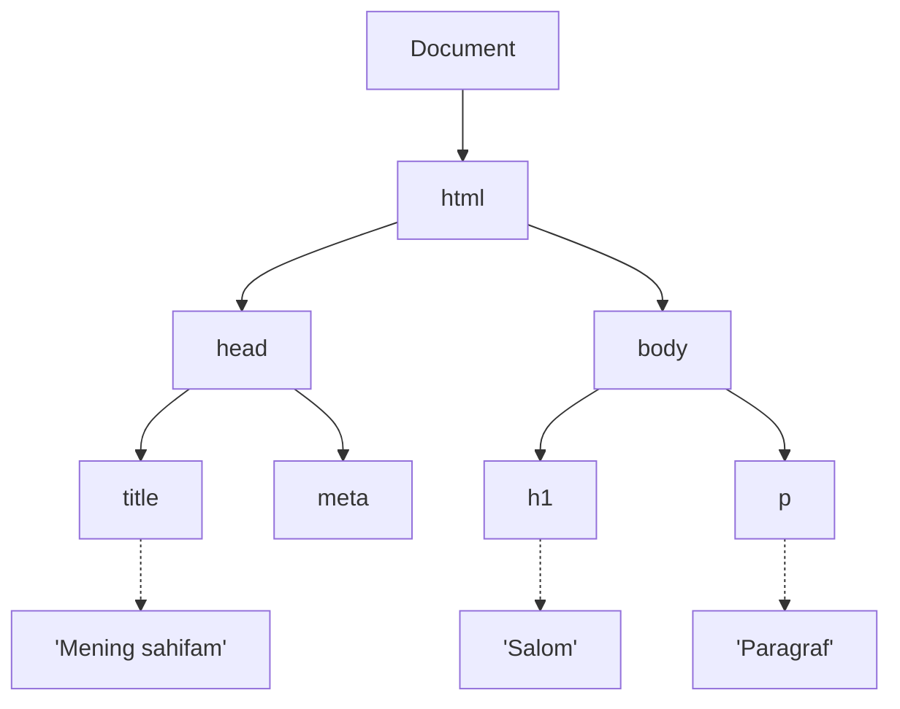
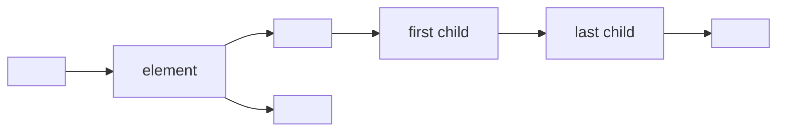
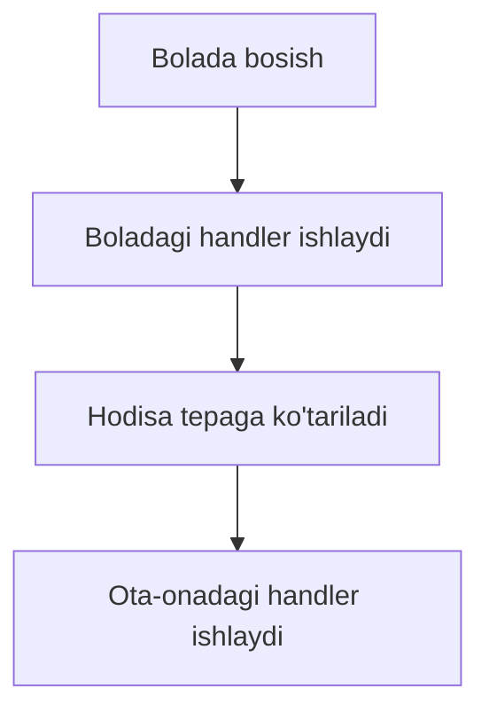
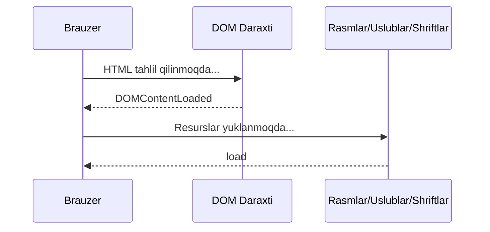

## DOM — Document Object Model

> **Oldingi kurs bilan bog'lanish:** "HTML: A dan Z gacha" kursida biz teglar va semantik elementlardan foydalanib veb-sahifa tuzilisini qurishni o'rgandik. Lekin yagona HTML statik — u faqat sahifada nima borligini tasvirlaydi. Bugun biz katta qadam tashlaymiz: JavaScript yordamida sahifaga ishlash vaqtida "qo'l cho'zish", har qanday elementni topish, uni o'zgartirish, yangilarini yaratish va foydalanuvchi harakatlariga javob berishni o'rganamiz. DOM — bu sizning kodingiz va foydalanuvchi ko'rayotgan narsa orasidagi ko'prik.

---

## Maqsad

DOM nima ekanligini, brauzer uni HTML dan qanday qurishini tushunish va elementlarni qidirish, o'qish, o'zgartirish, yaratish va o'chirishning asosiy usullarini egallash — dars oxirida har qanday sahifani interaktiv qila olishingiz uchun.

## Dars oxirida nimalarni bilib qolasiz

- DOM nima va u HTML bilan qanday bog'lanishini tushuntirish.
- `getElementById`, `querySelector`, `querySelectorAll` va boshqa usullar yordamida sahifadagi elementlarni topish.
- Elementlar tarkibini (`textContent`, `innerHTML`), uslublari va CSS-klasslarini (`className`, `classList`) o'qish va o'zgartirish.
- Attribute bilan ishlash: `getAttribute`, `setAttribute`, `removeAttribute`, `dataset`.
- DOM elementlarini dinamik yaratish, kiritish va o'chirish.
- `addEventListener` va `removeEventListener` yordamida hodisa handlerlarini qo'shish va o'chirish.
- Hodisa ko'tarilishi (bubbling) va hodisa delegatsiyasini tushunish.
- `DOMContentLoaded` va `load` orasidagi farqni bilish.
- Forma ma'lumotlarini qayta ishlash va standart forma yuborishni to'xtatish.
- `insertAdjacentHTML` ning to'rtta pozitsiyasidan foydalanish.

---

## Dars jadvali | Blok | Kontent |
| --- | --- |
| 1. DOM nima | Tugunlar daraxti, brauzer uni HTML dan quradi |
| 2. Elementlarni qidirish | getElementById, querySelector, querySelectorAll |
| 3. Elementlarni o'qish va o'zgartirish | textContent, innerHTML, style, className, classList |
| 4. Attribute bilan ishlash | getAttribute, setAttribute, removeAttribute, dataset |
| 5. Elementlarni yaratish va o'chirish | createElement, appendChild, prepend, insertBefore, remove |
| 6. insertAdjacentHTML | HTML satrlarini kiritishning to'rtta pozitsiyasi |
| 7. Hodisalar: addEventListener | Mashhur hodisalar jadvali, hodisa obyekti, removeEventListener |
| 8. Hodisa ko'tarilishi va delegatsiya | Hodisalar daraxt bo'ylab qanday ko'tariladi |
| 9. DOMContentLoaded va load | Skriptlarni qachon ishga tushirish |
| 10. Formalar bilan ishlash | input.value, submit + preventDefault |
| 11. Amaliyot va xulosa | Amaliy topshiriqlar va yorliq jadvali |

---

## Blok 1. DOM nima

**Oddiy qilib aytganda:** DOM ni **oilaviy daraxt** sifatida tasavvur qiling. Oiladagi har bir shaxsning ota-onasi, bolalari va aka-ukalari/singillari bo'lgani kabi, veb-sahifadagi har bir elementning ham ota-onasi, bolalari va qo'shni elementlari bor. JavaScript bu daraxtdan sahifaning har bir "a'zosini" topish va boshqarish uchun foydalanadi.

Brauzer HTML faylni yuklaganda, u belgilarni qatorma-qator o'qiydi va **xotiradagi model** quradi — Document Object Model. Bu model — **tugunlar daraxti**: har bir teg element tuguniga aylanadi, har bir matn bo'lagi matn tuguniga aylanadi, hatto izohlar ham tugunlar bo'ladi.

```html
<!DOCTYPE html>
<html>
  <head>
    <title>Mening sahifam</title>
  </head>
  <body>
    <h1>Salom</h3>
    <p>Paragraf</p>
  </body>
</html>
```



**Muhim farq:** DOM bu HTML manba kodi emas. Bu brauzer tomonidan xotirada yaratilgan **obyekt modeli**. JavaScript fayl matni emas, aynan shu model bilan o'zaro aloqada bo'ladi.

Sahifada ko'rgan har bir elementingiz — sarlavhalar, paragraflar, rasmlar, tugmalar — bu daraxtdagi tugun. Va har bir tugunning xususiyatlari bor, ular tarkibini o'qish, ierarxiyadagi o'rnini tekshirish va uni lahzada o'zgartirish imkonini beradi.

---

## Blok 2. Elementlarni qidirish

Element bilan ishlashdan oldin, uni DOM daraxtida **topish** kerak. JavaScript buning uchun bir nechta usul taqdim etadi.

### Bitta element usullari (birinchi mos kelganini qaytaradi)

```javascript
const header = document.getElementById('header');
const mainTitle = document.querySelector('.title');
const firstItem = document.querySelector('#list li:first-child');
```

- `getElementById` eng tez va aniq — u noyob `id` attributi bo'yicha qidiradi.
- `querySelector` universaldil — u har qanday CSS selektor satrini qabul qiladi va birinchi mos elementni qaytaradi.

### Ko'p element usullari (kolleksiyani qaytaradi)

```javascript
const items = document.getElementsByClassName('item');
const paragraphs = document.getElementsByTagName('p');
const allItems = document.querySelectorAll('.item');
```

### Statik va jonli kolleksiyalar

Bu ko'pincha e'tiborga olinmaydigan muhim farq:

| Usul | Qaytish turi | DOM o'zgarganda yangilanadi |
| --- | --- | --- |
| `getElementsByClassName` | HTMLCollection (jonli) | Ha — avtomatik ravishda yangi/o'chirilgan elementlarni aks ettiradi |
| `getElementsByTagName` | HTMLCollection (jonli) | Ha |
| `querySelectorAll` | NodeList (statik) | Yo'q — chaqirilgan paytdagi olma |

**Jonli** kolleksiya dolzarb qidiruv kabi ishlaydi: agar siz ro'yxatga yangi `<li>` qo'shsangiz, `getElementsByClassName('item')` uni avtomatik qo'shadi. **Statik** `querySelectorAll` natijasi o'zgarmasdi — u chaqirilgan paytda mavjud bo'lgan narsani qayd etgan.

### Kengaytirilgan querySelector misollari

```javascript
const activeItems = document.querySelectorAll('.active span');
const element = document.querySelector('[data-id="123"]');
const firstButton = document.querySelector('form button[type="submit"]');
```

`querySelector` va `querySelectorAll` har qanday yaroqli CSS selektorini qo'llab-quvvatlaydi — attribute selektorlari, pseudoklasslar, kombinatorlar va boshqalar. Bu ularni juda kuchli qiladi.

---

### Yangi boshlaydiganlarning ko'pincha uchraydigan xatolari

| Xato | Qanday tuzatish |
| --- | --- |
| `getElementById` (nuqtasiz) va `getElementsByClassName` (ko'plik shaklida) ni adashtirish | Eslab qoling: bitta element = `getElementById`, bir nechta = boshqa hamma narsa |
| `querySelectorAll` ishlatib, avtomatik yangilanishini kutish | Jonli kolleksiya kerak bo'lsa `getElementsByClassName` ishlating, yoki zarur bo'lganda DOM ni qayta so'rang |
| `querySelector` hech narsa topilmasa `null` qaytarishini unutish | Natija bilan ishlashdan oldin `null` ni tekshiring: `if (el) { ... }` |

---

## Blok 3. Elementlarni o'qish va o'zgartirish

Elementga havola bo'lgandan keyin, uning tarkibini o'qish yoki o'zgartirish mumkin.

### textContent — oddiy matn (HTML pars qilinmaydi)

```javascript
const title = document.querySelector('h1');
console.log(title.textContent);
title.textContent = 'Yangi sarlavha';
```

`textContent` element ichidagi matnni oladi yoki o'rnatadi, HTML teglarini e'tiborsiz qoldiradi. Bu xavfsiz va tez.

### innerHTML — to'liq HTML tarkibi (teglarni pars qiladi)

```javascript
const div = document.querySelector('.content');
div.innerHTML = '<strong>Qalin matn</strong>';
```

`innerHTML` satrni HTML sifatida pars qiladi va natijani ko'rsatadi. Ehtiyot bo'ling: tekshirilmagan foydalanuvchi kiritishini `innerHTML` orqali joylashtirish XSS (saytlararo skriptlash) hujumiga olib kelishi mumkin. Faqat oddiy matn kerak bo'lsa `textContent` ishlating.

### style — inline CSS uslublari

```javascript
const box = document.querySelector('.box');
box.style.backgroundColor = 'red';
box.style.fontSize = '20px';
box.style.display = 'none';
```

CSS xususiyatlari kebab-case (`background-color`) JavaScript da camelCase ga aylanishini unutmang.

### className va classList — CSS klasslari bilan ishlash

```javascript
const element = document.querySelector('.my-element');

console.log(element.className);
element.className = 'new-class';

element.classList.add('highlight');
element.classList.remove('old-class');
element.classList.toggle('active');
element.classList.contains('active');
```

`className` barcha klasslarni bir satr bilan almashtiradi. `classList` — tavsiya etilgan usul: u alohida klasslarni qo'shish, o'chirish, almashtirish va tekshirish metodlarini taqdim etadi, boshqalariga ta'sir qilmaydi.

---

### Yangi boshlaydiganlarning ko'pincha uchraydigan xatolari

| Xato | Qanday tuzatish |
| --- | --- |
| Oddiy matn o'rnatish uchun `innerHTML` ishlatish | `textContent` ishlating — bu tezroq va xavfsizroq |
| CSS xususiyatlarini kebab-case yozish: `element.style.background-color` | JavaScript da camelCase ishlating: `element.style.backgroundColor` |
| `className` ni qayta yozib, mavjud klasslarni yo'qotish | Boshqalarga ta'sir qilmaydigan klass qo'shish uchun `classList.add()` ishlating |

---

## Blok 4. Attribute bilan ishlash

HTML elementlarning attributelari bor: `id`, `class`, `src`, `href`, `data-*` va boshqalar. JavaScript o'qish, yozish va o'chirish usullarini taqdim etadi.

```javascript
const link = document.querySelector('a');

console.log(link.getAttribute('href'));
console.log(link.getAttribute('data-user-id'));

link.setAttribute('target', '#blank');
link.setAttribute('data-role', 'admin');

link.removeAttribute('target');
```

### Dataset API

Maxsus `data-*` attributelari uchun JavaScript qulay qisqa variant taqdim etadi — `dataset` xususiyati. Attribute nomlaridagi defislar camelCase ga o'tkaziladi:

```javascript
console.log(link.dataset.userId);
link.dataset.userId = '456';
```

`data-user-id` attributi `dataset.userId` ga aylanadi. Bu maxsus ma'lumot attributelari bilan ishlashning eng toza usuli.

---

## Blok 5. Elementlarni yaratish va o'chirish

DOM statik emas — siz istalgan vaqta butunlay yangi elementlar yaratishingiz va ularni sahifaga qo'shishingiz mumkin.

### Bosqichma-bosqich element yaratish

```javascript
const newDiv = document.createElement('div');
newDiv.textContent = 'Men yangi elementman!';
newDiv.classList.add('new-item');

const container = document.querySelector('.container');

container.appendChild(newDiv);
```

### Kiritish usullari

```javascript
container.appendChild(newDiv);

container.prepend(newDiv);

const reference = document.querySelector('.some-element');
container.insertBefore(newDiv, reference);
```

| Usul | Qaerga kiritadi |
| --- | --- |
| `appendChild(child)` | Ota-ona bolalarining oxiriga |
| `prepend(child)` | Ota-ona bolalarining boshiga |
| `insertBefore(newNode, referenceNode)` | Ko'rsatilgan referens elementdan oldin |

### Elementni o'chirish

```javascript
const element = document.querySelector('.to-delete');
element.remove();
```

`remove()` metodi zamonaviy va toza usul. Eski `parentNode.removeChild(element)` yondashuvi hali ham ishlaydi, lekin zamonaviy kodda kerak emas.

---

### Yangi boshlaydiganlarning ko'pincha uchraydigan xatolari

| Xato | Qanday tuzatish |
| --- | --- |
| Kontent qo'shish uchun `innerHTML +=` ishlatish | Bu butun ichki HTML ni qayta chizadi, mavjud hodisa handlerlarini yo'q qiladi. O'rniga `createElement` + `appendChild` ishlating |
| Yaratilgan elementni DOM ga qo'shishni unutish | Element faqat hujjat daraxtiga `appendChild`, `prepend` yoki `insertBefore` bilan kiritilgandan keyin sahifada paydo bo'ladi |
| DOM da mavjud bo'lmagan elementda `remove()` chaqirishga harakat qilish | `remove()` dan oldin element mavjudligini tekshiring |

---

## Blok 6. insertAdjacentHTML

HTML satr bo'lagini kiritish kerak bo'lsa, `insertAdjacentHTML` to'g'ri vosita. `innerHTML +=` dan farqli o'laroq, u mavjud elementlar va ularning hodisa handlerlarini **yo'q qilmaydi**.

```javascript
const container = document.querySelector('.container');
container.insertAdjacentHTML('beforeend', '<div>Yangi blok</div>');
```

To'rtta pozitsiya variantlari:

| Pozitsiya | Tavsif |
| --- | --- |
| `beforebegin` | Elementning o'zidan oldin (oldingi qo'shni sifatida) |
| `afterbegin` | Element ichida, birinchi child dan oldin |
| `beforeend` | Element ichida, oxirgi child dan keyin |
| `afterend` | Elementning o'zidan keyin (keyingi qo'shni sifatida) |



`insertAdjacentHTML` ayniqsa HTML satringiz bo'lganda (masalan, shablondan yoki API javobidan) va uni tezda va xavfsiz sahifaga kiritish kerak bo'lganda foydali.

---

## Blok 7. Hodisalar: addEventListener

Hodisalar interaktivlikning asosi. **Hodisa** — bu brauzerda sodir bo'layotgan narsa: bosish, tugma bosishi, forma yuborish, sahifa yuklash. Siz elementlarga **hodisa handlerlari** (shuningdek, tinglovchilar deb ataladi) bog'laydsiz, shunda kodingiz hodisa yuz berganda bajariladi.

### Handler qo'shish

```javascript
const button = document.querySelector('.btn');

button.addEventListener('click', function() {
  alert('Tugma bosildi!');
});

button.addEventListener('click', () => {
  console.log('Bosish!');
});
```

Bir elementga va bir hodisaga bir nechta handler qo'shishingiz mumkin — ularning hammasi tartibda bajariladi.

### Mashhur hodisalar jadvali

| Hodisa | Qachon ishlaydi |
| --- | --- |
| `click` | Sichqoncha bosilishi |
| `dblclick` | Ikkilama bosish |
| `mouseover` / `mouseout` | Kursor elementga kiradi / chiqadi |
| `mousemove` | Kursor element ichida harakatlanadi |
| `keydown` / `keyup` | Tugma bosilishi / qo'yib yuborilishi |
| `input` | Kiritish maydonidagi qiymat o'zgarishi (real vaqtda) |
| `change` | Fokus yo'qolganidan keyin qiymat o'zgarishi (chekbokslar, selectlar uchun) |
| `submit` | Forma yuborilishi |
| `scroll` | Sahifa yoki element aylanishi |
| `DOMContentLoaded` | HTML hujjati to'liq tahlil qilindi va DOM daraxti tayyor |

### Hodisa obyekti

Har bir handler **hodisa obyekti** oladi, unda nima sodir bo'lgan haqida ma'lumot bor:

```javascript
button.addEventListener('click', (event) => {
  console.log(event.target);
  console.log(event.currentTarget);
  console.log(event.clientX);
  console.log(event.clientY);
  event.preventDefault();
});
```

| Xususiyat | Ma'no |
| --- | --- |
| `event.target` | Hodisa sodir bo'lgan element |
| `event.currentTarget` | Handler bog'langan element |
| `event.clientX` / `event.clientY` | Kursor ko'rish maydoniga nisbatan koordinatalari |
| `event.preventDefault()` | Brauzerning standart harakatini bekor qiladi (masalan, havolaga o'tish yoki forma yuborish) |

### Handler ni o'chirish

```javascript
function handler() {
  console.log('Bosish!');
}

button.addEventListener('click', handler);
button.removeEventListener('click', handler);
```

Handler ni o'chirish uchun dastlab qo'shilgan **bir xil funksiya havolasini** topshirishingiz kerak. Shuning uchun anonim funksiyalarni (strelka funksiyalar yoki `function() {}`) o'chirib bo'lmaydi — `removeEventListener` ga topshirish uchun havola yo'q.

---

### Yangi boshlaydiganlarning ko'pincha uchraydigan xatolari

| Xato | Qanday tuzatish |
| --- | --- |
| Anonim funksiyani o'chirishga harakat qilish | Handler ni nomlangan o'zgaruvchi yoki funksiya e'lonida saqlang, shunda `removeEventListener` ga topshirish mumkin |
| Qo'shilgan bilan bir xil bo'lmagan funksiya bilan `removeEventListener` chaqirish | Fksiya havolasi bir xil bo'lishi kerak — bir xil funksiya, bir xil havola |
| `addEventListener` o'rniga `onclick = fn` ishlatish | `addEventListener` afzalroq, chunki u bir nechta handler qo'shish va ularni o'chirish imkonini beradi |

---

## Blok 8. Hodisa ko'tarilishi va delegatsiya

### Hodisa ko'tarilishi

Hodisa elementda sodir bo'lganda, u to'xtamaydi. U element ajdorlari bo'ylab **ko'tariladi**, yo'ldagi handlerlarni ishga tushiradi.

```html
<div id="parent">
  <button id="child">Bosing menga</button>
</div>
```

```javascript
document.getElementById('parent').addEventListener('click', () => {
  console.log('Ota-ona hodisani qabul qildi!');
});

document.getElementById('child').addEventListener('click', () => {
  console.log('Bola hodisani qabul qildi!');
});
```

Tugmani bosganingizda konsolda ko'rsatiladi:

```
Bola hodisani qabul qildi!
Ota-ona hodisani qabul qildi!
```

Hodisa avval bolada sodir bo'ladi, keyin ota-onaga ko'tariladi.



### Hodisa delegatsiyasi

Hodisa delegatsiyasi — bu ko'tarilishdan foydalanuvchi texnika. Har bir bolaga handler bog'lash o'rniga, siz **ota-onaga bitta handler** bog'laydsiz va `event.target` dan qaysi bola bosilganini aniqlaysiz.

```javascript
const list = document.getElementById('my-list');

list.addEventListener('click', (event) => {
  if (event.target.tagName === 'LI') {
    console.log('Bosilgan: ' + event.target.textContent);
  }
});
```

**Afzalliklari:**

- Har bir `<li>` ga alohida handler bog'lash shart emas.
- Keyinchalik qo'shilgan yangi `<li>` lar avtomatik ishlaydi — qayta bog'lash shart emas.
- Kamroq handler — kamrox xotira ishlatishi va yaxshiroq samaradorlik.

Hodisa delegatsiyasi ayniqsa dinamik ro'yxatlar, jadvallar va ko'p o'xshash bola elementlari bor konteynerlar uchun foydali.

---

## Blok 9. DOMContentLoaded va load

Eng ko'p uchraydigan xatolardan biri — DOM elementlariga hujjatda ular paydo bo'lishidan oldin kirishga harakat qilish.

### Muammo

```html
<head>
  <script>
    const title = document.querySelector('h1');
    title.textContent = "O'zgartirildi!";
  </script>
</head>
``>

Bu ishlamaydi, chunki `<h1>` elementi hali tahlil qilinmagan — skript brauzer `<body>` ga yetib kelishidan oldin bajariladi.

### Yechim

```javascript
document.addEventListener('DOMContentLoaded', () => {
  const title = document.querySelector('h1');
  title.textContent = "O'zgartirildi!";
});
```

DOM ga bog'liq barcha kodni `DOMContentLoaded` handleriga o'rang, shunda u faqat DOM daraxti to'liq qurilgandan keyin bajariladi.

### Yuklash bilan bog'liq ikki hodisa

| Hodisa | Qachon ishlaydi |
| --- | --- |
| `DOMContentLoaded` | HTML to'liq tahlil qilindi va DOM daraxti tayyor. Rasmlar, uslublar va shriftlar hali yuklanayotgan bo'lishi mumkin. |
| `load` | Hamma narsa yuklandi — HTML, CSS, JavaScript, rasmlar, shriftlar va hokazo |

Sahifa tuzilisi bilan ishlash kerak bo'lsa `DOMContentLoaded` ishlating. Barcha resurslar kerak bo'lsa (masalan, rasmlar o'lchovlarini o'lchash yoki shriftlar qo'llanilganligini tekshirish) `load` ishlating.



---

### Yangi boshlaydiganlarning ko'pincha uchraydigan xatolari

| Xato | Qanday tuzatish |
| --- | --- |
| Skriptni `DOMContentLoaded` siz `<head>` ga joylashtirish | Skriptni `<body>` oxiriga ko'chiring yoki kodni `DOMContentLoaded` ga o'rang |
| `DOMContentLoaded` va `load` ni adashtirish | DOM kirishi uchun `DOMContentLoaded` ishlating; faqat barcha resurslar tayyor bo'lishini kutish kerak bo'lsa `load` ishlating |
| Skript `<body>` oxirida bo'lsa `DOMContentLoaded` allaqachon ishlagan deb o'ylash | Agar skript tegi `<body>` tarkibidan tashqarida bo'lsa (masalan, `</body>` dan keyin), ishonch uchun uni `DOMContentLoaded` ga o'rang |

---

## Blok 10. Formalar bilan ishlash

Formalar vebda eng ko'p tarqalgan interaktiv elementlardan biri. JavaScript kiritish maydonlari qiymatlarini o'qish va forma yuborishni ushlab qolish imkonini beradi.

### Kiritish qiymatlarini o'qish va o'rnatish

```html
<input type="text" id="username" value="John">
```

```javascript
const input = document.getElementById('username');
console.log(input.value);
input.value = 'Alice';
```

### Forma yuborishni qayta ishlash

```javascript
const form = document.getElementById('login-form');

form.addEventListener('submit', (event) => {
  event.preventDefault();

  const login = document.getElementById('login').value;
  const password = document.getElementById('password').value;

  console.log('Login:', login);
  console.log('Parol:', password);
});
```

`event.preventDefault()` brauzerning standart harakatini to'xtatadi — forma holatida bu sahifani qayta yuklash va ma'lumotlarni HTTP so'rov orqali yuborish. Standart harakatni to'xtatganandan keyin ma'lumotlarni JavaScript yordamida qayta ishlashingiz mumkin: tekshirish, `fetch` orqali serverga yuborish, ekranda ko'rsatish va boshqalar.

---

## Amaliyot

Endi o'rgangan narsalaringizni amalda qo'llang. `index.html` faylini yarating va quyidagi topshiriqlarni bajaring:

1. `getElementById` va `querySelector` ishlatib, sahifadagi elementlarni toping va ularning `textContent`ini o'zgartiring.
2. JavaScript yordamida (`createElement` + `appendChild`) kamida uchta `<li>` elementli `<ul>` ro'yxatini yarating.
3. Bosilgan `<li>` matnini konsolga chiqaruvchi `click` hodisa handlerini `<ul>` ga qo'shing (hodisa delegatsiyasini ishlating).
4. Kiritish maydoni va yuborish tugmasi oddiy forma yarating. Yuborishda standart harakatni to'xtating va kiritish qiymatini forma ostidagi `<div>` da ko'rsating.
5. `<body>` ga `dark-mode` klassini qo'shuvchi/olib tashlaydigan qorong'u tema almashtirish tugmasini yaratish uchun `classList.toggle` ishlating.

---

## Dars xulosa

Bugun siz quyidagilarni bilib qoldingiz:

- DOM — brauzerning xotiradagi modeli, u HTML sahifani tugunlar daraxti sifatida taqdim etadi va JavaScript uni o'qish va boshqarish imkonini beradi.
- Elementlarni ID, klass, teg yoki har qanday CSS selektor bo'yicha `getElementById`, `querySelector`, `querySelectorAll` va `getElementsBy...` metodlari yordamida topish mumkin.
- `textContent` va `innerHTML` elementlar tarkibini o'qish va o'zgartirishga; `style` va `classList` tashqi ko'rinishni boshqarishga imkon beradi.
- Attribute larni `getAttribute`, `setAttribute`, `removeAttribute` va `dataset` API yordamida o'qish, yozish va o'chirish mumkin.
- Yangi elementlar `createElement` bilan yaratiladi va `appendChild`, `prepend` yoki `insertBefore` bilan kiritiladi. Elementlar `remove()` bilan o'chiriladi.
- `insertAdjacentHTML` HTML satrlarini elementga nisbatan belgilangan pozitsiyalarga kiritadi.
- Hodisalar `addEventListener` bilan qo'shiladi va `removeEventListener` bilan o'chiriladi. Hodisa obyekti `target`, `preventDefault` va boshqa foydali xususiyatlarni taqdim etadi.
- Hodisa ko'tarilishi delegatsiyadan foydalanishga imkon beradi — ota-onadagi bitta handler ko'p bolalarning hodisalarini boshqaradi.
- `DOMContentLoaded` DOM tayyor bo'lganda ishlaydi; `load` barcha resurslar yuklanganda ishlaydi.
- Formalar `input.value` ni o'qish va `event.preventDefault()` orqali standart yuborishni to'xtatish bilan qayta ishlanadi.

### DOM bo'yicha yorliq jadvali

| Harakat | Kod |
| --- | --- |
| ID bo'yicha topish | `document.getElementById('id')` |
| CSS selektor bo'yicha topish | `document.querySelector('.class')` |
| Selektor bo'yicha hammasini topish | `document.querySelectorAll('.class')` |
| Matnni o'zgartirish | `element.textContent = 'Yangi matn'` |
| HTML ni o'zgartirish | `element.innerHTML = '<b>qalin</b>'` |
| Uslubni o'zgartirish | `element.style.color = 'red'` |
| Klass qo'shish | `element.classList.add('active')` |
| Klass o'chirish | `element.classList.remove('active')` |
| Klass almashtirish | `element.classList.toggle('active')` |
| Klassni tekshirish | `element.classList.contains('active')` |
| Attribute olish | `element.getAttribute('href')` |
| Attribute o'rnatish | `element.setAttribute('src', 'img.png')` |
| Attribute o'chirish | `element.removeAttribute('disabled')` |
| Element yaratish | `document.createElement('div')` |
| Oxiriga qo'shish | `parent.appendChild(child)` |
| Boshiga qo'shish | `parent.prepend(child)` |
| Oldin kiritish | `parent.insertBefore(new, reference)` |
| HTML satr kiritish | `element.insertAdjacentHTML('beforeend', '<p>Salom</p>')` |
| Elementni o'chirish | `element.remove()` |
| Handler qo'shish | `element.addEventListener('click', fn)` |
| Handler o'chirish | `element.removeEventListener('click', fn)` |

---

[Keyingi dars: Yakuniy loyiha, topshiriqlar menejeri →](../../Lesson-10/uz/Yakuniy%20loyiha%20—%20topshiriqlar%20menejeri.md)
